# SCH & PCB 设计规范和 AD 的使用（SCH-&-PCB-rules-and-AD`s-usages）

    

***p.s 温馨提示：点个 star 收藏一下回头慢慢看；或者下(白)载(嫖)下来，在 Typora 中阅读；或者在 [本文知乎地址](https://zhuanlan.zhihu.com/p/356679916) 阅读；整理不易，请多支持。***

编辑整理 by [Staok](https://github.com/Staok)，始于 2020.7 且无终稿。转载请注明作者及出处。本文系作者纯属对硬件的兴趣（但不走硬件岗）而对过去做过的、没做过的硬件概念、经验做的总结，广泛撷取、借鉴和整理，参考的公开文档、书籍和网络文章数量已经**不可数**。适合刚入门的人阅读和遵守，已经有较多经验的人看一看图个乐。如有错误恭谢指出！

本文件是“瞰百易”计划的一部分，尽量遵循[“二项玻”定则](https://github.com/Staok/Please-stay-in-the-future)，致力于与网络上碎片化严重的现象泾渭分明（这中二魂...）！

------

## O 目录

[TOC]

------

## 0.5 优秀参考

（永远的 TODO）以下有些是作者还没有看到的（看过之后的都会把精髓写在本文）。

- [PCB 基本布线规范与设计原则 by Hank](https://uinika.gitee.io/Electronics/PCB/)。

- 基本数模电学习和查询推荐《新概念模拟电路》——西安交通大学电工电子中心，杨建国。

- [《硬件系统工程师宝典》](https://book.douban.com/subject/26318343/)——EDA精品智汇馆，介绍了硬件系统设计概要、信号完整性、电源完整性、EMC/EMI、原理图和PCB设计详情等。

- 本条是作者的备注：

  本地收集的文章：

  - 《PCB小知识》系列文章，路径：【3 硬件、电路】\【PCB设计规范】\ PCB小知识。
  - 有关高速PCB的独立文章，路径：【3 硬件、电路】\【高级 PCB 设计 SI EMC 高速等】\ 高速PCB。
  - 

- ADI 智库文章：《PCB设计秘籍》、《高速电路设计指南》（这个主要针对高速数模转换器件的PCB技巧）、《非隔离式开关电源的PCB布局考虑》、《Power技术问题解答》（这个针对常用 LDO 和 DCDC 的常见问题做梳理）、《电源设计基础知识精选》（对电源方方面面的内容做大梳理）等，具体文章免费在下面链接下载：[ADI电子书-您绝对值得拥有的电子书 | 教育 | 亚德诺半导体 (analog.com)](https://www.analog.com/cn/education/landing-pages/002/chinese-ebook.html)，或者在 微信里添加 “ADI智库” 小程序，在小程序里面搜索这些文章的名称，即可下载。

- MPS：PCB 布局指南：《电机驱动PCB布局指南》上、下篇、《低EMI DCDC变换器PCB设计》。

- TI 的 有关电源的文章。

- 网上传开的华为的硬件规范。[华为内部硬件开发设计流程 (qq.com)](https://mp.weixin.qq.com/s/8GRIrdKN4gmoB7gNsvI-qg)。

- ..

AD 的更多丰富技巧和高速布线：

- 综合类（高级技巧）：
  - AD官方：[Altium Designer 全套最权威教学|【官方PCB设计培训】|Altium 战疫免费云公益课堂 | 共27节|AD20|PCB Layout_哔哩哔哩 (゜-゜)つロ 干杯~-bilibili](https://www.bilibili.com/video/BV1D7411T7Pr)；
  - 凡亿：[凡亿教育的个人空间 - 哔哩哔哩 ( ゜- ゜)つロ 乾杯~ Bilibili](https://space.bilibili.com/11979252/channel/detail?cid=77461)；
  - ..
- 高速板设计（蛇形线 和 Active route）：
  - AD官方：[【官方培训】Altium Designer 高速DDR3模块全流程实战PCB设计 | AD20 教程 | 共5节|PCB Layout_哔哩哔哩 (゜-゜)つロ 干杯~-bilibili](https://www.bilibili.com/video/BV1oy4y1v7z1)；
  - AD官方：[DDR存储器布局布线设计思路解析_哔哩哔哩 (゜-゜)つロ 干杯~-bilibili](https://www.bilibili.com/video/BV1x441187Bd)；
  - 凡亿：[【PCB自动布线】 6层PCB高速ActiveRoute自动布线 速度就是快 Altium Designer 20_哔哩哔哩 (゜-゜)つロ 干杯~-bilibili](https://www.bilibili.com/video/BV1SE411n7os)；
  - 文章：[AD19如何使用强大的自动布线功能 - 哔哩哔哩专栏 (bilibili.com)](https://www.bilibili.com/read/cv3479922/)；
  - 文章：[Altium Designer 的ActiveRoute使用_MrZhanghx的博客-CSDN博客](https://blog.csdn.net/qq_34885615/article/details/77965021)；
  - ..

2T 移动硬盘里面的更多比较全的技巧视频 `【电子 学习】\【Altium.Designer】视频+教材\Altium 技巧经验 较多`。

## 0.51 电子类网站收集

大厂官网：筛选器件型号的选型、获得器件手册+参考设计+设计要点等文档资料。

- TI（德州仪器）：[模拟 | 嵌入式处理 | 半导体公司 | 德州仪器 TI.com.cn](https://www.ti.com.cn/)。
- ADI（亚德诺）：[ADI | 混合信号和数字信号处理IC | 亚德诺半导体 (analog.com)](https://www.analog.com/cn/index.html)。
- Infineon（英飞凌）[英飞凌——半导体与系统解决方案 - Infineon Technologies](https://www.infineon.com/cms/cn/)。
- MPS：[MPS | Monolithic Power Systems 芯源系统有限公司](https://www.monolithicpower.cn/)。
- Microchip：[Smart | Connected | Secure | Microchip Technology](https://www.microchip.com/)。
- ON（安森美）：[智能电源和感知技术I安森美 (onsemi.cn)](https://www.onsemi.cn/)。
- Maxim（美信）：[模拟, 线性, 混合信号, 半导体 | Maxim Integrated](https://www.maximintegrated.com/cn.html)。
- NXP（恩智浦）：[恩智浦半导体官方网站 | 主页 (nxp.com.cn)](https://www.nxp.com.cn/)。
- ST（意法）：[首页 - STMicroelectronics](https://www.st.com/content/st_com/zh.html)。
- Xilinx（赛灵思）：[Xilinx -灵活应变. 万物智能.](https://china.xilinx.com/)。
- TDK：[TDK Product Center](https://product.tdk.com.cn/zh/index.html)。
- Renesas（瑞萨）：[瑞萨电子 (Renesas Electronics Corporation)](https://www2.renesas.cn/cn/zh)。
- Powerint：[Homepage (CN) | Power Integrations, Inc.](https://www.powerint.cn/zh-hans/)。
- Keysight：[资源 | 是德科技 (keysight.com)](https://www.keysight.com/cn/zh/resources.html)。

综合类：

- [电子发烧友网：领先的电子工程师技术社区，为工程师创造价值 (elecfans.com)](http://www.elecfans.com/)。
- [21IC电子网 - 电子工程师的优选网站](https://www.21ic.com/)。
- [电子工程师的在线课堂_Moore8摩尔吧](https://www.moore8.com/)。
- [OpenEdv-开源电子网-正点原子论坛](http://www.openedv.com/forum.php)。
- [一个专注于智能硬件、嵌入式系统、物联网、电子产品设计美学的独立博客 - 吴川斌的博客 (mr-wu.cn)](https://www.mr-wu.cn/)。
- [38度发烧友论坛-38Hot Volt-Nuts 仪表 基准 工具 万用表 示波器 焊台 电烙铁 电钻电子爱好者专业论坛 - Powered by Discuz!](http://bbs.38hot.net/)，对一些仪器仪表、电源基准等研究很深。
- [在家学习——硬十宝典【20200127】 (qq.com)](https://mp.weixin.qq.com/s/euqRYvnbErBKnHznklpqSA)。
- [一个专注于智能硬件、嵌入式系统、物联网、电子产品设计美学的独立博客 - 吴川斌的博客 (mr-wu.cn)](https://www.mr-wu.cn/)。
- 一个目录：[扩展获取信息/学习的渠道（以EE为例） - 知乎 (zhihu.com)](https://zhuanlan.zhihu.com/p/379216586)。

开源电子项目分享类/资源类（当作兴趣，交流爱好的社群）：

- [All projects | Hackaday.io](https://hackaday.io/projects)。
- [硬件设计，立创EDA开源硬件平台，硬件工程师的电路家园。 (oshwhub.com)](https://oshwhub.com/)，开源 PCB 项目分享。
- [电路方案-电路城 (cirmall.com)](https://www.cirmall.com/circuits/)。
- [eesites 电子森林 (eetree.cn)](https://www.eetree.cn/wiki/)。
- [Projects | CircuitMaker](https://circuitmaker.com/Projects)，硬件版 github。
- [逆天PCB论坛-逆天电子论坛-电子工程师俱乐部-中国PCB论坛-PCB封装库-全球最大硬件开源网 - Powered by NTpcb](http://bbs.ntpcb.com/)，内容丰富。
- [GitHub](https://github.com/)。

教程类（活到老学到老系列）：

- [德州仪器（TI）官方视频课程培训 - 21ic电子网](https://edu.21ic.com/)。
- [学堂在线 - 精品在线课程学习平台 (xuetangx.com)](https://www.xuetangx.com/)。
- [网易公开课 (163.com)](https://open.163.com/)。[中国大学MOOC(慕课)_国家精品课程在线学习平台 (icourse163.org)](https://www.icourse163.org/)。
- PCB类：[逆天PCB论坛-逆天电子论坛-电子工程师俱乐部-中国PCB论坛-PCB封装库-全球最大硬件开源网 - Powered by NTpcb](http://bbs.ntpcb.com/)、[凡亿教育-凡亿PCB,实战教学PCB视频PCB培训，十天入门到精通多层高速PCB设计 (fany-online.com)](https://www.fany-online.com/)、[志博教育-电子工程师PCB开源社区 (zbpcb.com)](https://zbpcb.com/)。
- [哔哩哔哩 (゜-゜)つロ 干杯~-bilibili](https://www.bilibili.com/)，把 B 站放在这里没什么不对吧。

## 1 最基本的设计理念和器件选型

### 硬件岗位

引自从事硬件工作朋友的口述。

> “一般是原理图修改、画PCB、跟线工厂贴片生产，以及后面生产完了使用出问题的话，要解决。有的在自己办公室用示波器之类的测，有的时候要到外地去看现场到底出的啥问题。有些需要满足国标的还要跟测试，看EMC，或者其他高低温测试之类的。  最后还有些文档，写写使用手册，维护手册，系统里改改BOM，走走各种流程。”
>

> “首先是项目初期方案评审，主要考虑到项目的可实施性，第二是原理图框架评审，保证你后期设计不会跑偏，再者是原理图评审以及PCB评审，包括整个PCB绘制过程都是由硬件工程师主导。投板后开始写测试用例，其中就包含固件需求文档。板子回来就进入调试过程，这个过程完全脱离固件，你只保证你的硬件没有问题与设计符合就可以，测试完成需要进行测试结果评审查看是否可以转发布，发布完成就要给生产写生产指导文件以及跟踪前期试产，试产完成需要转C4测试这个是由测试部门主导，如果有问题随时反馈硬件工程师，测试不过需要重新设计。主要还是在设计技术和设计理念上下下功夫就好。”

### 设计原则

分别严肃考虑以下几个方面：

- 性能：要满足设计要求，并留有一些裕量。
- 成本：满足性能前提下降低成本，除非科研或全功能测试/调试版本。
- 兼容性：软硬件兼容（相互影响）、模块化时候接口兼容（压流范围、驱动能力、阻抗、保护等）、多种应用场景兼容、可以反复使用等等。
- 实施和调试难易程度：综合时间、方案成熟度、是否值得付出大量精力。
- 方案成熟度：尽量选择成熟方案，选择典型电路，容错强 或 新功能调试版本 开发 的情境下可以适当尝试创新的组合，但要在进入实物制作之前要进行充分的仿真和子单元测试，尽量减少在实际硬件上的错误概率。
- 实施要点：硬件低功耗（降低工作温度、散热成本、热噪声、电磁辐射，延长寿命；低功耗要细致设计，从整体规划到每一个芯片的静态电流和每一个电阻里流过的电流等等的考虑），硬件的可靠性，设计时参考芯片手册的电气参数并留有一定裕量，并且无论软件有什么操作硬件也不会发生永久性损坏，也尽量避免用户按错按键或者插错接口就坏掉，即无论在接口错误（物理错误或软件通讯错误）、环境变化、软件操作、用户错误使用等情况，都考虑增强鲁棒性，并能自恢复；软件提高效率、减小体积、节省存储空间，并且要配合硬件做低功耗。
- 如无必要，少增实体！

### 电路模块化

分为两种层面的 "模块化" ，原理图形式的模块化 和 电路板实体的模块化。

-   电路原理图必须要模块化，便于以后的开发可以直接参考或复制之前已经设计的固定下来的功能模块。
-   电路板实体的模块化（接口形式可以是 插接键 或者 邮票孔 ），要视具体应用而定：如果电路板要抗震、要空间集成度高（即占用空间紧张）、要低噪声（即精密设计），那么就不宜用电路板实体的模块化，那么此时直接用原理图模块化的形式（可以借鉴或复制之前设计的模块化的原理图）进行原理图层面的框图连接，然后所有器件画在一个板子上，PCB也直接借鉴之前的设计，这样就实现比较高效的设计。

另外要注意的：

- 标准化、通用化和可靠性设计高于功能设计；
- 接口要考虑到电平兼容，比如 TTL 和 CMOS 两大电平标准；
- 设计系统要尽量利用硬件资源和外设资源，减少 cpu 负担。

### 保护相关

-   过压，欠压，防反接，软起动。
-   过流，过温。
-   EMC 电磁兼容性设计，如 瞬态抑制 / 防浪涌，防静电 ESD，RC 抑制尖峰噪声/消火花。共模、差模干扰噪声抑制。
-   信号的缓冲和隔离。信号隔离（光耦隔离、磁隔离等）。电源隔离（通过变压器线圈在物理上隔离）。
-   共阻抗地干扰抑制（高频）。

上述保护电路更多细节内容可详看： [Staok/protection-circuits: 对保护电路中的过流、过压、软起动、防反接、通讯和信号隔离、电平转换、防共地干扰、TVS瞬态抑制、共模抑制和电磁兼容做一个大总结 (github.com)](https://github.com/Staok/protection-circuits)。

关于隔离：

- 电源隔离：常为使用变压器的磁路形式隔离（如金升阳等的电源模块）
- 信号隔离：常有缓冲/中继（74 系列的244、245 等等）、光耦隔离和磁隔离（如 I2C、SPI 专用的磁隔离芯片）等等；要注意的是信号的隔离往往是两个单独的电路回路之间的信号连接，所以如果用光耦进行信号隔离，那么光耦两边的电源连接应该用两边对应的单独电路回路里面的电源，而不是公用一个地或者电源，这样起不到隔离效果。

### 选型的原则

- 高性价比；
- 采购方便；
- 归一化：整板上相同作用的器件尽量选择一种器件，减少 BOM 表长度；
- 利用率高：引脚利用率、器件利用率；
- 兼容、可替代性：芯片替换时封装兼容、方案扩展性；
- 普遍性：选成熟的方案或芯片；
- 开源性：手册、应用资料和原理图例子的丰富；
- 持续发展：环保、供货周期长；

更多内容见`/额外文档/一篇很完整的元器件选型指南.docx`。

### 电阻，电容，电感

对于电容、电感和电源的一个较全面的科普性介绍：[TDK：电力电子，电感和电容产品指南（科普文档） (sohu.com)](https://www.sohu.com/a/259594784_100005941)。

[一文看透MLCC，附原厂及代理商名单！ (sohu.com)](https://www.sohu.com/a/191244092_609521)。

-   电阻：阻值，功率，精度（E24-5%，E96-1%），温漂，品牌厂家，封装，价格，热噪声。

-   电容：容值，耐压，材质（优先选：固态，铝聚合物，陶瓷电容（优先选：NPO（温度稳定性很高，容值小，适合信号处理），X7R（容值范围大，适合电源滤波），X5R（容值可以很大，低压大容值滤波（47uf/100uf 的 6.3V等））），MLCC 独石电容，钽电容（大容量的钽电容耐压很低），X/Y安规电容（掉电后不存电，安全）），ESR（等效电阻，要低），纹波电流额定值（rated ripple current），温度特性，泄露电流，封装，寿命年限。

    电容ESR相关：[电容的ESR知识汇总（很全） (sohu.com)](https://www.sohu.com/a/219221986_819258)；ESR性能排序，从好到差：MLCC>聚合物铝电解电容(固态电容)>聚合物钽电解电容>钽电容>铝电解电容。

    不同电容的 频率-阻抗 特性不同，每个容值都有一个对应的阻抗最低频率（谐振频率），所以对于重要器件如主控制器、FPGA等，其供电处应将很多、容值从大到小（uf 级别~nf 级别）的贴片电容并联用于对电源的去耦/滤波。相同容量电容的并联时并未展宽低阻抗频带，只是在谐振频率点处的阻抗降低了。多个不同容值（和多个封装大小）的贴片电容并联才可以有效的展宽低阻抗频带。每一个电容对某一个频率段呈低阻抗，外部电源的噪声的这个频率段的分量会在该电容泄放到地，因此好的电源噪声滤波是尽量覆盖全频段的多容值的好电容的并联，即 展宽 低阻抗 的 频带。

-   电感：Irms 温升电流（电流-温度特性图表），Isat 饱和电流（电流-感值特性图表），直流电阻（DCR），封装/构成类型（优先选：一体成型带屏蔽层的 0630/4040，线艺公司的扁铜带/扁铜线型，铁硅铝（做差模电感合适））。

    Isat(饱和电流，感值下降20%的电流)，Irms (温升电流，温升20°/40°的电流)相关：[功率电感的痛点：两个额定电流Isat , Irms 如何理解？_清风度面-CSDN博客_irms](https://blog.csdn.net/yanglianzhuang/article/details/94554598)。

-   关于阻容的封装的补充说明：电阻的直插（金属膜电阻）封装比表贴（碳膜电阻）和电容的直插（MLCC独石，NPO或X7R）比表贴（陶瓷，NPO或X7R），要来的更加稳定（精度高、热稳定好），噪声可能更小。对于要求精密、稳定的硬件可选此。

> **电阻、电容、电感品牌（包括国内、国外品牌）**
>
> **电阻**
>
> 美国：AVX、VISHAY威世
>
> 日本：KOA兴亚、Kyocera京瓷、muRata村田、Panasonic松下、ROHM罗姆、susumu、TDK
>
> 台湾：LIZ丽智、PHYCOM飞元、RALEC旺诠、ROYALOHM厚生、SUPEROHM美隆、TA-I大毅、TMTEC泰铭、TOKEN德键、TYOHM幸亚、UniOhm厚声、VITROHM、VIKING光颉、WALSIN华新科、YAGEO国巨
>
> 新加坡：ASJ
>
> 大陆：FH风华、捷比信
>
> **电容**
>
> 美国：AVX、KEMET基美、Skywell泽天、VISHAY威世
>
> 英国：NOVER诺华
>
> 德国：EPCOS、WIMA威马
>
> 丹麦：JENSEN战神
>
> 日本：ELNA伊娜、FUJITSU富士通、HITACHI日立、KOA兴亚、Kyocera京瓷、Matsushita松下、muRata村田、NEC、nichicon(蓝宝石)尼吉康、Nippon Chemi-Con(黑金刚、嘉美工)日本化工、Panasonic松下、Raycon威康、Rubycon(红宝石)、SANYO三洋、TAIYO YUDEN太诱、TDK、TK东信
>
> 韩国：SAMSUNG三星、SAMWHA三和、SAMYOUNG三莹
>
> 台湾：CAPSUN、CAPXON(丰宾)凯普松、Chocon、Choyo、ELITE金山、EVERCON、EYANG宇阳、GEMCON至美、GSC杰商、G-Luxon世昕、HEC禾伸堂、HERMEI合美电机、JACKCON融欣、JPCON正邦、LELON立隆、LTEC辉城、OST奥斯特、SACON士康、SUSCON冠佐、TAICON台康、TEAPO智宝、WALSIN华新科、YAGEO国巨
>
> 香港：FUJICON富之光、SAMXON万裕
>
> 大陆：AiSHi艾华科技、Chang常州华威电子、FCON深圳金富康、FH广东风华、HEC东阳光、JIANGHAI南通江海、JICON吉光电子、LM佛山利明、R.M佛山三水日明电子、Rukycon海丰三力、Sancon海门三鑫、SEACON深圳鑫龙茂电子、SHENGDA扬州升达、TAI-TECH台庆、TF南通同飞、TEAMYOUNG天扬、QIFA奇发电子
>
> **电感**
>
> 美国：AEM、AVX、Coilcraft线艺、Pulse普思、VISHAY威世
>
> 德国：EPCOS、WE
>
> 日本：KOA兴亚、muRata村田、Panasonic松下、sumida胜美达、TAIYO YUDEN太诱、TDK、TOKO、TOREX特瑞仕
>
> 台湾：CHILISIN奇力新、Mag.Layers美磊、TAI-TECH 台庆、TOKEN德键、VIKING光颉、WALSIN华新科、YAGEO国巨
>
> 大陆：Gausstek丰晶、GLE格莱尔、FH风华、CODACA科达嘉、Sunlord顺络、紫泰荆、肇庆英达

### 光耦

- [光耦参数的理解 - 百度文库 (baidu.com)](https://wenku.baidu.com/view/743b16d3360cba1aa811da54.html)。
- [几种常用的光耦反馈电路应用 - 百度文库 (baidu.com)](https://wenku.baidu.com/view/4c0d365fd5bbfd0a7856736d.html)。

### 功率开关管

- Vds（漏源极电压），Vgs（栅极源极电压），Ids（漏源电流），Rds(on)（导通电阻）。

- 分布/寄生电容（符号：Cs，Cg。其越小，开关速度越快，开关损耗越小，普通硅基材料 MOS 可选 TI 的 NexFET 型）；封装。

- 目前三类 MOS 开关管：硅基（Si），碳化硅（SiC），氮化镓（GaN），目前英飞凌（Infineon）能提供很广泛的 MOS 选型和对应的预驱 IC，官网有不少选型指导手册。下图是三类 MOS 的适用范围：

  .jpg)

总结目前适用范围：

- 传统硅基：成熟、稳定可靠，低压，低电流，低频；
- 碳化硅：高压领域，强电；
- 氮化镓：低压大电流，高频，强减小功率变换器的体积。（不过预驱参数和传统硅基不同，需要细看）。

以碳化硅为例，相比于 IGBT，其低阻值，高频率和高温工作（250 ℃），可明显将目前大功率变换器小型化，甚将改变工程设计模式。且碳化硅做的二极管，反向过压比硅基的小的多的多。碳化硅的开关管的开关损耗比传统硅基要减少 90%（理想）。

更多阅读：

- [Wide Bandgap Semiconductors (SiC/GaN)](https://www.infineon.com/cms/en/product/wide-band-gap-semiconductors-sic-gan/)。

- [体验三类 MOS： CoolMOS™ 7- CoolSiC™ - CoolGaN™ 和互补的EiceDRIVER™ IC.pdf](https://www.infineon.com/dgdl/Infineon-Experience_the_difference_in_power_CoolMOS_CoolSiC_CoolGaN-ProductSelectionGuide-v01_00-CN.pdf?fileId=5546d46262b31d2e0162b59d5869079c)。

- [英飞凌功率器件选型](https://www.infineon.com/cms/cn/product/power/)。

- [德州仪器（TI）的 NexFET MOS 选型（CSD 系列）](https://www.ti.com/power-management/mosfets/overview.html)。

- 谨防买到假货 MOS 管！识别经验现有两点（真实趟过雷的），一点是如下图识别丝印大小（左边两个真品，右边两个赝品），另一点是真货 MOS 的边缘是圆角，而方角的可能是假货，也不是绝对，需要进一步测量验证，比如加 Vgs，然后测量 Rds，假货肯定有 内阻不正常 / 最大承受电流很低 等等问题。

  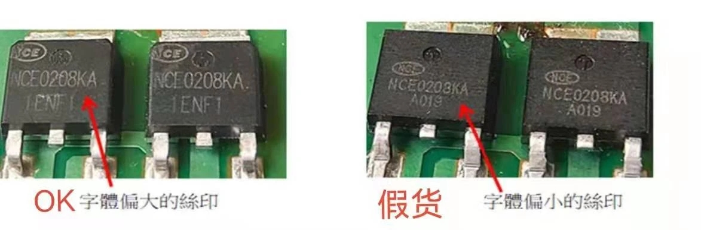

### 运放

括号内为最廉价运放的典型值。

-   输入、输出电压范围（供电是否必须双电源，输出是否轨到轨），带宽/摆率/电压转换速率（SR，0.5V/us），开环差模增益（Aod，100dB）/频率响应/伯德图/频带宽（-3dB的频率，0.5~2MHz），放大倍数温漂。
-   差模输入阻抗（Rid，大于2MΩ），共模输入阻抗，共模抑制比（KCMR，大于80dB）。
-    输入失调电压（Uio，小于2mV），输入失调电流（Iio，0.2~2uA），输入偏置电流（Iib，0.3~7uA），它们的温漂。
-   功耗（80mW）。

### 电源

-   确定入、出的压、流范围，纹波，温度特性。
-   电源设计四要素（设计一个好电源，打好整板的 “地基”）：
    - 体积小；
    - 效能高（效率高（轻载、重载情况下均 90% 以上）、低静态电流、热控制好）；
    - 低 EMI；
    - 好的动态响应（负载调整率好，负载快速变化时输出波动（过冲和下降）小且恢复快，输出纹波良好（20mV 左右 可以，10mV 以下优良））。
-   功率限制，电压、电流裕量。
-   保护机制完善程度考虑（参考上一小节）。
-   体积 & 成本限制。
-   布局布线考虑。
-   合理的设计和明确电源轨。
-   一般电源要加的多重保护：EMC 环节 + 防反接 + 防过流、过压、欠压（按照电源供电的前后顺序）。
-   通用 电源树/电源轨 框图，看 “电源规范设计” 一节。

### 开关电源芯片

即 DC-DC 的 BUCK、BOOST、BUCK-BOOST 等。

- 拓扑形式，频率，是否集成开关管。
- 输入、输出的电压、电流范围。输出是否可调。
- 是否带 comp 环路补偿端。
- 静态功耗。

### 线性电源芯片

即 LDO。

- 输入、输出的电压、电流范围。输出是否可调。
- 最低输入和输出之间的压差。
- 静态功耗/静态电流（如 HT7333 最低 1uA）。
- 输出噪声。
- 线性调整率，负载调整率。
- 过流和温度等的保护。
- 多种封装选择，或根据不同功率选用不同封装的具体型号（如 78 系类有 m、l 系列等，1117 系列有 sot-223、sot-89 等系列）。

### MCU / MPU

[ARM & SOC 系列快速鸟瞰——ARM 内核各系列介绍和各大厂的选型总结](https://github.com/Staok/ARM-Linux-Study/blob/main/ARM%20%26%20Linux%20%E5%9F%BA%E7%A1%80%E5%AD%A6%E4%B9%A0%E8%AE%B0%E5%BD%95/%E3%80%90%E4%B8%BB%E7%BA%BF%E5%89%A7%E6%83%85%20%E7%95%AA%E5%A4%9601%E3%80%91ARM%20%E7%B3%BB%E5%88%97%E5%BF%AB%E9%80%9F%E9%B8%9F%E7%9E%B0.md)（Github 地址），[PCIe接口及其衍生接口大总结 - 知乎 (zhihu.com)](https://zhuanlan.zhihu.com/p/388272103)（知乎地址）。

-   内核架构，RAM，ROM，I/O数量，通讯接口（UART，SPI，I2C，CAN，USB，SDIO，PCIe，HDMI等），其他特色外设，低功耗模式，抗扰能力。
-   官方手册、工具链是否齐全，官方是否提供 EVK 开发板及其 BSP 底层支持包。
-   最小系统：电源轨需求（电源树），时钟（晶振），复位（RC + 开关，内部看门狗，专用看门狗芯片等），RAM（SRAM、(LP)DDR2/3/4 SDRAM），FLASH（SPI FLASH、eMMC/Nor/NAND）。
-   功耗，价格，封装大小，供货周期。

## 1.5 硬件测试规范化

硬件测试（或称可靠性检验）的指标条目、每个项目的测试步骤和测试报告等规范化，还可以包括优化点、解决思路和方案，长期总结与方案的反馈校正等等。

（这条目前对于我个人是空白比较多的，以后慢慢积累）。

### 电源的测试项

包括开关电源和线性电源；每一项都含有最小值、标称值和最大值与单位和测试条件。

1. 输入、输出的电压、电流范围；效率；工作温度范围；
2. 纹波/噪声；
3. 输出启动过冲；启动上升时间；输出关机过冲；
4. 短路保护（过流保护）；
5. 温升；温度考核试验（高低温环节循环测试）；
6. 电压、负载调整率；
7. 电压裕量；电流裕量；
8. 体积限制；成本限制；材质和外观（比如铝壳黑漆）；引脚排布；
9. 最后加上我个人要求的保护完善程度：防反接，输入、输出的电压、电流过大保护，EMC合格，防电子干扰等等。

## 1.51 元件手册的准备

在画原理图和 PCB 之前应该先把所有用到的器件的手册准备好。找器件手册的地方主要有以下几个方法：

1. 芯片所在官网。有的芯片的官网进去太慢或者不提供手册，就略过此法。
   1. TI [模拟 | 嵌入式处理 | 半导体公司 | 德州仪器 TI.com.cn](https://www.ti.com.cn/)；
   2. ADI [ADI | 混合信号和数字信号处理IC | 亚德诺半导体 (analog.com)](https://www.analog.com/cn/index.html)；
   3. NXP [恩智浦半导体官方网站 | 主页 (nxp.com.cn)](https://www.nxp.com.cn/)；
   4. Infineon [英飞凌——半导体与系统解决方案 - Infineon Technologies](https://www.infineon.com/cms/cn/)；
   5. ST [首页 - STMicroelectronics](https://www.st.com/content/st_com/zh.html)；
   6. MPS [MPS | Monolithic Power Systems 芯源系统有限公司](https://www.monolithicpower.cn/)；
   7. ON [半导体和集成电路器件 (onsemi.cn)](https://www.onsemi.cn/)；
   8. 等等等等；
2. 大型商城。
   1. 立创商城 [立创商城_电子元器件采购网上商城_领先的现货元器件交易平台-嘉立创电子商城 (szlcsc.com)](https://www.szlcsc.com/)，直接搜芯片型号，型号比较全，可以下载到手册和封装。
   2. 云汉芯城 [云汉芯城ICKey.cn_电子元器件采购_BOM配单_SMT贴片_PCB打样](https://www.ickey.cn/)；
   3. 等；
3. 芯片手册搜索网。
   1. [ALLDATASHEET.COM - Datasheet search site for Electronic Components and Semiconductors and other semiconductors.](https://www.alldatasheet.com/)；
   2. [netCOMPONENTS 电子元器件查询](https://www.netcomponents.com/zh/)；
   3. 以下网站的收录型号相对较少；
   4. [半导小芯-芯片查询工具_芯片替代查询_数据手册查询_规格书查询_datasheet查询_IC查询 (semiee.com)](http://www.semiee.com/)；
   5. 丝印反查 [芯片丝印反查网 - IC芯片丝印,IC芯片代码,IC芯片印字,IC芯片顶标,SMD code,marking code,top mark (smdmark.com)](http://www.smdmark.com/m/)；
   6. [Datasheet,Datasheet下载,电子元器件查询网-datasheet5.com](https://www.datasheet5.com/)；
   7. [datasheet-PDF中文资料大全-电子产品世界 (eepw.com.cn)](http://datasheet.eepw.com.cn/)；
   8. [EasyDatasheet | 次世代元器件搜索引擎](https://easydatasheet.cn/)；
   9. 等；

## 1.52 元件原理图和封装的准备

法一：淘宝大法，针对基础器件库。淘宝上有很多卖封装的，也不贵，买一次一劳永逸真的划算，如 源创客 的等。

法二：开源大法，扩充器件库。如 [issus/altium-library](https://github.com/issus/altium-library)、[KitSprout/AltiumDesigner_PcbLibrary](https://github.com/KitSprout/AltiumDesigner_PcbLibrary) 、嘉立创的元件库 [嘉立创SMT (JLC_SMT) - Gitee.com](https://gitee.com/JLC_SMT) 等等。

法三：原厂大法，针对性下载。选定大厂的芯片后，一些大厂官网会直接提供该芯片对应的原理图和 PCB 封装，如 TI 等大厂官网对应 IC 页中寻找提供的 PCB 封装进行下载。

举例：如在 TI 搜索器件 CSD18540Q5B [CSD18540Q5B 数据表, 产品信息与支持 | TI.com.cn](https://www.ti.com.cn/product/cn/CSD18540Q5B?keyMatch=CSD&tisearch=search-everything#design-development##cad-cae-symbols) ，在页面下面找到 CAD/CAE 符号 一栏，其下有下载一栏，点进去会跳转到 Ultra Librarian For TI 网站中的封装选择页面，再点击 Choose CAD Formats & Download 按钮，在下一个页面中在 Choose CAD Format(s) 中选择 Altium Designer，然后在 Symbol Pin Ordering 选择 Functional ，再点击 Submit 即可下载封装数据文件，接下来在 AD 软件中使用该封装数据生成封装文件，步骤参考 [Ultra Librarian Altium Designer Import](https://app.ultralibrarian.com/content/help/?altium_designer.htm)。

其他芯片大厂（如 ST 等）的具体芯片型号封装的获取步骤类似。

法四：经销商/三方大法，针对性下载。如在：

1. 在 [Component Search Engine: Free Symbols, footprints, & 3D models](https://componentsearchengine.com/) 搜索器件并下载封装。

   还可以在 AD 软件（AD 17 及以上版本）内安装 Altium Library Loader 组件来脱离网页直接搜索器件并下载器件原理图和封装，如下图所示：

   - 安装和使用的步骤 [Altium Designer PCB Library - FREE - Footprints - Symbols - 3D Models (samacsys.com)](https://www.samacsys.com/altium-designer-library-instructions/)；

   - 下载地址 [Altium Designer Loader Download (componentsearchengine.com)](https://componentsearchengine.com/library/altium)；

   - 桌面版本（Library Loader）下载地址 [电子元件搜索引擎 - 免费获取原理图符号、PCB封装和3D模型 (componentsearchengine.com)](https://componentsearchengine.com/learn-more)（在这个网页里翻到最下边可以看到下载按钮）；

   - FAQ（比如遇到安装不成功等问题看这里） [Altium Library Loader FAQ (samacsys.com)](https://www.samacsys.com/altiumll-faq/)。

     上面所述的 Altium Library Loader 软件安装包 已经离线在 `/PCB LOGO-画法集合-PCB工具-规则文件/LibraryLoaderSetup2v49.msi.zip`。

   

   另外，在 贸泽电子 搜索器件并点击下载封装后会跳转到 Component Search Engine 网站，下载步骤同理。

2. 立创商城自己维护的库，在[立创商城](https://www.szlcsc.com/)搜索器件后可以得到 立创 EDA 的器件原理图和封装，导出到 Altium 即可，具体步骤参考[立创EDA元件转换为AD库封装(Altium Designer)_Mark_md的博客-CSDN博客](https://blog.csdn.net/Mark_md/article/details/116041756)，[如何将嘉立创的原理图封装导入到AD20?](https://www.bilibili.com/video/BV1of4y1S7oi)，需要注册登录。注：网页端的 “立创 EDA” 导出器件的 AD 格式为 SCH 和 PCB 的文件格式（SchDoc、PcbDoc）而非库文件格式，PCB 文件里面的封装可以直接复制到自己新建的 PCB 库里面，但是 SCH 文件不能复制到自己新建的 SCH 库里面，对于 SCH，可以点击 Design->Make Sch Library 即可生成 SCH 库文件，打开新生成的 SCH 库文件，里面的器件的每个 端口 均可编辑且可以复制到 自己的 SCH 库里面为画原理图而调用；若立创 EDA 导出的原理图文件内包含该器件的多个 Part，这时点击 Make Sch Library 只能生成其中一个 Part 的原理图库，但一样的，只需分别将每个 Part 都 “Make Sch Library” 一次，然后分别复制到自己新建的原理图库的器件的各个 Part 页里面即可（文字描述有些局限，意会吧）。

3. 在 Ultra Librarian 搜索并下载封装 [Free Altium PCB Library Online for Footprints & 3D Models | Ultra Librarian](https://www.ultralibrarian.com/solutions/cad-vendors/altium)，需要注册。如果下载到的封装数据是 CAD File（.bxl）类型的，那么通过 UltraLibrarian 软件 生成 AD 封装步骤参考[使用ULIB+Altium Designer绘制元件原理图及封装_dodwind的博客-CSDN博客](https://blog.csdn.net/dodwind/article/details/87954700)， [利用UltraLibrarian生成Altium designer原理图、PCB封装_fpga_start博客-CSDN博客](https://blog.csdn.net/m0_58064525/article/details/117607455)，[Ultra Librarian下载与安装使用教程_chengoes-CSDN博客](https://blog.csdn.net/chengoes/article/details/115440856)，[UltraLibrarian 软件下载链接](http://webench.ti.com/cad/ULib.zip)。

法五：以上方法都没有，是特殊的器件，可以自制。对于原理图，一般元件的引脚和其划分不会特别复杂，应该很快就能画好；对于PCB 封装，常见的可用 AD 的 IPC 自动创建常用封装工具，先选择封装类型，再根据手册设置各种长宽参数，自动生成PCB封装以供使用，不常见的那只能最后的最后才自己画啦，按照芯片手册提供的封装规格，尺寸的单位看准了。

至于 3D 模型若没有，简单的可在 AD 的 PCB 库中的元件上添加 3D 实体（通常在机械1层）自己画，复杂的可去：

- [找3D模型和导入的一个教程](http://bbs.21dianyuan.com/forum.php?mod=viewthread&tid=174773)。
- [IC封装网-行业IPC标准化的元件库及PCB封装库资源下载平台 (iclib.com)](https://www.iclib.com/)。
- [3D ContentCentral - 免费 3D CAD 模型、2D 工程图和供应商目录](https://www.3dcontentcentral.cn/)。
- 白嫖 立创 EDA 专业版（且为在线版） 的 3D 封装，[如何下载立创EDA的3D封装？后悔没有早点发现这功能〒▽〒_ 哔哩哔哩_bilibili](https://www.bilibili.com/video/BV1Sb4y1J7Pq)。

等网站下载。

up 北冥有鱼qzs 的 总结：[【汇总】都有哪些免费下载PCB封装的网站或者软件（一）_ 哔哩哔哩_bilibili](https://www.bilibili.com/video/BV1CR4y1x7Rz)。

> - https://www.szlcsc.com/
> - https://componentsearchengine.com/
> - https://www.snapeda.com/home/
> - https://www.pcblibraries.com/
> - https://www.ultralibrarian.com/
>
> Altium 官方：https://mp.weixin.qq.com/s/U5_yQ3ezFTjMD5twE8RMkA
>
> 凡亿PCB：www.iclib.com 
>
> 3D封装:
>
> - https://www.traceparts.com/zh
> - https://www.3dcontentcentral.cn/Default.aspx

## 2 SCH 绘制规范和 AD 使用

个人规范，仅供参考。这里是针对 AD10 版本。

在使用 AD 时候，应先导入我的软件配置和 PCB 规则 Rules 文件，具体文件和方法说明在“AD 软件设置和PCB规则Rules配置文件”文件夹中。

### SCH 中的快捷键

-   拖住器件时，按 x、y 为镜像翻转。
-   选中一根线，Ctrl+R，可以复制重复放置。
-   先点 Tools -> Cross Probe，扫描所有原理图中相连的线，再 ctrl + 鼠标左击，点击一根线全局高亮。
-   原理图和 PCB 界面分别选择 Tools -> Cross Select Mode，可以在 SCH 和 PCB 界面交叉选择，即同时高亮选中同一个元件，有利于定位。
-   ...

### 最基本的 SCH 绘制过程

1. 统一的标题栏：每一页原理图都使用 A4 大小，标题栏使用模板文件比如`./PCB LOGO-画法集合-PCB工具-规则文件/标题栏模板/A4 - 瞰百易.SchDot`，将其复制到 AD20 安装目录下的 `/Altium/AD20/Documents/Templates`，然后在 SCH 界面的属性栏的 Page Options 的 Formatting And Size 中选 Template，下拉选择 "A4 - 瞰百易" 选项，在属性栏的 参数页面加上 标题、作者、版本号等等信息。

2. 对电路原理图进行电源、主控和其他外设等模组分页绘制（这里仅为示例，没有用 层次原理图设计模式，详看同名章节）；第一页可以是目录页，附文详细说明等，可以再加上历史版本和改动说明；第二页可以是原理图框图；原理图第三页可以加上 电源轨框图 示意。后二者在原理图比较复杂的情况下，很有必要。

   

   原理图第一页的 目录 规范示意：

   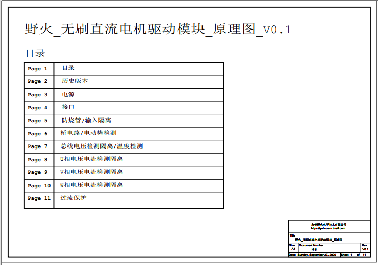

   

   原理图第一页的 历史版本 规范示意：

   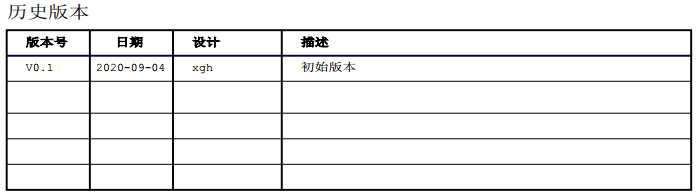

   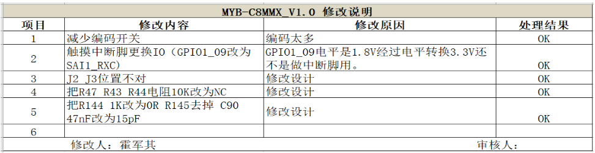

   原理图第一页的 目录 和 历史版本 和 说明 兼有，示意：

   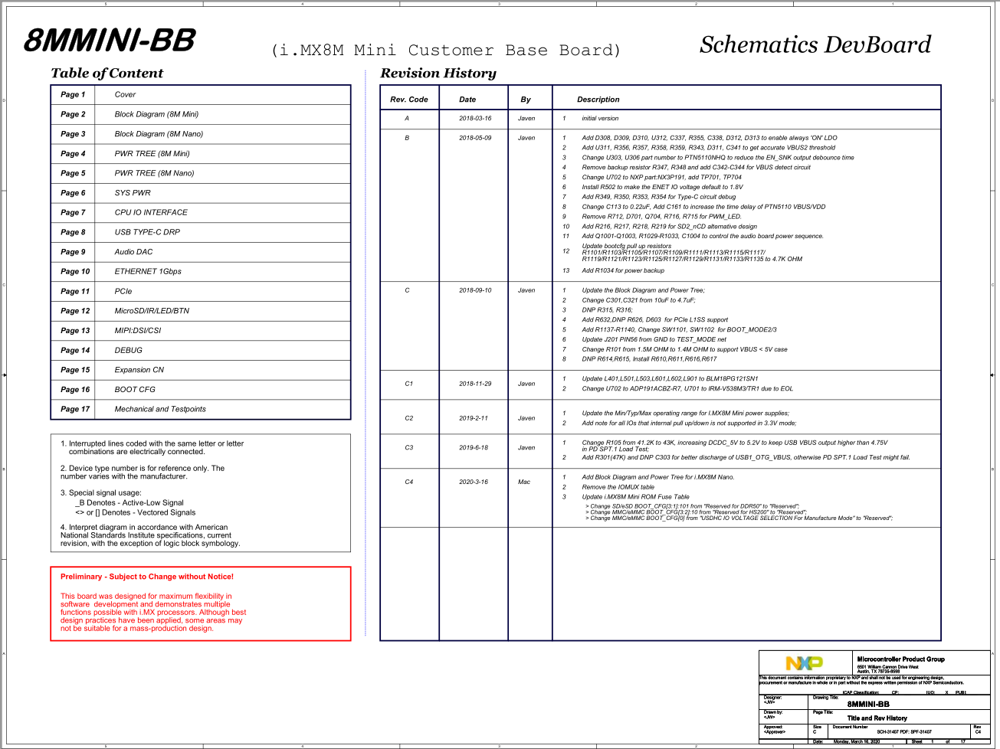

   原理图第二页的 框图 示意：

   

   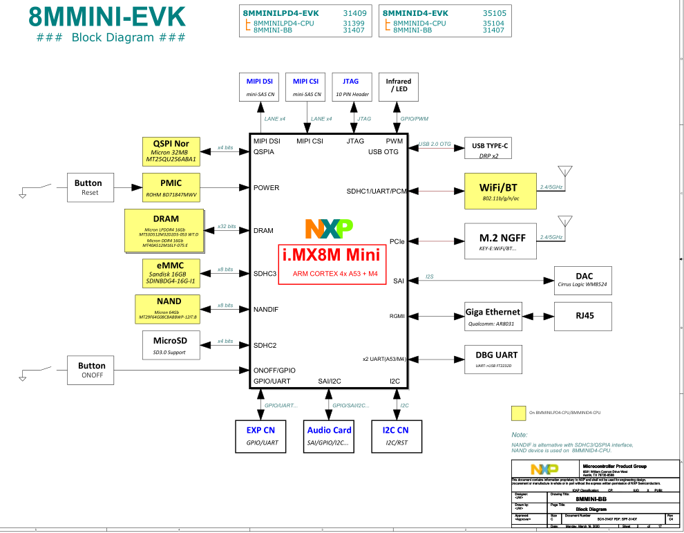

   原理图第三页的 电源轨框图 示意：

   

3.  统一的设计模式：原理图都使用 "层次原理图设计" 的模式。原理图的层次设计，每个原理图 是一个模块，也方便以后在别的地方直接复制和调用。详见 “SCH 层次原理图设计” 一节。

4.  对于每一页SCH（这里仅为示例，没有用 层次原理图设计模式，详看同名章节）：

    -   各个子模块用线格划分；

    -   并在各个格子里写上子模块名称；
    -   页面右下角写上本页名称，x / Total（x 当前页编号，Total 为总页数），作者和日期；
    -   可在子模块旁边放上实物图片、官方推荐PCB图等方便画原理图；
    -   信号/小电流线用细线，电源/驱动/大电流线用粗线。

    

5.  原理图作画要布局工整，走线清晰，注释到位！

    

6.  每个器件的命名。在 Designator 写上准编号，电容是C?，电阻是R?，电感L?，芯片IC?，晶体管Q?，以此类推；在 Comment 写上器件的名称。

    

7. 型号名补全，查看器件手册的发货信息（Order information），确定具体的封装、温度范围和功能等的一个器件型号全名，在原理图的器件中写清，方便导出 BOM 表和采购。

8. 原理图中元件标识的规范，供参考，不是必须。如下图，电阻原理图的左上角、右上角、左下角和右下角以此标识 Designator、Comment（一般为阻值）、封装和精度，对于电容类似，对于电感要有饱和电流标识，其他器件同理。

   

   更加全面的器件参数标识（来自 iphone 4s原理图）：电容包括标号、容值、误差、耐压、材质、封装，电阻基本同。

   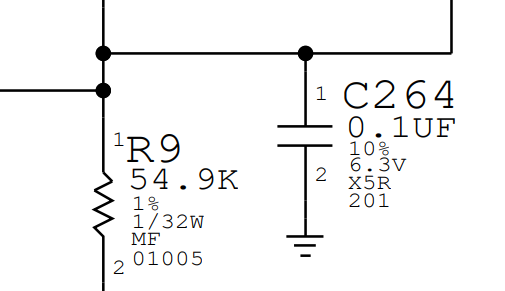

9. 网络标识的命名规范，基于 "器件名（或器件类型） _ IO性质（数字还是ADC） _ IO名（管脚名）"。中间常用于 MCU 的网络命名，其他非 MCU 器件非必须。例如，"MCU _  IO _ KEY1"、"TPS5450 _ SW"、"DRV _ EN _ BUCK  "等，如下图示意。

   

10. 一些注意点：

    - 原理图中添加 线组（Net Class）和 差分对（Diff Pair）（尽量在原理图中将线分组完成，而不是在 PCB 中手动挨个添加，因为从原理图更新 PCB 时原来在 PCB 单独添加的线组会被清除），并在原理图中对电源线线宽规则、数据线线宽规则和差分线对均设置完成。原理图绘制完毕后要紧接着添加 线组（Net Class）、差分对（Diff Pair）和其它如电源线等单独添加规则，这些都尽量在 SCH 中完成（尽量不要在 PCB 界面中另设置，PCB 界面中只专注与画 PCB），方法详看 “SCH 线组和差分对设置” 一节。针对线宽的规则可以做依不同 线组（Net Class）设置不同线宽规则（Parameter Set 添加到线或 Blanket 上，并在其内添加 Rules，在 Rules 界面的左下角设置优先级（手动布线时低优先级不起作用））；针对高速线的规则要依 线组（Net Class）单独设置规则，详见下面的 "等长线/蛇形线设计" 小节；针对差分线要设置 差分对（Diff Pair）规则，详见下面的 “差分走线设计” 小节。
    - 对于带有总线或差分线对的数据输入\输出的模块，都在模块内 对其 数据输出处添加 线组（Net Class）和 差分对（Diff Pair），这样保证各个 模块 连起来时候可以相互兼容。差分线对的阻抗匹配 可以依靠 PCB 上走线时的 线宽和线距的 测算和设置，也要在原理图中 分别串个小电阻，以方便后期拿到实物可以再 改电阻 来对线路的 阻抗 进行微调。
    - 对于电源模块，总是在输出处添加足够的 X5R/X7R 贴片陶瓷电容（可选：贴片固态电解电容 和 功率共模电感）和 TVS 管，输入处的滤波添加足，但是保护环节如 TVS 管为可选。在每个电源模块的输出处添加足够的滤波和保护，连起来的时候可以相互兼容，也不浪费。详参 “保护机制” 和 “EMC 电磁兼容设计” 等小节。
    - 对于有极性的器件（DIO、BJT、MOS、有极性电容等）要在原理图中露出器件引脚的数字号，并仔仔细细检查引脚是否均正确（在器件的  Component 窗口左下角 Pins 里面对引脚编号打对勾表示显示出来，在 PCB Model 里面的 Pin Map.. 里面可以交换引脚直到正确）。

11. 初次研制阶段，可多用 0 欧电阻、磁珠和跳线帽等，留出可以可测试、可断开和可配置的地方，方便逐个电源域、逐个模块的测试电流、功能裁剪等。比如加在电源出口，初次上电前可以先断开，不给后面的的电路供电，上电后测量电压和纹波，合理后，即可再接上，或者可以在此缺口直接测量电流。

12. 原理图中接口件，旁边放上实物图，图片设置为内嵌型。

13. 原理图画好后该给各个元件建立唯一编号。打开“工具”->“注解”，点 Reset All ，再点“更新更改列表”，最后执行“接受更改”。

14. 对原理图进行编译和查错。依次点 “工程”->“Compile Document” 和 “工程”->“Compile PCB Project”。没错后即可导入PCB。

**注意！**更多常用技巧总结在 “4 SCH-PCB 设计规范” 章节里。

## 3 PCB 绘制规范和 AD 使用

个人规范，仅供参考。这里是针对 AD10 版本。

### 板层标识定义

-   Top Overlay 为丝印层。
-   Top Solder 为开窗层。
-   Keep-out Layer 为板边界。

### PCB 中的快捷键

-   q 为单位在 mil 和 mm 之间切换。
-   拖住器件，按下 L 切换器件所在层。
-   Ctrl+鼠标左键点击一根线为高亮此线，点右下角“清除”清除高亮。
-   按住 Alt，鼠标在板子器件上移动，会显示器件轮廓。
-   Shift+s：为高亮所在层，重复操作取消高亮。
-   处于布线状态时，shift+空格为改变线类型，空格为改变线凹凸。
-   Ctrl+g：为选择切换栅格类型为线或点。
-   Backspace 为布线时回到上一步。
-   线状态下按*（乘号）为带过孔换层。
-   Ctrl+m：为测量长度。
-   Ctrl+左键点一下对正在布的线完成自动布线连接。
-   Ctrl+h：再点一根线会全选之，然后 del 删除整根线。
-    Shift+h：PCB 的左上角状态栏是否显示。
-   Shift+g：PCB 左上角状态栏是否固定不动。
-   键盘上边数字“3”为显示 3D 视图，数字“2”还原。
-   3D 视图中依次点“v”、“b”为翻转板。
-   按 L 按键，在视图选项中隐藏相关元素，比如隐藏覆铜（Polygons）。

### 最基本的 PCB 绘制过程

要全程符合“PCB 布局布线规范”章节内容。如果有双屏幕的话，在画 PCB 的时候我一般会把原理图视图放在左屏（在 AD 软件中将原理图标签拖过去就是），PCB 视图放在右屏，或者相反，这样双屏左右对照着看和画，不用来回切。

1.  先定义PCB规则。点开“设计”->“规则”，主要设置线宽范围，元件最小间距，焊盘的开窗范围，默认过孔尺寸，覆铜类型为直接连接等。

    过孔尺寸：焊盘比孔至少大6mil。例如最小孔直径为12mil（0.305mm），焊盘直径至少18mil。

    本规范已经有 AD 的 PCB 的 规则（Rule）模板，新建 PCB 文件后导入即可，在 PCB 文件中导入 AD20 的 PCB Rules 规则配置文件，参考 "7 AD 导入导出配置文件" 章节（AD的 PCB规则（Rule），最主要的几个就是按照 PCB 厂家的最小加工能力来改参数，比如[嘉立创PCB工艺加工能力范围说明-嘉立创PCB打样专业工厂-线路板打样 (jlc.com)](https://www.jlc.com/portal/vtechnology.html)））。

2.  确定板尺寸，划定板形。在 Keep-out Layer 层绘制板边界闭合线，然后执行“设计”->“板子形状”->“按照选择对象定义”。

3.  放置 PCB 原点到 PCB 边界的左下角。依次点击“编辑”、“原点”和“放置”，然后放置原点。

4.  把每个模块包含的所有元件移动到一堆。

    -   首先开启交叉选择，分别打开在原理图和PCB界面的“工具”->“交叉选择模式”选项。

    -   在原理图界面中，选中一个子模块内所有器件，再到PCB界面，点“排列工具”->“在区域内排列器件”，在空白区域内拖出一个矩形，此子模块所有的器件便都堆在此矩形区域内。

5.  PCB中显示元件的原名（此步骤非必须）。

    -   随便选中一个元件，右键点开“查找相似对象”，都是“any”情况下点“应用”，此时所有器件已全选，再点“确定”，出现“PCB Inspector”窗口，在其中取消选中“Show Name”，打开选中“Show Comment”即可。

    -   PCB Inspector 对于多器件批量改属性特别好用。选中要统一修改的器件，然后按 F11 调出 PCB Inspector 窗口，然后在 PCB Inspector 窗口改属性，所选中的多个器件就一同更改了。

6.  多层板（多于 2 层的偶数层）。

    -   在 PCB 里连按快捷键“D”、“K”调出层叠管理，或者在“设计”里面找“叠层管理”，或者空白处右击，“选项”里的“层叠管理”。
    -   多层板的推荐板层分布图在“PCB 布局布线规范”章节里。
    -   注意内电层在拼板的时候网络会丢失，暂时没有简便的办法。有内电层在需要拼板的时候，建议这样处理：先把PCB文件直接复制一个，命名为“xxx_不含内电层版.PcbDoc”，然后打开此文件，执行以下步骤：
        1.  先把内电层的分割线都删掉，然后 D K 快捷键调出板层管理，把内电层（负片层）删掉，换为普通层（正片层）。
        2.  然后在新的普通曾里按照原来分割线的形状覆铜，网络选择跟原来一样。
    -   四层板举例：
        1.  在“层叠管理”中，在中间添加“Signal1”和“Signal2”两个信号层，或者添加“GND”和“VCC”两个内电层(Internal Plane)；
        2.  前者的信号层可直接布线。后者的内电层特性为负片，即布线的地方不铺铜，什么都不画的时候是一整块铜皮，专用于电源划块，即内电层分割；双击一个封闭区域可设置此区域覆铜连接的net。
        4.  信号层和内电层可以各有一个，混搭组成四层板，这样内电层专走电源和地，还多了一个信号层。
        5.  其他注意点：画线不要用交互式走线，要用工具栏中的“应用工具”的“走线”等功能；典型内层厚度为1.4mil；通常采用默认的 Layer Pairs（层成对）模式；不允许在内电层上布置信号线；内电层不同区域之间的间隔宽度不小于 40mil。
        6.  典型四层板板层分布为（由上到下）：
            -   信号层 - 内电层（GND层） - 电源层 - 信号层（把信号层露在外面是为了好实物修改，也可不这样）；
            -   信号层 - 内电层（GND+VCC层）- 信号层 - 信号层。
    
7. 元器件布局。

   -   布局的好，走线容易，布局不好，走线困难。
   -   先大后小，先难后易，均匀分布，整齐划一。
   -   按照板功能区域的划分，理清整板上电源、信号的流向，先摆接口插件、主要芯片等的大致位置，再围绕其摆放阻容等小器件。再微调，并锁住接口器件和主要芯片等尺寸大的器件的位置。
   -   间隔充分，模块独立。间隔充分，即高压、低压区域之间要保证 1~2mm 以上的距离，干扰源和敏感区域相互远离，发热源（电源、测流电阻等）要给予散热空间（在 PCB 板上挖空一定区域增加透风，或预留散热器件的安装空间）并摆放在出风口附近等。元件的放置要便于调试和维修。大元件边上不能放置小元件；需要调试的元件周围应有足够的空间。
   -   根据主信号流向摆放主要元器件。
   -   数模分离；功率驱动和信号处理分离；高频低频分离。
   -   整齐美观，有规律。
   -   器件布局和走线推荐，优先参考 IC 的数据手册。
   -   主要元器件在 PCB 中放好后，锁住其位置（锁住的元件通过 双击 来再选中）。

   更多规范请参考 “4 SCH-PCB 设计规范” 章节的内容。

8. 布线。

   -   除非可以混过去的项目，否则坚决不用自动布线（你晓得）。
   -   不手动布地线，地线的布线在下一小节 “后续工作和润色” 中用覆铜和过孔解决，可以先隐藏地线（AD 10 的方法现查）。
   -   对于两层板而言：先走电源线，再走信号线；对于四层板而言：摆好器件，先划分好内电层区域，再走电源线，再走信号线。
   -   各类线的粗细和其过孔孔径 都提前定好（详细可见 “4 SCH-PCB 设计规范” 章节 的 “幼稚园级” 一节里，又说到线宽、孔径 与 过电流能力 的关系）。电源线足够粗，功率走线必要时考虑开窗加锡。功率走线可以用覆铜来布线，然后原地复制粘贴一个再换成开窗层，得到整块覆铜的开窗。
   -   走信号线时，模拟信号、高速信号和时钟线优先布线，尽量短。电流和地路径不形成环。即 电源、模拟小信号、高速信号、时钟信号和同步信号等关键信号优先布线。
   -   关键信号、模拟信号、高频线等等尽量用曲线走线（曲线也蛮好看），其它的数字低频电路避免直角、锐角、环形、电压/流快速变化的线（尽量短、避免环形）可不用曲线快速地走完。
   -   过孔尽量避免在焊盘、丝印上面（酌情考虑不是必须）。

   AD 10 的等长线/蛇形线设计：

   - 画法参考文档`./PCB LOGO-画法集合-PCB工具-规则文件/AD10教程/AD10 蛇形等长线的画法和规则设定.pdf`；
   - 先走好线，然后等长线都加到一个网络，按T R，选择最长线确定，移动鼠标拖蛇形线。
   - 快捷键：“1、2”改弧度，“3、4”改间距，“，、。”改绕长，在左下角导航选“PCB”窗口，可见加入网络的要等长的线及其各自的长度。

   多跟线一块走：先选中多跟线，点“交互式布多跟线”，再点任一个线，就并排走了。

   更多布线规则请参考“4 PCB 布局布线规范”章节的内容。

   -   检查布线完成情况：工具栏 "Report"，"Board information"，勾上 "Routing information"，点 "Report"，新页面中查看布线的完成情况。如果还差最后几根不容易发现的线，在 PCB 页面中以 shitf + s 显示单独层来查看未连接的线。

9. 后续工作和润色。

   -   在规则正确的情况下，执行DRC检查，反复几次纠错改错。永远不要手动消除 DRC 报警或报错，要么修改 PCB，要么修改到合适的规则。
   -   板边缘圆润。
   -   电源芯片下方的 PAD 处仅加一个超大的过孔，而不是一堆小过孔，小过孔会被焊锡堵住。
   -   过大电流的细线可以在 中间/内部空间 开窗（Solder 层在细线内部画线），用于加锡。
   -   留下必要的测试点（开窗点），直径至少大于 0.4mm，测试点周围至少 2.54mm 空间以内要保持空旷。
   -   加泪滴。
   -   加螺丝定位孔。
   -   覆铜。原理图和器件布局时候按照“地”的划分而讲究，覆铜也按照这个讲究来讲究。每一块覆铜之间间隔在2mm以上，尤其是高压和低压区域的覆铜。对于覆铜，确保不出现较大的（超过 150mil）死铜、孤铜。覆铜不要有尖端或者细支延申或者存在于焊盘之间的覆铜的细线，可以在要去掉尖端的地方放置多边形占着地方，然后重新更新一下覆铜，尖端的地方就没有了。敷铜不要有尖锐的边角，四周要圆润。
   -   打孔。绕着模块加大的过覆铜过孔，板子四周加一圈过覆铜过孔，板子内多加过覆铜过孔增加回流路径。每一个滤波旁路电容的地脚旁边放一个地过孔。每一个芯片底部有尽量完整的地覆铜和过孔。干扰源、易受干扰的器件、高速信号线/关键信号线、模拟线路等等可以用地过孔包围之，形成电磁屏蔽。过孔尽量避免在焊盘、丝印上面（酌情考虑不是必须）。注意过孔不要露铜，要盖阻焊油。
   -   在丝印层加板子的接口（电源、通讯接口等）、Logo 等标识。

10.  工艺边

     工艺边是为了满足自动化贴片的需要而增加的辅助部分，生产完成之后会被移除，一般设计为 5mm。

     -   定位孔: 用于 PCB 加工和测试时的定位，一般设计为 2mm 的过孔。
     -   Mark 点: 用于自动化贴片机进行识别定位，通常设计为 1mm 的焊盘。

11.  PCB 画好后，执行 DRC 检查！

12.  拼板。

     1.  新建一个PCB，选择“放置”->“内嵌板阵列”或者拼板之类的（不同版本名字不同），选择要拼板的源文件、更改阵列参数和更改间距参数等即可。
     2.  两板的连接处中间加两排或者一排过孔（邮票孔：一般0.8mm大小的非金属化过孔，间距1.1mm，五个为宜），拿到后可直接掰开，掰开后再处理平滑一下边缘，而省去切割；应该注意便于板掰开的过孔要足够多，不用吝啬，如果寥寥几个过孔的话掰开仍然很困难。
     3.  或者用粘贴的方法。把要拼的板子的PCB文件复制一份，打开新复制的文件，全选并复制，原点要在最左下角，然后点特殊粘贴，只勾选“duplicate designator”（如果勾选“Keep Net Name”，那么多个板同名线会显示未连接），然后点“粘贴”或者“矩阵粘贴”，然后选不进行重新覆铜即可。

可点击 “生成PCB封装库”，把当前 PCB 里面所有器件的封装单独做一个 PCB 封装库。

缩减PCB文件体积 [Altium Designer PCB文件太大怎么办-百度经验 (baidu.com)](https://jingyan.baidu.com/article/5d6edee2e97ccb99eadeecf4.html)。

**注意！**更多常用技巧总结在 “4 SCH-PCB 设计规范” 章节 和 `./PCB LOGO-画法集合-PCB工具-规则文件/PCB实验-画板技巧综合.PcbDoc`里。

## 3.5 AD20 SCH & PCB 常用设置

这里没有说到的都与上面 "2 SCH 绘制规范和 AD 使用" 章节中的一样。

### AD 20 软件设置

- 改中文界面：AD20 界面右上角的设置图标，选 "system"，选 "General"，选 "Use local resource"，重启软件。但建议使用全英文。
- 窗口找不到：AD20 界面右上角的设置图标，选 "system"，选 "View"，选 Desktop 中的 "Reset"。
- 自定菜单项的快捷键：按住 Ctrl 键点击所选功能项，打开 Edit Command 窗口，并设置快捷键，注意不要与已有快捷键的提示（Currently in use by）冲突；取消快捷键：在快捷键选项框中下拉选择 None 即可。
- 将 AD 软件的线标适用范围改为“分层级的（Hierarchical）”：Project，Project Options，里面的 Options，在 Net Identifier Scope 选择 Hierarchical。
- 
- 

### AD 20 快捷键 & 绘制技巧

- 在拖动元件的时候按 "Tab" 键调出元件属性进行参数修改和设置等。
- 在原理图中器件的属性界面有 "Pin" 标签栏，进去可以选择显示/隐藏引脚标号和名称。
- 取消高亮：Shift + c，或者右键点 "Clear Filter"。
- 修改器件移动时的网格，SCH 为修改 "Snap Grid" 参数，PCB 为 ctrl+g 或者在属性中双击 "Grid Manager" 调出 Grid Edtior，修改 Steps 参数；PCB中修改 Steps 可以以准确、固定的间距放置多个器件。
- 跨图连接器 Off Sheet Connector，尽量不要用，这就像 C 中的 goto 一样容易混乱，要么设计成 层次原理图设计，要么设置网络标号为全局使用（选择 project->project options->options，在 Net ... Scope 中选 "Global ..." 即可）。
- 
- 
- ...
- SCH 中的：
  - 多个相似器件的批量修改，如所有电容的 Designator 修改为 "C?"，或者统一修改封装等等：右击一个器件，点 "Find Similar"，把 Symbol Refrence 选为 same，或者其他选为 same，然后点 Apply，会高亮出所有相似器件，然后鼠标在空白处按住左键拖动框选所有相似器件，便可以在属性栏中批量修改属性，调出属性栏可以按 F11。或者手动单独多选要批量修改的多个器件，然后在属性栏中可以批量修改。PCB 中同理，可用于批量修改封装、修改焊盘/过孔等等，只是在 "Find Similar" 步骤中点 Apply 后相似器件会自动都被选中，直接在属性栏批量修改即可。

  - 按住 shift 拖动一个元件，可以拖出一个复制元件。

  - 原理图编译和查看错误：AD 20 是实时查错的，右下角点 Panels 打开 Message 即可看到，重新编译点 Project 里面的 Validate ... 即可。

  - ...
- PCB 中的：
  - 更新 PCB 后会生成一堆 Room，通过 寻找 相同元件 来选中全部 Room 来一同删除而不用一个一个删。
  - 切换 PCB 网格大小和网格类型：Ctrl+g；推荐在摆元件的时候 移动网格 改为 3mil，走线的时候改为 1mil。
  - 隐藏覆铜：按 L 按键，在视图选项（View Options）中选择关闭覆铜（Polygons）显示；在视图选项（View Options）中还可以关闭 3D 模型显示，等更多选择。
  - 禁止/启用自动吸附：Shift+e（多按几次再试试）。或者，拖动元件，按住 "Ctrl" 的时候器件不会吸附网格而自由移动。
  - 切换三种布线模式（忽略，避开，推挤）：Shift+r。
  - 把选中的器件排列到框里："Tools"，"Component Placement"，".. Within Rectangle"；或者设置个快捷键，可以设置为 Shift+Q。
  - 选择一整条连接的线：选择多条连接线的其中一段再按 tab 即可，这个对于任何线都有效；Ctrl + h 然后单机一条走线可以选择整条线上的所有，这个只对 wire 走线有效。
  - 隐藏线或线类：点右下角的 Panels 里面，打开 PCB 面板，选择线或网络，右击选择 “Connections（连接）” 里面的隐藏即可。
  - 覆铜：选择好网络、选择移除死铜、设定移除小于比如 10mil 的铜片和选择 "Pour Over Same Net .."；移动覆铜后，要右键选 "Polygon Actions" 的 "Repour All"。覆铜的属性栏里面的 Actions 里面有重新覆铜、设置网络（再手动点一根要连接的网络的线）、前置/后置和修改（手动画线微调边缘）等。
  - 挖掉一块覆铜：选 Polygon Pour Cutout 工具，在已经覆铜的区域画个框，然后重新覆铜 "Repour All"。
  - 批量放过地孔：给覆铜添加或者围绕某个线添加，选 Tools 的 Via Stitching/Shielding，在里面设置孔连接的网络、孔分布和孔大小等信息，可以选择给整个板面均匀加接地孔（孔间距可以打一些防止孔过多了），也可以选择给信号线的周围围绕着加接地孔，比较方便。
  - 只能选择某种类型要素而其他元素不能被选中，方便只修改某一类元素而防止误碰其他要素：点工具栏的 Selection Filter，哪一项打开哪一项就能被选中，反之不能被选中；一般在覆铜后可以把覆铜 Polygons 关闭使能选中。
  - 调节 PCB 线高亮时候与背景对比的程度：点右下角 Panels，点进 View Configuration，在 View Options 栏中下面调节 Mask and dim，还可以调节 Object Visibility，可以把 覆铜 Polygons 的亮度调低，以区分覆铜和走线、焊盘。
  - 板子镂空：先围绕要镂空的区域画 Keep-out-layer 闭合曲线，然后工具栏选择 Designer，Board Shape，Define Board Cutout，然后围绕刚才画的镂空区域的 Keep-out-layer 闭合曲线 画一圈。
  - 2D 和 3D 视图切换，使用 2 和 3 按键时视图不会同步，使用 Ctrl + Alt +2/3 视图是同步的（暂时不知如何解决使用 2/3 按键是同步视图的）。
  - 过孔盖油。如果发给 PCB 厂家 PCB 文件，可以选择过孔盖油然后由厂家设置，如果不想泄露 PCB 文件而发的是 Gerber 文件，则必须要先设置过孔盖油，否则发过去是默认的，默认过孔是不盖油的。选择全部过孔，打开属性栏 -> 勾选两个 Tented。详见 [Altium AD20过孔盖油，通过设计规则实现过孔盖油，简便实用不会造成遗漏出错_Mark_md的博客-CSDN博客](https://blog.csdn.net/Mark_md/article/details/118542699)。
  - 多层板，我这里一般内电层（负片层）只用于地层而不是电源层。如果有电源层（或者大面积连接电源网络的覆铜），其边缘要内缩 1 ~ 2mm（40mil 以上）（20H 原则）。对于内电层可以设置让其自动内缩 详见 [Altium AD20的四层板叠层管理、平面层20H内缩_Mark_md的博客-CSDN博客](https://blog.csdn.net/Mark_md/article/details/116455563)。
  - ...
  
- 器件原理图库绘制的技巧：
  - 引脚名字上要加横线表示低有效：绘制器件原理图库，在名字的每一个字符中间加 " \ " 字符即可。
  - 快速添加各个引脚名：在一个器件原理图库的界面，其属性的 "Pin" 标签中，下面有笔形状的 "编辑" 按钮，点进去可以以表格形式编辑当前器件各个引脚属性。
  - 每个引脚有属性，比如 I/O、Power、Passive 等等，可以如实设置，如果嫌麻烦可以一律设置为 Passive，这样连接时候不会报错。在 SCH 中可以改元件 SCH 的每个引脚属性、显示标号等，双击打开一个元件 Component 页面，左下角点 Pin 打开引脚属性设置界面，在里面即可更改。
  - ..

更多 AD20 快捷键参考`./PCB LOGO-画法集合-PCB工具-规则文件/AD20常用快捷键总结（北冥有鱼）.xlsx`。

### 通用 AD 规范-今后尽量适用

- 导入 AD20 软件的配置文件，参考 "7 AD 导入导出配置文件" 章节。
- 统一的标题栏：每一页原理图都使用 A4 大小，标题栏使用模板文件`./PCB LOGO-画法集合-PCB工具-规则文件/标题栏模板/A4 - 瞰百易.SchDot`，将其复制到 AD20 安装目录下的 `/Altium/AD20/Documents/Templates`，然后在 SCH 界面的属性栏的 Page Options 的 Formatting And Size 中选 Template，下拉选择 "A4 - 瞰百易" 选项，在属性栏的 参数页面加上 标题、作者、版本号等等信息。
- SCH 和 PCB 的基本设计流程 看 “最基本的 SCH 绘制过程” 和 “最基本的 PCB 绘制过程” 小节，其中的每一个句子和步骤 均要看过！
- 硬件规划/设计框图/逐级细化确定可实施 -> SCH 各个子页设计 -> SCH 中设置线组/差分对/线上的规则 -> SCH 顶层原理图设计/个子页模块的连接 -> SCH **检查** -> PCB 导入/设置规则 -> PCB 器件布局和**检查** -> PCB 布线 -> PCB **检查** -> PCB 板面信息完善 / 打板准备。
  - 设计时遵守的规范：按照下面 “4 SCH-PCB 设计规范” 小节中介绍的内容进行 SCH 绘制 和 PCB 布局布线 和 完善。
  - SCH & PCB 的检查：设计完之后的查错表格：首要确保 SCH & PCB 全部编译无错，接着检查每个元件的封装、封装 BOM 名称、线路连接、功率线加粗、PCB 上放置元件留出焊接调试空间、地平面覆铜和加泪滴；然后按照检查表格（Check List）检查一遍，参考 “SCH & PCB 检查表 \ Check List” 一节。
- ...
- 准备焊接实物 PCB 的准备：AD20 中 PCB 界面右下角 Panels 里面打开 PCB List 栏，该栏的 顶部 左边 选 View All Objects，再在其 右边 选 Components，即列出所有器件并按照 Comment 排列，可以选中所有一个值的阻/容器件然后器件会高亮显示，并且 PCB List 栏的下面会显示被选中元件的数量，接着焊接这一值的阻/容器件，然后换下一波相同值的器件，以此类推。使用钢网和加热台快速手工贴片：[如何快速高质量手工PCB贴片](https://www.bilibili.com/video/BV1V5411b7Wa)。
- 调试使其能工作，再测试性能。

### SCH 层次原理图设计

进行原理图设计时，一般都是先设计系统的框图，自顶向下逐层细化。然后使用 CAD 工具进行绘制，先绘制好每一个模块，然后在顶层原理图将其一一作为模块相互连接起来。

一个比较全的示例看 “总线连接” 一节。

顶层以框图形式，方便原理图各个子系统部分模块、固定和规范化，也方便从顶层快速了解整个原理图工程。通常先把各个子系统的局部电路原理图画好，放置好端口 Port，最后在顶层做框图把各个模块连接。以下介绍的是自下而上的画，若是架构设计人员可以自上而下设计。

1. 一个模块只用一页原理图，画好各个子系统电路模块原理图，并添加好  Net Label（局域级别有效），然后再添加各个模块对外连接的 Port，并填好 Port 的网络标号名字（可以与 Net Label 重名），输入输出类型；
2. 新建一个顶层原理图文件，在其中 点工具栏 Design，点 Creat Sheet Symbol Form Sheet，选择一个子原理图模块，放置 Sheet Symbol，其中的 Port 和  Sheet 框图的大小均可调整，然后连线；如果子原理图模块更新了端口，在 Top 层的 Sheet Symbol 上右击，选择 Sheet Symbol Actions 里面的 Sync.. 同步即可。

在所有原理图都是平级的时候（即没有顶层 Top 原理图 SCH 的时候）：当单独使用 Port 或 Net Lable 时候，这两个都是全局作用的；当同时使用的时候，Port 是全局作用的，Net Lable 是局域级别作用的（即所在 SCH 页内）；从电源符号那一栏中拖出的（有 GND、VCC 等各种电源符号）的网络标号总是全局作用的，因为其名字都带 Port（或 Net Lable？）。~~但是当原理图有分层的时候，Port （包括电源符号的 Port）也变成局域级别作用，仅当在上级原理图中用线连接后才会连接。~~这句不确定，**电源符号 Net Lable 总是全局作用的**，所以每个原理图内的 电源和地 要互相不同，做好区分，比如 AD 模块 原理图内的电源 都标为 AD_Vcc，地都标为 AD_GND，其他模块同理都标为 xxx_Vcc 和 xxx_GND，然后用 Port 引出。

推荐将 AD 软件的线标适用范围改为“分层级的（Hierarchical）”，详看AD 20 软件设置小节。

### SCH Variant 设置 NC 器件

AD Variant 设置用于在画好的原理图中设置一些不焊接的元器件，即 NC 器件，比较常用到。

1. 在 AD20 软件原理图界面，点击 Project -> Variants，打开 Variant Management 界面，其左下角 Add Variant，新的 Variant 这里规范命名为 “Variant of 实际打板”，确定并关闭后，工程目录会出现 Variants 目录，其下有 “Variant of 实际打板” 一项；
2. 然后在原理图中，对要 NC 的元器件 右击，点击 Part Actions -> Variants，新界面里面 对器件 设置为 Not Fitted，即对其 NC 了；在此界面的下边还有对 Variants 进行设置的选项，比如 NC 标识的样式等等。
3. 工程目录有 Variants 目录，其下有 “Variant of 实际打板” 一项，双击切换到此项，然后到某个原理图页面，其下方有 “Editor” 栏，其右边有 “U_<原理图名称>” 栏，单击，即可看到被 标记为 NC 的器件。

其方法记录在`\PCB LOGO-画法集合-PCB工具-规则文件\AD Variant 设置\AltiumDesigner20装配变量Variant使用说明 .pdf`文件里。

另一个详细的网络文章教程：[(1条消息) 硬件工程师必备技能之Variant_地主家也没有余粮啊的博客-CSDN博客](https://blog.csdn.net/weixin_39153808/article/details/119704800)。

### SCH 总线连接

看图自学。以下原理图源文件在`\PCB LOGO-画法集合-PCB工具-规则文件\多层次原理图 总线连接 示例`里。

Sheet 2 SCH 图：

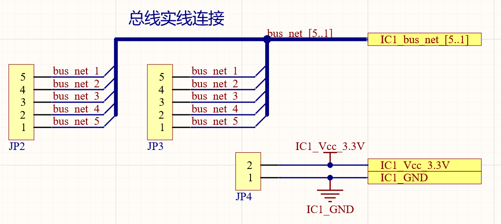

Sheet 3 SCH 图：

Sheet 1 SCH 图：创建一个名为 SPI 的 Harness，且引出在其中心引出 Port 名为 SPI。 

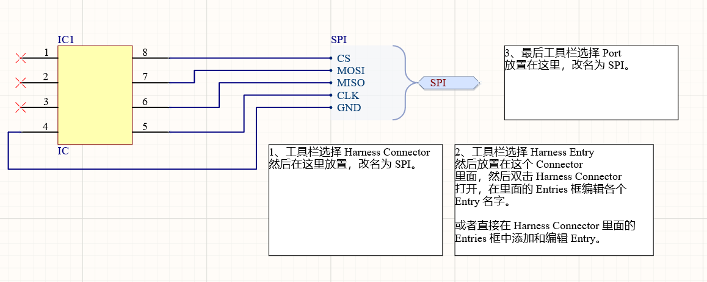

Sheet 4 SCH 图：引用 名为 SPI 的 Port，创建一个名为 SPI 的 Port，使用 Signal Harness 给该 Port 拉线，则该 Port 会自动变为 Harness 类型，双击该 Port 打开属性，修改 Harness 的类型为 “SPI”（该 “SPI” 名字即上图中 Harness 的名字）。

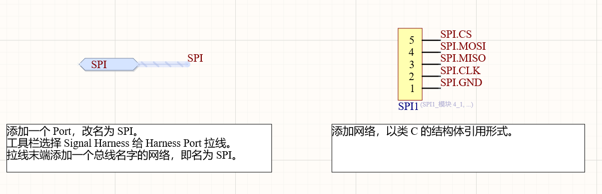

Top SCH 图：

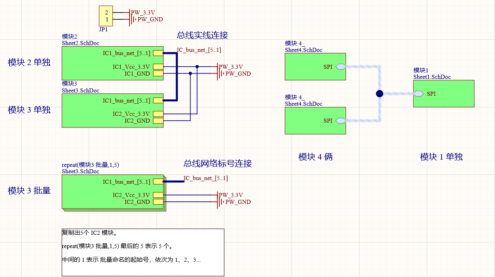

注意，一个 sheet 的所有 port 都要加上，不能少。

PCB 效果：

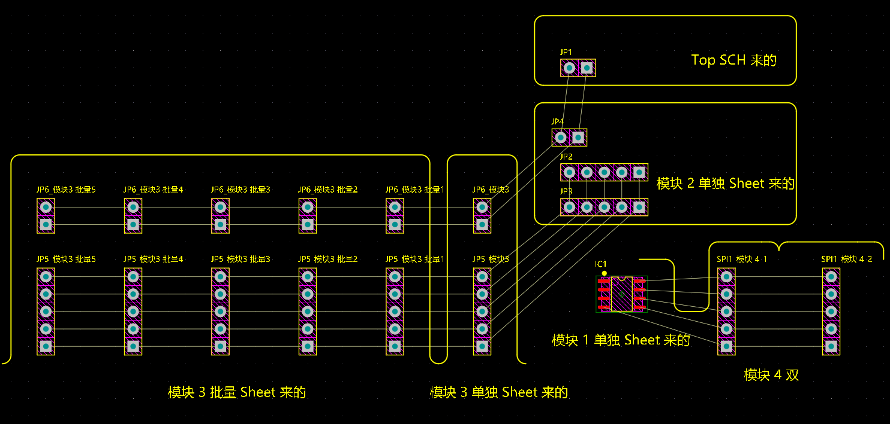

### SCH 线组和差分对设置

原理图中添加 线组（Net Class）和 差分对（Diff Pair）（尽量在原理图中将线分组完成，而不是在 PCB 中手动挨个添加，因为从原理图更新 PCB 时原来在 PCB 单独添加的线组会被清除），并在原理图中对电源线线宽规则、数据线线宽规则和差分线对均设置完成。

- 添加线组（Net Class）和规则：

  （首先确保 工具栏—>Project—>Project Options—>Class Generation 里面的 Gentrate Net classes 勾选，这样设置才能原理图产生线组 Class，软件默认勾选）

  Place 中选择（空白处右击选择 Place 或者 原理图界面软件上方工具栏选择 Place 或者在原理图上方的工具栏里面）Directives 里面的 Blanket，包围要添加一个线组的所有线（可以画成不规则形状，关键要在只剩最后一处连接的时候右击完成放置）；再在上述位置找到 Parameter Set，选择后 TAB 键修改参数，在里面 add 一个 Net Class 参数，并写上线组名，可以选择是否显示该参数，推荐 Label 名修改为 “Class _ <线组名>”，然后放置并连接到 Blanket 上面；再添加一个 Parameter Set，add 一个 Rule 参数，选择线宽项，设置线宽，最后放置并连接到 Blanket 上面。如下图所示，这样就将这一组线命名为 “I2S _ LINE” 并设置了线宽规则。然后从原理图更新到 PCB 即可。

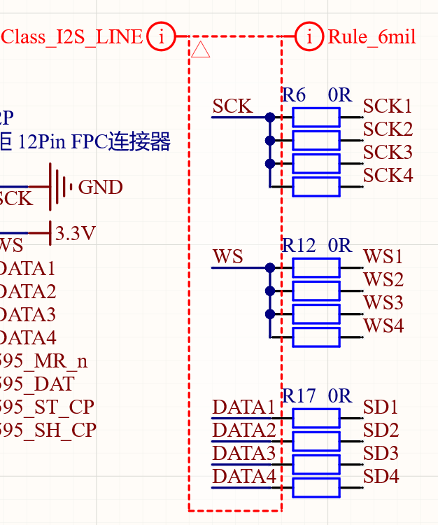

如果要设置线组的线不在一块并且也不好用 不规则形状的 Blanket 全部包围住，那么就将这些线的线标单独拿到一块空白区域，然后围住即可。

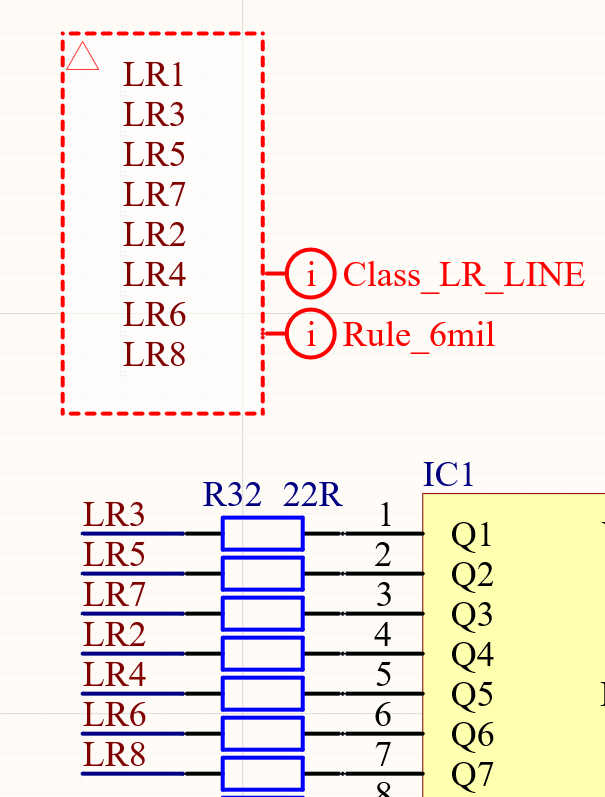

- 在 PCB 中查看线组：

  1. 在 PCB 界面，右下角 Panels 点开 “PCB”，左侧即可看到 “PCB” 栏，里面即可看到线组。
  2. 在 PCB 界面，上方软件工具栏选择 Design 里面的 Classes 栏，里面即可看到线组。

- 添加差分对（Diff Pair）：

  每一对差分对的线标有要求，前缀必须相同，后缀必须为 “_ P” 和 “_ N”，软件才会识别。

  如下图设置。执行原理图更新到 PCB 操作。在 PCB 视图 中的 左边 “PCB” 栏里上面选择 “Differential Pairs Editor” 即可看见刚刚添加的差分对。也可以不画 Blanket 而在线上直接添加 Differential Pair 标识符，要写好差分对名称。

  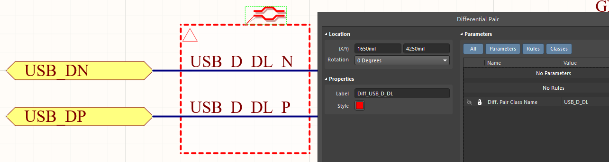

  可以同时添加多组差分对，如下图所示，只要线标名字按照要求即可识别。

  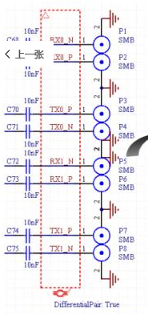

- 差分线对走线：

  在 PCB 视图中，工具栏选择 Interactive Differential Pair Routing 在差分线对上走线即可，走完之后还可以用 Interactive Diff Pair Length Tuning 确保差分线等长。

  更多差分线的规则设置看“差分走线设计”小节。

### PCB 布局复制

**手动按照坐标来布局复制**

针对多个一样的模块，PCB 中器件摆放/布局都一样化。

1. 先布局好一套模块，另外几套模块的位置可以乱，先放着；
2. 打开 Panels 中的 PCB List，选择 View Selected Objects，再选 Components，再把上面布局好的一套模块的所有器件选中，这时 PCB List 中会显示所有被选中的器件信息表，找到表中的 X1 和 Y1，右击选择 Switch to edit mode，然后选中 X1 和 Y1 复制，然后选中另外一套模块的所有器件，在其 X1 和 Y1 上粘贴即可，这时两套是重叠的，不要取消刚才的选中状态，进行整体平移到两套不重叠，然后选中第一套模块的所有器件，在 PCB List 中复制所有的 Rotation，然后选中第二套模块的所有器件，在其 Rotation 栏粘贴即可。

**按照多个相同 Sheet Symble 的自动布局复制**

这种根据多个同样的 Sheet Symble，只要布局好其中一个，其它相同 Sheet Symble 的元件都自动布局复制。其方法在 `\PCB LOGO-画法集合-PCB工具-规则文件\多个相同 Sheet Symble 布局复制\Altium Designer 多个相同电路快速布局.pdf`文件里。

### PCB 差分走线设计

差分线具有抗干扰能力强、信噪比高、辐射小和带宽容量大等优点，常用于高速链路设计。更多 信号完整性（SI）基本概念说明可见 “信号完整性（SI）分析” 一节。

常见差分线的阻抗：一般的高频信号线均为 50 欧姆 ~ 60 欧姆。75 欧姆 主要是视频信号线。USB 信号线差分阻抗为 90 欧姆；PCIe 差分线为 100 欧姆（85 欧姆 到 115 欧姆）；MIPI 差分线阻抗规定为 80 ~ 125 欧姆。以太网差分信号线差分阻抗为 100 欧姆。RS422、RS485、CAN差分信号的差分阻抗为 120 欧姆。

阻抗匹配概念简单入门：[PCB板画废了，才知道阻抗设计这么重要！ (qq.com)](https://mp.weixin.qq.com/s/DWc3dFyCAzR6rfw0BeHRfg)。阻抗匹配是差分线对的输出端、传输路径 和 接收端 三个位置的 阻抗 均相同，从而不会产生信号的反射。“信号源内阻与所接传输线的特性阻抗大小相等且相位相同，或传输线的特性阻抗与所接负载阻抗的大小相等且相位相同，分别称为传输线的输入端或输出端处于阻抗匹配状态，简称为阻抗匹配（引自百度百科）”。

- 如果差分线对的两根线不等长会怎么样：[高速 PCB 蛇形线，等长线，差分对是咋回事，我们再做个实验_ 哔哩哔哩 _bilibili](https://www.bilibili.com/video/BV1Vr4y1w75S)。
- 如果差分线对的阻抗不一致会怎样：[做个实验告诉你高速PCB为什么要阻抗匹配_ 哔哩哔哩 _bilibili](https://www.bilibili.com/video/BV1hi4y1j7zX)。

AD 中添加和设置差分线对：输入端和输出端的阻抗从 原理图的电路和IC选型上就能定好，传输过程的阻抗调节有两种方法，设置差分线对的 线宽 和 线距 来产生一定的阻抗，或者差分线对 分别 串联 电阻 进行后期的调整。在 PCB 上走差分线对 需要先 严格的 测算和设置 线宽 和 线距 等，以达到目标阻抗。实际中，若在调试阶段，除了走计算好的差分线之外，还应该添加上 阻容感 元件 的位置用于后期调试的阻抗调整。首先要原理图中添加差分线对：步骤详看“AD 20 快捷键 & 绘制技巧” 小节里面的 “SCH 中” 部分的 “添加差分线对” 部分！

#### 阻抗计算软件

**TXLine**

- [TXLine_百度搜索 (baidu.com)](https://www.baidu.com/s?ie=UTF-8&wd=TXLine)。

**Polar Si9000**

- [Polar Si9000_百度搜索 (baidu.com)](https://www.baidu.com/s?ie=UTF-8&wd=Polar Si9000)。
- [PCB阻抗设计及Polar Si9000 PCB阻抗计算软件的使用_ qlexcel的专栏-CSDN博客 _polar si9000](https://blog.csdn.net/qlexcel/article/details/82933320)。
- [特性阻抗计算神器Polar SI9000 2021 V21.04 版本更新 (qq.com)](https://mp.weixin.qq.com/s/jRGLnSs5Nq7UpRtS8rTkzA).

**嘉立创阻抗计算器**

这里的步骤以 嘉立创 提供的计算工具和下单助手提供的阻抗生产选项为准。下面以 USB 差分走线（阻抗一般为 90 Ω）为例。

1. 嘉立创提供的阻抗计算工具；

   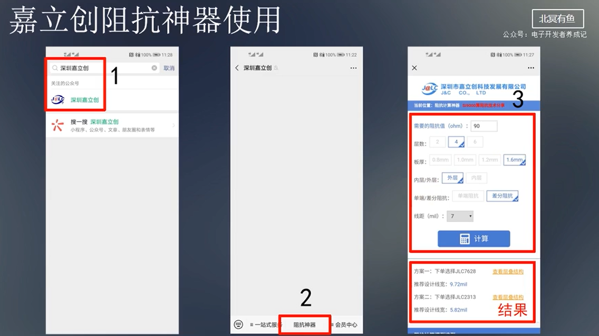

2. 嘉立创下单助手的 工艺信息 一栏选择 "需要阻抗"，并选择层压结构（一般为第一个 JLC7628）；

   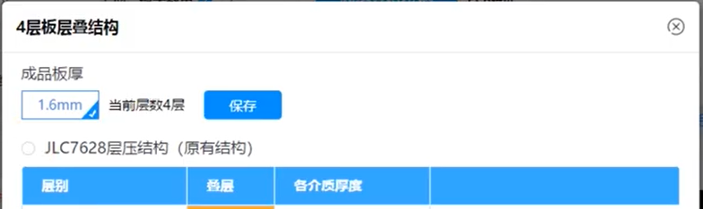

3. 在 PCB 的 规则 Rules 中，点进 DiffPairsRouting 栏里，改差分走线的 最小间隙和优选间隙 为步骤1中指定的（7 mil），最小宽度、优选宽度和最大宽度 改为步骤1中指定的（9.72 mil）。

4. 在 SCH 或 PCB 中添加差分对，[一个详细步骤文章](https://www.sohu.com/a/152779501_744981)，[另一个详细步骤文章](http://www.360doc.com/content/17/0705/10/33246491_668901190.shtml)，然后在 PCB 页面中打开 panels 的 PCB 栏，在其中选择 Differential Pairs Editor，可以看到差分对的名称以及其具体的每一个差分线。

5. 在 PCB 界面中选择 "交互式差分对走线" 进行走线。

#### PCB 上差分走线要求

- 每一组 LVDS 内的两根信号线要 "紧耦合" 和 "等长" 处理，当两者不可兼得时，应该优先考虑等长。“紧耦合” 即两根信号线间距尽量一致（使 共模抑制比 CMRR 最大）。
- 控制/设置阻抗所要求的线宽、线距等。
- 差分线对尽量走直线，拐弯时走圆角。
- 差分线对的接收端的电阻要靠近接收管脚。
- 线路途径元件尽量使用表贴元件，线对尽量避免过孔，若需要过孔则一对差分线上的过孔数量要一致。
- PCB 中走差分线对要保证等长、等距和过孔数量一致，其中必须要满足等长（要保证相位匹配，等长的优先级最高）而另外两项可以妥协一点。差分线的等长要尽量让两根线靠近（等长线的蛇形线的凸起要小），而且尽量在靠近发射端的一边将等长处理完毕。

### PCB 等长线/蛇形线设计

这里是针对 AD20 的操作。

1. PCB 界面的右下角 Panels 按钮里面打开 PCB 栏，左边 PCB 栏中显示 Nets，在 Net Classes 栏里面添加要等长的线的 Class 命和线。参考 “通用 AD 规范” 一节，线组在设计原理图的时候就要设置好，不推荐在 PCB 界面添加线组。
2. 然后在 Rules 里面，High Speed 里面的 Matched Lengths 上右击新建一个规则，进去在 Where The Object Matches 栏里面的 第一个选 Net Class，第二个选 要等长的线的 class，然后在下面设置 Tolerance，容忍等长的误差，最好填小一点如 3 mil。
3. PCB 界面 工具栏 选择 Interactively Tune Trace Lengths 工具，从最短的线开始画线进行等长变化的区域；鼠标开始拉蛇形线的时候，按下 TAB 键，打开属性窗口选择 本线组中最长的那根线，然后继续拉线，这样当等长的时候鼠标继续拉蛇形线也不会继续增加长度了。
4. 快捷键：“1、2”改弧度，“3、4”改间距，“，、。”改绕长，在左下角导航选 “PCB” 窗口，可见加入网络的要等长的线及其各自的长度；走线等长变化的区域可以调整，直接对等长变化区域选中的矩形框的四周拖拽，改变等长区域；删除等长，直接选中线的等长变化区域再按 del。

### PCB ActiveRoute 用好省时

- [ AD18中高速信号等长线使用_t wx11213030422的博客-CSDN博客 _ad18等长布线](https://blog.csdn.net/twx11213030422/article/details/88656361)。

关键步骤：

1. PCB 界面的右下角 Panels -> PCB ActiveRoute。
2. 按住 Alt 并按住鼠标左键从右向左拖动 选择 全部要 ActiveRouting 的线。
3. 选择在哪层布线，在 PCB ActiveRoute 窗口中的 Layers 区域选。
4. 绘制布线 区域规划，在 PCB ActiveRoute 窗口中 Action 区域点击 Route Guide 按钮，然后在 PCB 里面 画 走线区域，键盘上 上下箭头按键 调节区域宽度。
5. 执行 ActiveRoute 命令，在 PCB ActiveRoute 窗口中 Action 区域点击 ActiveRoute 按钮，执行 ActiveRoute 布线命令，软件左下角进度条 显示执行进度。
6. 可以自动进行等长线、和差分线的走线，用时学即可，网上教程很多，这里不重复。

### PCB 添加 LOGO 图案

两个方法（[PCB个性logo设计-面包板社区 (eet-china.com)](https://www.eet-china.com/mp/a103267.html)），第二种和第三种精度高，但第三种操作最方便且通用（你看，口水话几乎没有）。

1. PCB Logo Creator 生成丝印图案的方法，具体教程 pdf 和所需软件在 `./PCB LOGO-画法集合-PCB工具-规则文件/创建 PCB Logo 图形/PCB Logo Creator 生成丝印图案的方法.zip` 里面。
2. LOGO 字体 添加 PCB 图案的方法，具体教程和所需软件在 `./PCB LOGO-画法集合-PCB工具-规则文件/创建 PCB Logo 图形/LOGO 字体 添加 PCB 图案的方法.zip` 。[AD20 添加字体logo 视频教程 - 北冥有鱼](https://www.bilibili.com/video/BV1kC4y1a7bM)。
3. 新版 AD 直接在 PCB 里导入 图形即可，[AD21如何快速添加LOGO_ 哔哩哔哩_bilibili](https://www.bilibili.com/video/BV193411e7mW)。当前在哪个导入，就会是那个图层的图形。

## 4 SCH-PCB 设计规范

### 幼稚园级

1.  首要参考 “最基本的 PCB 绘制过程” 小节中的 6 多层板、7 布局、8 布线 部分！

2.  走线没有锐角和直角拐弯（包括信号线和电源线）；可以走 T 型线，但其直角转角要做缓和的圆角过渡处理。

3.  元件引脚下的焊盘上尽量不要放过孔。

4.  功率线、信号线尽可能短，功率线要足够粗，必要时应开窗加锡，并且大电流线、电源线之间的间隔应大于30mil，内电层不同区域之间的间隔宽度不小于 40mil。

5. 大电流、高功率的走线及其经过的器件应尽量按照能量流动的 "好走" 的路线布局和布线，尽量减少拐弯和跨层，让其一马平川的流动。

   线宽和电流能力关系表：（参考：过 2A 至少要 30~40mil（约 1mm） 线宽）（40mil 约为 1mm，20mil 约为 0.5mm）（1mil = 0.0254mm，1OZ  = 0.035mm ≈ 1.4mil）

   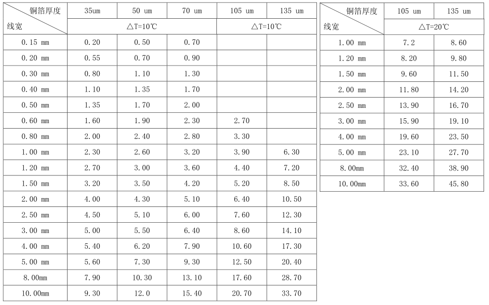

   

   

   过孔直径和电流能力关系表：（看工程实践一栏；孔径高于 0.5mm（约 20mil） 时，每增加 0.5mm ，电流能力增加 0.5A ）

   

   推荐过孔孔径：（单位 mm）

   -   信号线——0.3过孔 / 0.5外径（8/16mil 过孔），0.84A 电流；
   -   弱电电源线——0.5过孔 / 0.8外径，1A 电流；
   -   大电流(多个)——1过孔 / 1.5外径（30/40mil 过孔），1.5~4A 电流；
   -   大电流（多个）——1.5过孔 / 2外径，2~5A 电流。

   PCB走线与电流关系更多参考文档：`./额外文档/PCB走线与电流关系.pdf`。

6. 多采用星形拓扑结构，少采用菊花链布局，缩短电源的公共回路。

7. 关于电源：

   1.  电源变换元器件（如变压器、DC/DC 变换器、三端稳压管等）应该留有足够的散热空间，发热器件底部加一个或多个大孔径的过孔（接地或不解地）；干扰源（DC/DC 变换器、晶振、变压器等）底部不要布线，以免干扰。走线短、粗。
   2.  去耦电容（旁路电容）尽量靠近 IC 等器件的电源输入端，滤波电容可以放置在芯片的背面，靠近芯片的电源和地引脚；可选的，每一个去耦/滤波/旁路电容的接地端附近放一个过地孔，让电流顺畅泄放。
   3.  电源芯片输入输出的大、小去耦/滤波电容，小的靠近芯片端。
   4.  开关节点（MOS 的 输出端）有严重的电场辐射，其铜箔应该最小化，并避开其他敏感电路。

8. 留意一些大功率的电源类等芯片下方有接地的 PAD（焊盘），不但要开窗裸铜，还要放一个或多个大的过地孔；其他高发热/高功率的器件同理。

9. 留意差分信号（如 USB 和 CAN 的信号线、运放输入，电流采集的差分电压信号和晶振的差分时钟信号等）要注意线上串阻抗匹配的电阻，或设置差分走线（需要计算和设置 线距、线宽等）。

10. 留下必要的测试点（开窗点），留螺丝孔。

11. 丝印字符方向尽量在两个方向以内，避免人看的时候不断转板子。过孔尽量不要放在丝印上。

12. 用丝印字符和图形 标识出从板子引出的 引脚 功能，接口说明，开关、拨码开关的功能表，LED 指示的功能等。

13. 画出 LOGO、板子名称、板子版本号 和 防静电（手勿触碰）与高压提醒等丝印层标识。

### 本科生级

- 基本绘板过程要点！请看 “最基本的 PCB 绘制过程” 一节的 7、8、9、10、11、12 设计要点，这些是规范的基本步骤！基本！

- 器件布局相关：

  - “最基本的 PCB 绘制过程” 一节的 “7 元器件布局” 设计要点。
  - 减少一个电路回路所包围的面积，考虑从电源输出正极的电流出去开始一直到回到电源负极的整个路线，要这个路线形成的环所包围的面积尽量小。
  - 对于变压器、扬声器、电感等会产生磁场的元件，布局时应注意减少磁力线对于印制导线的切割，相邻元件磁场方向应相互垂直，减少彼此之间的耦合。
  - 元件的放置要便于调试和维修。大元件边上不能放置小元件；需要调试的元件周围应有足够的空间。
  - 一个芯片的外围阻容元件应尽量靠近芯片，并尽量接近其所要连接的芯片引脚。例如，电源脚去耦电容靠近电源引脚，电源芯片的反馈电阻要靠近其 FB 反馈输入引脚。
  - 晶振、继电器、开关电源等强辐射器件远离单板接口连接器至少 1000mil。
  - 高压元件核线路之间要留有空隙，100V 以内至少留 1mm 间隔，线路和元件 与板边缘同理；若对于 100V 以上并且空间小不够开 大于 1mm 的间隙，那么可以做 1mm 宽的板挖空做隔离。
  - 接口电路的滤波、防护、隔离器件、EMC和整流等应该靠近接口放置；如果接口处既有滤波又有防护电路，应该遵从先防护后滤波的顺序。I/O接口电路及功率驱动电路尽量靠近 PCB 板边缘，即大功率器件尽可能放在电路板边缘。

- 热设计的几个原则：

  - 器件的摆放要考虑通风散热的方便，要使得空气可以比较顺畅的从一边流向另一边并有效带走主要发热元件（电源芯片、控制器芯片、功率管、测流电阻等）的发热热量。
  - 发热元件尽可能分散布置、均匀的放置，不要使热量堆积在一个小区域内。
  - 热敏感元件（晶振、精密电阻、主控等）要远离发热元件并放置在“冷”区域（或发热元件的板面的另一侧），并置于散热气流入口处。
  - 发热源（电源、测流电阻等）要给予散热空间（在 PCB 板上挖空一定区域增加透风，或预留散热器件的安装空间）并摆放在出风口附近等。
  - 发热器件如电源芯片、功率管、测流电阻等，要在其下面加一个或几个大孔径的过孔（接地或不解地）增减散热。发热元件应有足够的空间以利于通风散热；热敏元件应远离发热元件。

- 多层板相关

  - 时钟频率到 5MHZ 或脉冲上升时间小于 5 ns（五五准则），则 PCB 板须采用多层板。

  - 考虑板子尺寸、器件和走线密集程度、成本、抗扰和稳定性等，进行多层板划分，可以参考推荐多层板板层设置。多层板的推荐板层分布图：

    

  这里注意，并不必严格按照上图进行划分多层板的叠层，具体问题具体分析。

  我的规范建议：

  - 多层板的第二层（从上往下数）一般为整个地平面层；地平面层要保证大片的完整性，避免异形。

  - 典型四层板板层分布为（由上到下）：
    - 信号层 - 内电层（GND层） - 电源层 - 信号层（把信号层露在外面是为了好实物修改，也可不这样）；
    - 信号层 - 内电层（GND+VCC层）- 信号层 - 信号层。
    - 少量的层数时候，比如四层板，或者板子尺寸小并且走线密集，少一个电源层，就多一个走线层。但是在走线不太密集时候，两层用于走线够，那么两个内层就可以当作两个内电层分别连接地网络和电源网络（并分割），减小电源走线的阻抗。

  - 每一个信号层视情况，与内电层的地分割同样的位置，加地网络覆铜，并打地网络的缝合孔（贯穿多层板的连接地网络的过孔）。

  -   多层板中有内电层作为整个地平面时，尽量不要破坏 发出干扰的元件和芯片下方的 地平面的完整性，尽量不要有过孔等破坏地平面完整性。

  -   多层板的关键信号层最好位于两个地平面之间，即其电路模块的上下层所对应的区域都用地平面覆盖。

      

  - 电源平面应相对于其相邻地平面内缩 5H-20H（H 为电源和地平面的距离，若内缩 20H 则可以将 70% 的电场限制在接地边沿内，内缩 1000H 则可以将 98% 的电场限制在内）。内缩1~2mm（40mil 以上)。

    

  -   相邻布线层的走线应尽量垂直；实在无法实现垂直而必出现平行的应互相远离，或时钟、总线、射频线等关键信号走线和其他同层平行走线应满足 3W 原则，3W 原则：线中心距不少于 3 倍线宽（70% 的电场不互相干扰），还有更好的 10W 原则（98% 的电场不互相干扰）。小信号走线尽量远离大电流走线，忌平行，相距要 大于等于 2.0mm。

- 电源滤波电容的布线：

  - 单个电容情况的布线：纹波电流要尽量全部经过电容的引脚。

    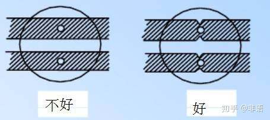

  - 多个电容情况的布线：纹波电流经过第一个电容产生的热量也比第二个、第三个多，很容易损坏，走线时，尽量让纹波电流均分给每个电容，走线如下图A、B如空间许可，也可用图B方式走线。

    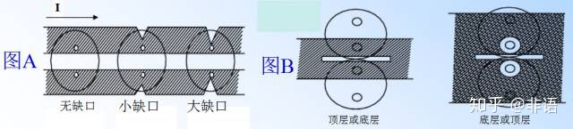

  - 每个滤波、去耦电容的接地端旁边加过地孔（数量视电容容量而定，电源滤波的大容量电容则加一个以上）（增加回流通路，减小回流阻抗）。

- 敏感信号线/高频信号线/关键信号线 设计的几个原则：

  - “最基本的 PCB 绘制过程” 一节的 “8 布线” 设计要点。
  - 差分线对的阻抗匹配 可以依靠 PCB 上走线时的 线宽和线距的 测算和设置，也要在原理图中 分别串个小电阻，以方便后期拿到实物可以再 改电阻 来对线路的 阻抗 进行微调。详见 “PCB 差分走线设计” 一节。
  - 敏感电路或器件（如复位、看门狗、高速/关键 信号线路等）远离单板各边缘特别是单板接口侧边缘至少 1000mil，或关键信号线距参考平面边沿的距离大于 3H（H 为线距离参考平面的高度）。信号线不能从变压器、散热片、MOS 管脚等中穿过。关键信号线 远离 高频线路/器件。高速/关键 信号线应该 远离 其它任何 线路或器件 至少 10mil 以上。差分信号线组相互之间至少远离 3倍 差分线间距 的距离。
  - 高频元件一侧的 PCB 面上不要走线，应该大面积覆铜并加围圈的过地孔，在 PCB 的另一面可以布线。
  - 过孔可能会引发信号传输线的阻抗突变，因此需要尽量减少过孔使用的数量，尤其是对于关键信号线，一个过孔大约带来 10pF 的电容效应。
  - 关键信号线不能出现 T 形线。
  - 敏感信号线/高频信号线/关键信号线，其周围应放置多个接地过孔（宽度大于 50mil 地线或间距小于 300mil 的地孔），提供电磁屏蔽，或叫包地处理。信号线（特别是关键信号线）换层时，应在其换层过孔附近设计地过孔。
  - 无论是时钟线、信号线还是电源线，在 PCB上 的走线都应该尽量短，器件紧密排布以减少 PCB 上走线长度；而且时钟线和信号线等在 PCB 上的走线应尽量用地过孔和地平面在空间上包裹；并且在 PCB 板的四周边缘打一圈连地平面的过孔。

- MCU 的 IRQ 中断引脚等重要 IO 注意静电保护等，可加 TVS 保护管，防正负过压的保护二极管。

- 开关器件如 MOS，其栅极和源极之间要加 TVS 防过压冲击（设计让 Vgs ≤ 18 V 恒）。MOS 的栅极串电阻的作用：MOS 导通速度过快，高压情况下容易击穿周围的器件或者损坏 MOS（后者为感性上理解）；栅极电阻阻值过大会导致 MOS 管导通速度过慢，开关损耗会巨大。栅极电阻最好紧靠栅极，并且这个是信号线，布线避免与其他线耦合，避免栅极过压。

- 高阻抗输入端易受干扰，所以器件的高阻抗输入端的 R、C 元件要靠近输入端放置，高输入阻抗的器件有如 BJT 的基极、MOS 的栅极、二极管、CMOS 芯片（运放、数字IC等）引脚等。

- 防护电路的检查项详看 "1 最基本的电路检查项和器件选型" 章节的 "保护机制"。

- PCB 走线和覆铜完毕后，加“缝合”过地孔，防止孤立铜箔，覆铜边角修为 45° 或圆角（减少天线效应）。

- 电源模块周围加一周过孔包地，电感接地端也要多加，晶振周围和时钟线用过孔包围，每个模块用过地孔围一圈（即 法拉第电磁屏蔽笼）。对于金属外壳接地元件(例如晶振)，应在其投影区的顶层上铺接地铜皮，并在其周围密布上一圈接地孔，提供电磁屏蔽。

- 小型化是产品开发的必经之路，挑战极限才有竞争力。

- 更多某些具体地方的规范看下面的 “各类型电路设计规范或要点” 一节。

### PCB 计算小工具 / 辅助设计小软件

**电路&PCB计算小工具**

详见`PCB LOGO-画法集合-PCB工具-规则文件\SCH&PCB 设计、计算和检查的工具和软件\`里，包括：

- 电路计算Excel表格合集！非常丰富。
- PCB 过孔电流计算器。
- ProPCB PCB设计助手。
- 一键删除AD的History文件和Previews文件和ProjectLogs文件.bat（放到 AD PCB 工程文件夹内，双击运行一次可以清理除了工程以外的临时文件）。

**零散电路计算工具网页**

- [在线电子单位换算器 - Digi-Key得捷电子 (digikey.cn)](https://www.digikey.cn/zh/resources/online-conversion-calculators).
- [在线计算器_电子工程师在线工具 - 电子工程网 (eechina.com)](https://www.eechina.com/tools/)。
- [LC电路频率在线计算器 (520101.com)](https://tool.520101.com/dianlu/lcdianlu/)。
- 合集，包括传函计算、闭环系统计算、运放电路、滤波器、滞回比较器、解方程等：[Engineering Design Utilities (okawa-denshi.jp)](http://sim.okawa-denshi.jp/en/)，其内的滤波器仿真：[Filter Design and Analysis (okawa-denshi.jp)](http://sim.okawa-denshi.jp/en/Fkeisan.htm)。

### 各类型电路设计规范或要点

*p.s 电源、运放、EMC 和 高速电路等细分领域，看看那些 芯片大厂 对这些方面出的 文档，其晦暗艰深，每一块儿都能够研究一辈子、吃一辈子饭。*

*p.s 我看过很多在对电路原理没有学习和认知而只管连通、随意走线的别人的板子，要不是我脾气好，否则止不住骂骂咧咧全都当垃圾对待。我也是从那时候过来的，只是如果用心对待，那种状态不会持续超过2年，如果再长，那就过分了属于现学现卖和混子。*

#### 运放设计注意

- 运放选型。运放基本参数 详见 “1 最基本的设计理念和器件选型” 一节的 “运放” 小节（去看一下，里面说的参数选择比较全面，光靠记忆不太中）。

  > 下面引自 ADI 2021.12 线下专题讲座 某个 PPT。
  >
  > 
  >
  > 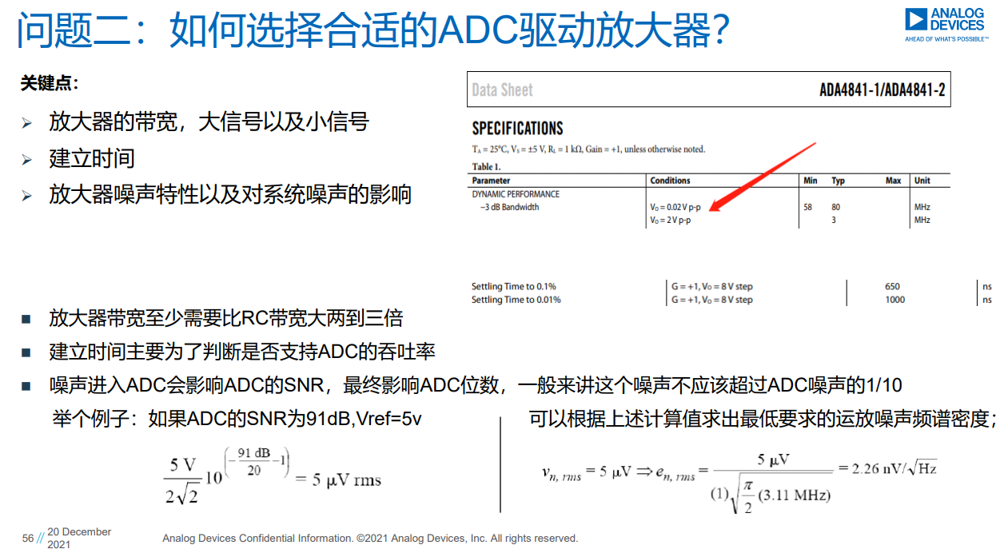
  >
  > 

- 注意滤波器仿真，和滤波器的品质因数 Q。仿真工具详见 “4.3 大厂在线/离线电路仿真工具” 一节。

- 防止输出信号失真：运放/放大电路 的 摆率/带宽 足够，不合适的放大倍数导致输出超过电源电压。

- 电路设计注意点：

  > 下面部分内容引自 [运放使用的注意事项 (qq.com)](https://mp.weixin.qq.com/s/PascwarLFo7kndlbt8vw0w)。
  >
  > - 运放的输出和输入口上不要直接并电容，要先通过电阻再经过电容。
  > - 反馈回路的元器件必须要靠近运放，而且 PCB 走线要尽量短，避开干扰源。
  > - 运放的电源滤波不容忽视，电源的好坏直接影响输出。特别是对于高速运放，电源纹波对运放输出干扰很大，弄不好就会变成自激振荡。所以最好的运放滤波是在运放的电源脚旁边加一个0.1uF的去耦电容和一个几十uF的钽电容，或者再串接一个小电感或者磁珠，效果会更好。
  >
  > 下面引自 ADI 2021.12 线下专题讲座 某个 PPT。
  >
  > 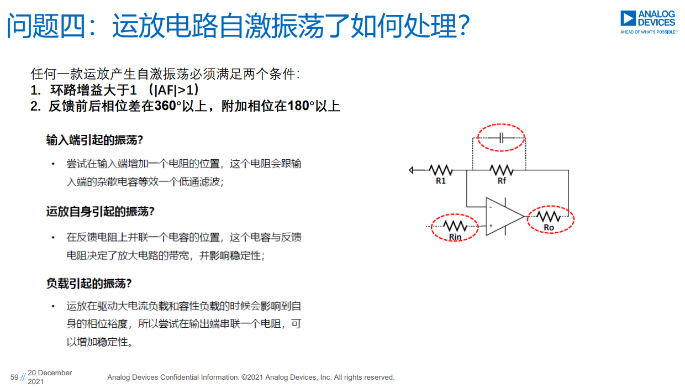
  >
  > 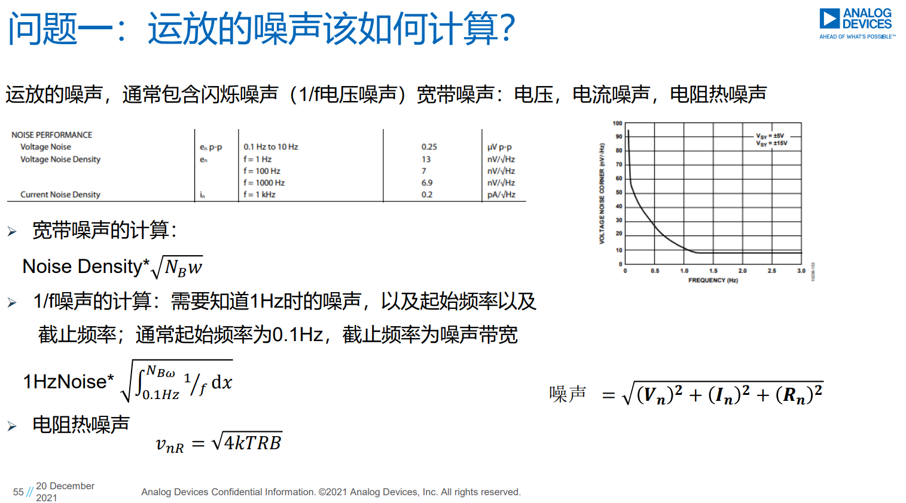

#### 电源规范设计

**电源绘制规范**。基本规则分为三大块，都搞明白了就**自然**的知道怎么画了：

1. 画 PCB 的基本规范要首先知道：按照信号流向走线、走线尽量短、电容尽量靠近要滤波的端口、走线宽度足够设计电流通过（或开窗加锡）、电流路径尽量一马平川而减少过孔和拐弯，还有本规范的其它相关规范内容；
2. 了解 LDO、BUCK、BOOST 或 正激、反激 等电源拓扑的运行原理；
3. 了解电源的主要参数（本规范里 “1 最基本设计理念和器件选型” 章的 “电源” 小节）。电源类芯片的数据手册一般均有 PCB 布局布线参考图，在空间允许的范围内还是尽量参照该参考图。需要完整实践几次，从绘制 SCH、PCB 再到焊接、测量主要参数和调试。

选择 LDO 主要是用其高的 PSRR（电源纹波抑制比，在 10Hz~10MHz 这个完整范围内具有较大的抑制能力）和 低噪声输出。但是LDO输出噪声与降压差、电流和输入噪声频率都有关系，PSRR会随着这些变化，电流影响很大。

**电源设计四要素**（设计一个好电源，打好整板的 “地基”）：

- 体积小；
- 效能高（效率高（轻载、重载情况下均 90% 以上）、低静态电流、热控制好）；
- 低 EMI；
- 好的动态响应（负载调整率好，负载快速变化时输出波动（过冲和下降）小且恢复快，输出纹波良好（20mV 左右 可以，10mV 以下优良））。

**通用 电源树/电源轨 框图**

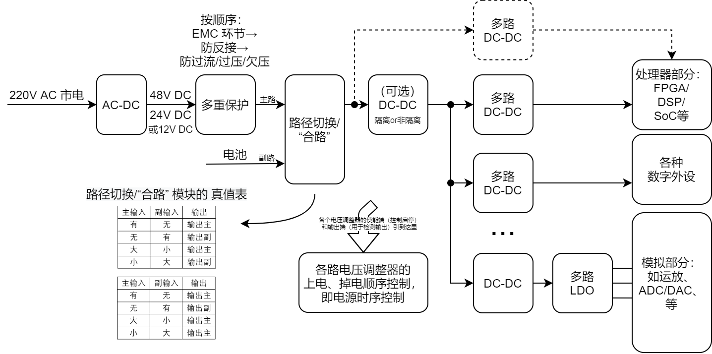

高价值补充：

- EMC 环节，参考 各种 EMC 标准电路，[protection-circuits/EMC 理论和设计要点 at master · Staok/protection-circuits (github.com)](https://github.com/Staok/protection-circuits/tree/master/EMC 理论和设计要点)，其它保护电路也参考这个仓库里面的电路。
- “合路” 环节，对于低压、小电流用两个二极管来选择即可，对于高压、大电流用第二类或第三类路径切换电路，[protection-circuits/掉电保护 简易自动切换电源轨 at master · Staok/protection-circuits (github.com)](https://github.com/Staok/protection-circuits/tree/master/掉电保护 简易自动切换电源轨)。
- 泰克官方，电源测量小贴士，10 个设计阶段：[10_Steps_Power_Supply_48C-60180-cn.pdf (tek.com)](https://download.tek.com/document/10_Steps_Power_Supply_48C-60180-cn.pdf)，文档离线在`\额外文档\10_Steps_Power_Supply_48C-60180-cn.pdf`里。
- 电源噪声：[EEVblog #594 - 怎样测量电源纹波和噪声_哔哩哔哩_bilibili](https://www.bilibili.com/video/BV15t411F76U)、[EEVBlog #1116 - 怎样消除电源纹波_哔哩哔哩_bilibili](https://www.bilibili.com/video/BV1Gt411u7eR)。这篇文章 [【实用】看完这篇，轻松掌握开关电源纹波测量和抑制方法 (qq.com)](https://mp.weixin.qq.com/s?__biz=MzI4NTQ4NTA3NA==&mid=2247486962&idx=1&sn=48001cbfdaa8e92e939abe2c932cb1ec&chksm=ebea3c8fdc9db599c9e6b0ba26274dae8adc999f5bed574fd9ccb50e8f2234ffcbe7c20141fb&scene=0&ascene=7&devicetype=android-23&version=26060638&nettype=3gnet&abtest_cookie=BAABAAoACwASABMABAAjlx4AWZkeAGKZHgBtmR4AAAA%3D&lang=zh_CN&pass_ticket=BK2iBKubCk8sK6qJcWVmP87gLgblu8%2Bkqe1bucAW6oix4OJh3N5tw4OjP9nBjIVB&wx_header=1) 就是对前面两个视频的总结。
- 阻尼震荡与振铃问题：[Buck的振铃实验与分析 (qq.com)](https://mp.weixin.qq.com/s/xj0gmkcpq5TplHRwkMHrCA)、[开关电源的阻尼振荡 (qq.com)](https://mp.weixin.qq.com/s/0n8xpQxZ8uDzwqaKPTruwg)。

#### EMC 电磁兼容设计

> 引自《硬件系统工程师宝典》。
>
> EMC（Electromagnetic Compatibility）即电磁兼容性，指在特定的电磁环境下，电子系统或PCB上的电子元器件之间相互协调有序工作的能力。对于EMC，相应的标准有欧洲的CE认证、美国的FCC认证和中国的3C认证，电子产品在各个区域必须符合相应的认证才可以
> 销售。
>
> **EMC 包含 EMI 和 EMS 两项。**EMI (Electromagnetic Interface)即电磁干扰，指电子系统或PCB上的电子元器件之间在工作时，产生的不利于其他电子系统或器件的电磁能量。EMS (Electromagnetic Susceptibility)即电磁敏感度，指电子系统或PCB上的电子元器件应能接受其他设备或器件的电磁干扰。
>     **EMC 设计的方法可以分为以下四点：接地、滤波、隔离和屏蔽。**接地能够有效地将噪声导入GND平面，滤波能够将无效的信号频段滤除，隔离能够阻挡噪声的传导干扰，屏蔽能够有效地阻断噪声的辐射干扰。
>
> ...
>
> **干扰源、耦合途径 和 敏感装置 是 EMC 存在的三个要求。对症下药。**
>
> 在进行产品的EMC可行性分析时，首先要确定产品定位的区域，从而对应其标准进行相应的测试。对于EMC的可行性分析，可以着重从三个方面入手：**隔离（或抑制）干扰源、切断干扰噪声的传输路径和保护受干扰的群体。**

> 引自 [单片机硬件设计原则：抗干扰常用方法（学习群：943552345） - 知乎 (zhihu.com)](https://zhuanlan.zhihu.com/p/450623564)。
>
> 1. 干扰源。指产生干扰的元件、设备或信号，用数学语言描述如下：du/dt， di/dt大的地方就是干扰源。如：雷电、继电器、可控硅、电机、高频时钟等都可能成为干扰源。
> 2. 传播路径。指干扰从干扰源传播到敏感器件的通路或媒介。典型的干扰传播路径是通过导线的传导和空间的辐射。
> 3. 敏感器件。指容易被干扰的对象。如：A/D、D/A变换器，单片机，数字IC，弱信号放大器等。干扰的分类干扰的分类有好多种，通常可以按照噪声产生的原因、传导方式、波形特性等等进行不同的分类。按产生的原因分：可分为放电噪声音、高频振荡噪声、浪涌噪声。按传导方式分：可分为共模噪声和串模噪声。按波形分：可分为持续正弦波、脉冲电压、脉冲序列等等。
>
> 因此，常用硬件抗干扰技术针对形成干扰的三要素，采取的抗干扰主要有以下手段：
>
> 一是，抑制干扰源抑制干扰源，就是尽可能的减小干扰源的du/dt，di/dt。这是抗干扰设计中先考虑和重要的原则，常常会起到事半功倍的效果。减小干扰源的du/dt主要是通过在干扰源两端并联电容来实现。减小干扰源的di/dt则是在干扰源回路串联电感或电阻以及增加续流二极管后RC抑制来实现。
>
> 二是，切断干扰传播路径按干扰的传播路径可分为传导干扰和辐射干扰两类。所谓传导干扰是指通过导线传播到敏感器件的干扰。高频干扰噪声和有用信号的频带不同，可以通过在导线上增加滤波器的方法切断高频干扰噪声的传播，有时也可加隔离光耦来解决。电源噪声的危害，要特别注意处理。所谓辐射干扰，是指通过空间辐射传播到敏感器件的干扰。一般的解决方法是增加干扰源与敏感器件的距离，用地线把它们隔离和在敏感器件上加蔽罩。
>
> 三是，提高敏感器件的抗干扰性能提高敏感器件的抗干扰性能是指从敏感器件这边考虑尽量减少对干扰噪声的拾取，以及从不正常状态尽快恢复的方法。
>
> 四是，其它常用抗干扰措施交流端用电感电容滤波：去掉高频低频干扰脉冲。变压器双隔离措施：变压器初级输入端串接电容，初、次级线圈间屏蔽层与初级间电容中心接点接大地，次级外屏蔽层接印制板地，这是硬件抗干扰的关键手段。次级加低通滤波器：吸收变压器产生的浪涌电压。采用集成式直流稳压电源：因为有过流、过压、过热等保护。I/O口采用光电、磁电、继电器隔离，同时去掉公共地。通讯线用双绞线：排除平行互感。防雷电用光纤隔离为有效。A/D转换用隔离放大器或采用现场转换：减少误差。外壳接大地：解决人身安全及防外界电磁场干扰。加复位电压检测电路。防止复位不充分CPU就工作，尤其有EEPROM的器件，复位不充分会改变EEPROM的内容。

EMC（电磁兼容性）下分 EMI（电磁干扰，因发射/排放（Emission）电磁波而对环境的干扰）和 EMS（电磁敏感性，对电磁波干扰的耐受度/抗扰度（Immunity））。EMI 下分 CE（Conducted Emission，传导嗓声）、RE（Radiated Emission，辐射噪声）；EMS 下分 CI（Conducted Immunity，传导抗扰度）、RI（Radiated Immunity，辐射抗扰度），还有 浪涌（Surge）和电压跌落等测试。

EMC 主要用到的器件有：TVS 瞬态抑制管（和 GDT 气体放电管）、ESD 防护器件、Y/X 电容、MLCC（片式多层陶瓷电容）、共模电感、磁珠等。对于 各种电压的 AC、DC 电源接口，以及各种通讯接口，均有 标准/常用 的 EMC 电路供参考。

更多内容参见 参考上文的 “保护机制” 小节。更多内容参见 可以参考在 “保护电路” Github 仓库里面总结比较丰富的 EMC 有关的教材资料、**EMC 标准电路**和，以及 ESD 器件如 TVS管、共模电感、磁珠等的介绍和选型。详见如下：

- [protection-circuits/EMC 理论和设计要点 at master · Staok/protection-circuits (github.com)](https://github.com/Staok/protection-circuits/tree/master/EMC 理论和设计要点)。
- [protection-circuits/TVS管 ESD器件选型 接口保护选型 at master · Staok/protection-circuits (github.com)](https://github.com/Staok/protection-circuits/tree/master/TVS管 ESD器件选型 接口保护选型)。

#### "地"的类型 / 地平面分割

要划分这些“地”，防止互相干扰，每一个“地”单独划分区域，单独覆铜；一般方法是单点接地，都连接到电源地上，参考上面 “电源” 中配图。不同电源或地之间可以通过 磁珠 或 0R 电阻 连接，推荐前者，注意电流能力（0805/0603 的 磁珠 的电流能力在其手册有写，1% 0805（1/8W）的 0R 电阻 的电阻最大为 0.01R，电流能力约为 3.5A（3A 左右可能就烧了））。

-   电源地（PGND），公共地（GND），这俩看作一回事；

-   模拟电源部分 对应的 模拟地（AGND）；

-   数字电源部分 对应的 数字地（DGND）；

-   负载地（外接的电机等大负载进行隔离）；

-   外接传感器地（外接模块地隔离，或者共模电感隔离）；

-   机壳地，外壳地；

-   以下为接地的考虑：

    

    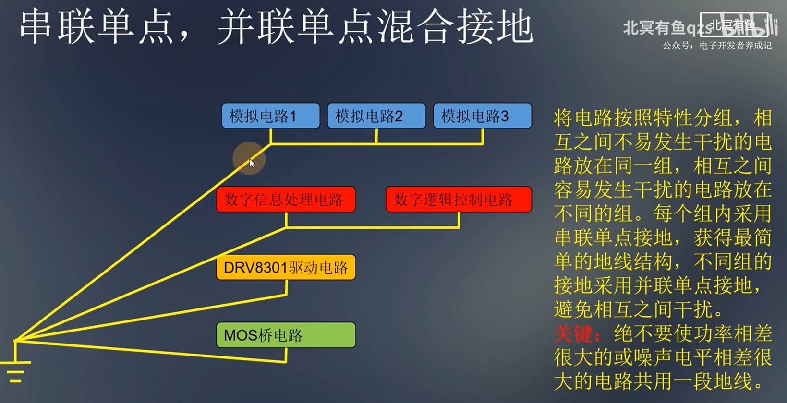

更多参考文档`./额外文档/单点接地和多点接地剖析.doc`。

#### 布局时模块分离

-   要进行电源分割、空间远离和地线单独安排等措施。
-   各个部分接各自独立的“地”，最后都各自单点接公共地。
-   模块特性区分：
    -   数字部分供电电源，给数字电路；模拟部分供电电源，给模拟电路。
    -   强信号、大电流部分 与 弱信号（又分高频、低频）部分。
    -   高电压区域 与 低电压区域。
    -   干扰源 与 敏感元件。即按频率范围划分区域。

#### SI/PI/HS/RF X

*p.s 本节为专业 PCB 领域，本文作者不涉及。只写一点点概念。*

*p.s.s 这一块内容，高速电路、SI、PI、阻抗匹配、射频天线 等的设计，专业的来说，非常依靠 电路/电磁场 的仿真软件 的 专业领域。*

> 引自《硬件系统工程师宝典》。
>
> **信号完整性设计，是指设计的系统在信号传输的过程中能够保持信号的时域特性和频域特性，信号从发送端到接收端能够保持正确的时序、幅度及相位等电气参数。**时域分析从时间和信号波形来观察结果，它研究电源和信号实际的波形，与激励信号有关，适用于观测系统的有源、非线性特性。**时域分析的优点是直观，有明确的SPEC**，如Ripple和Transient等指标供参考；**缺点是不容易发现和解决问题**，IC器件的电流激励波形难以得到，测量容易受外部噪声的干扰。频域分析会从不同频率和对应的阻抗值来观察结果，它研究的是物理结构本身随频率变化的特性，与激励信号无关，适用于无源、线性、时不变系统。**频域分析比时域分析更容易定位和解决问题，容易进行频域仿真**，能够清晰地分析Board Package和Die等各部分对系统性能的贡献，不受外部噪声的干扰。
>
> ...
>
> **系统的信号完整性问题可以归结为5大类**：①**单网络问题**，主要研究单根走线信号的时序、幅度和相位等，引起单根网络信号完整性问题的主要根源是信号的反射问题；②**多网络之间的问题**，主要研究的是相邻信号（同平面走线、不同平面走线）之间串扰祸合的影响；③**信号时序问题**，主要研究的是对信号采样的建立时间和保持时间的最大余量设计；④**电源完整性问题**，主要设计到同步开关输出(SSO)、同步开关噪声(SSN)、因平面谐振引起的电源/地反弹(Ground Bounce)；⑤**电磁兼容与电磁干扰问题**，主要研究PCB的近场辐射特性与远程辐射特性。
>
> ...
>
> 电源完整性(Power Integrity)简称PI，指的是电源波形的质量。从广义上讲，PI分析隶属于SI研究的范畴之内，电源完整性是信号完整性的基础。
>
> ...
>
> EMC 与 SI、PI 虽然在概念上分的很清晰，但从提高信号质量、完善系统设计的具体措施角度考虑，彼此之间又没有明显的界限。

##### 信号完整性（SI）分析

信号具备信号完整性，是指信号发射端将信号有效的输送到接收端，接收端能够接收到符合逻辑电平要求、时序要求和相位要求的信号。

高速电路（以 100MHz 为界）中 电路元器件参数 和 PCB上的 电磁场分布参数 会共同起 主要作用，影响信号质量。

四类 SI 问题（《信号完整性分析-Eric Bogatin》的一家之言）：

- 反射(reflection)；
- 串扰(crosstalk)；
- 电源噪声（同步开关SSN、地弹、轨道塌陷）；
- 电磁干扰(EMI)。

串扰和振铃：串扰是指一个信号被其它信号干扰，作用原理是电磁场耦合。信号线之间的互感和互容会引起线上的噪声。容性耦合引发耦合电流，而感性耦合引发耦合电压；振铃是因为信号线本身阻抗不匹配导致信号发生反射和叠加，从而使信号出现了振荡波形。

避免反射问题最基本的要做阻抗匹配：高频电路源与目的之间的阻抗匹配非常重要，错误的匹配会带来信号反馈和阻尼振荡。过量地射频能量则会导致 EMI 问题。此时，需要考虑采用信号端接；滤波器选型的阻抗失配准则：对低阻抗噪声源，滤波器需为高阻抗（大的串联电感）；对高阻抗噪声源，滤波器就需为低阻抗（大的并联电容）；降低敏感线路的输入阻抗有效减少引入干扰的可能性；LC滤波器 在低输出阻抗电源和高阻抗数字电路之间，需要LC滤波器，以保证回路的阻抗匹配；降低敏感线路的输入阻抗。

对症下药，简单地说为：

- 传输延迟问题：走蛇形线保证信号线等长；
- 反射：要 阻抗匹配，线长不要是1/4波长的整数倍；
- 串扰：元件和导线的磁场相互垂直、平行线相互远离（3W原则）、信号线间用地平面隔离等等。

> 引自《硬件系统工程师宝典》。
>
> 在进行高速PCB设计时，考虑到PCB设计的实际操作，在操作中需要考虑的主要因素有PCB叠层结构(PCB Layer Stackup )、阻抗(Impedance)、器件互连的拓扑结构(InterconnectTopologies )、延迟(Delay Matching)、串扰(Cross Talk)、时序(Timing)、电源完整性(Power Integrity)、电磁兼容和电磁干扰分析(EMC and EMI)。

> 引自百度百科。
>
> 阻抗匹配网络的目的是为了解决功率传输时阻抗不匹配的问题，可以通过集总参数元件（比如电容、电感）或者分布参数元件（微带线）来实现，前者主要用于较低频率，后者主要用于更高的频率。
>
> 阻抗匹配（Impedance matching）是微波电子学里的一部分，主要用于传输线上，来达到所有高频的微波信号皆能传至负载点的目的，不会有信号反射回来源点，从而提升能源效益。[史密夫图表](https://baike.baidu.com/item/史密夫图表)上。电容或电感与负载串联起来，即可增加或减少负载的阻抗值，在图表上的点会沿着代表实数电阻的圆圈走动。如果把电容或电感接地，首先图表上的点会以图中心旋转180度，然后才沿电阻圈走动，再沿中心旋转180度。重覆以上方法直至电阻值变成1，即可直接把阻抗力变为零完成匹配。更多概念 [阻抗匹配_百度百科 (baidu.com)](https://baike.baidu.com/item/阻抗匹配)。

差分线 以及 阻抗匹配，会大概率遇到，对于非硬件人员可能属于需要稍稍会做的内容，其更多内容可看“PCB 差分走线设计”一节。

##### 电源完整性（PI）分析

> 引自《硬件系统工程师宝典》。
>
> 电源完整性研究的是电源分配网络(Power Distribution Network, PDN )，包含电源的源头、供电模块VRM、PCB上的储能电容和去耦电容、PCB上的电源和地平面、芯片封装内的电源和地网络、Die上的电容。
>
> ...
>
> 在电源系统中，噪声是影响电源完整性的一个主要性问题，明确了电源噪声的来源，就能在设计中尽可能地去避免或在出现问题的地方解决问题。

电源完整性可以通过波形观察，用于确认电源末端的电压及电流、纹波等是否符合需求。主要看 DC-DC 开关电源的电压降与电源纹波，只有满足一定性能指标的电源才能保证单板长期运行稳定。

**电源完整性的测量**：

-   纹波和噪声的测量。
-   输出阻抗的测量。
-   环路增益的测量。
-   滤波器件（电容/磁珠等）性能参数的测量。

...

##### HS/RF 高频 / 射频 

**高频相关**

高于 1GHz 信号的线路属于高频范畴，如 LPDDRx、PCIe、天线 等。

对于高频电路，需要考虑元件之间的分布参数的影响。

**射频相关**

离线文档资料：`\额外文档\射频相关\`，更多文章：

- 一个 微波/射频/天线 的 电磁波理论/天线设计相关的 底层原理/科班式 基础介绍 [天线原理（最专业最全面的精华）-面包板社区 (eet-china.com)](https://www.eet-china.com/mp/a84131.html)。
- [非常实用: 2.4G天线设计指南(赛普拉斯工程师力作)_ 霁风AI-CSDN博客 _2.4g天线调试](https://blog.csdn.net/wwt18811707971/article/details/79452165)。
- [鬼才工程师，20天让你“征服”射频天线那些事！ (qq.com)](https://mp.weixin.qq.com/s/v-Dd5QxOuSm13Dy-Lmg4pQ)。
- [射频电路设计要点 (qq.com)](https://mp.weixin.qq.com/s/A7ODTepWoJy46ja_hEKN8g)。

### SCH & PCB 检查表\评审

**PCB Check List（检查表）**

- 比较丰富的 PCB 检查项表格：`\PCB LOGO-画法集合-PCB工具-规则文件\SCH&PCB 设计、计算和检查的工具和软件\PCB检查步骤.xls`。

- 丰富的 SCH&PCB 检查表格：`\PCB LOGO-画法集合-PCB工具-规则文件\SCH&PCB 设计、计算和检查的工具和软件\电路计算Excel表格合集+检查表CheckList\电子工程师一版成功必备检查项（SCH&PCB CHECK LIST）V0.9-避坑指南.xlsx`（引自 公众号 路飞的电子设计宝藏）。
- [一整套PCB设计流程和要点，老板再也不怕我出错 - 知乎 (zhihu.com)](https://zhuanlan.zhihu.com/p/356234723)。
- 设计方面的检查项表格如下图，[图源](https://mp.weixin.qq.com/s/fMdGVFTkOGlQgdq-yfnngA)。

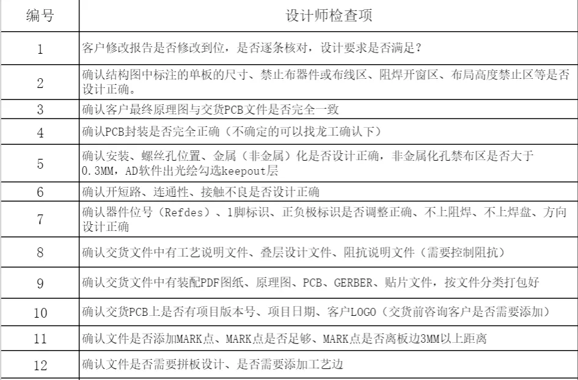

- 自己补充：
  - PCB 至少有一个地平面。
  - 电源线和信号线的路径是否按照原理图设计的流动方向排布；对于信号线，是否正确滤波等。
  - 慢慢补充。

**PCB Review（评审）**

下文引自 [4 步学会PCB评审 (qq.com)](https://mp.weixin.qq.com/s/jqgoclVp1UJkQjYm6ijv3g)。

> 步骤一：资料收集和初步验证
>
> 1. 在开始审阅之前，请确保所有数据手册，参考设计和叠层信息均可用。
> 2. 验证原理图设计并签核。
> 3. Layout DRC，并消除所有错误
> 4. 验证每个元件的封装
> 5. 原理图每个模块分别和PCB对应起来，这样有利于审阅。
> 6. 确保板尺寸正确，并且安装孔在正确的位置且具有一定的允许公差。
> 7. 检查是否有板边的信号
>
> 步骤二：布局
>
> 1. 确保去耦电容尽可能靠近引脚放置。
> 2. RFI和EMC滤波器应尽可能靠近输入输出。
> 3. 提供了足够的空间用于操作和散热器安装。
> 4. 确保正确遵循各个IC的布局指南。
> 5. 考虑回流路径，分析模拟和数字电路是否干扰。 这将引起信号完整性问题。
> 6. 所有有线连接器都放置在电路板的一侧，以保持接地电位尽可能接近。否则可能有天线效应。
> 7. 放置的方式应尽量减小走线长度和交叉。
>
> 步骤三：布线
>
> 平面
>
> 1. 确保数字和模拟电路的公共端仅在一个位置连接。
> 2. 每个信号在其下方都有其参考平面。
> 3. 电源线的宽度应与其承载的电流成比例。
> 4. 确保电源平面中的插槽尽可能少，接地平面应连续。
> 5. 任何平面都不应在中间形成空的环路。
> 6. 确保磁性元件和滤波器下方平面挖空，否则会污染平面。
>
> 信号
>
> 1. 除非特别强调，否则不要有多余的Trace。
> 2. 尽量保证SMD器件下无走线
> 3. 敏感模拟信号需要提供保护环
> 4. 所有信号到板边距离至少20mils。
> 5. 高速信号的参考平面中间没有截断
> 6. 根据制造商提供的叠层信息，确定信号阻抗匹配
>
> 步骤四：丝印
>
> 1. 确保IC下或焊盘上没丝印。
> 2. 遵循同向。
> 3. LOGO和版本号等。

## 4.3 在线/离线电路仿真计算工具

### 电路计算小工具

内容丰富，参看 “4 SCH-PCB 设计规范” 章的 “PCB 计算小工具 / 辅助设计小软件” 小节。

### TI-设计和仿真工具

[设计工具和仿真 | 设计资源 | 德州仪器 TI.com.cn](https://www.ti.com.cn/zh-cn/design-resources/design-tools-simulation.html)。

包括 电源设计工具（开关模式电源、处理器电源（PMIC、FPGA 电源等） 和 用 Power Stage Designer™ 软件工具深入分析电压、电流应力和稳定性）、信号链设计工具（滤波器、模拟电路（运放 和 ADC 设计） 和 时钟树设计） 和 分析和仿真工具（PSpice® for TI 对器件进行热分析等）。

### ADI-设计工具与解决方案

**ADI-设计工具**

[设计工具与计算器 | 设计资源 | 亚德诺半导体 (analog.com)](https://www.analog.com/cn/design-center/design-tools-and-calculators.html)。

包括：

- 电源树/电源轨的设计：LTpowerPlay 和 LTpowerCAD，[LTpowerCAD和LTpowerPlanner | 亚德诺半导体 (analog.com)](https://www.analog.com/cn/design-center/ltpowercad.html)。

  教程（可网搜更多，ADI 官网也有教程）：

  - [LTpowerPlanner：一种系统级电源架构设计工具-EDN 电子技术设计 (ednchina.com)](https://www.ednchina.com/news/201701051400.html)。
  - [√电源设计工程师福利，LTpowerCAD教学视频来啦！ (qq.com)](https://mp.weixin.qq.com/s/bPAfw8iDCzIs9f7RzNwBlQ)。

- 模拟类设计，包括滤波、放大、模拟光电二极管、仪放、ADC/DAC 等：[ADI Precision Studio | 亚德诺半导体 (analog.com)](https://tools.analog.com/cn/precisionstudio/)。

- LTspice 电路仿真：[LTspice Simulator | 亚德诺半导体 (analog.com)](https://www.analog.com/cn/design-center/design-tools-and-calculators/ltspice-simulator.html)。

- RF 及相关工具（包括 RF 阻抗匹配设计）：[RF及相关工具 | 亚德诺半导体 (analog.com)](https://www.analog.com/cn/design-center/design-tools-and-calculators/rf-and-synthesis-tools.html)。

**ADI-解决方案**

- [技术解决方案 | 亚德诺半导体 (analog.com)](https://www.analog.com/cn/applications/technology.html)。
- [参考设计 | 设计资源 | 亚德诺半导体 (analog.com)](https://www.analog.com/cn/design-center/reference-designs.html)。
- [评估硬件与软件 | 设计资源 | 亚德诺半导体 (analog.com)](https://www.analog.com/cn/design-center/evaluation-hardware-and-software.html)。
  - [精密技术信号链 | ADI公司 | 亚德诺半导体 (analog.com)](https://www.analog.com/cn/applications/technology/precision-technology.html)。
  - 等等。

### MPS-设计工具

[设计工具 - 设计 (monolithicpower.cn)](https://www.monolithicpower.cn/cn/design-tools/design-tools.html)。

包括：DC/DC 设计工具、AC/DC 设计工具 和 磁钢设计工具。

### 村田-设计辅助软件 SimSurfing

[设计辅助软件 SimSurfing | 设计辅助工具 | 村田制作所 (murata.com)](https://www.murata.com/zh-cn/tool/simsurfing)。具有在线版和离线版。

具有的工具和功能：

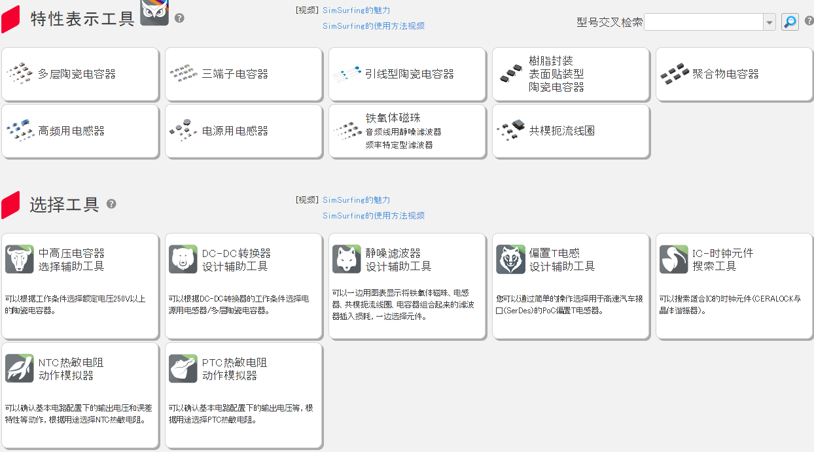

使用教学视频：

- [设计支持工具 SimSurfing - SimSurfing - 视频資料库 | 村田制作所 (murata.com)](https://video.murata.com/zh-cn/detail/videos/simsurfing/video/5288510174001)。
- [电源噪声查不出来？不用上板子，滤波器仿真就能搞定 (bilibili.com)](https://www.bilibili.com/medialist/play/watchlater/BV12v411r798)。

## 4.6 PCB 自动化检查工具

自动化 PCB 检查工具。

- [华秋 DFM](https://dfm.elecfans.com/)：一键分析导入的 PCB 文件，检查项有板子尺寸、孔、线、间距、孤铜等等，排除生产难点、设计缺陷，给出优化建议，结合各种生产因素，自动计算或反算阻抗等等，比较有用。
- etc.

## 5 AD 导出 BOM 表

AD10 的教程：[Altium Designer（AD）软件导出BOM文件操作步骤-百度经验 (baidu.com)](https://jingyan.baidu.com/article/0eb457e501efda42f0a9056a.html)；

AD20 的教程（推荐使用，还包含自定义 BOM 表模板）：[AD20如何自定义BOM模板?Altium Designer20 实用技巧系列教程（五）_哔哩哔哩 (゜-゜)つロ 干杯~-bilibili](https://www.bilibili.com/video/BV1FZ4y1M71U)，其中 BOM 模板文件在 `./PCB LOGO-画法集合-PCB工具-规则文件/AD20 BOM模板/` 里面，这个模板导出的 BOM 表比较常用、整齐，还包含描述、封装、单位价格（可以在导出 Excel 表格后再填入单价，表中的总价格会自动计算；表格最底部有一栏 PCB ，可以填入价格）等，比较实用。注，视频中的模板的位置，在不同版本 AD20 不同，如果按照视频找不到，那么就应该在 `/Altium/AD20/Documents/Templates/` 目录下。

## 6 AD 导出 Gerber 和 钻孔文件

用时再学：

- [【AD小教程】导出Gerber文件和钻孔文件_哔哩哔哩 (゜-゜)つロ 干杯~-bilibili](https://www.bilibili.com/video/BV1n4411L7c9)
- [【完结】第26课 Altium Designer20(AD20)+VESC6.4实战教程：调整丝印输出Geber文件并投板（北冥有鱼）完结撒花_哔哩哔哩 (゜-゜)つロ 干杯~-bilibili](https://www.bilibili.com/video/BV1ea4y1Y7Mx)

## 7 AD 导入导出配置文件

AD 软件的设置和 PCB Rule 设置，两个配置文件的导入和导出，参考本文件夹这里 `./PCB LOGO-画法集合-PCB工具-规则文件/AD 软件设置和 PCB 规则 Rules 配置文件/`。

## 8 使用 KeyShot 10 渲染三维模型

B站等有很多教程视频，以下只经验之谈。

### 基本步骤

-   用Altium Designer导出.step格式的3D模型文件，再导入keyshot，但这个模型不带走线和丝印。
-   导出表面贴图：在Altium Deigner里面使用“智能PDF”分别导出正反面的只有“走线和丝印”两个层的图，注意颜色可选，然后可以把这个pdf使用PS简单修一修（比如颜色修改和过孔透明），再导出.png格式的图。省事的做法可以直接在AD的3D视图截图，然后贴到keyshot的PCB板面上。
-   PCB板面添加贴图：然后把贴图添加到keyshot中PCB模型的板面的材质里面的标签里面。如果板面不加材质，保持原色，则直接在其材质面板下的纹理下的颜色双击添加图片，映射类型选平面，对准选部件，然后点移动纹理调整，调整使这个图像对齐贴合PCB板面即可，另一面的图片再在标签里添加。

### KeyShot 的几个初级技巧

（毕竟只是看一下效果，不是专业的）

-   3D视图下，tools菜单下的legacy tools可以导出带走线的，带丝印的模型，但是文件太大，keshot会卡，对电脑性能要求很高,我还没测试。
    没试
-   高版本的AD，可以导出pdf3d 没试
-   单个模型加材质：单击选中一个模型（出现橘色描边），然后添加材质。或者双击这个模型，右边菜单下面点“接触链接材质”
-   单独删除模型，先模型右击点分离，便可删除单独部件。
-   右边菜单 什么都不选 全局设置的情况下 有 照明和图像里面很多不错的效果可以调整
-   材质和打光：https://www.bilibili.com/video/BV14W411d7Hx
-   动画制作：https://www.bilibili.com/video/BV1T741177WU