# SCH & PCB 设计规范、技巧以及AD 的使用（SCH-&-PCB-rules-and-AD`s-usages）

    

本文系作者纯属对硬件的兴趣（但不走硬件岗）而对过去实践过的、没实践过的硬件概念、经验做的总结，广泛撷取、借鉴和整理，参考的公开文档、书籍和网络文章数量已经**不可数**。看本文的你最好已经对数模电比较熟悉。适合刚入门的人阅读和遵守，已经有较多经验的人看一看图个乐。如有错误恭谢指出！**本文已经是长期积累和堆叠而形成一定规模，不必按照从前到后的顺序去看，可以挑感兴趣的章节去看。**

本文件是 “瞰百易” 计划的一部分，尽量遵循[“二项玻”定则](https://github.com/Staok/Please-stay-in-the-future)，致力于与网络上碎片化严重的现象泾渭分明（这中二魂...）！

本文对应的 [Github](https://github.com/Staok/thoughs-about-hardware-design)/[Gitee](https://gitee.com/staok/thoughs-about-hardware-design) 仓库地址，本文最新的原文 和 一些源码、备查手册等等 均放在里面。

p.s 温馨提示：点个 star 收藏一下回头慢慢看；或者下(白)载(嫖)下来，在 Typora 中阅读； [本文知乎地址（不是最新）](https://zhuanlan.zhihu.com/p/356679916) ；一个人整理不易，这么丰富的仓库只顾着看和克隆而忘了点 star？。

------

## O 目录

[TOC]

------

## 0.5 电子类网站收集

### 大厂官网

筛选器件型号的选型、获得器件手册+参考设计+设计要点等文档资料

- TI（德州仪器）：[模拟 | 嵌入式处理 | 半导体公司 | 德州仪器 TI.com.cn](https://www.ti.com.cn/)。
- ADI（亚德诺）：[ADI | 混合信号和数字信号处理IC | 亚德诺半导体 (analog.com)](https://www.analog.com/cn/index.html)。
- Infineon（英飞凌）[英飞凌——半导体与系统解决方案 - Infineon Technologies](https://www.infineon.com/cms/cn/)。
- MPS：[MPS | Monolithic Power Systems 芯源系统有限公司](https://www.monolithicpower.cn/)。
- Microchip：[Smart | Connected | Secure | Microchip Technology](https://www.microchip.com/)。
- ON（安森美）：[智能电源和感知技术I安森美 (onsemi.cn)](https://www.onsemi.cn/)。
- Maxim（美信）：[模拟, 线性, 混合信号, 半导体 | Maxim Integrated](https://www.maximintegrated.com/cn.html)。
- NXP（恩智浦）：[恩智浦半导体官方网站 | 主页 (nxp.com.cn)](https://www.nxp.com.cn/)。
- ST（意法）：[首页 - STMicroelectronics](https://www.st.com/content/st_com/zh.html)。
- Xilinx（赛灵思）：[Xilinx -灵活应变. 万物智能.](https://china.xilinx.com/)。
- TDK：[TDK Product Center](https://product.tdk.com.cn/zh/index.html)。
- Renesas（瑞萨）：[瑞萨电子 (Renesas Electronics Corporation)](https://www2.renesas.cn/cn/zh)。
- Powerint：[Homepage (CN) | Power Integrations, Inc.](https://www.powerint.cn/zh-hans/)。
- Keysight：[资源 | 是德科技 (keysight.com)](https://www.keysight.com/cn/zh/resources.html)。

更多见 `额外文档/电子元件官网汇总.pdf`。

### 综合类网站、论坛

- [电子发烧友网：领先的电子工程师技术社区，为工程师创造价值 (elecfans.com)](http://www.elecfans.com/)。
- [21IC电子网 - 电子工程师的优选网站](https://www.21ic.com/)。
- [OpenEdv-开源电子网-正点原子论坛](http://www.openedv.com/forum.php)。[野火电子论坛 - Powered by Discuz! (firebbs.cn)](https://www.firebbs.cn/)。[硬汉嵌入式论坛 - Powered by Discuz! (armbbs.cn)](https://www.armbbs.cn/)。[硬石电子 - 社区 (ing10bbs.com)](http://ing10bbs.com/forum.php)。[意法半导体STM32/STM8技术社区 - 提供最新的ST资讯和技术交流 (stmcu.org.cn)](https://www.stmcu.org.cn/)。
- [一个专注于智能硬件、嵌入式系统、物联网、电子产品设计美学的独立博客 - 吴川斌的博客 (mr-wu.cn)](https://www.mr-wu.cn/)。
- [电子工程师的在线课堂_Moore8摩尔吧](https://www.moore8.com/)。
- [38度发烧友论坛-38Hot Volt-Nuts 仪表 基准 工具 万用表 示波器 焊台 电烙铁 电钻电子爱好者专业论坛 - Powered by Discuz!](http://bbs.38hot.net/)，对一些仪器仪表、电源基准等研究很深。
- [51黑电子论坛-单片机 电子制作DIY MCU 嵌入式技术学习 (51hei.com)](http://www.51hei.com/bbs/)。
- [在家学习——硬十宝典【20200127】 (qq.com)](https://mp.weixin.qq.com/s/euqRYvnbErBKnHznklpqSA)。
- [一个专注于智能硬件、嵌入式系统、物联网、电子产品设计美学的独立博客 - 吴川斌的博客 (mr-wu.cn)](https://www.mr-wu.cn/)。
- 一个目录：[扩展获取信息/学习的渠道（以EE为例） - 知乎 (zhihu.com)](https://zhuanlan.zhihu.com/p/379216586)。

### 开源电子项目分享类/资源类

当作兴趣，交流爱好的社群。

- [All projects | Hackaday.io](https://hackaday.io/projects)，开源硬件项目网站。

- [硬件设计，立创EDA开源硬件平台，硬件工程师的电路家园。 (oshwhub.com)](https://oshwhub.com/)，开源 PCB 项目分享。

- [电路方案-电路城 (cirmall.com)](https://www.cirmall.com/circuits/)。

- [应用方案_ 电路图_ 开发板资料_ 应用设计_ 行业软件_电子工程师资料下载网站-电子芯吧客（www.icxbk.com）](https://www.icxbk.com/download.html)。

- [融创芯城|融创电子社区|融创芯城电子工程师社区|电子技术论坛|电子技术问答 (digiic.com)](http://club.digiic.com/Home/Index)。

- [eesites 电子森林 (eetree.cn)](https://www.eetree.cn/wiki/)。

- [Projects | CircuitMaker](https://circuitmaker.com/Projects)，硬件版 Github。

- [逆天PCB论坛-逆天电子论坛-电子工程师俱乐部-中国PCB论坛-PCB封装库-全球最大硬件开源网 - Powered by NTpcb](http://bbs.ntpcb.com/)，内容丰富。

- [电子制作实验室网站欢迎您！ (xie-gang.com)](http://www.xie-gang.com/)。

- [GitHub](https://github.com/)。

- [delftopenhardware/awesome-open-hardware: 🛠Helpful items for making open source hardware projects. (github.com)](https://github.com/delftopenhardware/awesome-open-hardware#readme)。

  [sindresorhus/awesome: 😎 Awesome lists about all kinds of interesting topics (github.com)](https://github.com/sindresorhus/awesome#hardware)。

- [手机电路图大全 - 消费电子 - 电子工程网 (eechina.com)](https://www.eechina.com/thread-87988-1-1.html) 资料丰富。

### 教程类

活到老学到老系列。

- [德州仪器（TI）官方视频课程培训 - 21ic电子网](https://edu.21ic.com/)。
- [学堂在线 - 精品在线课程学习平台 (xuetangx.com)](https://www.xuetangx.com/)。
- [网易公开课 (163.com)](https://open.163.com/)。[中国大学MOOC(慕课)_国家精品课程在线学习平台 (icourse163.org)](https://www.icourse163.org/)。
- [培训资源-全国大学生电子设计竞赛培训网 (nuedc-training.com.cn)](https://www.nuedc-training.com.cn/index/video)。
- PCB 类：
  - [逆天PCB论坛-逆天电子论坛-电子工程师俱乐部-中国PCB论坛-PCB封装库-全球最大硬件开源网 - Powered by NTpcb](http://bbs.ntpcb.com/)。
  - [凡亿教育-凡亿PCB,实战教学PCB视频PCB培训，十天入门到精通多层高速PCB设计 (fany-online.com)](https://www.fany-online.com/)。
  - [志博教育-电子工程师PCB开源社区 (zbpcb.com)](https://zbpcb.com/)。

- [哔哩哔哩 (゜-゜)つロ 干杯~-bilibili](https://www.bilibili.com/)，把 B 站放在这里没什么不对吧。
- [微雪课堂 (waveshare.net)](https://www.waveshare.net/study/portal.php)。[深圳百问网科技有限公司 (100ask.org)](http://www.100ask.org/)。
- [硬件工程师技能树 - 知乎 (zhihu.com)](https://zhuanlan.zhihu.com/p/254980338)。[HardwareDesign: 介绍硬件设计的一些内容 - Gitee.com](https://gitee.com/AndrewChu/hardware-design/tree/master)。走硬件岗的推荐把这个人总结的都值得深深研究研究！

### 大型电子器件商城

- 立创商城：[立创商城_电子元器件采购网上商城_领先的现货元器件交易平台-嘉立创电子商城 (szlcsc.com)](https://www.szlcsc.com/)。
- 得捷电子（Digi-Key）：[得捷电子 中国 Digi-Key官网 | 供应商直授权电子元器件分销商 (digikey.cn)](https://www.digikey.cn/)。
- 华秋商城：[华秋商城(原"华强芯城")官网_电子元器件采购网_自营现货电子元器件商城-一站式电子元器件商城 (hqchip.com)](https://www.hqchip.com/)。
- 泽贸电子（Mouser Electronics）：[电子元件分销商 - Mouser Electronics](https://www.mouser.cn/)。
- 云汉芯城：[云汉芯城ICKey.cn_电子元器件采购_BOM配单_SMT贴片_PCB打样](https://www.ickey.cn/)。
- 淘宝（货源存疑望小心，便宜没好货），咸鱼（或可超廉价入拆机盲盒芯片）。

### 优秀参考/书籍/数模电基础（新人必看）

请转到 本文最后一章 “9 优秀参考/书籍/数模电基础（新人必看）”。

那里面有 系统入门、学习的 书籍、视频，还有适合零碎时间翻看汲取各种硬件设计中经验技巧的小文章。

走硬件的人也可看一看下面 `硬件岗位描述` 一节。

## 1 最基本的设计理念和器件选型

### 硬件岗位描述

引自从事硬件工作朋友的口述。

> “一般是原理图修改、画PCB、跟线工厂贴片生产，以及后面生产完了使用出问题的话，要解决。有的在自己办公室用示波器之类的测，有的时候要到外地去看现场到底出的啥问题。有些需要满足国标的还要跟测试，看EMC，或者其他高低温测试之类的。  最后还有些文档，写写使用手册，维护手册，系统里改改BOM，走走各种流程。”

> “首先是项目初期方案评审，主要考虑到项目的可实施性，第二是原理图框架评审，保证你后期设计不会跑偏，再者是原理图评审以及PCB评审，包括整个PCB绘制过程都是由硬件工程师主导。投板后开始写测试用例，其中就包含固件需求文档。板子回来就进入调试过程，这个过程完全脱离固件，你只保证你的硬件没有问题与设计符合就可以，测试完成需要进行测试结果评审查看是否可以转发布，发布完成就要给生产写生产指导文件以及跟踪前期试产，试产完成需要转C4测试这个是由测试部门主导，如果有问题随时反馈硬件工程师，测试不过需要重新设计。主要还是在设计技术和设计理念上下下功夫就好。”

> 安规设计培训，家电类的3C安规认证依据GB8898或GB4943，这两个强制安规标准是硬件工程师必读必会的。

硬件产品开发30个流程总结参考：离线在 `额外文档/硬件产品开发30个流程-一路带飞up-提供.pdf`。

调侃硬件设计的一个有趣回答：[ 为什么电路要设计得这么复杂？ - 知乎 (zhihu.com)](https://www.zhihu.com/question/492885806/answer/2766693759)。

推荐：[硬件工程师技能树 - 知乎 (zhihu.com)](https://zhuanlan.zhihu.com/p/254980338)。[HardwareDesign: 介绍硬件设计的一些内容 - Gitee.com](https://gitee.com/AndrewChu/hardware-design/tree/master)。走硬件岗的推荐把这个人总结的都深深研究研究！

[硬件工程师入门——4000字，看这一篇就够了V1.0 (qq.com)](https://mp.weixin.qq.com/s/JMV73gADGxLm4eUpwEOoUg)。

p.s 免得我这个文章误人子弟，我要反复提醒，本文只**非硬件专业的我**基于兴趣的长期、大量的做硬件、踩坑的经验总结，想要专业搞硬件的，还需要经过相当专业的理论学习、软件使用和大量实践，每个好的硬件工程师都是大量实践（硬件调试、金钱、时间）喂出来的！

关于焊接，这里放一些经验技巧：

- 这是多练出来的玩意，熟能生巧，是个长期受用的手艺，手焊下焊接的好，电路板调试也不容易出现虚焊等问题。
- 可 B站 等多搜搜焊接视频，看看好的焊接结果是什么样子，见贤思齐哈哈。
- 基本设置（类似文房四宝）：
  - 焊台（最好带焊枪和吹风枪（焊枪300°左右，视器件焊盘大小等酌情调高温度，吹风枪温度视焊锡熔化温度）），必备。
    - 关于做 SMT，可看 `最基本的 PCB 绘制过程`  小节里的 `SMT 的实用 PCB 经验` 一小节。
    - 可选的，配置一个加热台（咸鱼、淘宝有性价比很高的网友自制的在卖）。
    - 不推荐用湿海绵进行烙铁头清洁，推荐用钢丝球（可搜 “焊接清洁器 钢丝球”），嘎嘎好用。
  - 镊子（尖头，弯或直）（用于夹住小器件），尖嘴钳，小钳子，推荐均必备。
  - 助焊剂：松香 和 焊油，推荐必备。
    - 许多新手不会用助焊剂，焊盘上焊接时候焊锡容易形成突刺，就是焊锡里面的助焊剂烤没了，熔化的焊锡缺乏流动性了，就容易焊盘上焊锡拉丝、突刺、异形，虚焊，不牢固一用点力就掉等，练好手艺避免之。
    - 大件儿松香，小件儿焊油。松香可以烙铁涂抹上然后快速进行焊接，也可以松香捣碎撒到焊接的地方再上烙铁；焊油推荐用小刷子刷一些到焊盘上，再放上器件，再焊接。有助焊剂，焊接就比较顺而且效果嘎嘎的。
    - 焊接导线，推荐这样做，导线先一段剥皮（可以用尖嘴钳、剪线钳）露出金属头，和烙铁、焊锡，三者一同放入松香内，让熔化的焊锡均匀附着（渗入）到导线的金属头上（内），就是给导线上锡，这样之后更容易焊接。
  - 固定电路板的架台，带照明灯、放大镜等，比较实用，按需来。

### 顶层设计

**设计原则**

分别严肃考虑以下几个方面：

- 性能：要满足设计要求，并留有一些裕量。
- 成本：满足性能前提下降低成本，除非科研或全功能测试/调试版本。
- 兼容性：软硬件兼容（相互影响）、模块化时候接口兼容（压流范围、驱动能力、阻抗、保护等）、多种应用场景兼容、可以反复使用等等。
- 实施和调试难易程度：综合时间、方案成熟度、是否值得付出大量精力。
- 方案成熟度：尽量选择成熟方案，选择典型电路，容错强 或 新功能调试版本 开发 的情境下可以适当尝试创新的组合，但要在进入实物制作之前要进行充分的仿真和子单元测试，尽量减少在实际硬件上的错误概率。
- 实施要点：
  - 硬件低功耗。即降低静态电流、工作温度、电磁辐射、散热成本、热噪声，延长寿命；低功耗要细致设计，从整体规划到每一个芯片的静态电流和每一个电阻里流过的电流等等的考虑，即设计新电路时注意着不要太多增加消耗无用功率和静态功耗，尽量降低静态电流。
  - 硬件的可靠性。设计时参考芯片手册的电气参数并留有一定裕量，并且无论软件有什么操作硬件也不会发生永久性损坏，也尽量避免用户按错按键或者插错接口就坏掉，即无论在接口错误（物理错误 或 软件通讯错误）、环境变化、软件操作、用户错误使用等情况，都考虑增强鲁棒性，并能自恢复。
  - 软件提高效率、减小体积、节省存储空间，并且要配合硬件做低功耗。
  - .etc

- 如无必要，少增实体！

**电路模块化**

分为两种层面的 "模块化" ，原理图形式的模块化 和 电路板实体的模块化。

- 电路原理图必须要模块化，便于以后的开发可以直接参考或复制之前已经设计的固定下来的功能模块。
- 电路板实体的模块化（接口形式可以是 插接键 或者 邮票孔 ），要视具体应用而定：如果电路板要抗震、要空间集成度高（即占用空间紧张）、要低噪声（即精密设计），那么就不宜用电路板实体的模块化，那么此时直接用原理图模块化的形式（可以借鉴或复制之前设计的模块化的原理图）进行原理图层面的框图连接，然后所有器件画在一个板子上，PCB 也直接借鉴之前的设计，这样就实现比较高效的设计。

另外要注意的：

- 标准化、通用化和可靠性设计高于功能设计；
- 接口要考虑到电平兼容，比如 TTL 和 CMOS 两大电平标准（提醒不能忘：未使用的 TTL 的输入口可以悬空，未使用的 CMOS 的输入口不能悬空，需要拉到一个确定的电平）；
- 设计系统要尽量利用硬件资源和外设资源，减少 CPU 负担。

### 选型的原则

- 高性价比；
- 采购方便；
- 归一化：整板上相同作用的器件尽量选择一种器件，减少 BOM 表长度；
- 利用率高：引脚利用率、器件利用率；
- 兼容、可替代性：芯片替换时封装兼容、方案扩展性；
- 普遍性：选成熟的方案或芯片；
- 开源性：手册、应用资料和原理图例子的丰富；
- 持续发展：环保、供货周期长；

更多内容见`/额外文档/一篇很完整的元器件选型指南.docx`，[巧学系列——各种基础器件介绍 (qq.com)](https://mp.weixin.qq.com/s/M1UPXkJ9tbYza6rgQp-lrg)。

元器件降额参数基本要求 [【一张图概括】元器件降额参数及要求 (qq.com)](https://mp.weixin.qq.com/s/Yk7wjIB9DggskhxEd8_Kyg)。

电子元件可靠性：[→→ 电子元件可靠性相关专辑 6册 1091页 22.8M ←← - 无源器件/分立半导体 - 电子工程网 (eechina.com)](https://www.eechina.com/thread-8249-1-1.html)。

### MCU / MPU

[【主线剧情 番外01】ARM & SOC 系列快速鸟瞰 - 知乎 (zhihu.com)](https://zhuanlan.zhihu.com/p/369245951)，[PCIe接口及其衍生接口大总结 - 知乎 (zhihu.com)](https://zhuanlan.zhihu.com/p/388272103)。

- 内核架构，RAM，ROM，I/O 数量，通讯接口（UART，SPI，I2C，CAN，USB，SDIO，PCIe，HDMI 等），其他特色外设，低功耗模式，抗扰能力。
- 官方手册、工具链是否齐全，官方是否提供 EVK 开发板及其 BSP 底层支持包。
- 最小系统：电源轨需求（电源树），时钟（晶振），复位（RC + 开关，内部看门狗，专用看门狗芯片等），RAM（SRAM、(LP)DDR2/3/4 SDRAM），FLASH（SPI FLASH、eMMC/Nor/NAND）。
- 功耗，价格，封装，供货周期。

### 电源

**更多具体设计相关内容见 `电源规范设计` 一节，这里是笼统列举。**

**顶层设计**

- 电源设计四要素（设计一个好电源，打好整板的 “地基”）：
  1. 体积小。
  2. 效能高（效率高（轻载、重载情况下均 90% 以上）、低静态电流、热控制好）。
  3. 低 EMI。
  4. 好的动态响应（负载调整率好，负载快速变化时输出波动（过冲和下降）小且恢复快，输出纹波良好（20mV 左右 可以，10mV 以下优良））。
- 通用 电源树/电源轨 框图，看 `电源规范设计` 一节。

**确定一些参数**

- 合理的 明确 和 设计 电源轨，也就是 板级的 顶层设计。
- 确定入、出的压、流范围，纹波，温度特性。
- 功率限制（负载是什么，需要多大功率），电压、电流裕量。
- 预期的 电压 和 电流调整率（带载后 压、流 的 下降 在合理范围内）。
- 体积 & 成本限制。
- 布局布线考虑。
- 保护机制完善程度考虑（参考上一小节）。一般电源要加的多重保护：EMC 环节 + 防反接 + 防过流、过压、欠压（按照电源供电的前后顺序）。
- 目前 电源设计 大多是基于 芯片的，电源芯片选型看下面 “开关电源芯片” 和 “线性电源芯片” 两个列出的一些参考要素。

**开关电源芯片**

即 DC-DC 的 BUCK、BOOST、BUCK-BOOST 和 AC-DC 的 正激、反激 等。

- 拓扑形式，频率，是否集成开关管。
- 输入、输出的电压、电流范围。输出是否可调。
- 是否带 COMP 环路补偿端。
- 静态功耗。

**线性电源芯片**

即 LDO。

- LDO 非常重要的是 PSRR 参数，选 LDO 基本就是在选 PSRR，LDO 的 PSRR 要尽量覆盖前级电路（如 DCDC）输出的噪声频谱。LDO前面接一个LC滤波是推荐做法。
- 输入、输出的电压、电流范围。输出是否可调（一般 LDO 都选择固定输出的）。
- 输出噪声。
- 电流能力（一般可留一倍以上的裕量）。
- 静态功耗 / 静态电流（uA 级别）。
- 线性调整率，负载调整率。
- 过流和温度等的保护。
- 最低输入和输出之间的压差（一般在 几百 mV）。
- 多种封装选择，或根据不同功率选用不同封装的具体型号（如 78 系类有 m、l 系列等，1117 系列有 sot-223、sot-89 等系列）。

### 运放

**更多具体设计相关内容见 `运放设计注意` 一节。**

括号内为最廉价运放的典型值，即不是各种具有特殊特性运放的参数值，比如主打低噪声的运放、主打低功耗的运放、主打性价比的运放等等。

- 输入、输出电压范围（供电是否必须双电源，输出是否轨到轨），带宽/摆率/电压转换速率（SR，0.5V/us），开环差模增益（Aod，100dB）/频率响应/伯德图/频带宽（-3dB的频率，0.5~2MHz），放大倍数温漂。

- 差模输入阻抗（Rid，大于2MΩ），共模输入阻抗，共模抑制比（KCMR，大于80dB）。

- 输入失调电压（Uio，小于2mV），输入失调电流（Iio，0.2~2uA），输入偏置电流（Iib，0.3~7uA），它们的温漂。

- 功耗（80mW）。

- 补充：[【一张图概括】运放关键参数 (qq.com)](https://mp.weixin.qq.com/s/7WGnggbIuSaEcw7xOBYgbw)。

  

- 较全面的一文 [硬件-TI-OPA - 知乎 (zhihu.com)](https://zhuanlan.zhihu.com/p/255182475)。

### ADC

主要参数列举需要考虑：

- 位数（8、16、24bit 等）。
- 采集速率。
- 参考电压范围 和 具体选择（与 位数 一同决定 采集精度）。
- 输入阻抗（注意阻抗匹配）。
- 数字接口（SPI、并口总线 等）。
- 同步采集特性，是否支持多片级联 等。
- 封装、功耗 等等。

- 较全面的一文 [硬件-TI-ADC - 知乎 (zhihu.com)](https://zhuanlan.zhihu.com/p/255185139)。

### 电阻，电容，电感

对于电容、电感和电源的一个较全面的科普性介绍：[TDK：电力电子，电感和电容产品指南（科普文档） (sohu.com)](https://www.sohu.com/a/259594784_100005941)。

- **电阻**：先考虑类别（贴片电阻、金属膜电阻（稳定）、水泥电阻等等），阻值，功率，精度（E24-5%，E96-1%），温漂，品牌厂家，封装，价格，热噪声。

- **电容**：容值，耐压，材质（优先选：固态，铝聚合物，多层陶瓷电容（MLCC，也有叫“独石电容”）（优先选：NPO（温度稳定性很高，容值小，适合信号处理），X7R（容值范围大，适合电源滤波），X5R（容值可以很大，低压大容值滤波（47uf/100uf 的 6.3V等））），钽电容（大容量的钽电容耐压很低），X/Y安规电容（掉电后不存电，安全）），ESR（等效电阻，要低），纹波电流额定值（rated ripple current），温度特性，泄露电流，封装，寿命年限（一般 10 年就明显老化）。[一文看透MLCC，附原厂及代理商名单！ (sohu.com)](https://www.sohu.com/a/191244092_609521)。

  电容 ESR 相关，重要：

  - [关于电容的ESR参数，它是什么？为何重要？以及测量它的 N 种方法_哔哩哔哩_bilibili](https://www.bilibili.com/video/BV1AB4y1J7Vd/?vd_source=c633af9518bed5572b1614612e2be3df)。
  - [电容的ESR知识汇总（很全） (sohu.com)](https://www.sohu.com/a/219221986_819258)。
  - ESR性能排序，从好到差：MLCC>聚合物铝电解电容(固态电容)>聚合物钽电解电容>钽电容>铝电解电容。

  注意：MLCC的ESR相比于其它几种电容非常小，因此也就造成上电瞬间充电的电流（瞬时电流）会非常大（打个比方，普通铝电解电容220uf充电瞬时电流 10A 吧，MLCC能干到40A），如果此条链路上有MOS管（比如用P-MOS和BJT等分立元件搭建的线路上的电子开关）等，可能这样很不安全，反复折腾后MOS管可能就挂了，就造成硬件总坏，这时可以考虑加点软起电路，比如MOS的GS极之间加1uf的电容让其缓慢在线性区的开启，不过这样做也会增加 启动时间 和 关闭时间 对于整系统的 多路电源 的 启动顺序 会造成影响，对电路的调整需要从硬件整体考虑。`对时序控制要求高的场合，还是用专门的负载开关去处理吧，分立MOS开关搞起来就太折腾了`。[MOS管电源开关？没想的那么简单 - 知乎 (zhihu.com)](https://zhuanlan.zhihu.com/p/83540005)。

  不同电容的 频率-阻抗 特性不同，每个容值都有一个对应的阻抗最低频率（谐振频率），所以对于重要器件如主控制器、FPGA等，其供电处应将很多、容值从大到小（uf 级别~nf 级别）的贴片电容并联用于对电源的去耦/滤波。相同容量电容的并联时并未展宽低阻抗频带，只是在谐振频率点处的阻抗降低了。多个不同容值（和多个封装大小）的贴片电容并联才可以有效的展宽低阻抗频带。每一个电容对某一个频率段呈低阻抗，外部电源的噪声的这个频率段的分量会在该电容泄放到地，因此好的电源噪声滤波是尽量覆盖全频段的多容值的好电容的并联，即 展宽 低阻抗 的 频带，或描述为 在 更宽的高频带内 使噪声 对地 形成 低阻抗的 泄放通路。

  [电容Q值计算公式-电子发烧友网 (elecfans.com)](https://www.elecfans.com/d/1965244.html)，`ATC的宽带电容，几乎全频带都是低阻抗`！~

  用于芯片电源脚旁边 “滤波” 用的电容 可分为 去耦 和 旁路 两种作用，去耦降低线路上的扰动（电源纹波、其它器件的高频或大电流脉动对电源线路的干扰等），也就是泄放高频信号到地，旁路则相当于 “小电池”，电源较远不能及时供上能量的时候就靠 旁路电容 “小电池” 放电供能，而这个电容的 ESR 就相当于 “小电池” 的电源内阻，当然 电源内阻小 放电能力 就强~

  重要说明，这里都是 定量分析，属于 “感性”/“想当然” 分析，对于低频、小功率电路无所谓这么多，对于高频电路就要考虑负责的线路和器件的分布参数（等效串并复杂的联电容、电感），需要做仔细、专业的仿真和实测！

- **电感**：Irms 温升电流（电流-温度特性图表），Isat 饱和电流（电流-感值特性图表），直流电阻（DCR），封装/构成类型（电源用的功率电感优先选：一体成型带屏蔽层的 0630/4040 较小封装的功率电感，线艺公司的 扁铜带/扁铜线型（大电流，封装紧凑），铁硅铝（适合做电源滤波的大电流、大感值的功率电感））。

  Isat(饱和电流，感值下降20%的电流)，Irms (温升电流，温升20°/40°的电流)相关：[功率电感的痛点：两个额定电流Isat , Irms 如何理解？_ 清风度面-CSDN博客_irms](https://blog.csdn.net/yanglianzhuang/article/details/94554598)。

- 关于阻容的封装的补充说明：电阻的直插（金属膜电阻）封装比表贴（碳膜电阻）和电容的直插（MLCC独石，NPO或X7R）比表贴（陶瓷，NPO或X7R），要来的更加稳定（精度高、热稳定好），噪声可能更小。对于要求精密、稳定的硬件可选此。

- 较全面的一文 [硬件-基本元件 - 知乎 (zhihu.com)](https://zhuanlan.zhihu.com/p/254986829)。关于 电阻，电容，电感 比较全面的 参数介绍 和 高速的等效模型介绍。

- **磁珠**：一般手册标100MHz的阻抗，电流能力，内阻（过大电流时候压降就不可忽视了）。

> **电阻、电容、电感品牌（包括国内、国外品牌）**
>
> **电阻**
>
> - 美国：AVX、VISHAY威世
>
> - 日本：KOA兴亚、Kyocera京瓷、muRata村田、Panasonic松下、ROHM罗姆、susumu、TDK
>
> - 台湾：LIZ丽智、PHYCOM飞元、RALEC旺诠、ROYALOHM厚生、SUPEROHM美隆、TA-I大毅、TMTEC泰铭、TOKEN德键、TYOHM幸亚、UniOhm厚声、VITROHM、VIKING光颉、WALSIN华新科、YAGEO国巨
>
> - 新加坡：ASJ
>
> - 大陆：FH风华、捷比信
>
>
> **电容**
>
> - 美国：AVX、KEMET基美、Skywell泽天、VISHAY威世
>
> - 英国：NOVER诺华
>
> - 德国：EPCOS、WIMA威马
>
> - 丹麦：JENSEN战神
>
> - 日本：ELNA伊娜、FUJITSU富士通、HITACHI日立、KOA兴亚、Kyocera京瓷、Matsushita松下、muRata村田、NEC、nichicon(蓝宝石)尼吉康、Nippon Chemi-Con(黑金刚、嘉美工)日本化工、Panasonic松下、Raycon威康、Rubycon(红宝石)、SANYO三洋、TAIYO YUDEN太诱、TDK、TK东信
>
> - 韩国：SAMSUNG三星、SAMWHA三和、SAMYOUNG三莹
>
> - 台湾：CAPSUN、CAPXON(丰宾)凯普松、Chocon、Choyo、ELITE金山、EVERCON、EYANG宇阳、GEMCON至美、GSC杰商、G-Luxon世昕、HEC禾伸堂、HERMEI合美电机、JACKCON融欣、JPCON正邦、LELON立隆、LTEC辉城、OST奥斯特、SACON士康、SUSCON冠佐、TAICON台康、TEAPO智宝、WALSIN华新科、YAGEO国巨
>
> - 香港：FUJICON富之光、SAMXON万裕
>
> - 大陆：AiSHi艾华科技、Chang常州华威电子、FCON深圳金富康、FH广东风华、HEC东阳光、JIANGHAI南通江海、JICON吉光电子、LM佛山利明、R.M佛山三水日明电子、Rukycon海丰三力、Sancon海门三鑫、SEACON深圳鑫龙茂电子、SHENGDA扬州升达、TAI-TECH台庆、TF南通同飞、TEAMYOUNG天扬、QIFA奇发电子
>
>
> **电感**
>
> - 美国：AEM、AVX、Coilcraft线艺、Pulse普思、VISHAY威世
>
> - 德国：EPCOS、WE
>
> - 日本：KOA兴亚、muRata村田、Panasonic松下、sumida胜美达、TAIYO YUDEN太诱、TDK、TOKO、TOREX特瑞仕
>
> - 台湾：CHILISIN奇力新、Mag.Layers美磊、TAI-TECH 台庆、TOKEN德键、VIKING光颉、WALSIN华新科、YAGEO国巨
>
> - 大陆：Gausstek丰晶、GLE格莱尔、FH风华、CODACA科达嘉、Sunlord顺络、紫泰荆、肇庆英达

### 二极管

分类 / 各个类别的区分：

- [二极管整理分类_sternlycore的博客-CSDN博客_二极管分类](https://blog.csdn.net/sternlycore/article/details/84789805) 好文。
- [二极管有哪些种类 (baidu.com)](https://baijiahao.baidu.com/s?id=1649735895423559102&wfr=spider&for=pc)。
- [二极管的分类及用途介绍-电子发烧友网 (elecfans.com)](https://www.elecfans.com/d/1164294.html)。

常用到的：

- 肖特基二极管 SBD。
- 快恢复二极管 FRD。
- 稳压二极管 / 齐纳二极管，[关于稳压二极管的坑，你一定要知道 (qq.com)](https://mp.weixin.qq.com/s/8bCeEsjCYYnyrIuKBPEGDw)。
- TVS & ESD .etc，瞬态抑制、保护类的 器件见 下面 “保护机制” 一节。

二极管的主要参数：

- 额定整流电流 IF。

  最大整流电流（平均值）IOM，在半波整流连续工作的情况下，允许的最大半波电流的平均值。

  最大浪涌电流 IFSM，允许流过的过量的 瞬间的 正向电流。

- 正向电压降 VF。

- 最高反向工作电压 VRM，反向击穿电压 VB，通常 VRM 为 VP 的三分之二或略小一些。

- 反向漏电流 IR，在规定的反向电压条件下流过二极管的反向电流值。

- 最高工作频率 FM（二极管具有单向导电性的最高交流信号的频率） / 结电容 CJ / 反向恢复时间 Trr。

### 功率开关管

- 较全面的一文 [硬件-BJT MOSFET - 知乎 (zhihu.com)](https://zhuanlan.zhihu.com/p/254988239)。

- Vds（漏源极电压），Vgs（栅极源极电压），Ids（漏源电流），Rds(on)（导通电阻）。

- 分布/寄生电容（符号：Cs，Cg。其越小，开关速度越快，开关损耗越小，普通硅基材料 MOS 可选 TI 的 NexFET 型）（防止因 寄生电容 较大 导致 米勒效应（开关过程中停留在米勒平台的时间） 较大 而造成开关损耗大）。

- 封装（小的 如 SOT-23 一般在 30V/4A 以内，大的如 TO252，还有贴片封装的 MOS 可以具有更好的性能和小巧的封装）。

- 目前三类 MOS 开关管：硅基（Si），碳化硅（SiC），氮化镓（GaN），目前英飞凌（Infineon）能提供很广泛的 MOS 选型和对应的预驱 IC，官网有不少选型指导手册。下图是三类 MOS 的适用范围：

  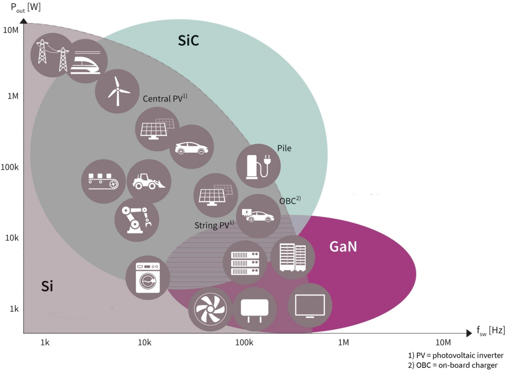

总结目前适用范围：

- 传统硅基：成熟、稳定可靠，低压，低电流，低频；
- 碳化硅：高压领域，强电；
- 氮化镓：低压大电流，高频，强减小功率变换器的体积。（不过预驱参数和传统硅基不同，需要细看）。

以碳化硅为例，相比于 IGBT，其低阻值，高频率和高温工作（250 ℃），可明显将目前大功率变换器小型化，甚将改变工程设计模式。且碳化硅做的二极管，反向过压比硅基的小的多的多。碳化硅的开关管的开关损耗比传统硅基要减少 90%（理想）。

更多：

- [Wide Bandgap Semiconductors (SiC/GaN)](https://www.infineon.com/cms/en/product/wide-band-gap-semiconductors-sic-gan/)。
- [体验三类 MOS： CoolMOS™ 7- CoolSiC™ - CoolGaN™ 和互补的EiceDRIVER™ IC.pdf](https://www.infineon.com/dgdl/Infineon-Experience_the_difference_in_power_CoolMOS_CoolSiC_CoolGaN-ProductSelectionGuide-v01_00-CN.pdf?fileId=5546d46262b31d2e0162b59d5869079c)。

选型和设计：

- [英飞凌功率器件选型](https://www.infineon.com/cms/cn/product/power/)。并联 MOS 设计：[英飞凌在大电流应用中并联功率MOSFET的技巧 (eefocus.com)](https://www.eefocus.com/activity/ifx_mosfets)。
- [德州仪器（TI）的 NexFET MOS 选型（CSD 系列）](https://www.ti.com/power-management/mosfets/overview.html)。
- 谨防买到假货 MOS 管！识别经验现有两点（真实趟过雷的），一点是如下图识别丝印大小（左边两个真品，右边两个赝品），另一点是真货 MOS 的边缘是圆角，而方角的可能是假货，也不是绝对，需要进一步测量验证，比如加 Vgs，然后测量 Rds，假货肯定有 内阻不正常 / 最大承受电流很低 等等问题。

### 保护机制

**保护设计**

主要是针对 **电源线** 的 抗冲击设计 和 对 **信号线** 的 抗干扰保护（EMS） 与 防电磁辐射（EMI）。

- 过压，欠压，防反接，软起动——主要针对 电源设计。
- 过流，过温——主要针对芯片、发热元件，电路板整体散热规划 等。

- EMC 电磁兼容性设计，如 瞬态抑制 / 防浪涌，防静电 ESD，RC 抑制尖峰噪声/消火花。共模、差模干扰噪声抑制。
- 信号的缓冲和隔离。信号隔离（光耦隔离、磁隔离等）。电源隔离（通过变压器线圈在物理上隔离）。
- 共阻抗地干扰抑制（高频）。

上述保护电路更多细节内容可详看这个，非常实用的各类保护电路的总结：Github [Staok/protection-circuits: 对保护电路中的过流、过压、软起动、防反接、通讯和信号隔离、电平转换、防共地干扰、TVS瞬态抑制、共模抑制和电磁兼容做一个大总结 (github.com)](https://github.com/Staok/protection-circuits)。Gitee [protection-circuits: 对保护电路中的过流、过压、软起动、防反接、通讯和信号隔离、电平转换、防共地干扰、TVS瞬态抑制、共模抑制和电磁兼容做一个大总结 (gitee.com)](https://gitee.com/staok/protection-circuits)。

**关于隔离**

- 电源隔离：常为使用变压器的磁路形式隔离（如金升阳等的电源模块）
- 信号隔离：常有 逻辑缓冲/中继（74 系列的 244、245 等等）、光耦隔离 和 磁隔离（如 I2C、SPI 专用的磁隔离芯片）等等；要注意的是信号的隔离往往是两个单独的电路回路之间的信号连接，所以如果用光耦进行信号隔离，那么光耦两边的电源连接应该用两边对应的单独电路回路里面的电源，而不是公用一个地或者电源，这样起不到隔离效果。
- [硬件- Isolation Power Design - 知乎 (zhihu.com)](https://zhuanlan.zhihu.com/p/255013263)。

### 更多元件选型

有总结比较好的资料放在这里。

**关于具体的光耦的选择和应用**

- [简记_光耦的主要参数及应用_土豆19891021的博客-CSDN博客_光耦的主要参数](https://blog.csdn.net/zhuang19891021/article/details/121915307) 好文。

- [光耦的主要参数及分类都有哪些？ (baidu.com)](https://baijiahao.baidu.com/s?id=1749555966578154961&wfr=spider&for=pc)。

- [详解光耦的重要参数——CTR值 - 百度文库 (baidu.com)](https://wenku.baidu.com/view/e404b763e75c3b3567ec102de2bd960590c6d9c5.html?_wkts_=1669693706891)。

  

- [光耦参数的理解 - 百度文库 (baidu.com)](https://wenku.baidu.com/view/743b16d3360cba1aa811da54.html)。

- [几种常用的光耦反馈电路应用 - 百度文库 (baidu.com)](https://wenku.baidu.com/view/4c0d365fd5bbfd0a7856736d.html)。

**自恢复保险丝**

在 `额外文档/具体器件选型/自复保险丝基础.pdf`。

**晶振**

在 `额外文档/具体器件/选型晶振的选择.pdf`。

**.etc**

## 1.25 硬件测试规范化

硬件测试（或称可靠性检验）的指标条目、每个项目的测试步骤和测试报告等规范化，还可以包括优化点、解决思路和方案，长期总结与方案的反馈校正等等。

（这条目前对于我个人是空白比较多的，以后慢慢积累）。

**明确一个硬件产品的 硬件的 需求、指标，以及一些测试项，一些约束条件，针对性进行硬件设计。**

**电源的测试项**

具体文档有 `\额外文档\测试相关\电源测试方法.pdf`。

包括开关电源和线性电源；每一项都含有最小值、标称值和最大值与单位和测试条件。以下列出项不必全包括，只是列举。

1. 输入、输出的电压、电流范围；效率；工作温度范围。
2. 输出压流纹波，电磁噪声，EMC（EMI / EMS）。
3. 输出启动过冲；启动上升时间；输出关机过冲。
4. 过压保护、欠压保护，短路保护（过流保护），防反接，防雷，脉冲 / 瞬态抑制 等。
5. 温升；温度考核试验（高低温环节循环测试）。
6. 电压、负载调整率。
7. 电压裕量；电流裕量。
8. 体积限制；成本限制；材质和外观（比如铝壳黑漆）；引脚排布。
9. 最后加上我个人要求的保护完善程度：防反接，输入、输出的电压、电流过大保护，EMC合格，防电子干扰等等。

## 1.50 元件手册的准备

在画原理图和 PCB 之前应该先把所有用到的器件的手册准备好。找器件手册的地方主要有以下几个方法：

1. 芯片所在官网。有的芯片的官网进去太慢或者不提供手册，就略过此法。
   
   1. TI [模拟 | 嵌入式处理 | 半导体公司 | 德州仪器 TI.com.cn](https://www.ti.com.cn/)。
   2. ADI [ADI | 混合信号和数字信号处理IC | 亚德诺半导体 (analog.com)](https://www.analog.com/cn/index.html)。
   3. NXP [恩智浦半导体官方网站 | 主页 (nxp.com.cn)](https://www.nxp.com.cn/)。
   4. Infineon [英飞凌——半导体与系统解决方案 - Infineon Technologies](https://www.infineon.com/cms/cn/)。
   5. ST [首页 - STMicroelectronics](https://www.st.com/content/st_com/zh.html)。
   6. MPS [MPS | Monolithic Power Systems 芯源系统有限公司](https://www.monolithicpower.cn/)。
   7. ON [半导体和集成电路器件 (onsemi.cn)](https://www.onsemi.cn/)。
   8. 等等等等，更多详见 `0.5 电子类网站收集` 小节。

2. 大型商城。
   
   1. 立创商城 [立创商城_电子元器件采购网上商城_领先的现货元器件交易平台-嘉立创电子商城 (szlcsc.com)](https://www.szlcsc.com/)，直接搜芯片型号，型号比较全，可以下载到手册和封装。
   2. 云汉芯城 [云汉芯城ICKey.cn_电子元器件采购_BOM配单_SMT贴片_PCB打样](https://www.ickey.cn/)。
   3. 等，更多详见`0.5 电子类网站收集`小节。

3. 芯片手册搜索网。
   
   1. [ALLDATASHEET.COM - Datasheet search site for Electronic Components and Semiconductors and other semiconductors.](https://www.alldatasheet.com/)。
   
   2. [netCOMPONENTS 电子元器件查询](https://www.netcomponents.com/zh/)。
   
   3. **搜索替代型号** [道合顺大数据infinigo官网-国产芯片替代查询,datasheet规格书下载,电子元器件IC交易网上商城](https://www.infinigo.com/)，一款专门做国产替代芯片查询的搜索引擎，输入芯片型号就可搜索出国产替代芯片型号。
      
      以下网站的收录型号相对较少。
   
   4. [半导小芯-芯片查询工具_芯片替代查询_数据手册查询_规格书查询_datasheet查询_IC查询 (semiee.com)](http://www.semiee.com/)。
   
   5. **丝印反查** [芯片丝印反查网 - IC芯片丝印,IC芯片代码,IC芯片印字,IC芯片顶标,SMD code,marking code,top mark (smdmark.com)](http://www.smdmark.com/m/)。
   
   6. [Datasheet,Datasheet下载,电子元器件查询网-datasheet5.com](https://www.datasheet5.com/)。
   
   7. [datasheet-PDF中文资料大全-电子产品世界 (eepw.com.cn)](http://datasheet.eepw.com.cn/)。
   
   8. [EasyDatasheet | 次世代元器件搜索引擎](https://easydatasheet.cn/)。
   
   9. 等。

## 1.75 元件原理图和封装的准备

法一：淘宝大法，针对基础器件库。淘宝上有很多卖封装的，也不贵，买一次一劳永逸真的划算，如 源创客 的等。

法二：开源大法，扩充器件库。如：

- [issus/altium-library](https://github.com/issus/altium-library)、[KitSprout/AltiumDesigner_PcbLibrary](https://github.com/KitSprout/AltiumDesigner_PcbLibrary)。
- [RedCommissary/altium-library: Component's library for Altium Designer (github.com)](https://github.com/RedCommissary/altium-library)。
- [嘉立创SMT (JLC_SMT) - Gitee.com](https://gitee.com/JLC_SMT)。
- [AD_SCH_2D_3D_Libraries: AD原理图库、2DPCB封装库、3DPCB封装库 (gitee.com)](https://gitee.com/mculover666/ad-sch-2d-3d-libraries)。
- [Queeneren/AD_Library: 主要是AD软件的原理图库和封装库，不断更新ing (github.com)](https://github.com/Queeneren/AD_Library)。
- 等等。

法三：原厂大法，特殊器件针对性下载。选定大厂的芯片后，一些大厂官网会直接提供该芯片对应的原理图和 PCB 封装，如 TI 等大厂官网对应 IC 页中寻找提供的 PCB 封装进行下载。

1. 举例：如在 TI 搜索器件 CSD18540Q5B [CSD18540Q5B 数据表, 产品信息与支持 | TI.com.cn](https://www.ti.com.cn/product/cn/CSD18540Q5B?keyMatch=CSD&tisearch=search-everything#design-development##cad-cae-symbols) ，在页面下面找到 CAD/CAE 符号 一栏，其下有下载一栏，点进去会跳转到 Ultra Librarian For TI 网站中的封装选择页面，再点击 Choose CAD Formats & Download 按钮，在下一个页面中在 Choose CAD Format(s) 中选择 Altium Designer，然后在 Symbol Pin Ordering 选择 Functional ，再点击 Submit 即可下载封装数据文件，接下来在 AD 软件中使用该封装数据生成封装文件，步骤参考 [Ultra Librarian Altium Designer Import](https://app.ultralibrarian.com/content/help/?altium_designer.htm)。

   其他芯片大厂（如 ST 等）的具体芯片型号封装的获取步骤类似。

2. AD 21 新版软件里面 [如何优雅地服用AD 21的在线元件库_哔哩哔哩_bilibili](https://www.bilibili.com/video/BV1SM4y1c7Tz)。

法四：经销商/三方大法，针对性下载。如在：

1. 在 [Component Search Engine: Free Symbols, footprints, & 3D models](https://componentsearchengine.com/) 搜索器件并下载封装。
   
   还可以在 AD 软件（AD 17 及以上版本）内安装 Altium Library Loader 组件来脱离网页直接搜索器件并下载器件原理图和封装，如下图所示：
   
   - 安装和使用的步骤 [Altium Designer PCB Library - FREE - Footprints - Symbols - 3D Models (samacsys.com)](https://www.samacsys.com/altium-designer-library-instructions/)；
   
   - 下载地址 [Altium Designer Loader Download (componentsearchengine.com)](https://componentsearchengine.com/library/altium)；
   
   - 桌面版本（Library Loader）下载地址 [电子元件搜索引擎 - 免费获取原理图符号、PCB封装和3D模型 (componentsearchengine.com)](https://componentsearchengine.com/learn-more)（在这个网页里翻到最下边可以看到下载按钮）；
   
   - FAQ（比如遇到安装不成功等问题看这里） [Altium Library Loader FAQ (samacsys.com)](https://www.samacsys.com/altiumll-faq/)。
     
     上面所述的 Altium Library Loader 软件安装包 已经离线在 `/PCB LOGO-画法集合-PCB工具-规则文件/LibraryLoaderSetup2v49.msi.zip`。
   
   
   
   另外，在 贸泽电子 搜索器件并点击下载封装后会跳转到 Component Search Engine 网站，下载步骤同理。

2. 电子器件商城。如立创商城自己维护的库，在[立创商城](https://www.szlcsc.com/)搜索器件后可以得到 立创 EDA 的器件原理图和封装，导出到 Altium 即可，具体步骤参考[立创EDA元件转换为AD库封装(Altium Designer)_Mark_md的博客-CSDN博客](https://blog.csdn.net/Mark_md/article/details/116041756)，[如何将嘉立创的原理图封装导入到AD20?](https://www.bilibili.com/video/BV1of4y1S7oi)，需要注册登录。注：网页端的 “立创 EDA” 导出器件的 AD 格式为 SCH 和 PCB 的文件格式（SchDoc、PcbDoc）而非库文件格式，PCB 文件里面的封装可以直接复制到自己新建的 PCB 库里面，但是 SCH 文件不能复制到自己新建的 SCH 库里面，对于 SCH，可以点击 Design->Make Sch Library 即可生成 SCH 库文件，打开新生成的 SCH 库文件，里面的器件的每个 端口 均可编辑且可以复制到 自己的 SCH 库里面为画原理图而调用；若立创 EDA 导出的原理图文件内包含该器件的多个 Part，这时点击 Make Sch Library 只能生成其中一个 Part 的原理图库，但一样的，只需分别将每个 Part 都 “Make Sch Library” 一次，然后分别复制到自己新建的原理图库的器件的各个 Part 页里面即可（文字描述有些局限，意会吧）。

3. 在 Ultra Librarian 搜索并下载封装 [Free Altium PCB Library Online for Footprints & 3D Models | Ultra Librarian](https://www.ultralibrarian.com/solutions/cad-vendors/altium)，需要注册。如果下载到的封装数据是 CAD File（.bxl）类型的，那么通过 UltraLibrarian 软件 生成 AD 封装步骤参考[使用ULIB+Altium Designer绘制元件原理图及封装_dodwind的博客-CSDN博客](https://blog.csdn.net/dodwind/article/details/87954700)， [利用UltraLibrarian生成Altium designer原理图、PCB封装_fpga_start博客-CSDN博客](https://blog.csdn.net/m0_58064525/article/details/117607455)，[Ultra Librarian下载与安装使用教程_chengoes-CSDN博客](https://blog.csdn.net/chengoes/article/details/115440856)，[UltraLibrarian 软件下载链接](http://webench.ti.com/cad/ULib.zip)。

4. 最新发现一方法：DigiPCBA

   - [这也许是最全、最完整的封装库资源。具有器件封装库及器件参数信息。 (qq.com)](https://mp.weixin.qq.com/s/ve8RIbMXAOXlOc-QJiwszg)。
   - 官方 [DigiPCBA是将 PCB 设计、MCAD、数据管理和团队合作相结合的云端电子产品设计平台。| DigiPCBA](https://digipcba.com/)。
   - [如何看待DigiPCBA这个现在特别火的EDA云平台？ - 知乎 (zhihu.com)](https://www.zhihu.com/question/451865547)。
   - [【DigiPCBA】使用DigiPCBA创建和复用PCB封装-软服之家 (ruanfujia.com)](https://www.ruanfujia.com/10562346/)。
   - 是一个硬件协作服务提供的平台 [解救PM于水火的竟是一个免费的平台——DigiPCBA-软服之家 (ruanfujia.com)](https://www.ruanfujia.com/10514085/)。

法五：以上方法都没有，是特殊的器件，可以自制。对于原理图，一般元件的引脚和其划分不会特别复杂，应该很快就能画好；对于PCB 封装，常见的可用 AD 的 IPC 自动创建常用封装工具，先选择封装类型，再根据手册设置各种长宽参数，自动生成PCB封装以供使用，不常见的那只能最后的最后才自己画啦，按照芯片手册提供的封装规格，尺寸的单位看准了。

至于 3D 模型若没有，简单的可在 AD 的 PCB 库中的元件上添加 3D 实体（通常在机械1层）自己画，复杂的可去：

- [找3D模型和导入的一个教程](http://bbs.21dianyuan.com/forum.php?mod=viewthread&tid=174773)。
- [IC封装网-行业IPC标准化的元件库及PCB封装库资源下载平台 (iclib.com)](https://www.iclib.com/)。
- [3D ContentCentral - 免费 3D CAD 模型、2D 工程图和供应商目录](https://www.3dcontentcentral.cn/)。
- 白嫖 立创 EDA 专业版（且为在线版） 的 3D 封装，[如何下载立创EDA的3D封装？后悔没有早点发现这功能〒▽〒_ 哔哩哔哩_bilibili](https://www.bilibili.com/video/BV1Sb4y1J7Pq)。

等网站下载。

up 北冥有鱼qzs 的 总结：[【汇总】都有哪些免费下载PCB封装的网站或者软件（一）_ 哔哩哔哩_bilibili](https://www.bilibili.com/video/BV1CR4y1x7Rz)。

> - https://www.szlcsc.com/。
> - https://componentsearchengine.com/。
> - https://www.snapeda.com/home/。
> - https://www.pcblibraries.com/。
> - https://www.ultralibrarian.com/。
> 
> Altium 官方：https://mp.weixin.qq.com/s/U5_yQ3ezFTjMD5twE8RMkA。
> 
> 凡亿PCB：www.iclib.com 。
> 
> 3D封装:
> 
> - https://www.traceparts.com/zh。
> - https://www.3dcontentcentral.cn/Default.aspx。

## 2 SCH 绘制规范和 AD 使用

个人规范，仅供参考。这里是针对 AD10 版本。

在使用 AD 时候，应先导入我的软件配置和 PCB 规则 Rules 文件，具体文件和方法说明在“AD 软件设置和PCB规则Rules配置文件”文件夹中。

### SCH 中的快捷键

**这里是针对 AD10 版本**，AD20 以及以后版本 见 `AD20 软件设计` 一节等。快捷键可以自定。

**本人习惯：鼠标滚轮 为 放大缩小 SCH 视图，鼠标右键拖动 为 平移 SCH 视图。**

- 拖住器件时，按 x、y 为镜像翻转。
- 选中一根线，Ctrl+R，可以复制重复放置。
- 先点 Tools -> Cross Probe，扫描所有原理图中相连的线，再 ctrl + 鼠标左击，点击一根线全局高亮。
- 原理图和 PCB 界面分别选择 Tools -> Cross Select Mode，可以在 SCH 和 PCB 界面交叉选择，即同时高亮选中同一个元件，有利于定位。
- .etc

### 最基本的 SCH 绘制过程

**一些 AD 软件的使用 可通读参考 `3.5 AD20 SCH & PCB 常用技巧` 章节的内容和经验。**

#### 顶层设计/前置设置

1. 统一的标题栏：每一页原理图都使用 A4 大小，标题栏使用模板文件比如`./PCB LOGO-画法集合-PCB工具-规则文件/标题栏模板/A4 - 瞰百易.SchDot`，将其复制到 AD20 安装目录下的 `/Altium/AD20/Documents/Templates`，然后在 SCH 界面的属性栏的 Page Options 的 Formatting And Size 中选 Template，下拉选择 "A4 - 瞰百易" 选项，在属性栏的 参数页面加上 标题、作者、版本号等等信息。

2. 对电路原理图进行电源、主控和其他外设等模组分页绘制（这里仅为示例，没有用 层次原理图设计模式，详看同名章节）；**第一页可以是目录页**，附文详细说明等，可以再加上历史版本和改动说明；**第二页可以是原理图框图**；原理图**第三页可以加上 电源轨框图 示意**。后二者在原理图比较复杂的情况下，很有必要。
   
   可以参考的清晰的原理图：[这原理图你打几分？ (qq.com)](https://mp.weixin.qq.com/s/_JBZFcOC-J17k9N5KH_jqQ) 里面的图片也放到了下面。
   
   
   
   
   
   原理图第一页的 目录 规范示意：
   
   
   
   
   
   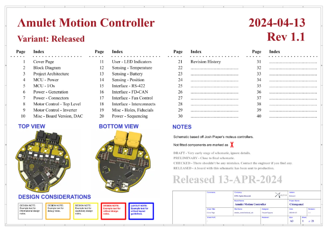
   
   原理图第一页的 历史版本 规范示意：
   
   
   
   
   
   原理图第一页的 目录 和 历史版本 和 说明 兼有，示意：
   
   
   
   原理图第二页，硬件系统框图 示意：
   
   

   
   
   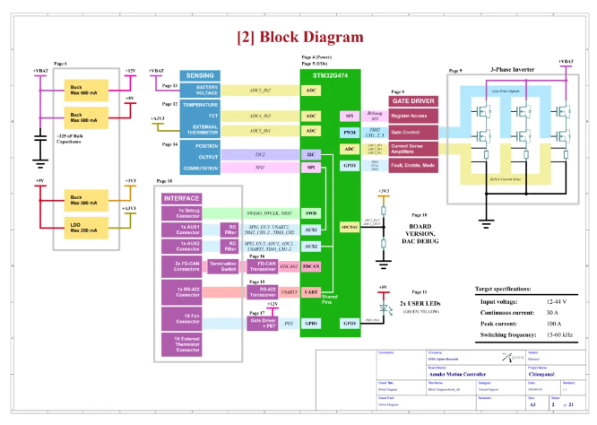
   
   原理图第三页，硬件系统电源轨框图 示意：
   
   可以用画框图的工具（draw.io/visio/Xmind 等等）画 该电路的 电源树图（同时也可以是电路框图），并标出 每一路/电源轨 的最大电流，放在原理图内。
   
   
   
   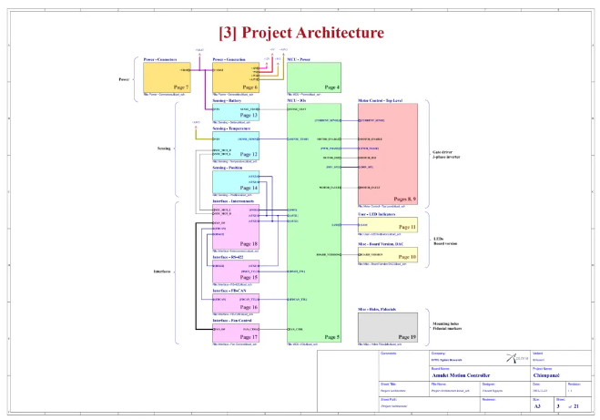

#### 层次设计/细节标注

1. 顶层设计相关要点：

   - （首要）电路硬件划分模块，减少或者整合硬件原理图中的功能块。
   - （建议）各个功能块加入供电控制，处理器调度整板功耗。
   - （建议）统一的设计模式：原理图都使用 "层次原理图设计" 的模式。原理图的层次设计，每个原理图 是一个模块，也方便以后在别的地方直接复制和调用。详见 “SCH 层次原理图设计” 一节。
   - 具体原理图设计，广泛搜罗相关参考设计资料，器件选型，设计时详勘器件手册。

2. 对于每一页SCH（这里仅为示例，没有用 层次原理图设计模式，详看同名章节）：

   - 各个子模块用线格划分；

   - 并在各个格子里写上子模块名称；

   - 页面右下角写上本页名称，x / Total（x 当前页编号，Total 为总页数），作者和日期；

   - 可在子模块旁边放上实物图片、官方推荐PCB图等方便画原理图；

   - 信号/小电流线用细线，电源/驱动/大电流线用粗线。

   

3. 原理图作画要布局工整，走线清晰，注释到位！

   

4. 每个器件的命名。在 Designator 写上准编号，电容是C?，电阻是R?，电感L?，芯片IC?，晶体管Q?，以此类推；在 Comment 写上器件的名称，是具体的型号。

   

5. 型号名补全，查看器件手册的发货信息（Order information），确定具体的封装、温度范围和功能等的一个器件型号全名，在原理图的器件中写清，方便导出 BOM 表和采购。

6. 原理图中元件标识的规范，供参考，不是必须。如下图（引自野火），电阻原理图的左上角、右上角、左下角和右下角以此标识 Designator、Comment（一般为阻值）、封装和精度，对于电容类似，对于电感要有饱和电流标识，其他器件同理。

   

   更加全面的器件参数标识（来自 iphone 4s原理图）：电容包括标号、容值、误差、耐压、材质、封装，电阻基本同。

   

   电阻的精度，计算最差的情况，是否还能满足电路需求，让电路正确工作。在精密电路中，电阻的精度很重要，若电路容忍 10mV 的误差，分压电阻的精度如果不够则会直接导致分压的精度的误差非常大，严重注意这一点。

7. 网络标识的命名规范。MCU/FPGA/SOC 芯片的GPIO引脚网络标号规范（特定功能引脚就直接标其功能名称即可，这里是针对繁杂GPIO网络标号的规范），这里只自己经验之谈：

   - MCU：先标所有功能引脚比如电源、复位、BOOT、JTAG、USB、串行通讯口（UART、I2C、SPI、I2S 等等）、网口 等等，最后剩下的用做 GPIO，标法如下：

     `<mcu型号简称>_<外设英文大写缩写>_<外设的具体引脚名称 或者 功能>`，比如：

     `STM32F4_TIMER1_PWM1`、`STM32F1_ADC_PA1`、`STM8S_GPIO_PA6`。

     实例（这里的尾缀就不加芯片 IO 的编号了）：基于 `器件名（或器件类型）_IO性质（数字还是ADC）_IO名（管脚名）`。常用于 MCU 的网络命名，其他非 MCU 器件非必须。例如，`MCU_IO_KEY1`、`MCU_IO_TPS5450_EN`、`DRV_EN_BUCK` 等，如下图示意，并且一组的 IO 旁边用黑色竖线括起来，用大括号图形括住最好。

     

   - FPGA：先标所有功能引脚比如电源、JTAG、PCIe 等等，然后剩下的用作 GPIO 的引脚，都按照序号顺序，在 FPGA 芯片上由上到下由左到右按顺序标，即可，即 `IO1、IO2...` 等等这样，要在这些分组的 IO 旁边写上它的 IO 电压。

     当 FPGA 芯片用作核心板的时候，为了布线方便可以在插接件上（不按标号顺序）去调整标号，这样在查找 IO 的时候，只要确定了其编号就可以在芯片的原理图上直接找到它连接的 FPGA 引脚和它周围按顺序标号的引脚。

     但是如果 FPGA 芯片是在一个大板子上，那么为了布线方便，就不得不在芯片原理图上调整标号的顺序了。

   - SOC：与 MCU 的大同小异。

#### 注意点/建议/检查

1. 一些注意点：

   - 原理图中添加 线组（Net Class）和 差分对（Diff Pair）（尽量在原理图中将线分组完成，而不是在 PCB 中手动挨个添加，因为从原理图更新 PCB 时原来在 PCB 单独添加的线组会被清除），并在原理图中对电源线线宽规则、数据线线宽规则和差分线对均设置完成。原理图绘制完毕后要紧接着添加 线组（Net Class）、差分对（Diff Pair）和其它如电源线等单独添加规则，这些都尽量在 SCH 中完成（尽量不要在 PCB 界面中另设置，PCB 界面中只专注与画 PCB），方法详看 “SCH 线组和差分对设置” 一节。针对线宽的规则可以做依不同 线组（Net Class）设置不同线宽规则（Parameter Set 添加到线或 Blanket 上，并在其内添加 Rules，在 Rules 界面的左下角设置优先级（手动布线时低优先级不起作用））；针对高速线的规则要依 线组（Net Class）单独设置规则，详见下面的 "等长线/蛇形线设计" 小节；针对差分线要设置 差分对（Diff Pair）规则，详见下面的 “差分走线设计” 小节。
   - 对于带有 总线或差分线对 的 数据输入\ 输出的 模块，都在模块内 对其 数据输出处添加 线组（Net Class）和 差分对（Diff Pair），这样保证各个 模块 连起来时候可以相互兼容。差分线对的阻抗匹配 可以依靠 PCB 上走线时的 线宽和线距的 测算和设置，也要在原理图中 分别串个小电阻，以方便后期拿到实物可以再 改电阻 来对线路的 阻抗 进行微调。
   - 对于电源模块，总是在输出处添加足够的 X5R/X7R 贴片陶瓷电容（可选：贴片固态电解电容 和 功率共模电感）和 TVS 管，输入处的滤波添加足，但是保护环节如 TVS 管为可选。在每个电源模块的输出处添加足够的滤波和保护，连起来的时候可以相互兼容，也不浪费。详参 “保护机制” 和 “EMC 电磁兼容设计” 等小节。
   - 对于有极性的器件（DIO、BJT、MOS、有极性电容等）要在原理图中露出器件引脚的数字号，并仔仔细细检查引脚是否均正确（在器件的  Component 窗口左下角 Pins 里面对引脚编号打对勾表示显示出来，在 PCB Model 里面的 Pin Map.. 里面可以交换引脚直到正确）。
2. 初次研制阶段，可多用 0 欧电阻、磁珠和跳线帽等，留出可以可测试、可断开和可配置的地方，方便逐个电源域、逐个模块的测试电流、功能裁剪等。比如加在电源出口，初次上电前可以先断开，不给后面的的电路供电，上电后测量电压和纹波，合理后，即可再接上，或者可以在此缺口直接测量电流。
3. 原理图画好后该给各个元件建立唯一编号。打开“工具”->“注解”，点 Reset All ，再点“更新更改列表”，最后执行“接受更改”。
4. 对原理图进行编译和查错。依次点 “工程”->“Compile Document” 和 “工程”->“Compile PCB Project”。没错后即可导入PCB。
5. 原理图中一些器件 尤其是接口件，旁边放上实物图，图片设置为内嵌型。可以通过 “放置” 来导入图片到原理图内，也可以从 剪切板 直接复制出来（比如截图后复制、word/excel/ppt 里面直接复制 等等）。

**注意！**更多常用技巧总结在 `4 SCH-PCB 设计规范` 章节里。

## 3 PCB 绘制规范和 AD 使用

个人规范，仅供参考。

### 板层标识定义

- Top Overlay 为丝印层。
- Top Solder 为开窗层。
- Keep-out Layer 为板边界。

### PCB 中的快捷键

**这里是针对 AD10 版本**，AD20 以及以后版本 见 `AD20 软件设计` 一节等。快捷键可以自定。

**本人习惯：鼠标滚轮 为 放大缩小 PCB 视图，鼠标右键拖动 为 平移 PCB 视图。**

- q 为单位在 mil 和 mm 之间切换。
- 拖住器件，按下 L 切换器件所在层。
- Ctrl+鼠标左键点击一根线为高亮此线，点右下角“清除”清除高亮。
- 按住 Alt，鼠标在板子器件上移动，会显示器件轮廓。
- Shift+s：为高亮所在层，重复操作取消高亮。
- 处于布线状态时，shift+空格为改变线类型，空格为改变线凹凸。
- Ctrl+g：为选择切换栅格类型为线或点。
- Backspace 为布线时回到上一步。
- 线状态下按*（乘号）为带过孔换层。
- Ctrl+m：为测量长度。
- Ctrl+左键点一下对正在布的线完成自动布线连接。
- Ctrl+h：再点一根线会全选之，然后 del 删除整根线。
- Shift+h：PCB 的左上角状态栏是否显示。
- Shift+g：PCB 左上角状态栏是否固定不动。
- 键盘上边数字“3”为显示 3D 视图，数字“2”还原。
- 3D 视图中依次点“v”、“b”为翻转板。
- 按 L 按键，在视图选项中隐藏相关元素，比如隐藏覆铜（Polygons）。

### 最基本的 PCB 绘制过程

**除了下面的内容，还要全程符合 `4 SCH-PCB 设计规范` 章节的内容和经验。**下面的内容会与这个有重复的地方，就当做是重要的重提提醒~

**以及，一些 AD 软件的使用 可通读参考 `3.5 AD20 SCH & PCB 常用技巧` 章节的内容和经验。**

如果有双屏幕的话，在画 PCB 的时候我一般会把原理图视图放在左屏（在 AD 软件中将原理图标签拖过去就是），PCB 视图放在右屏，或者相反，这样双屏左右对照着看和画，不用来回切。

#### 前置设置

1. 先定义PCB规则。点开“设计”->“规则”，主要设置线宽范围，元件最小间距，焊盘的开窗范围，默认过孔尺寸，覆铜类型为直接连接等。

   过孔尺寸：焊盘比孔至少大6mil。例如最小孔直径为12mil（0.305mm），焊盘直径至少18mil。更多 PCB 生产 工艺 参数 看 本节后面 “打板” 一段。

   本规范已经有 AD 的 PCB 的 规则（Rule）模板，就是按照 上面的 工艺参数 来的，新建 PCB 文件后导入即可，在 PCB 文件中导入 AD20 的 PCB Rules 规则配置文件，参考 "7 AD 导入导出配置文件" 章节（AD的 PCB规则（Rule），最主要的几个就是按照 PCB 厂家的最小加工能力来改参数，比如 [嘉立创PCB工艺加工能力范围说明-嘉立创PCB打样专业工厂-线路板打样 (jlc.com)](https://www.jlc.com/portal/vtechnology.html)））。

2. 确定板尺寸，划定板形。在 Keep-out Layer 层绘制板边界闭合线，然后执行“设计”->“板子形状”->“按照选择对象定义”。

3. 放置 PCB 原点到 PCB 边界的左下角。依次点击“编辑”、“原点”和“放置”，然后放置原点。

4. 把每个模块包含的所有元件移动到一堆。

   - 首先开启交叉选择，分别打开在原理图和PCB界面的“工具”->“交叉选择模式”选项。

   - 在原理图界面中，选中一个子模块内所有器件，再到PCB界面，点“排列工具”->“在区域内排列器件”（这个经常用，可以设置快捷键，比如 shift+q），在空白区域内拖出一个矩形，此子模块所有的器件便都堆在此矩形区域内。

5. PCB中显示元件的原名（此步骤非必须；此步骤可以放到最后去做，找缝隙和空白的地方放下器件标号的丝印）。

   - 随便选中一个元件，右键点开“查找相似对象”，都是“any”情况下点“应用”，此时所有器件已全选，再点“确定”，出现“PCB Inspector”窗口，在其中取消选中 “Show Name” 或者 “Show Designator”，打开选中 “Show Comment” 即可。

   - PCB Inspector 对于多器件批量改属性特别好用。选中要统一修改的器件，然后按 F11 调出 PCB Inspector 窗口，然后在 PCB Inspector 窗口改属性，所选中的多个器件就一同更改了。

6. 多层板（多于 2 层的偶数层）。

   - 在 PCB 里连按快捷键 “D”、“K” 调出层叠管理，或者在“设计”里面找“叠层管理”，或者空白处右击，“选项”里的“层叠管理”。
   - 多层板的推荐板层分布图在“PCB 布局布线规范”章节里。

   

   - 避免两个信号层相邻，相邻也要信号线垂直交叉而避免平行。
   - 多层板中，设计一组或多组临近的电源层和地层，该耦合层之间可形成电容，对噪声可形成泄放。
   - 元器件层下面的第二层应为一个完整的地平面，作为地参考。

   

   - 注意内电层在拼板的时候网络会丢失，暂时没有简便的办法。有内电层在需要拼板的时候，建议这样处理：先把PCB文件直接复制一个，命名为“xxx_不含内电层版.PcbDoc”，然后打开此文件，执行以下步骤：
     1. 先把内电层的分割线都删掉，然后 D K 快捷键调出板层管理，把内电层（负片层）删掉，换为普通层（正片层）。
     2. 然后在新的普通曾里按照原来分割线的形状覆铜，网络选择跟原来一样。
   - 四层板举例：
     1. 在“层叠管理”中，在中间添加“Signal1”和“Signal2”两个信号层，或者添加“GND”和“VCC”两个内电层(Internal Plane)；
     2. 前者的信号层可直接布线。后者的内电层特性为负片，即布线的地方不铺铜，什么都不画的时候是一整块铜皮，专用于电源划块，即内电层分割；双击一个封闭区域可设置此区域覆铜连接的net。
     3. 信号层和内电层可以各有一个，混搭组成四层板，这样内电层专走电源和地，还多了一个信号层。
     4. 其他注意点：画线不要用交互式走线，要用工具栏中的“应用工具”的“走线”等功能；典型内层厚度为1.4mil；通常采用默认的 Layer Pairs（层成对）模式；不允许在内电层上布置信号线；内电层不同区域之间的间隔宽度不小于 40mil。
     5. 典型四层板板层分布为（由上到下）：
        - 信号层 - 内电层（GND层） - 电源层 - 信号层（把信号层露在外面是为了好实物修改，也可不这样）；
        - 信号层 - 内电层（GND+VCC层）- 信号层 - 信号层。

7. 将在线 DRC 打开：首选确保 AD 软件设置界面里面的 PCB Editor 里面的 General 里面的 Online DRC 打勾，再 打开 DRC 界面（Tools -> Design Rule Check），在 Rules to check 里面的 Electrical 和 Routing 和 Placement 里面的全部打勾，其它选项的勾选视情况而定。

#### 布局布线

**多参考下面 `4 SCH-PCB 设计规范` 一节中实用丰富的内容。**

1. 元器件布局。

   - 除了较大的插件和较少的芯片，可以将其余的阻容感以及二极管（R/C/L/D）的标号和器件名均 隐藏/不显示，再去布局，等布局、布线都完成之后再显示这些器件的标号再专门摆一遍标号，没空间就摆远一点再用箭头指引，密集的按照器件的布局在一片空白按照对应位置关系摆标号丝印再用丝印线围一圈（业内惯例做法）。

   - 首先规划布局，比如板上有 12V 区域、5V 区域、3V3 区域，先板子划分三大块放这三部分，再各区域内部逐个模块的放置。

     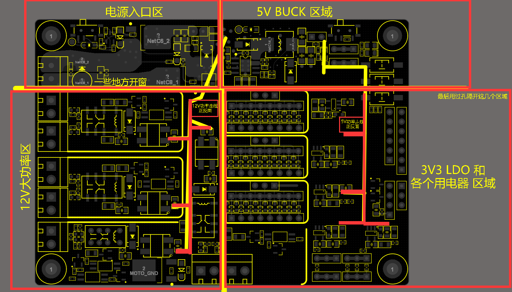

     - 按照板功能区域的划分，理清整板上电源、信号的流向，先摆接口插件、主要芯片等的大致位置，再围绕其摆放阻容等小器件。再微调，并锁住接口器件和主要芯片等尺寸大的器件的位置。
     - ！数模分离；功率驱动和信号处理分离；高频低频分离（尤其是高频数字部分和模拟部分之间做地线的隔离（单点接地、磁珠分隔等），且布局上空间的分离）。
     - ！器件布局和走线推荐，优先参考 IC 的数据手册。
     - ！根据主信号流向摆放主要元器件。
     - 布局的好，走线容易，布局不好，走线困难。
     - **先大后小，先难后易，均匀分布，整齐划一。**

   - **电路分区域，先按功能块分，一个功能块中再按照频率分，同频率级别电路块中再按照数模分；设计好接地，防止共地干扰；设计好供电、电源树 等。**

     **数模要分离，地线分离并单点接地，数模区域不能重叠**。高压、低压区域之间要保证 1~2mm 以上的距离；干扰源和敏感区域相互远离。模块电路相互独立，间隔充分。

     电源和敏感信号走线有良好的参考地线或参考地平面。

     共地干扰 在 `额外文档` 的 `关于接地-解决共地干扰` 的文件夹里面有专题介绍。

     **电源路径和信号路径流向，大的基本规则为，“怎么去，就怎么回”。**给各频段的噪声泄放路径，它就小，不给就憋的变大，从而影响自己电路的性能，还造成电磁噪声辐射引起 EMI 问题。

     **考虑 EMC**。敏感电路块做好抗外界干扰 EMS，发出干扰较大的电路块降低对外的电磁干扰 EMI，前者与后者保持远离（降低耦合和干扰）参考 `EMC 电磁兼容设计` 一节，也在原理图层面增加相关 EMC 器件 和 电路。

     **考虑 信号完整性 SI 和 电源完整性 PI**。参考 `信号完整性（SI）`  和 `电源完整性（PI）` 小节。

   - **发热源（电源、测流电阻等）要给予散热设计**，电源和功率芯片（DCDC、LDO、MOS 等）在所在位置的 PCB 上开过孔并开窗 加强散热，设计散热空间（在 PCB 板上挖空一定区域增加透风，或预留散热器件的安装空间）并摆放在出风口附近等。

   - **元件的放置要便于调试**。大元件边上不能放置小元件；需要调试的元件周围应有足够的空间。

   - 插件要 SMT 有间隔需求

     > 插件焊点和贴片元件安全间距不足5mm，安全间距不足无法使用波峰焊或选择手焊。

   - 整齐美观，有规律。

   - 考虑 PCB 板 在机箱中的位置和方向。

   - 主要元器件在 PCB 中放好后，锁住其位置（锁住的元件通过 双击 来再选中）。

   更多规范请参考 “4 SCH-PCB 设计规范” 章节的内容。

2. 布线。在 布局 阶段进行粗布放，布线的时候再进行精细调整，为 器件之间保持合理间距、更方便布线等。

   - ~~除非可以混过去的项目，否则~~坚决不用自动布线（除了用ActiveRouting走内存、总线等线除外）。
   
   - 确定整个板上大部分走线和过孔的规格，即 各类线的粗细和其过孔孔径 都提前定好。比如信号线均走 4~10mil，功率线为 20mil~60mil 不等，信号线过孔 4/10mil、8/16mil、12/18mil 等，功率线过孔 20/28mil。这些都要提前确定好。关于 线宽、过孔孔径 与 电流之间的关系 详见 “4 SCH-PCB 设计规范” 里面的 “幼稚园级” 一节。过孔不要 密集/紧挨着 排列，相互之间保持一定间距，否则加工易出现 钻孔披锋/金属披锋/铜皮倒刺。
   
   - 主要分为电源线、信号线（包括关键信号、敏感信号、模拟信号等）以及底线。
   
     - 多参考，以及按照上面 布局 时候考虑的各个点。下面只点出几点。
   
     - 电源。参考 `4 SCH-PCB 设计规范` 一章里面的 布局布线规范（`幼稚园级`、`本科生级` 小节） 以及 `电源规范设计` 小节。
   
       - 布线开始，先走电源线，**从电源入口开始引出大动脉然后分离给各个模块，树形结构，层层分级**；再逐个模块内部走线；最后 MCU IO 等信号线，当前一些关键的信号线优先级更高。
       - 电源线足够粗，功率走线必要时考虑开窗加锡。功率走线可以用覆铜来布线，然后原地复制粘贴一个再换成开窗层，得到整块覆铜的开窗。
       - **对于 DC-DC，按照信号流向布局布线，最好一字型，敏感的反馈线远离开关环路（MOS、电感等），尽量减小环路 等等。对于 LDO ，输入输出电容均先大后小，走线确保输入输出均通过输入输出的电容，对于各种芯片同样，等等。**电源 的 布局布线 尽量参考 官方手册 的推荐 PCB 来，道道很多，多参考优良的实践经验。
   
     - 信号。参考 参考 `4 SCH-PCB 设计规范` 一章里面的 布局布线规范（`幼稚园级`、`本科生级` 小节） 等。
   
       - 走信号线时，模拟信号、高速信号和时钟线优先布线，尽量短。电流和地路径不形成环。即 电源、模拟小信号、高速信号、时钟信号和同步信号等关键信号优先布线。
   
       - 关键信号、模拟信号、高频线等等**尽量用曲线走线**（另外，曲线也蛮好看的）；其它的数字低频电路避免直角、锐角、环形、电压/流快速变化的线（尽量短、避免环形）可不用曲线快速地走完。尽量避免信号线形成环路、尽量使环路面积小。
   
         敏感信号包围地线，但也不要太近，减小寄生电容和漏电流影响，与变化的数字信号线隔开。
   
     - 对于地线。
   
       - 习惯最后使用覆铜和过孔解决，要注意防共地干扰。地线的布线在下一小节 “后续工作和润色” 中用覆铜和过孔解决，可以先隐藏地线（AD 10 的方法现查）。共地干扰 在 `额外文档` 的 `关于接地-解决共地干扰` 的文件夹里面有专题介绍。
   
   - 对于两层板而言：先走电源线，再走信号线；对于四层板而言：摆好器件，先划分好内电层区域，再走电源线，再走信号线。
   
   - 过孔尽量避免在焊盘、丝印上面（酌情考虑，不是必须）。
   
   
   
   - **检查布线完成情况**：工具栏 "Report"，"Board information"，勾上 "Routing information"，点 "Report"，新页面中查看布线的完成情况。如果还差最后几根不容易发现的线，在 PCB 页面中以 shitf + s 显示单独层来查看未连接的线。
   - 查看 有多少个 pin：原理图界面，找到 tools 下面的 parameter manager，只选择 pins 选项，点确定即可查看有多少个（以 xxx objects 显示数量）。
   
   
   
   - 检查不要超过PCB加工工艺指标，重点在 线距（JLC为 0.1mm，尤其是蛇形线容易超）、线宽（5mil 以上）、过孔直径和孔焊盘直径（8/16mil 以上）、丝印层字符大小（60mil 以上）等等。
   
   
   
   更多布线规则请参考 “4 PCB 布局布线规范” 章节的内容。
   
   
   
   AD 10 的等长线/蛇形线设计：
   
   - 画法参考文档 `./PCB LOGO-画法集合-PCB工具-规则文件/AD10教程/AD10 蛇形等长线的画法和规则设定.pdf`；
   - 先走好线，然后等长线都加到一个网络，按T R，选择最长线确定，移动鼠标拖蛇形线。
   - 快捷键：“1、2” 改弧度，“3、4” 改间距，“，、。” 改绕长，在左下角导航选 “PCB” 窗口，可见加入网络的要等长的线及其各自的长度。
   - 多跟线一块走：先选中多跟线，点 “交互式布多跟线”，再点任一个线，就并排走了。

#### 润色/查写/拼制/测试

1. 后续工作和润色。

   - **检查器件封装**，主要是关键少数器件的封装，不确定封装名字的最好对照器件手册的尺寸图实际在 PCB 中量一量实际尺寸。

   - **在规则正确的情况下，执行 DRC 检查**，反复几次纠错改错。永远不要手动消除 DRC 报警或报错，要么修改 PCB，要么修改到合适的规则。

   - 板边缘圆润。板上加螺丝定位孔（一般是 3mm 孔径的 螺丝孔）（这一步一般在PCB摆器件时期就搞好了）。

   - **电源芯片下方的 PAD 处仅加一个大的过孔**，而不是一堆小过孔，小过孔会被焊锡堵住。

   - 过大电流的细线可以在 中间/内部空间 开窗（Solder 层在细线内部画线），用于加锡，开窗部分不要超出覆铜区域！

   - 留下必要的测试点（开窗点），直径至少大于 0.4mm，测试点周围至少 2.54mm 空间以内要保持空旷。

   - **加泪滴**（选择 线形，非弧形）。如果先覆铜了，那么可以直接加泪滴然后再重铺覆铜即可。teardrop style 选择 line。对于过孔加泪滴，可以设置 泪滴的长宽，按需调整。

   - 检查器件是否重合，最后检查走线，调整走线（距离适中，减少串扰等等）。

   - 插件是否符合 SMT 的安全间距需求，至少 和贴片元件的间距 5mm。

   - 在丝印层加板子的接口（电源、通讯接口等）、Logo 等标识，注意丝印不要被过孔、开窗、器件等覆盖住。

   - 覆铜 & 打过地缝合过孔一条龙：

     1. 覆铜。原理图和器件布局时候按照“地”的划分而讲究，覆铜也按照这个讲究来讲究。每一块覆铜之间间隔在 2mm 以上，尤其是高压和低压区域的覆铜（可以先设置不用 自动删除 孤铜，等后面打完过地缝合孔、确保所有地线都连接完毕、每个模块良好接地之后，再全部选择设置自动删除孤铜（勾选 remove dead copper）再全部重复覆铜一遍即可；为了放置覆铜出现小细区域，可以设置 remove necks less than 为 10mil）。

        覆铜可以在规则里单独设置与其它网络的间距大小，一般比布线时候设的间距大小要大（比如布线的间距为 6mil，而覆铜要设为 12mil/20mil 等，大一些）。方法参考：

        - [Altium Designer 规则设置Advance(Query)的使用_【ql君】qlexcel的博客-CSDN博客_ad custom query](https://blog.csdn.net/qlexcel/article/details/78910878)。
        - [Altium Designer 16 修改铺铜间距规则_不同类别的线铺铜距离不同-CSDN博客](https://blog.csdn.net/FLYMCUCN/article/details/132380922)。可以使用 Query Builder 来针对 某个 net 的 覆铜进行单独设置，在一个板子上，模拟部分需要覆铜间距大一些 如 30mil（减小漏电流和串扰）、而 低速、不敏感的电路 区域 的 覆铜 可以覆铜设置为正常的 10mil、6mil 等。
     
     2. **打 接地的 缝合过孔。**1、绕着每个单独的模块、单元加大的过覆铜过孔，2、围绕板子四周加一圈过覆铜过孔，3、板子内多加过覆铜过孔增加回流路径。对于第三点：每一个滤波旁路电容的地脚旁边放一个地过孔；每一个芯片底部有尽量完整的地覆铜和过孔；干扰源、易受干扰的器件、高速信号线/关键信号线、模拟线路等等可以用地过孔包围之，形成电磁屏蔽。过孔尽量避免在焊盘、丝印上面（酌情考虑不是必须）。最后注意，要设置一下，过孔不要露铜，要盖阻焊油（AD20 的操作方法见 “AD 20 快捷键 & 绘制技巧” 一节里面的 “过孔盖油” 部分）。
     
     3. 打完过地缝合孔、确保所有地线都连接完毕、每个模块良好接地之后，再选择全部覆铜再设置自动删除孤铜再全部重复覆铜一遍即可。对于覆铜，确保不出现较大的（超过 150mil）死铜、孤铜；覆铜不要有尖端或者细支延申或者存在于焊盘之间的覆铜的细线，可以在要去掉尖端的地方放置多边形占着地方，然后重新更新一下覆铜，尖端的地方就没有了；可以使用 Pour Cutout 画不覆铜的区域，对于高速线/差分线/敏感信号线、高低压区域之间、需要更大间相互距的区域 可以画上 Pour Cutout 表示这里覆铜不要覆盖。敷铜不要有尖锐的边角，四周要倒角或者圆润。

2. PCB 画好后，最后执行 DRC 检查！剩余走线、距离过近、过孔的孔径均合适并且孔径一致，等等这些均无错。

3. （简单地）**写一个 “调试说明” 文档**。PCB 完成之后 即硬件设计工作基本完成，但在拿到 实物板子之前 还有一段时间，如果板子比较复杂、调试/测试的接口和点位比较多，那么应该趁热打铁 将在设计过程中的 留给调试/测试/使用 时候的东西 和 第一次调试的流程 等等 都做一个记录。

   写 第一次上电测试的流程。一般，最开始，应该将电源与后续的电路隔离开（预留的 通过 0R电阻、排针+跳线帽、电子开关 等等方式），先测试电源的性能（电源指标见 `1 最基本的设计理念和器件选型` 里的 `电源` 一节），电源好使/不错/达标之后再考虑测试后面电路。电源后面的电路也应该按照模块、区域来逐个测试，比如 低压/高压、小功率/大功率、处理器部分/外设部分 等等分开单独测试。均正常后 才敢 全部联通，进行整板测试。

   比如对于我的 通用电源模块 的测试是这么写的：`通用电源模块的测试：断开各个电源轨与后面电路的连接，上电，各个电压均正常，使能端可以控制，测空载纹波；每一个电压挨个加负载并看纹波，并记录不同负载下的峰峰值，从轻负载到额定负载；测保护功能`。

4. 拼板。

   1. 内嵌方式。新建一个PCB，选择“放置”->“内嵌板阵列”或者拼板之类的（不同版本名字不同），选择要拼板的源文件、更改阵列参数和更改间距参数等即可。

      注意这种方法是 多个 PCB 源文件 链接 的方式 到 拼板PCB，如果源文件丢失 则 拼板PCB 内 为空（比如只把拼版的 pcb 文件 打包发出去，对方打开会为空），不适合 多个 PCB 合成一个 PCB：[AD的拼板工具很好用，但是做的pcbdoc文件嘉立创这边还是不认，要不要优化一下 - 立创社区 (szlcsc.com)](http://club.szlcsc.com/article/details_55853_1_2.html#floor_2)。

   2. **用特殊粘贴的方式**。把要拼的板子的PCB文件复制一份，打开新复制的文件，全选并复制，原点要在最左下角，然后点特殊粘贴，只勾选 “duplicate designator”（如果勾选 “Keep Net Name”，那么多个板同名线会显示未连接），然后点 “粘贴” 或者 “矩阵粘贴”，然后选不进行重新覆铜即可。

      注意推荐使用 特殊粘贴 方式。

      注意全选的时候，把 “选择滤波器” 保持所有元素都可以选择的状态，才能都选上，再去 特殊粘贴。

      注意，多个板子粘贴到同一个 PCB 文件里面时候，如果要用 SMT，则需要 对 拼板后的 PCB 所有器件 标号 重新分配下 保证不重复，选择 Tools->Re-Annotate 即可！

      关于 “打板的拼板多收费问题” 见 后面 “打板” 里面相关内容。

   3. **后处理**。两板的连接处中间加两排或者一排过孔（邮票孔：一般0.8mm大小的非金属化过孔，间距1.1mm，五个为宜），拿到后可直接掰开，掰开后再处理平滑一下边缘，而省去切割；应该注意便于板掰开的过孔要足够多，不用吝啬，如果寥寥几个过孔的话掰开仍然很困难。

   4. **后检查**。尤其是，原 PCB 中有一些 不焊接的 N.C 器件，拼版之后这些信息消失了，，检查拼板后不焊接的器件，目前还不知道有什么办法在拼版的 pcb 上 标识 不焊接的器件，目前在 SMT 的时候手动再设置这些器件不焊接。

   3. 板子之间要用 v cut，邮票孔太难掰了！！！

5. 打板，制板。

   1. PCB 生成厂家 的工艺参数，[以嘉立创为例](https://www.jlc.com/portal/vtechnology.html)：

      最小过孔/焊盘：单双面板：0.3mm(内径)/0.5mm(外径)；多层板：0.2mm(内径)/0.3mm(外径)。换成 mil 单位即：双面板 12mil/18mil（过孔内径/过孔焊盘外径） 和 多层板 8mil/16mil。

      最小线宽/线隙（1OZ）：单双面板：0.127/0.127mm(5mil/5mil)；多层板：0.09/0.09mm(3.5mil/3.5mil)。

      焊盘边到线边间距：≧0.127mm(极限值)，尽量大于此参数。换成 mil 单位 即 尽量 6mil 以上。

      字符高度：≧1mm（特殊字体，中文，掏空字符视情况需更高）。

      字符粗细：≧0.15mm（低于此值可能印不出来）。

      

      本规范已经有 AD 的 PCB 的 规则（Rule）模板，就是按照 上面的 工艺参数 来的，新建 PCB 文件后导入即可，在 PCB 文件中导入 AD20 的 PCB Rules 规则配置文件，参考 "7 AD 导入导出配置文件" 章节（AD的 PCB规则（Rule），最主要的几个就是按照 PCB 厂家的最小加工能力来改参数。

   2. PCB 打板下单 时候 最基本 / 最普遍的普通（便宜的） 工艺，[以嘉立创为例](https://www.jlc.com/newOrder/#/pcb/pcbPlaceOrder)，[下单前技术员必看 (jlc.com)](https://www.jlc.com/portal/server_guide_112.html)：

      板子尺寸，长x宽：10cm x 10cm 以内。

      板子数量：5。

      板子层数：2/4/6，等等。

      板子厚度：1.6mm。

      外层铜厚：1盎司（oz.），铜厚、线宽、孔径 与 电流能力 关系 看下面 “4 SCH-PCB 设计规范” 第一节 “幼稚园级” 里面。

      阻焊颜色：绿色，其他颜色在焊接、上助焊剂时候可能有掉阻焊、露出铜皮的问题，还是绿色最普遍、阻焊能力比较强。

      过孔盖油，一般都选择盖油，除非是调试需求才所有过孔开窗。

      多层板需要格外注意层压结构，阻抗匹配 与 内层铜厚等参数 相关，需要比较专业（本人不是硬件专业，不要迷信本文），一般按照 工程里面的 层压结构。

   3. 工艺边。

      工艺边是为了满足自动化贴片的需要而增加的辅助部分，生产完成之后会被移除，一般设计为 5mm。

      一般 SMT 时候会用到 工艺边 用于 固定板子和定位，这个一般 SMT 厂家会帮助去做。

      - 定位孔: 用于 PCB 加工和测试时的定位，一般设计为 2mm 的过孔。
      - Mark 点: 用于自动化贴片机进行识别定位，通常设计为 1mm 的焊盘。

   4. 打板的拼板多收费问题：

      左边 方式 多个板拼到一起，传到 比如 嘉立创（JLC） 不会被识别为 拼板，拼板会被 多收 N 倍费用，而右边会被识别为拼板，也就是说，拼板后尽量整个板面保持整体 而 不明显 各个板做 分隔，拿到 PCB 实物后 可以用 台锯分割 或者 沿着过孔掰开 或者 使用加工 V cut，都行。 

      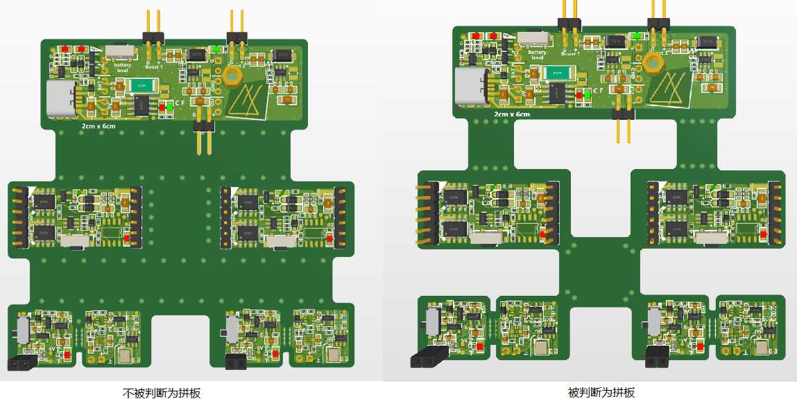

      还有，有时候如左图那样，如果遇到人工审核，中间打了很多对方所说的所谓 “邮票孔”，也被视为拼版，所以小心为甚 可以少打一些不那么明显的分割孔，但是也不要太少导致掰开非常费力。

   4. 为 SMT 的实用 PCB 经验：

      - 器件数量少、PCB 板面积大的，尽量器件都放到单层，单层 SMT 便宜很多，调试也方便。

      - 两个双层板的进行单层 SMT 的 PCB 板 通过 接插件 或者 焊接 等方式 贴到一块，可以模拟 四层板的 双面 SMT，这个打板会便宜很多。

        即：做两个双面板，一个是小一点带半孔可贴在另一个板子， 都单面 SMT，然后贴在一起，那么就是两个双层板+单面 SMT 最后效果等于 四层板+双面 SMT，就便宜很多！
      
      - 自己回流焊，网上很多教程。需要做钢网，上锡浆，放器件，加热台烹饪，出炉。或者 如果 PCB 器件都比较简单 比如 SOP、SOT 之类的，没有 QFN 之类的 IC 下方也有焊接点，那么钢网也可以不用，上锡浆，上器件，热风枪加热即可。

6. PCB 实物拿到之后。

   - 首先检查：元器件是否焊接齐全（不焊接的 N.C 器件保证没有焊接）、焊接是否有虚焊、开窗是否良好并且是否需要补锡、等等。
- 修饰：可用热胶棒 固定/加固 各种板载接口、电位器 等可能晃动/不牢固的器件；加装散热片或添加导热硅胶；板面 封胶/防水 处理。
   - 调试电路尽量用可调电流的专用电源，设置一个最高电流做保护，设置一个肯定不正常但又不至于烧掉电路板的电流，减小电路板烧坏风险，看到电流不正常就立马掉电，逐电流路线和逐模块的排查原因。
- 调整 & 测试：各个模块单独测试，任何一个子模块有问题都立即定位并解决，再整体联调。首先将各个板载电源与后面的用电部分分开（板上预留的 通过 0R电阻、排针+跳线帽、电子开关 等等方式），上电检查各个电源轨输出是否正常，保护功能（保护电路、TVS/ESD、保险元件等）测试；各个功能模块逐个测试，最后全部连接起来整体测试。

**注意！**更多常用技巧总结在 `4 SCH-PCB 设计规范` 章节 和 `./PCB LOGO-画法集合-PCB工具-规则文件/PCB实验-画板技巧综合.PcbDoc`里。

## 3.5 AD20 SCH & PCB 常用技巧

这里没有说到的都与上面 `2 SCH 绘制规范和 AD 使用` 章节中的一样。

Altium Designer 好教程系列 [【资源合集】Altium资源汇总 (qq.com)](https://mp.weixin.qq.com/s/A7DdsiQECRapabkRo6RVTw)。

> [将Gerber / ODB++制造数据返回PCB](https://mp.weixin.qq.com/s?__biz=MzA4NTgzMTgzNQ==&mid=2650766451&idx=2&sn=ca308fdd8ba0c2250cd14be3cb64f48d&scene=21#wechat_redirect)
>
> [对元件显示模式下发现的验证错误进行故障排除](https://mp.weixin.qq.com/s?__biz=MzA4NTgzMTgzNQ==&mid=2650766334&idx=2&sn=ce3b675ff2385274731f516cb469e970&scene=21#wechat_redirect)
>
> [重新安装或修复 Microsoft Office 组件以解决意外错误或程序挂起问题](https://mp.weixin.qq.com/s?__biz=MzA4NTgzMTgzNQ==&mid=2650766241&idx=3&sn=7ccd93823658e51098cc83e85bc54dfa&scene=21#wechat_redirect)
>
> [从库中复制和粘贴元件](https://mp.weixin.qq.com/s?__biz=MzA4NTgzMTgzNQ==&mid=2650766134&idx=3&sn=f4f7fcbf62aad46ece014698a688816f&scene=21#wechat_redirect)
>
> [控制相同网络对象连接线的外观](https://mp.weixin.qq.com/s?__biz=MzA4NTgzMTgzNQ==&mid=2650766081&idx=4&sn=472f4062f68ec908cd3c497c8281e1c0&scene=21#wechat_redirect)
>
> [确认您的订阅级别以明确可用的功能](https://mp.weixin.qq.com/s?__biz=MzA4NTgzMTgzNQ==&mid=2650766021&idx=3&sn=ba145ef1760494359633e22a3776eb29&scene=21#wechat_redirect)
>
> [PDF输出时出现错误提醒](https://mp.weixin.qq.com/s?__biz=MzA4NTgzMTgzNQ==&mid=2650765716&idx=3&sn=d678b17bfa01a11a3d1f577727712ced&scene=21#wechat_redirect)
>
> [冻结或长时间延迟的故障原因排查](https://mp.weixin.qq.com/s?__biz=MzA4NTgzMTgzNQ==&mid=2650765684&idx=3&sn=859213436deec0743a1478ff9e09062c&scene=21#wechat_redirect)
>
> [无法在层堆栈中删除层](https://mp.weixin.qq.com/s?__biz=MzA4NTgzMTgzNQ==&mid=2650765606&idx=5&sn=1cccec96fd436512d02dd50ba858a3e1&scene=21#wechat_redirect)
>
> [是否可以显示PCB中Cavity的三维视图？](https://mp.weixin.qq.com/s?__biz=MzA4NTgzMTgzNQ==&mid=2650765579&idx=4&sn=6e9150f61ed3cc8fd541d5613994ec15&scene=21#wechat_redirect)
>
> [无法导出DXF或DWG文件 - “没有注册类”错误](https://mp.weixin.qq.com/s?__biz=MzA4NTgzMTgzNQ==&mid=2650765561&idx=4&sn=639d8fd4c5522d07a4f6726d5cb54dee&scene=21#wechat_redirect)
>
> [如何单击导线并编辑网络名称](https://mp.weixin.qq.com/s?__biz=MzA4NTgzMTgzNQ==&mid=2650765508&idx=4&sn=77c0d0ddbc2d2ece4378d44db8cc6b9f&scene=21#wechat_redirect)
>
> [SOLIDWORKS MCAD的“内部ID不匹配”问题](https://mp.weixin.qq.com/s?__biz=MzA4NTgzMTgzNQ==&mid=2650765434&idx=3&sn=104df7aa7649b47fee94798ab20bd7b9&scene=21#wechat_redirect)
>
> [定义单层板](https://mp.weixin.qq.com/s?__biz=MzA4NTgzMTgzNQ==&mid=2650765418&idx=3&sn=f05e39a7b08dbcca5bfc05edada04a05&scene=21#wechat_redirect)
>
> [分层结构中的重复网络](https://mp.weixin.qq.com/s?__biz=MzA4NTgzMTgzNQ==&mid=2650765407&idx=4&sn=31c158198abe7d768e2b6bee6aff437c&scene=21#wechat_redirect)
>
> [放置过程中的元器件标注](https://mp.weixin.qq.com/s?__biz=MzA4NTgzMTgzNQ==&mid=2650765351&idx=5&sn=0bad622a7f73d596d4700cafb2a7431a&scene=21#wechat_redirect)
>
> [难以编辑和选择多边形铺铜](https://mp.weixin.qq.com/s?__biz=MzA4NTgzMTgzNQ==&mid=2650765305&idx=4&sn=b54e454e46772a3b1e323e7b3fdec21e&scene=21#wechat_redirect)
>
> [PCB上的米色标记](https://mp.weixin.qq.com/s?__biz=MzA4NTgzMTgzNQ==&mid=2650765265&idx=4&sn=e27ceb92c632dfa4c6b9d0f6ddc2c81f&scene=21#wechat_redirect)
>
> [无法添加折弯线/放置后，无法移动分隔线/无法选中电路板区域](https://mp.weixin.qq.com/s?__biz=MzA4NTgzMTgzNQ==&mid=2650765185&idx=4&sn=f17587d5a47222a6bc4f1345a6007fdb&scene=21#wechat_redirect)
>
> [如何改变Port端口的交叉参考显示？](https://mp.weixin.qq.com/s?__biz=MzA4NTgzMTgzNQ==&mid=2650765121&idx=4&sn=223c2e006365e2470029229277202161&scene=21#wechat_redirect)
>
> [SOLIDWORKS不显示丝印](https://mp.weixin.qq.com/s?__biz=MzA4NTgzMTgzNQ==&mid=2650765104&idx=4&sn=90bf7b9460dc5c52b7f926cc6231b633&scene=21#wechat_redirect)
>
> [BOM验证问题](https://mp.weixin.qq.com/s?__biz=MzA4NTgzMTgzNQ==&mid=2650765086&idx=4&sn=680cf5bd2de338fd3c206ab27b17968b&scene=21#wechat_redirect)
>
> [无法在刚性区域与柔性区域之间布线](https://mp.weixin.qq.com/s?__biz=MzA4NTgzMTgzNQ==&mid=2650765060&idx=5&sn=a76bf269e52fb868a13cad5d030f7d1f&scene=21#wechat_redirect)
>
> [放置过程中的元器件标注](https://mp.weixin.qq.com/s?__biz=MzA4NTgzMTgzNQ==&mid=2650764974&idx=4&sn=7cff09ffc2b3ff858813eb60aa378bd6&scene=21#wechat_redirect)
>
> [无法在PDF中搜索到来自PCB的文本](https://mp.weixin.qq.com/s?__biz=MzA4NTgzMTgzNQ==&mid=2650764948&idx=4&sn=8addaac010e71b1b7641ee8cc3c45561&scene=21#wechat_redirect)
>
> [编辑原理图模板](https://mp.weixin.qq.com/s?__biz=MzA4NTgzMTgzNQ==&mid=2650764899&idx=4&sn=048b195df4de6e4b2c43f693bdbdbbdf&scene=21#wechat_redirect)
>
> [链接Spice模型](https://mp.weixin.qq.com/s?__biz=MzA4NTgzMTgzNQ==&mid=2650764868&idx=4&sn=e3e6c29df96638296a48ec81c56d9f3a&scene=21#wechat_redirect)
>
> [黄线贯穿整个PCB窗口](https://mp.weixin.qq.com/s?__biz=MzA4NTgzMTgzNQ==&mid=2650764843&idx=4&sn=b86fc8e5e04aec417143a9dcb474d7b2&scene=21#wechat_redirect)
>
> [Draftsman 如何隐藏位号](https://mp.weixin.qq.com/s?__biz=MzA4NTgzMTgzNQ==&mid=2650764828&idx=4&sn=f460f0ab999bcbd7c4fdaa1e22a91819&scene=21#wechat_redirect)
>
> [如何确定封装的元件拾放中心？](https://mp.weixin.qq.com/s?__biz=MzA4NTgzMTgzNQ==&mid=2650764687&idx=6&sn=8ef2f56a558d0808c2887d6a7621e6ad&scene=21#wechat_redirect)
>
> [为何我无法进行多边形铺铜？](https://mp.weixin.qq.com/s?__biz=MzA4NTgzMTgzNQ==&mid=2650764665&idx=3&sn=75fec27702010a7340e1f1bde1558ebb&scene=21#wechat_redirect)
>
> [将OrCAD Schematic和PADS Allegro PCB合并到一个项目中](https://mp.weixin.qq.com/s?__biz=MzA4NTgzMTgzNQ==&mid=2650764624&idx=5&sn=6f27ed6ecd3fe841b359d715518709cb&scene=21#wechat_redirect)
>
> [Status Bar状态栏在底部边缘处丢失](https://mp.weixin.qq.com/s?__biz=MzA4NTgzMTgzNQ==&mid=2650764579&idx=5&sn=c2e3762c33ddf15862df14cefb1a695d&scene=21#wechat_redirect)
>
> [Active Bom中的替代零件](https://mp.weixin.qq.com/s?__biz=MzA4NTgzMTgzNQ==&mid=2650764472&idx=3&sn=1a4dd570206c404ddb036a5d46bb9e98&scene=21#wechat_redirect)
>
> [PCB和Schematic编辑器窗口中看不到滚动条](https://mp.weixin.qq.com/s?__biz=MzA4NTgzMTgzNQ==&mid=2650764391&idx=4&sn=a6753ca7b90cda562cb5cabb7dd963db&scene=21#wechat_redirect)
>
> [多页式或堆叠式分形面板分组](https://mp.weixin.qq.com/s?__biz=MzA4NTgzMTgzNQ==&mid=2650764370&idx=3&sn=4c59348cc08498713deb3c1b3c07ec43&scene=21#wechat_redirect)
>
> [连接线颜色](https://mp.weixin.qq.com/s?__biz=MzA4NTgzMTgzNQ==&mid=2650764318&idx=3&sn=954b3a82e9235fad91a9c74ecf9f363c&chksm=87da2deab0ada4fc23fd8c56bc4a68f760b8f5117638f4eb0162b5c1e256a822de7d9a2e16d7&scene=21&cur_album_id=2323781048054398977#wechat_redirect)
>
> [负片间距](https://mp.weixin.qq.com/s?__biz=MzA4NTgzMTgzNQ==&mid=2650764298&idx=3&sn=5bbc265d03b95720ace768714af56e86&chksm=87da2dfeb0ada4e81ca17a74406890b841729a16430b336db63c4b4a869f02c7db68f4ea9f8b&scene=21&cur_album_id=2323781048054398977#wechat_redirect)
>
> [设计规则的导入或导出](https://mp.weixin.qq.com/s?__biz=MzA4NTgzMTgzNQ==&mid=2650764246&idx=3&sn=fc964df77ab71bbbb8f4d4d98007e356&chksm=87da2a22b0ada334f083929f0a8f22641b083a7dc06d8d36c3c5e83e47f94a69e486db4113b4&scene=21&cur_album_id=2323781048054398977#wechat_redirect)
>
> [为什么三维视图中不显示PCB三维模型？](https://mp.weixin.qq.com/s?__biz=MzA4NTgzMTgzNQ==&mid=2650764213&idx=3&sn=dbd5177318bfdfc3fa7a89a56202b3f8&chksm=87da2a41b0ada357e9876f0ee67a1f5432744bd2e49307460997234fde4317a208f599e6dd71&scene=21&cur_album_id=2323781048054398977#wechat_redirect)
>
> [放置Track走线时背景变暗](https://mp.weixin.qq.com/s?__biz=MzA4NTgzMTgzNQ==&mid=2650764163&idx=3&sn=65ef3bf90d14b09eecbd69a42889082b&chksm=87da2a77b0ada3616890a333b475aa824d0fe406de154b9b713fda4cb8b7cc5d15ee8d7a7a14&scene=21&cur_album_id=2323781048054398977#wechat_redirect)
>
> [无法选择对象](https://mp.weixin.qq.com/s?__biz=MzA4NTgzMTgzNQ==&mid=2650764136&idx=3&sn=3498624cfd417a9e96bfe2c78bc5c6b0&chksm=87da2a9cb0ada38aebfccc3107678dac1ed549f4dc14a2e5f24a72c7ecde33ba11083727dc2d&scene=21&cur_album_id=2323781048054398977#wechat_redirect)
>
> [无法在Altium中打开*.DRL文件](https://mp.weixin.qq.com/s?__biz=MzA4NTgzMTgzNQ==&mid=2650764097&idx=4&sn=9c767f287db6c020c0a703223babdb4f&chksm=87da2ab5b0ada3a3e4ca0ee8eb093136f1cc197bdd1b20765c4b0a9008e8fabe7dc15af41e10&scene=21&cur_album_id=2323781048054398977#wechat_redirect)
>
> [如何编辑电路板外形](https://mp.weixin.qq.com/s?__biz=MzA4NTgzMTgzNQ==&mid=2650764009&idx=3&sn=3587b7f4c000698d091ddf12e86d815b&chksm=87da2b1db0ada20b116a9153160d80d3ee605415755d84ccb314c147a6e57455354aec0d262e&scene=21&cur_album_id=2323781048054398977#wechat_redirect)
>
> [如何将所有内容复制到新的PCB](https://mp.weixin.qq.com/s?__biz=MzA4NTgzMTgzNQ==&mid=2650763960&idx=3&sn=33046385497f640f325dc27029726837&chksm=87da2b4cb0ada25af0d9c0de5853dfd306a4400f999c5282e2e21e6d496aeb4dcdba38564006&scene=21&cur_album_id=2323781048054398977#wechat_redirect)
>
> [PCB面板选择和高亮显示控制](https://mp.weixin.qq.com/s?__biz=MzA4NTgzMTgzNQ==&mid=2650763637&idx=2&sn=3f8184c1f2d959e908873676b99284d9&chksm=87da2881b0ada197f28b8989422bbe2358ac3333204515d76175522eac22c40b90415ee31b62&scene=21&cur_album_id=2323781048054398977#wechat_redirect)
>
> [无法选择远离PCB边界的对象](https://mp.weixin.qq.com/s?__biz=MzA4NTgzMTgzNQ==&mid=2650763579&idx=2&sn=dbb8bd485872509ceee6a4e634fb8ef2&chksm=87da28cfb0ada1d9d6dc25fb192de3bdfc74abbd5c153c5bfb254aa6afde5144266d1a45f76f&scene=21&cur_album_id=2323781048054398977#wechat_redirect)
>
> [将多行文本复制成字符串](https://mp.weixin.qq.com/s?__biz=MzA4NTgzMTgzNQ==&mid=2650763287&idx=3&sn=c6903eb4f7253c5f0dd3c04268696942&chksm=87da29e3b0ada0f5ff7bda8b4d771b13d87b7bad58c04dec4846d5d7d94288600aef327a4b06&token=1789314639&lang=zh_CN&scene=21#wechat_redirect)
>
> [如何将栅格从mil更改为mm或将我的标识符设置为在原理图库中可见](https://mp.weixin.qq.com/s?__biz=MzA4NTgzMTgzNQ==&mid=2650763272&idx=3&sn=b83850b0e098535242bbb28aded45d15&chksm=87da29fcb0ada0eabd1c05798d9de7a371d5a6c8d7879308ea578a008784a1c3f83bf7a7e70b&token=1789314639&lang=zh_CN&scene=21#wechat_redirect)
>
> [如何跟随库更新变量器件](https://mp.weixin.qq.com/s?__biz=MzA4NTgzMTgzNQ==&mid=2650763255&idx=3&sn=eaae356ce6842292e1e3501af588a523&chksm=87da3603b0adbf1516d819222c7bb4dad9917dddb1bd89a0f3ad1fc294e5339eda482b6cbe93&token=1789314639&lang=zh_CN&scene=21#wechat_redirect)
>
> [如何在SOLIDWORKS中查看铜](https://mp.weixin.qq.com/s?__biz=MzA4NTgzMTgzNQ==&mid=2650763231&idx=4&sn=2b32886e1ef5569dfbab1236b4654915&chksm=87da362bb0adbf3d7112a11beede2d08f21b5ee2600d6b29a2b2a145e30f621734586f91e5cc&scene=21&cur_album_id=2323781048054398977#wechat_redirect)
>
> [运行批量处理文件后，未在Vault中创建元器件](https://mp.weixin.qq.com/s?__biz=MzA4NTgzMTgzNQ==&mid=2650763125&idx=3&sn=8d46cfb07cc4f73fa3ad734b6256bf4e&chksm=87da3681b0adbf97a9fa7f6d1a91a4fc09330d0fc43251c5874582077a56005cf0aae67a717a&scene=21&cur_album_id=2323781048054398977#wechat_redirect)
>
> [多层上的多边形铺铜区域和顶层上的焊盘之间的间距约束](https://mp.weixin.qq.com/s?__biz=MzA4NTgzMTgzNQ==&mid=2650763102&idx=4&sn=074a06369c1c55426b2f3bc19d4455a8&chksm=87da36aab0adbfbc44736a5653479bc33a3d0f068a5a5a8f7b74be4aba93aa34d3c8e9fd6b9a&scene=21&cur_album_id=2323781048054398977#wechat_redirect)
>
> [如何避免相邻层的平行路由线段](https://mp.weixin.qq.com/s?__biz=MzA4NTgzMTgzNQ==&mid=2650763072&idx=4&sn=ffcfad7d4adba3f562f8dcf2a7dabbc9&chksm=87da36b4b0adbfa252dac5ff75ece3e9f8678582d4b2cc7830c856f66778f237124807d9bc89&scene=21&cur_album_id=2323781048054398977#wechat_redirect)
>
> [如何将Allegro文件导入Altium Designer?](http://mp.weixin.qq.com/s?__biz=MzA4NTgzMTgzNQ==&mid=2650761295&idx=3&sn=3a96e77bea569eb20fe327b48f0f863c&chksm=87da31bbb0adb8ada9340f931ee88b22e2458f7208d178dda3d78564fcd4440df17f515473e3&scene=21#wechat_redirect)
>
> [如何控制PCB上飞线的显示或隐藏？](http://mp.weixin.qq.com/s?__biz=MzA4NTgzMTgzNQ==&mid=2650761334&idx=1&sn=fff8783632354256bac45a2fc5394f69&chksm=87da3182b0adb89426d4bfdf265d2ebf83e86368a8049f7eba6d2ae8e05b29fb6647a636eda8&scene=21#wechat_redirect)
>
> [移动元件时连接的飞线消失](http://mp.weixin.qq.com/s?__biz=MzA4NTgzMTgzNQ==&mid=2650761701&idx=2&sn=c5f948dc329554e3d8dc19b949605a70&chksm=87da3011b0adb90799fba10cab4920ccc28a65696944bea820b1d3b07686d3cb0bd5a724fd43&scene=21#wechat_redirect)
>
> [为什么我在原理图中看到不同的位号？](http://mp.weixin.qq.com/s?__biz=MzA4NTgzMTgzNQ==&mid=2650761741&idx=3&sn=1d5eda7beb63287097db7e5b702cdb55&chksm=87da33f9b0adbaef85db8f7e25da851d91aaf4b19c60168bb46676437dc0f570f3bdc506fa76&scene=21#wechat_redirect)
>
> [从PCB文档更新原理图元件的关联封装](http://mp.weixin.qq.com/s?__biz=MzA4NTgzMTgzNQ==&mid=2650761789&idx=2&sn=cdffa178e64d0e4f5a8ba4de34cbd596&chksm=87da33c9b0adbadf34344520e88b73c25006387a2f71ddcc1c5845bdf38f96f28d6515a56d9a&scene=21#wechat_redirect)
>
> [编译错误：重复的网络名称（Multi-Channel，Bus）](https://mp.weixin.qq.com/s?__biz=MzA4NTgzMTgzNQ==&mid=2650761831&idx=3&sn=950d12bf51e23b36dfe0188b48d98745&chksm=87da3393b0adba85a521d64885fbe02414a595ffe996de993460b75556cefff58e826a5b4849&scene=21#wechat_redirect)
>
> [防火墙或 VPN 可能会阻止访问的端口和URL信息](https://mp.weixin.qq.com/s?__biz=MzA4NTgzMTgzNQ==&mid=2650761859&idx=2&sn=f52a37dca9474174bc14e054aa743a46&chksm=87da3377b0adba6193c715820d8c2c1abfae596853d3e52b475be0879b8efc5181e3c7f2ef82&scene=21#wechat_redirect)
>
> [将AD配置恢复为安装后的默认值](https://mp.weixin.qq.com/s?__biz=MzA4NTgzMTgzNQ==&mid=2650762105&idx=4&sn=4b863c363262b4473da7e75383bc8374&chksm=87da328db0adbb9b683c42a7ef324558ffcafd1c4892b850331550d9a112f423968f0dbc577e&scene=21#wechat_redirect)
>
> [Private License服务器不支持的版本 - Refresh PLS & AIS](https://mp.weixin.qq.com/s?__biz=MzA4NTgzMTgzNQ==&mid=2650762251&idx=3&sn=7198db6671f9476eb4626fa39f775d8e&chksm=87da35ffb0adbce9507905efe6d4f1a2051a9c581cffd519808cd5adf6ef9fcdb727b7eccade&scene=21#wechat_redirect)
>
> [如何在PCB库的封装中精确放置三维模型](http://mp.weixin.qq.com/s?__biz=MzA4NTgzMTgzNQ==&mid=2650762327&idx=3&sn=3b6cd7d4d06c6b9392b71cccf2d98fe4&chksm=87da35a3b0adbcb567f72678d2a73c88f419b5eb46e9842a5be0294035190d24b8e45da763ae&scene=21#wechat_redirect)
>
> [如何从BOM中删除行](http://mp.weixin.qq.com/s?__biz=MzA4NTgzMTgzNQ==&mid=2650762355&idx=4&sn=a1ed7b62255787abc0dc46cceb17f966&chksm=87da3587b0adbc9189809586462c88d9ed0d486ec0ab69292045d9af010b09a94f43fedc8b98&scene=21#wechat_redirect)
>
> [如何配置整个柔性PCB的弯折并对其进行动画设置](http://mp.weixin.qq.com/s?__biz=MzA4NTgzMTgzNQ==&mid=2650762452&idx=4&sn=bcc17d808a23fe26b193826f01658c86&chksm=87da3520b0adbc365bd17d10f3e98d07b587bef443ee4344ce918f691124ea8da30d3c034637&scene=21#wechat_redirect)
>
> [未知服务器 - 无法使项目在线托管](http://mp.weixin.qq.com/s?__biz=MzA4NTgzMTgzNQ==&mid=2650762457&idx=3&sn=069f21b5569498e21a1d0f6fc02ef0ea&chksm=87da352db0adbc3bc7f77f2220734fdca6e38890a80039af31f13cb170d3a0f5e89d91867ab4&scene=21#wechat_redirect)
>
> [在ODB++输出中，将电镀的背钻孔转换为非电镀](http://mp.weixin.qq.com/s?__biz=MzA4NTgzMTgzNQ==&mid=2650762491&idx=4&sn=6bcf1e1f1d0e8c152c6fa0d946e2dd59&chksm=87da350fb0adbc195dde49cd51605945a1821dca67fcc57b3caabbdf0d32db864381fe2ca781&scene=21#wechat_redirect)
>
> [DRC不检测未连接的网络](http://mp.weixin.qq.com/s?__biz=MzA4NTgzMTgzNQ==&mid=2650762660&idx=4&sn=fb2c7a2e49a07283d526ad9161ab2d49&chksm=87da3450b0adbd46f07f14e1cb091a7aa5986d718325119de15fb99fbf302c40e95579fa157c&scene=21#wechat_redirect)
>
> [如何将Logo放置到PCB文档中](http://mp.weixin.qq.com/s?__biz=MzA4NTgzMTgzNQ==&mid=2650762670&idx=2&sn=5317c8471adc4261a973620eeff35256&chksm=87da345ab0adbd4c6342f3615706d23817975b0c83c019a6ac167560d672de59dc5eba9a923f&scene=21#wechat_redirect)
>
> [如何通过Output Job输出原理图变量](http://mp.weixin.qq.com/s?__biz=MzA4NTgzMTgzNQ==&mid=2650762769&idx=3&sn=b42ded9cb46801084c6d5bd5be4e7473&chksm=87da37e5b0adbef39544ebf4263e7e3ea477588e194a3dabddcc7d61788b3cf4a2c2ef0959f6&scene=21#wechat_redirect)
>
> [从ECAD至MCAD的转换导致电路板形状重构](http://mp.weixin.qq.com/s?__biz=MzA4NTgzMTgzNQ==&mid=2650762795&idx=3&sn=3067478f30c6fd41e8d1cfe743c7b487&chksm=87da37dfb0adbec9fc66a0bd67e5f7223f60650f7d243ce33fbc6a4877b966e440b3c60082f5&scene=21#wechat_redirect)
>
> [提示更新错误：This application requires Windows hotfix KB3140245](https://mp.weixin.qq.com/s?__biz=MzA4NTgzMTgzNQ==&mid=2650762826&idx=5&sn=322abda4831ddf3ccfaa40f781dfaae7&chksm=87da37beb0adbea81296efb5ce7dc9ebf99ce91848cea0d9e8e236da75a380a7a3927d9c0f40&token=1468787192&lang=zh_CN&scene=21#wechat_redirect)

### AD20 软件设置

- 改中文界面：AD20 界面右上角的设置图标，选 "system"，选 "General"，选 "Use local resource"，重启软件。但建议使用全英文。
- 窗口找不到：AD20 界面右上角的设置图标，选 "system"，选 "View"，选 Desktop 中的 "Reset"。
- 自定菜单项的快捷键：按住 Ctrl 键点击所选功能项，打开 Edit Command 窗口，并设置快捷键，注意不要与已有快捷键的提示（Currently in use by）冲突；取消快捷键：在快捷键选项框中下拉选择 None 即可。
- 将 AD 软件的线标适用范围改为“分层级的（Hierarchical）”：Project，Project Options，里面的 Options，在 Net Identifier Scope 选择 Hierarchical。
- .etc

### AD20 快捷键 & 绘制技巧

- 在拖动元件的时候按 "Tab" 键调出元件属性进行参数修改和设置等。

- 在原理图中器件的属性界面有 "Pin" 标签栏，进去可以选择显示/隐藏引脚标号和名称。

- 取消高亮：Shift + c，或者右键点 "Clear Filter"。

- 修改器件移动时的网格，SCH 为修改 "Snap Grid" 参数，PCB 为 ctrl+g 或者在属性中双击 "Grid Manager" 调出 Grid Edtior，修改 Steps 参数；PCB中修改 Steps 可以以准确、固定的间距放置多个器件。

- 跨图连接器 Off Sheet Connector，尽量不要用，这就像 C 中的 goto 一样容易混乱，要么设计成 层次原理图设计，要么设置网络标号为全局使用（选择 project->project options->options，在 Net ... Scope 中选 "Global ..." 即可）。

- .etc

- SCH 中的：
  
  - 多个相似器件的批量修改，如所有电容的 Designator 修改为 "C?"，或者统一修改封装等等：右击一个器件，点 "Find Similar"，把 Symbol Refrence 选为 same，或者其他选为 same，然后点 Apply，会高亮出所有相似器件，然后鼠标在空白处按住左键拖动框选所有相似器件，便可以在属性栏中批量修改属性，调出属性栏可以按 F11。或者手动单独多选要批量修改的多个器件，然后在属性栏中可以批量修改。PCB 中同理，可用于批量修改封装、修改焊盘/过孔等等，只是在 "Find Similar" 步骤中点 Apply 后相似器件会自动都被选中，直接在属性栏批量修改即可。
  
  - 按住 shift 拖动一个元件，可以拖出一个复制元件。
  
  - 原理图编译和查看错误：AD 20 是实时查错的，右下角点 Panels 打开 Message 即可看到，重新编译点 Project 里面的 Validate ... 即可。
  
  - .etc

- PCB 中的：（注意，bug 记录会写在最前）
  
  - **AD 20 遇到 bug 记录**：PCB 开始不先前先隐藏一些线（比如 gnd 等），然后走线，然后再在左边 “PCB” 面板 “All Net” 里面选择 显示全部线 有可能显示的线 还是原来 位置的 没有更新，这时 选择 “All Net” 之后 下面一栏会显示所有线，在下面全选所有线，右键 里面 ”Connections“ 先 选择全部 关闭显示，再开启显示，则就正常了。
  
  - **AD 20 遇到 bug 记录**：加泪滴时候，teardrop style 选择 line，选择另外一个 “曲线” 类型泪滴则会有毛刺泪滴！很恶心！
  
  - 更新 PCB 后会生成一堆 Room，通过 寻找 相同元件 来选中全部 Room 来一同删除而不用一个一个删。
  
  - 切换 PCB 网格大小和网格类型：Ctrl+g；推荐在摆元件的时候 移动网格 改为 3 or 5mil，走线的时候改为 1mil。
  
  - 隐藏覆铜：按 L 按键，在视图选项（View Options）中选择关闭覆铜（Polygons）显示；在视图选项（View Options）中还可以关闭 3D 模型显示，等更多选择。
  
  - 禁止/启用自动吸附：Shift+e（多按几次再试试）。或者，拖动元件，按住 "Ctrl" 的时候器件不会吸附网格而自由移动。
  
  - 切换三种布线模式（忽略，避开，推挤）：Shift+r。
  
  - 把选中的器件排列到框里："Tools"，"Component Placement"，".. Within Rectangle"；或者设置个快捷键，可以设置为 Shift+Q。
  
  - 选择一整条连接的线：选择多条连接线的其中一段再按 tab 即可，这个对于任何线都有效；Ctrl + h 然后单击一条走线可以选择整条线上的所有，这个只对 wire 走线有效。
  
  - 隐藏线或线类：点右下角的 Panels 里面，打开 名为 “PCB” 的面板，选择线或网络，右击选择 “Connections（连接）” 里面的隐藏即可。在这里也可以对线、线组或差分线对设置不同的颜色（打对勾就显示），来明显区分显示。

  - 覆铜：选择好网络、选择移除死铜、设定移除小于比如 10mil 的铜片和选择 "Pour Over Same Net .."；移动覆铜后，要右键选 "Polygon Actions" 的 "Repour All"。覆铜的属性栏里面的 Actions 里面有重新覆铜、设置网络（再手动点一根要连接的网络的线）、前置/后置和修改（手动画线微调边缘）等。
  
  - 挖掉一块覆铜：选 Polygon Pour Cutout 工具，在已经覆铜的区域画个框，然后重新覆铜 "Repour All"。
  
  - 批量放过地孔：给覆铜添加或者围绕某个线添加，选 Tools 的 Via Stitching/Shielding，在里面设置孔连接的网络、孔分布和孔大小等信息，可以选择给整个板面均匀加接地孔（孔间距可以打一些防止孔过多了），也可以选择给信号线的周围围绕着加接地孔，比较方便。
  
  - 只能选择某种类型要素而其他元素不能被选中，方便只修改某一类元素而防止误碰其他要素：点工具栏的 Selection Filter，哪一项打开哪一项就能被选中，反之不能被选中；一般在覆铜后可以把覆铜 Polygons 关闭使能选中。
  
  - 调节 PCB 线高亮时候与背景对比的程度：点右下角 Panels，点进 View Configuration，在 View Options 栏中下面调节 Mask and dim，还可以调节 Object Visibility，可以把 覆铜 Polygons 的亮度调低，以区分覆铜和走线、焊盘。
  
  - 板子镂空：先围绕要镂空的区域画 Keep-out-layer 闭合曲线，然后工具栏选择 Designer，Board Shape，Define Board Cutout，然后围绕刚才画的镂空区域的 Keep-out-layer 闭合曲线 画一圈。
  
  - 2D 和 3D 视图切换，使用 2 和 3 按键时视图不会同步，使用 Ctrl + Alt +2/3 视图是同步的（暂时不知如何解决使用 2/3 按键是同步视图的）。
  
  - 过孔盖油。如果发给 PCB 厂家 PCB 文件，可以选择过孔盖油然后由厂家设置，如果不想泄露 PCB 文件而发的是 Gerber 文件，则必须要先设置过孔盖油，否则发过去是默认的，默认过孔是不盖油的。选择全部过孔，打开属性栏 -> 勾选两个 Tented。详见 [Altium AD20过孔盖油，通过设计规则实现过孔盖油，简便实用不会造成遗漏出错_Mark_md的博客-CSDN博客](https://blog.csdn.net/Mark_md/article/details/118542699)。
  
  - 多层板，我这里一般内电层（负片层）只用于地层而不是电源层。如果有电源层（或者大面积连接电源网络的覆铜），其边缘要内缩 1 ~ 2mm（40mil 以上）（20H 原则）。对于内电层可以设置让其自动内缩 详见 [Altium AD20的四层板叠层管理、平面层20H内缩_Mark_md的博客-CSDN博客](https://blog.csdn.net/Mark_md/article/details/116455563)。
  
  - 通过 selection filter 可以设置只能选中某一些 PCB 中的元素，比如不能选择覆铜：
  
    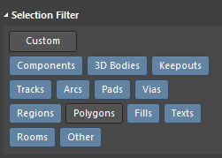
  
    在 PCB 定型之后，可以设置 全部不能选择，或者不能选择 Components，防止后面 查看 PCB 时候误操作。
  
  - ...
  
- 器件原理图库绘制的技巧：
  
  - 引脚名字上要加横线表示低有效：绘制器件原理图库，在名字的每一个字符中间加 " \ " 字符即可。
  - 快速添加各个引脚名：在一个器件原理图库的界面，其属性的 "Pin" 标签中，下面有笔形状的 "编辑" 按钮，点进去可以以表格形式编辑当前器件各个引脚属性。
  - 每个引脚有属性，比如 I/O、Power、Passive 等等，可以如实设置，如果嫌麻烦可以一律设置为 Passive，这样连接时候不会报错。在 SCH 中可以改元件 SCH 的每个引脚属性、显示标号等，双击打开一个元件 Component 页面，左下角点 Pin 打开引脚属性设置界面，在里面即可更改。
  - ..

更多 AD20 快捷键参考`./PCB LOGO-画法集合-PCB工具-规则文件/AD20常用快捷键总结（北冥有鱼）.xlsx`。

### 通用 AD 规范-今后尽量适用

- 导入 AD20 软件的配置文件，参考 "7 AD 导入导出配置文件" 章节。
- 统一的标题栏：每一页原理图都使用 A4 大小，标题栏使用模板文件`./PCB LOGO-画法集合-PCB工具-规则文件/标题栏模板/A4 - 瞰百易.SchDot`，将其复制到 AD20 安装目录下的 `/Altium/AD20/Documents/Templates`，然后在 SCH 界面的属性栏的 Page Options 的 Formatting And Size 中选 Template，下拉选择 "A4 - 瞰百易" 选项，在属性栏的 参数页面加上 标题、作者、版本号等等信息。
- SCH 和 PCB 的基本设计流程 看 “最基本的 SCH 绘制过程” 和 “最基本的 PCB 绘制过程” 小节，其中的每一个句子和步骤 均要看过！
- 硬件规划/设计框图/逐级细化确定可实施 -> SCH 各个子页设计 -> SCH 中设置线组/差分对/线上的规则 -> SCH 顶层原理图设计/个子页模块的连接 -> SCH **检查** -> PCB 导入/设置规则 -> PCB 器件布局和**检查** -> PCB 布线 -> PCB **检查** -> PCB 板面信息完善 / 打板准备。
  - 设计时遵守的规范：按照下面 “4 SCH-PCB 设计规范” 小节中介绍的内容进行 SCH 绘制 和 PCB 布局布线 和 完善。
  - SCH & PCB 的检查：设计完之后的查错表格：首要确保 SCH & PCB 全部编译无错，接着检查每个元件的封装、封装 BOM 名称、线路连接、功率线加粗、PCB 上放置元件留出焊接调试空间、地平面覆铜和加泪滴；然后按照检查表格（Check List）检查一遍，参考 “SCH & PCB 检查表 \ Check List” 一节。
- ...
- 准备焊接实物 PCB 的准备：AD20 中 PCB 界面右下角 Panels 里面打开 PCB List 栏，该栏的 顶部 左边 选 View All Objects，再在其 右边 选 Components，即列出所有器件并按照 Comment 排列，可以选中所有一个值的阻/容器件然后器件会高亮显示，并且 PCB List 栏的下面会显示被选中元件的数量，接着焊接这一值的阻/容器件，然后换下一波相同值的器件，以此类推。使用钢网和加热台快速手工贴片：[如何快速高质量手工PCB贴片](https://www.bilibili.com/video/BV1V5411b7Wa)。
- 调试使其能工作，再测试性能。

### SCH 层次原理图设计

进行原理图设计时，一般都是先设计系统的框图，自顶向下逐层细化。然后使用 CAD 工具进行绘制，先绘制好每一个模块，然后在顶层原理图将其一一作为模块相互连接起来。

一个比较全的示例看 “总线连接” 一节。

顶层以框图形式，方便原理图各个子系统部分模块、固定和规范化，也方便从顶层快速了解整个原理图工程。通常先把各个子系统的局部电路原理图画好，放置好端口 Port，最后在顶层做框图把各个模块连接。以下介绍的是自下而上的画，若是架构设计人员可以自上而下设计。

1. 一个模块只用一页原理图，画好各个子系统电路模块原理图，并添加好  Net Label（局域级别有效），然后再添加各个模块对外连接的 Port，并填好 Port 的网络标号名字（可以与 Net Label 重名），输入输出类型；
2. 新建一个顶层原理图文件，在其中 点工具栏 Design，点 Creat Sheet Symbol Form Sheet，选择一个子原理图模块，放置 Sheet Symbol，其中的 Port 和  Sheet 框图的大小均可调整，然后连线；如果子原理图模块更新了端口，在 Top 层的 Sheet Symbol 上右击，选择 Sheet Symbol Actions 里面的 Sync.. 同步即可。

在所有原理图都是平级的时候（即没有顶层 Top 原理图 SCH 的时候）：当单独使用 Port 或 Net Lable 时候，这两个都是全局作用的；当同时使用的时候，Port 是全局作用的，Net Lable 是局域级别作用的（即所在 SCH 页内）；从电源符号那一栏中拖出的（有 GND、VCC 等各种电源符号）的网络标号总是全局作用的，因为其名字都带 Port（或 Net Lable？）。~~但是当原理图有分层的时候，Port （包括电源符号的 Port）也变成局域级别作用，仅当在上级原理图中用线连接后才会连接。~~这句不确定，**电源符号 Net Lable 总是全局作用的**，所以每个原理图内的 电源和地 要互相不同，做好区分，比如 AD 模块 原理图内的电源 都标为 AD_Vcc，地都标为 AD_GND，其他模块同理都标为 xxx_Vcc 和 xxx_GND，然后用 Port 引出。

推荐将 AD 软件的线标适用范围改为“分层级的（Hierarchical）”，详看AD 20 软件设置小节。

### SCH Variant 设置 NC 器件

AD Variant 设置用于在画好的原理图中设置一些不焊接的元器件，即 NC 器件，比较常用到。

1. 在 AD20 软件原理图界面，点击 Project -> Variants，打开 Variant Management 界面，其左下角 Add Variant，新的 Variant 这里规范命名为 “Variant of 实际打板”，确定并关闭后，工程目录会出现 Variants 目录，其下有 “Variant of 实际打板” 一项；
2. 然后在原理图中，对要 NC 的元器件 右击，点击 Part Actions -> Variants，新界面里面 对器件 设置为 Not Fitted，即对其 NC 了；在此界面的下边还有对 Variants 进行设置的选项，比如 NC 标识的样式等等。
3. 工程目录有 Variants 目录，其下有 “Variant of 实际打板” 一项，双击切换到此项，然后到某个原理图页面，其下方有 “Editor” 栏，其右边有 “U_<原理图名称>” 栏，单击，即可看到被 标记为 NC 的器件。

其方法记录在`\PCB LOGO-画法集合-PCB工具-规则文件\AD Variant 设置\AltiumDesigner20装配变量Variant使用说明 .pdf`文件里。

另一个详细的网络文章教程：[(1条消息) 硬件工程师必备技能之Variant_地主家也没有余粮啊的博客-CSDN博客](https://blog.csdn.net/weixin_39153808/article/details/119704800)。

### SCH 总线连接

看图自学。以下原理图源文件在`\PCB LOGO-画法集合-PCB工具-规则文件\多层次原理图 总线连接 示例`里。

Sheet 2 SCH 图：

Sheet 3 SCH 图：

Sheet 1 SCH 图：创建一个名为 SPI 的 Harness，且引出在其中心引出 Port 名为 SPI。 

Sheet 4 SCH 图：引用 名为 SPI 的 Port，创建一个名为 SPI 的 Port，使用 Signal Harness 给该 Port 拉线，则该 Port 会自动变为 Harness 类型，双击该 Port 打开属性，修改 Harness 的类型为 “SPI”（该 “SPI” 名字即上图中 Harness 的名字）。

Top SCH 图：

注意，一个 sheet 的所有 port 都要加上，不能少。

PCB 效果：

### SCH 线组和差分对设置

原理图中添加 线组（Net Class）和 差分对（Diff Pair）（尽量在原理图中将线分组完成，而不是在 PCB 中手动挨个添加，因为从原理图更新 PCB 时原来在 PCB 单独添加的线组会被清除），并在原理图中对电源线线宽规则、数据线线宽规则和差分线对均设置完成。

- 添加线组（Net Class）和规则：
  
  （首先确保 工具栏—>Project—>Project Options—>Class Generation 里面的 Gentrate Net classes 勾选，这样设置才能原理图产生线组 Class，软件默认勾选）
  
  Place 中选择（空白处右击选择 Place 或者 原理图界面软件上方工具栏选择 Place 或者在原理图上方的工具栏里面）Directives 里面的 Blanket，包围要添加一个线组的所有线（可以画成不规则形状，关键要在只剩最后一处连接的时候右击完成放置）；再在上述位置找到 Parameter Set，选择后 TAB 键修改参数，在里面 add 一个 Net Class 参数，并写上线组名，可以选择是否显示该参数，推荐 Label 名修改为 “Class _ <线组名>”，然后放置并连接到 Blanket 上面；再添加一个 Parameter Set，add 一个 Rule 参数，选择线宽项，设置线宽，最后放置并连接到 Blanket 上面。如下图所示，这样就将这一组线命名为 “I2S _ LINE” 并设置了线宽规则。然后从原理图更新到 PCB 即可。

如果要设置线组的线不在一块并且也不好用 不规则形状的 Blanket 全部包围住，那么就将这些线的线标单独拿到一块空白区域，然后围住即可。

- 在 PCB 中查看线组：
  
  1. 在 PCB 界面，右下角 Panels 点开 “PCB”，左侧即可看到 “PCB” 栏，里面即可看到线组。
  2. 在 PCB 界面，上方软件工具栏选择 Design 里面的 Classes 栏，里面即可看到线组。

- 添加差分对（Diff Pair）：
  
  每一对差分对的线标有要求，前缀必须相同，后缀必须为 “_ P” 和 “_ N”，软件才会识别。
  
  如下图设置。执行原理图更新到 PCB 操作。在 PCB 视图 中的 左边 “PCB” 栏里上面选择 “Differential Pairs Editor” 即可看见刚刚添加的差分对。也可以不画 Blanket 而在线上直接添加 Differential Pair 标识符，要写好差分对名称。
  
  
  
  可以同时添加多组差分对，如下图所示，只要线标名字按照要求即可识别。
  
  

- 差分线对走线：
  
  在 PCB 视图中，工具栏选择 Interactive Differential Pair Routing 在差分线对上走线即可，走完之后还可以用 Interactive Diff Pair Length Tuning 确保差分线等长。
  
  更多差分线的规则设置看“差分走线设计”小节。

### PCB 布局复制

**手动按照坐标来布局复制**

针对多个一样的模块，PCB 中器件摆放/布局都一样化。

1. 先布局好一套模块，另外几套模块的位置可以乱，先放着；
2. 打开 Panels 中的 PCB List，选择 View Selected Objects，再选 Components，再把上面布局好的一套模块的所有器件选中，这时 PCB List 中会显示所有被选中的器件信息表，找到表中的 X1 和 Y1，右击选择 Switch to edit mode，然后选中 X1 和 Y1 复制，然后选中另外一套模块的所有器件，在其 X1 和 Y1 上粘贴即可，这时两套是重叠的，不要取消刚才的选中状态，进行整体平移到两套不重叠，然后选中第一套模块的所有器件，在 PCB List 中复制所有的 Rotation，然后选中第二套模块的所有器件，在其 Rotation 栏粘贴即可。

**按照多个相同 Sheet Symble 的自动布局复制**

这种根据多个同样的 Sheet Symble，只要布局好其中一个，其它相同 Sheet Symble 的元件都自动布局复制。其方法在 `\PCB LOGO-画法集合-PCB工具-规则文件\多个相同 Sheet Symble 布局复制\Altium Designer 多个相同电路快速布局.pdf`文件里。

### PCB 差分走线设计

#### 差分高速线概念、要点

差分线具有抗干扰能力强、信噪比高、辐射小和带宽容量大等优点，常用于高速链路设计。更多 信号完整性（SI）基本概念说明可见 `SI/PI/HS/RF X` 和 `本科生级`一节。

**阻抗匹配概念简单入门**

p.s 这几个都是入门好文

- [技术指导：阻抗设计说明 (jlc.com)](https://www.jlc.com/portal/server_guide_38565.html)。
- [画PCB板时阻抗设计的重要性 (qq.com)](https://mp.weixin.qq.com/s/V_kz4RFk-dA8EYOXC-ssjg)。
- [PCB板画废了，才知道阻抗设计这么重要！ (qq.com)](https://mp.weixin.qq.com/s/DWc3dFyCAzR6rfw0BeHRfg)。

阻抗匹配是差分线对的输出端、传输路径 和 接收端 三个位置的 阻抗 均相同，从而不会产生信号的反射。“信号源内阻与所接传输线的特性阻抗大小相等且相位相同，或传输线的特性阻抗与所接负载阻抗的大小相等且相位相同，分别称为传输线的输入端或输出端处于阻抗匹配状态，简称为阻抗匹配（引自百度百科）”。

- 如果差分线对的两根线不等长会怎么样：[高速 PCB 蛇形线，等长线，差分对是咋回事，我们再做个实验_ 哔哩哔哩 _bilibili](https://www.bilibili.com/video/BV1Vr4y1w75S)。
- 如果差分线对的阻抗不一致会怎样：[做个实验告诉你高速PCB为什么要阻抗匹配_ 哔哩哔哩 _bilibili](https://www.bilibili.com/video/BV1hi4y1j7zX)。
- 更具体的差分线阻抗匹配原理介绍 [lvds匹配阻抗 (360doc.com)](http://www.360doc.com/content/22/0419/09/348183_1027204430.shtml)。

**常见信号的阻抗需求**

注意下面的信号线的阻抗和推荐线宽，不是电源线~电源线要看电流等再决定线宽。

做阻抗匹配通常为单端阻抗和差分阻抗，前者如 天线 RF（50Ω）、SDIO（50Ω），后者如下：

常见差分线的阻抗：

- 一般的高频差分信号线均为 85 欧姆 ~ 100 欧姆。

- USB 差分信号线阻抗为 90 欧姆（参考设计：信号线 线宽 10mil，线距 6mil，地线和信号线距 6mil）。

- PCIe 差分线为 100 欧姆（85 欧姆 到 115 欧姆）。

- 以太网 差分信号线阻抗为 100 欧姆。

- MIPI 差分线阻抗规定为 80 ~ 125 欧姆。

- LVDS、HDMI、SATA 差分线阻抗 100±15% 欧姆（参考设计：线宽 10mil，线距 6mil，每两组差分信号线对间距超过 20mil）。

  这些 同 PCIe，物理信号线 都是 LVDS 信号线标准。

- DDR 走线，尽量不走过孔、信号线等宽、线等距、满足 2W 原则（线中心间距不少于 2 倍线宽）、等长、保证阻抗匹配等。

- RS422、RS485、CAN 差分信号的差分阻抗为 120 欧姆，一般在终端并联 120Ω 匹配电阻。

- 电视信号线 AV 线 是 75 欧姆。

**AD 中添加和设置差分线对**

输入端和输出端的阻抗从 原理图的电路和IC选型上就能定好，传输过程的阻抗调节有两种方法，设置差分线对的 线宽 和 线距 来产生一定的阻抗，或者差分线对 分别 串联 电阻 进行后期的调整。在 PCB 上走差分线对 需要先 严格的 测算和设置 线宽 和 线距 等，以达到目标阻抗。实际中，若在调试阶段，除了走计算好的差分线之外，还应该添加上 阻容感 元件 的位置用于后期调试的阻抗调整。首先要原理图中添加差分线对：步骤详看“AD 20 快捷键 & 绘制技巧” 小节里面的 “SCH 中” 部分的 “添加差分线对” 部分！

#### 阻抗计算软件

**TXLine**

- [TXLine_百度搜索 (baidu.com)](https://www.baidu.com/s?ie=UTF-8&wd=TXLine)。

**Polar Si9000**

- [Polar Si9000_百度搜索 (baidu.com)](https://www.baidu.com/s?ie=UTF-8&wd=Polar Si9000)。
- [PCB阻抗设计及Polar Si9000 PCB阻抗计算软件的使用_ qlexcel的专栏-CSDN博客 _polar si9000](https://blog.csdn.net/qlexcel/article/details/82933320)。
- [特性阻抗计算神器Polar SI9000 2021 V21.04 版本更新 (qq.com)](https://mp.weixin.qq.com/s/jRGLnSs5Nq7UpRtS8rTkzA).

**SaturnPCBToolkit 小工具**

对于该软件的介绍 [PCB参数计算神器-Saturn PCB Design Toolkit下载及安装指南 8.02 更新 - 吴川斌的博客 (mr-wu.cn)](https://www.mr-wu.cn/saturn-pcb-toolkit-install/)。

本地离线包：`SCH&PCB 设计、计算和检查的工具和软件\SaturnPCBToolkit`。

**嘉立创阻抗计算器**

这里的步骤以 嘉立创 提供的计算工具和下单助手提供的阻抗生产选项为准。下面以 USB 差分走线（阻抗一般为 90 Ω）为例。

1. 嘉立创提供的阻抗计算工具。
   
   网页版：[嘉立创阻抗计算 (jlc.com)](https://tools.jlc.com/jlcTools/index.html#/impedanceCalculatenew)。

   手机上：下图。
   
   
   
2. 嘉立创下单助手的 工艺信息 一栏选择 "需要阻抗"，并选择层压结构（一般为第一个 JLC7628）。
   
   

3. 在 PCB 的 规则 Rules 中，点进 DiffPairsRouting 栏里，改差分走线的 最小间隙和优选间隙 为步骤1中指定的（7 mil），最小宽度、优选宽度和最大宽度 改为步骤1中指定的（9.72 mil）。

4. 在 SCH 或 PCB 中添加差分对，[一个详细步骤文章](https://www.sohu.com/a/152779501_744981)，[另一个详细步骤文章](http://www.360doc.com/content/17/0705/10/33246491_668901190.shtml)，然后在 PCB 页面中打开 panels 的 PCB 栏，在其中选择 Differential Pairs Editor，可以看到差分对的名称以及其具体的每一个差分线。

5. 在 PCB 界面中选择 "交互式差分对走线" 进行走线。

#### 各差分接口布线要点

- 更多 见本文的差分布线规范的小节如 “本科生级” 里面的等。
- 每一组 LVDS 内的两根信号线要 "紧耦合" 和 "等长" 处理，当两者不可兼得时，应该优先考虑等长。“紧耦合” 即两根信号线间距尽量一致（使 共模抑制比 CMRR 最大）。
- 控制/设置阻抗所要求的线宽、线距等。
- 差分线对尽量走直线，拐弯时走圆角。
- 差分线对的接收端的电阻要靠近接收管脚。
- 线路途径元件尽量使用表贴元件，线对尽量避免过孔，若需要过孔则一对差分线上的过孔数量要一致。
- PCB 中走差分线对要保证等长、等距和过孔数量一致，其中必须要满足等长（要保证相位匹配，等长的优先级最高）而另外两项可以妥协一点。差分线的等长要尽量让两根线靠近（等长线的蛇形线的凸起要小），而且尽量在靠近发射端的一边将等长处理完毕。

**USB 走线要点**

参考：

- [USB走线布局，不要搞错了！ - 知乎 (zhihu.com)](https://zhuanlan.zhihu.com/p/534194248?utm_id=0)。
- [PCB设计笔记(一)——USB布局布线设计_usb走线_南林电工帆的博客-CSDN博客](https://blog.csdn.net/qq_41922419/article/details/129071539)。

> 一般 USB接口：
>
> 1. USB接口一定要靠近板边放置，便于插拔。
> 2. 串阻、串容以及ESD器件靠近USB接口放置，USB接口接线先通过ESD器件，再供给后级电路，放置静电浪涌电压对后级电路造成影响，也要遵循先防护后滤波的原则，同时器件要与USB接口留有一定的距离，放置手工焊接时器件对接口焊接造成影响。
> 3. 终端匹配电阻应该尽可能靠近连接器放置，电压稳压器也应该尽可能靠近连接器放置。
> 4. USB的数据差分控制90欧姆阻抗，需要包地处理，总长度不要超过1800mil，对内长度误差控制在5mil以内，USB差分走线时尽量避免打孔换层，在每次打孔换层的附近需要放置一对回流地过孔尽可能缩短走线长度，优先考虑对高速USB差分的布线，尽可能的减少在USB信号线上的过孔数和拐角，从而可以更好的做到阻抗的控制，避免信号的反射。
> 5. 高速差分信号尽量走在同一层，避免出现跨分割现象。
> 6. 如果USB定位柱接保护地(外壳地)，在进行地平面分割时需要与GND距离2MM以上，同时在保护区域内多打孔。
>
> Type-C：
>
> 1. ESD、共模电感器件靠近USB接口，放置的顺序是ESD-共模电感-阻容；同样也要注意ESD和USB的距离，留有1.5mm的间距，考虑后焊的情况。
> 2. Type-C 有RX/TX1-2四组差分信号，两组D+/D-差分信号 ，一共六对差分线，差分信号线要求至少紧邻一个地平面，两侧都紧邻地平面最好。
> 3. 保证差分线的的线问距在走线过程中的一到致性，差分线要尽量等长，如果两根线长度相差大时，可以绘制蛇行线增加短线长度。
> 4. CC1/CC2是两个关键引脚，作用很多：探测连接，区分正反面，区分DFP和UFP，也就是主从配置Vbus，走线时面要加粗处理。
>
> 

**PCIe 走线要点**

引自 [pcie全面解析（PCIe接口学习笔记） - 百科 - 晓霜阁 (xiaoshuangge.com)](http://www.xiaoshuangge.com/rewen/baike/202305/t20230507_10588.shtml)。

> 为保证信号质量，要求PCB LAYOUT时保证：
>
> a． 完整的参考平面。
>
> b． 信号间距不小于20mil。
>
> c． 走线尽量走off-angle 线，或者是圆弧线。
>
> d． 在换层的地方添加回流地via。
>
> e． 尽量避免出现stub 的情况。
>
> f． 如果PCI-e 信号线通过金手指进行通信，则金手指下面需要全部掏空。
>
> 尽量把差分对与对之间的间距拉开以减少串扰。
>
> 

- 不同 PCIe插槽 之间距离不应高于 38cm，参考时钟传输延迟不高于2.5ns（虽然 PCIe 控制器件里 有 Deskew 进行 测量 和 时延/相位 的 补偿）。

### PCB 等长线/蛇形线设计

这里是针对 AD20 的操作。

1. PCB 界面的右下角 Panels 按钮里面打开 PCB 栏，左边 PCB 栏中显示 Nets，在 Net Classes 栏里面添加要等长的线的 Class 命和线。参考 “通用 AD 规范” 一节，线组在设计原理图的时候就要设置好，不推荐在 PCB 界面添加线组。
2. 然后在 Rules 里面，High Speed 里面的 Matched Lengths 上右击新建一个规则，进去在 Where The Object Matches 栏里面的 第一个选 Net Class，第二个选 要等长的线的 class，然后在下面设置 Tolerance，容忍等长的误差，最好填小一点如 3 mil。
3. PCB 界面 工具栏 选择 Interactively Tune Trace Lengths 工具，从最短的线开始画线进行等长变化的区域；鼠标开始拉蛇形线的时候，按下 TAB 键，打开属性窗口选择 本线组中最长的那根线，然后继续拉线，这样当等长的时候鼠标继续拉蛇形线也不会继续增加长度了。
4. 快捷键：“1、2”改弧度，“3、4”改间距，“，、。”改绕长，在左下角导航选 “PCB” 窗口，可见加入网络的要等长的线及其各自的长度；走线等长变化的区域可以调整，直接对等长变化区域选中的矩形框的四周拖拽，改变等长区域；删除等长，直接选中线的等长变化区域再按 del。

其它重要注意：

- 线距不要超过PCB加工工艺指标，JLC 是 0.1mm，蛇形线有时候空间小会很密容易超。
- 查看信号的等长，而不是线的等长：等长需要在 Xsignals 里面看，因为 NET 里面的等长是没算串阻的距离或者是把到ESD器件的距离算进去了，是不准确的。如下图所示：

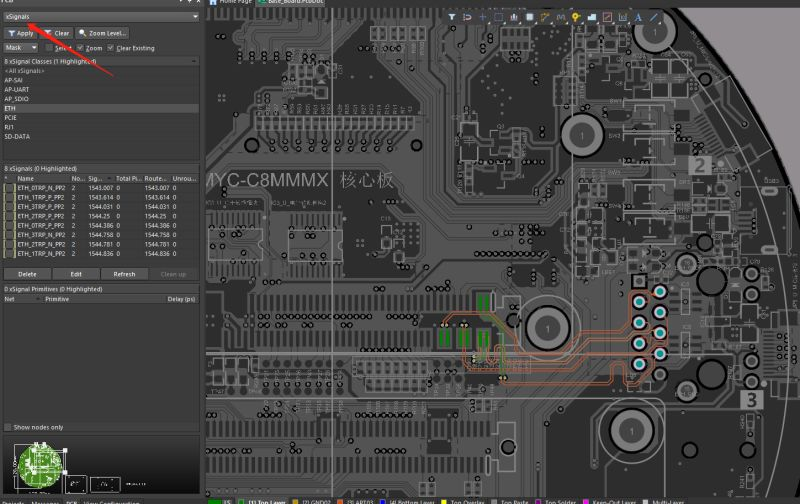

### PCB ActiveRoute 用好省时

- [ AD18中高速信号等长线使用_t wx11213030422的博客-CSDN博客 _ad18等长布线](https://blog.csdn.net/twx11213030422/article/details/88656361)。

关键步骤：

1. PCB 界面的右下角 Panels -> PCB ActiveRoute。
2. 按住 Alt 并按住鼠标左键从右向左拖动 选择 全部要 ActiveRouting 的线。
3. 选择在哪层布线，在 PCB ActiveRoute 窗口中的 Layers 区域选。如果线要走不同层，需要两个引脚端分别手动打好过孔，这里不会自动打过孔。
4. 绘制布线 区域规划，在 PCB ActiveRoute 窗口中 Action 区域点击 Route Guide 按钮，然后在 PCB 里面 画 走线区域，键盘上 上下箭头按键 调节区域宽度。
5. 执行 ActiveRoute 命令，在 PCB ActiveRoute 窗口中 Action 区域点击 ActiveRoute 按钮，执行 ActiveRoute 布线命令，软件左下角进度条 显示执行进度。
6. 可以自动进行等长线、和差分线的走线，用时学即可，网上教程很多，这里不重复。

### PCB 添加 LOGO 图案

下面给出 3 + 1 方法，第二种和第三种精度高，但第三种操作最方便且通用（你看，本文就是这么干货，口水话几乎没有）。

1. PCB Logo Creator 生成丝印图案的方法，具体教程 pdf 和所需软件在 `./PCB LOGO-画法集合-PCB工具-规则文件/创建-收集 PCB Logo 图形/PCB Logo Creator 生成丝印图案的方法.zip` 里面。
2. LOGO 字体 添加 PCB 图案的方法，具体教程和所需软件在 `./PCB LOGO-画法集合-PCB工具-规则文件/创建-收集 PCB Logo 图形/LOGO 字体 添加 PCB 图案的方法.zip` 。[AD20 添加字体logo 视频教程 - 北冥有鱼](https://www.bilibili.com/video/BV1kC4y1a7bM)。[PCB个性logo设计-面包板社区 (eet-china.com)](https://www.eet-china.com/mp/a103267.html)。
3. 新版 AD 直接在 PCB 里导入 图形即可，[AD21如何快速添加LOGO_ 哔哩哔哩_bilibili](https://www.bilibili.com/video/BV193411e7mW)。当前在哪个导入，就会是那个图层的图形，导入的时候选择多大的框就导入多大！推荐这种！
4. 网友收集：
   1. [各种花活标志 - 立创EDA开源硬件平台 (oshwhub.com)](https://oshwhub.com/PROREEDS/ge-zhong-hua-huo-biao-zhi)，在 立创 EDA 打开此工程 然后导出 AD 格式 的 PCB 即可，最新离线在 文件夹 `./PCB LOGO-画法集合-PCB工具-规则文件\创建-收集 PCB Logo 图形\各种花活标志/` 里。
   2. etc.

### AD 更多高级功能罗列

**杂技巧罗列**

- 缩减PCB文件体积 [Altium Designer PCB文件太大怎么办-百度经验 (baidu.com)](https://jingyan.baidu.com/article/5d6edee2e97ccb99eadeecf4.html)。

- [AD20、21、22实用技巧教程汇总【20220315】 (qq.com)](https://mp.weixin.qq.com/s/jwen3hhMvjK4Ek-NE5rKUw)。

  > 1. AD20如何添加字体LOGO
  > 2. AD20如何更改标题栏
  > 3. Port和Netlabel的区别
  > 4. AD20如何精确添加3D封装
  > 5. AD20如何显示3D捕捉点
  > 6. AD20如何自定义BOM模板
  > 7. 如何快速高质量手工PCB贴片
  > 8. 如何将嘉立创的原理图封装导入到AD20
  > 9. AD20如何高亮显示元器件
  > 10. 61个AD20常用快捷键介绍
  > 11. 总结AD20常用规则设置
  > 12. AD20铺铜相关操作技巧
  > 13. 如何计算走线线宽和过孔
  > 14. AD20如何复制PCB布局
  > 15. AD20如何在原理图中画虚线
  > 16. AD20如何制作异形焊盘
  > 17. AD20如何邮票孔拼板，V割拼板，添加工艺边、Mark点
  > 18. 【PCB拼板重新录制】使用AD20+华秋DFM进行快速PCB拼板
  > 19. 从大坝来看GND和铺铜到底该如何处理！
  > 20. 如何使用AD脚本输出交互式BOM
  > 21. AD21如何调整铺铜间距
  > 22. 如何解决AD中拖动元器件，电气走线连接不显示的问题
  > 23. 【汇总】都有哪些免费下载PCB封装的网站或者软件（一）
  > 24. 【汇总】都有哪些免费下载PCB封装的网站或者软件（二）
  > 25. 如何解决交互式BOM显示不全的BUG
  > 26. AD21如何修改3D板子的厚度
  > 27. AD21如何快速添加LOGO
  > 28. 如何解决交互式BOM显示不全的BUG【过程讲解】
  > 29. 芯片数据手册中的单词看不懂？英文差？试试这两个工具吧
  > 30. AD重新定义PCB边框最容易犯错的地方!
  > 31. 如何下载立创EDA的3D封装？

**Altium Designer PDN Analyze**

- [利用Altium Designer自带PDN Analyzer对电源平面进行PDN实例仿真分析，超经典！_YIRender的博客-CSDN博客](https://blog.csdn.net/weixin_40727233/article/details/118312561)。

**原理图对比和 BOM 对比工具**

- [【硬件设计必备】原理图逐页对比工具 (qq.com)](https://mp.weixin.qq.com/s/t6tEz9n8ZDKdZNsLzWRS7A)。

## 4 SCH-PCB 设计规范

本章 PCB 布局布线规范 主要包括 这几大部分：“**幼稚园级**”、“**本科生级**”（这两个是最基本的要领，分别讥称为 “幼稚园小朋友” 要会的 和 “本科生大朋友” 要会的，对号入座） 和 下面的 “**各类型电路设计规范或要点**”（这里分为多个子部分包括 运放、电源、地分割、EMC 等等）。

### 幼稚园级

1. SCH 的绘制，首要参考 上面 "最基本的 SCH 绘制过程" 一节！

1. 对于 PCB 绘制，首要参考 “最基本的 PCB 绘制过程” 小节中的 “多层板”、“布局”、“布线” 等部分！

2. 走线没有锐角和直角拐弯（包括信号线和电源线）；可以走 T 型线，但其直角转角要做缓和的圆角过渡处理。

3. 元件引脚下的焊盘上尽量不要放过孔。

4. 功率线、信号线尽可能短，功率线要足够粗，必要时应开窗加锡，并且大电流线、电源线之间的间隔应大于30mil，内电层不同区域之间的间隔宽度不小于 40mil。

5. 大电流、高功率的走线及其经过的器件应尽量按照能量流动的 "好走" 的路线布局和布线，尽量减少拐弯和跨层，让其一马平川的流动。
   
   线宽和电流能力关系表：（参考：过 2A 至少要 30~40mil（约 1mm） 线宽）（40mil 约为 1mm，20mil 约为 0.5mm）（1mil = 0.0254mm，1OZ = 0.035mm ≈ 1.4mil）
   
   
   
   
   
   
   
   过孔直径和电流能力关系表：（看工程实践一栏；孔径高于 0.5mm（约 20mil） 时，每增加 0.5mm ，电流能力增加 0.5A ）
   
   
   
   推荐过孔孔径：（单位 mm）
   
   - 信号线——0.3过孔 / 0.5外径（8/16mil 过孔），0.84A 电流；
   - 弱电电源线——0.5过孔 / 0.8外径，1A 电流；
   - 大电流(多个)——1过孔 / 1.5外径（30/40mil 过孔），1.5~4A 电流；
   - 大电流（多个）——1.5过孔 / 2外径，2~5A 电流。
   
   PCB走线与电流关系更多参考文档：`./额外文档/PCB走线与电流关系.pdf`。

6. 多采用星形拓扑结构，少采用菊花链布局，缩短电源的公共回路。

7. 关于电源：
   
   1. 电源变换元器件（如变压器、DC/DC 变换器、三端稳压管等）应该留有足够的散热空间，发热器件底部加一个或多个大孔径的过孔（接地或不接地）；干扰源（DC/DC 变换器、晶振、变压器等）底部不要布线，以免干扰。走线短、粗。
   2. 去耦电容（旁路电容）尽量靠近 IC 等器件的电源输入端，滤波电容可以放置在芯片的背面，靠近芯片的电源和地引脚；可选的，每一个去耦/滤波/旁路电容的接地端附近放一个过地孔，让电流顺畅泄放。
   3. 去耦电容的大小选择，应能够有效滤除电源轨中的典型纹波频率范围，对于开关电源一般几个大容量滤波电容（10uf ~ 100uf等），对于芯片输入电源的去耦、续流用的电容，一般一大（1uf ~ 10uf）和多个小（0.1uf ~ 1uf），或者从大到小多个容值（10nf ~ 10uf）电容的并联（在更宽的高频频带上对纹波噪声对地形成泄放通路）。电源芯片输入输出的大、小去耦/滤波电容，小的靠近芯片端。
   4. 开关节点（MOS 的 输出端）有严重的电场辐射，其铜箔应该最小化，并避开其他敏感电路。

9. 留意差分信号（如 USB 和 CAN 的信号线、运放输入，电流采集的差分电压信号和晶振的差分时钟信号等）要注意线上串阻抗匹配的电阻，或设置差分走线（需要计算和设置 线距、线宽等）。

9. 留意一些大功率的电源类等芯片下方有接地的 PAD（焊盘），不但要开窗裸铜，还要放一个或多个大的过地孔；其它高发热/高功率的器件同理；但要注意芯片地下的焊盘里的过孔孔径不要太大，减少其与芯片管脚短路的风险。

9. 高度较高的两个器件摆放间隔一定距离而不要紧密排列，紧密的话不管 SMT 贴片机 还是 人手工 都不好下手 焊接 和 调试。尽量避免 器件的重叠布局，比如电阻放到数码管地下，返修和测量很不方便，可以在背面。

10. 留下必要的测试点（开窗点），留螺丝孔。

11. 丝印字符方向尽量在两个方向以内，避免人看的时候不断转板子。过孔尽量不要放在丝印上。

12. 用丝印字符和图形 标识出从板子引出的 引脚 功能，接口说明，开关、拨码开关的功能表，LED 指示的功能等。

13. 丝印层画出 LOGO、板子名称、板子版本号 和 防静电（手勿触碰）与高压提醒等标识。

### 本科生级

可以树立一个意识，对于各种领域都可以适用（而不只是硬件、软件、机械 等）：

要做到 “既要又要”，考虑新的到达目标的 “模式”，可能会同时解决之前到达模式中相互“矛盾”的指标。

#### 器件基本布局相关

- ！参考 `最基本的 PCB 绘制过程` 一节的 `元器件布局` 设计要点。

- 减少一个电路回路所包围的面积，考虑从电源输出正极的电流出去开始一直到回到电源负极的整个路线，要这个路线形成的环所包围的面积尽量小。避免线路形成环、半环。

- 对于变压器、扬声器、电感等会产生磁场的元件，布局时应注意减少磁力线对于印制导线的切割，相邻元件磁场方向应相互垂直，减少彼此之间的耦合。

- 元件的放置要便于调试和维修。大元件边上不能放置小元件；需要调试的元件周围应有足够的空间。

- 一个芯片的外围阻容元件应尽量靠近芯片，并尽量接近其所要连接的芯片引脚。例如，电源脚去耦电容靠近电源引脚，电源芯片的反馈电阻要靠近其 FB 反馈输入引脚。

  一般遵守电源芯片输入端小电容靠近电源芯片引脚，电源芯片输出端大电容靠近电源芯片引脚。

- 晶振、继电器、开关电源等强辐射器件远离单板接口连接器至少 1000mil。

- 高压元件核线路之间要留有空隙，100V 以内至少留 1mm 间隔，线路和元件 与板边缘同理；若对于 100V 以上并且空间小不够开 大于 1mm 的间隙，那么可以做 1mm 宽的板挖空做隔离。

- 接口电路的滤波、防护、隔离器件、EMC和整流等应该靠近接口放置；如果接口处既有滤波又有防护电路，应该遵从先防护后滤波的顺序。I/O接口电路及功率驱动电路尽量靠近 PCB 板边缘，即大功率器件尽可能放在电路板边缘。

- 更多参考：下面 “**敏感信号线/关键信号线 和 高频信号线/高速信号线 设计的几个原则**” 小节。

#### 可制造性设计相关

积累一些微妙的点。

- 以下几个内容摘自《高速先生-第22期》，并自己重新整理语言。
- 少做大面积开窗在 SMT 焊点的地方，焊锡会向开窗外围和导线的地方流动导致 要 SMT 贴片器件的地方少锡 可能导致虚焊。如果一个过孔双面都有开窗，尤其是 BGA 焊接时，焊料很可能与通过焊盘相邻的过孔流失，造成焊盘上的焊球缺失从而虚焊，如果焊锡过分流动甚至造成与其它网络的短路，为了安全可以考虑阻焊塞孔。
- 即 贴片焊盘上（尽量）不能有通孔，以免焊膏流失造成元件虚焊。
- 两个临近的分属于不同网络的开窗之间要加阻焊桥，即覆盖绿油，防止焊锡过分流动形成短路；或在要 SMT 的地方，除了焊接的焊盘外，尽量不开窗。
- PCB 贴片机的轨道最小能调整的尺寸为 50mm * 50mm，建议设计的 PCB 板 或最小拼版尺寸为 55mm * 55mm。一般自己设计的 PCB 直接交给 PCB 厂家即可，他们会重新调整，他们会对小的板子，要么拼版，要么外扩。
- 原件覆盖的范围（向 PCB 板的投影）不要在 v-cut 或 邮票孔 上，否则批量生产中可能会伤元件。
- 关于邮票孔的放置：
  - 基本要求是，对于加工时强度要够，对于分板时要容易分板。
  - 邮票孔常用孔径为 0.4mm-1.0mm，个数为 3-6；邮票孔距离板边 15mm 以内；邮票孔的位置避开离板边太近的器件，离线路也至少保持 20mil 以上距离；常规间距为 2mm，板厚增加则间距增加。
  - 邮票孔的一排排列位置，通常在板边再稍微往里一点的位置，或者板边的中心。

- PCB 器件封装的中心通常就放在原件的中心位置，对于 SMT 拾取不易出错。
- 器件到板边应小于 4mm 或 5mm。
- 放置焊接过程中，器件的引脚和焊盘的挤压过程中出现焊珠，器件的 PCB 封装，每个焊盘，朝内的方向可以做成梯形，或内倒圆角。

#### 热设计的几个原则

- 器件的摆放要考虑通风散热的方便，要使得空气可以比较顺畅的从一边流向另一边并有效带走主要发热元件（电源芯片、控制器芯片、功率管、测流电阻等）的发热热量。
- 发热元件尽可能分散布置、均匀的放置，不要使热量堆积在一个小区域内。
- 热敏感元件（晶振、精密电阻、主控等）要远离发热元件并放置在 “冷” 区域（或发热元件的板面的另一侧），并置于散热气流入口处。
- 发热源（电源、测流电阻等）要给予散热空间（在 PCB 板上挖空一定区域增加透风，或预留散热器件的安装空间）并摆放在出风口附近等。
- 发热器件如电源芯片、功率管、测流电阻等，要在其下面加一个或几个大孔径的过孔（接地或不解地）增减散热。发热元件应有足够的空间以利于通风散热；热敏元件应远离发热元件。

#### 多层板相关

- 时钟频率到 5MHz 或脉冲上升时间小于 5 ns（五五准则），则 PCB 板须采用多层板。

- 考虑板子尺寸、器件和走线密集程度、成本、抗扰和稳定性等，进行多层板划分，可以参考推荐多层板板层设置（很多 PCB 教程 和 书籍均有提到）。多层板的推荐板层分布图：
  
  

这里注意，并不必严格按照上图进行划分多层板的叠层，具体问题具体分析。

我的规范建议：

- 多层板的 第二层 和 倒数第二层（从上往下数）一般为整个地平面层；地平面层要保证大片的完整性，避免异形。

- 典型四层板板层分布为（由上到下）：
  
  - 信号层 - 内电层（GND层） - 电源层 - 信号层（把信号层露在外面是为了好实物修改，也可不这样）；
  - 信号层 - 内电层（GND+VCC层）- 信号层 - 信号层。
  - 少量的层数时候，比如四层板，或者板子尺寸小并且走线密集，少一个电源层，就多一个走线层。但是在走线不太密集时候，两层用于走线够，那么两个内层就可以当作两个内电层分别连接地网络和电源网络（并分割），减小电源走线的阻抗。

- 每一个信号层视情况，与内电层的地分割同样的位置，加地网络覆铜，并打地网络的缝合孔（贯穿多层板的连接地网络的过孔）。

- 多层板中有内电层作为整个地平面时，尽量不要破坏 发出干扰的元件和芯片下方的 地平面的完整性，尽量不要有过孔等破坏地平面完整性。

- 多层板的关键信号层最好位于两个地平面之间，即其电路模块的上下层所对应的区域都用地平面覆盖。
  
  

- 电源平面应相对于其相邻地平面内缩 5H-20H（H 为电源和地平面的距离，若内缩 20H 则可以将 70% 的电场限制在接地边沿内，内缩 1000H 则可以将 98% 的电场限制在内）。内缩1~2mm（40mil 以上)。
  
  

- 相邻布线层的走线应尽量相互垂直；实在无法实现垂直而必出现平行的应互相远离，或时钟、总线、射频线等关键信号走线和其他同层平行走线应满足 3W 原则，3W 原则：线中心间距不少于 3 倍线宽（70% 的电场不互相干扰），还有更好的 10W 原则（98% 的电场不互相干扰）。小信号走线尽量远离大电流走线，忌平行，相距要 大于等于 2.0mm。

- 内电层 / 中间层 的 地分割，要相距稍微大一些，至少 50mil。

- 更多参考 [详解多层PCB层叠结构 - 知乎 (zhihu.com)](https://zhuanlan.zhihu.com/p/159282165)。

#### 电源滤波电容的布线

- 关于电容的选择可以看 “电阻，电容，电感” 一节。

- 更多电源内容见 `电源规范设计` 一节。

- 每个集成芯片（数字芯片、MCU等等，10MHz 以下的）至少要布置一个 1uf / 0.1uf 的陶瓷电容（MLCC）；对抗噪声能力弱，关断时电源变化大的器件要加高频去耦电容（高频的如数字电路、MCU，10MHz以上的等，可放置 0.01uf）；空间充足还可以在前面加高频去耦电容的情况下再给每个器件芯片加大电容/低频滤波/电源缓冲 的电容比如 10uf / 22uf 等（当然都尽量选择 MLCC 或 固态电容）。

- 去耦/滤波电容要尽量靠近芯片电源脚，每个芯片电源脚都配置上合理的电容最好；电容之间不要共用过孔；去耦电容引线不能太长。

- 电源输入端 和 电源输出端 放置大小不同电容的顺序，都是先大后小。

- 单个电容情况的布线：纹波电流要尽量全部经过电容的引脚。

  

- 多个电容情况的布线：纹波电流经过第一个电容产生的热量也比第二个、第三个多，很容易损坏，走线时，尽量让纹波电流均分给每个电容，走线如下图 A、B，也可用图 B 方式走线。

  

- 每个滤波、去耦电容的接地端旁边加过地孔（数量视电容容量而定，电源滤波的大容量电容则加一个以上），增加回流通路，减小回流阻抗。

- 每个环节多用 MLCC 电容，条件允许的话，尤其各种电源输出口，10uf、22uf、47uf 的上就行了（尽量电源输出口用大的就行，比如两个并排的 47uf），因为每个环节都会带来新的噪声，所以每个环节的输入输出尽量多 去耦/旁路电容。

  有的 MLCC 电容器件可能容值不对，属于小概率出厂就是坏的，如果对噪声存疑，先测测输入输出的电容容量。

  有时候感觉输出纹波仍然比较大，排除了容值不对等滤波环节，以及环路干扰问题，那么加大电容试试。

#### 敏感信号线/关键信号线 和 高频信号线/高速信号线 设计的几个原则

- 同时也包括 `最基本的 PCB 绘制过程` 一节的 “布线” 设计要点。
- 各种 高速/差分总线 的阻抗匹配 和 布线 这一块详见 `PCB 差分走线设计` 和 `SI/PI/HS/RF X` 一节。
- 运放相关见 `运放设计注意` 一节。

0 基本原则：

- 参考：
  - [【干货】PCB设计中的20个规则！ - 知乎 (zhihu.com)](https://zhuanlan.zhihu.com/p/438114764)。
  - [PCB布线知识大全，建议收藏！ - 知乎 (zhihu.com)](https://zhuanlan.zhihu.com/p/662348874)。
  - [20 个 PCB 的设计规则是什么？ - 知乎 (zhihu.com)](https://www.zhihu.com/question/484439528/answer/2663232689)。
  - [混合信号PCB布局设计的基本准则_模拟技术-面包板社区 (eet-china.com)](https://mbb.eet-china.com/forum/topic/120565_1_1.html)，[混合信号PCB布局设计的基本准则-电子工程专辑 (eet-china.com)](https://www.eet-china.com/mp/a164978.html)。

这里面一些精华总结下面：

布局相关：

- 下面的 `各种走线的基本规则`。

- 五五规则，时钟频率到 5MHz 或 脉冲上升时间小于 5ns，则 PCB 板须采用多层板。

  完整覆铜平面。对于多层板，中间某一层或多层不进行任何走线再进行完整覆铜铺地；若考虑成本等要做成双层板，最好将一面做为一个完整的地平面层。

- 数模分离。PCB 板上预划分数字、模拟。不同电源层在空间上要避免重叠。

- 模块划分，单点接地。不同频率的器件，一般高速放在接口处，关于地平面，考虑将两者的地分割，然后在接口处单点连接。

  对混合电路，有的将数字和模拟分别放在PCB的两面，中间用地层隔离。数字部分接近接口。

  即： 接口 - 高速 / 数字部分 - 低速 / 模拟部分，之间接口处单点连接，接地可用 磁珠进行高频扼流，或 0R 电阻。各部分之间的任何在空间上都不能交叉，包括走线、覆铜等等。

  >  建议将敏感的模拟元件（如放大器和基准电压源、ADC 等）放置在模拟平面内。类似地，高噪声的数字元件（如逻辑控制和时序模块）必须放在另一侧/数字平面上。    
  >
  > 模拟部分和数字部分可以分别使用专用电源模块，以避免高噪声数字干扰。
  >
  > 为使实施更轻松，可以利用器件 GND 引脚附近的过孔将去耦电容连接到接地平面，而不是创建走线 将滤波电容的 GND 端引到对应位置。

- 电源先经过电容滤波后再给器件使用，去耦电容遵从靠近原则。滤波电容如 MLCC 的耐压 至少为 标称工作电压的 2 倍。

- 电容的大小取决于您要去耦的组件的电流消耗。根据经验，22 uF 将处理 22 mA 的瞬态电流，并具有最小的电压降。在电源和接地路径上使用短而宽的走线。有时使用多个电容器，这可以实现为一个较大的电源覆铜区域。

- 这里有个说法：

  > 不要为每个电源引脚使用三个不同值的电容器，即 10 uF、1 uF 和 0.1 uf。这解决不了任何问题。而且，如果做得不仔细，有时会增加额外的问题。如果有空间容纳三个电容器，请将它们全部布线为低环路电感，并使它们全部为 22 uF。

  所以，可以做成比如 两个 22uf + 一个 0.1uf 这种的。

- 20H 覆铜平面内缩，最小要内缩 1mm。孤立铜区接地或删除。

- 大的覆铜平面上尽量不要有走线、过孔、焊盘等，保持完整性，有也要尽量将这些均匀分散开，不要堆积形成对覆铜的分割。

- 对于直插器件，其 PCB 封装中，焊盘直径可以做孔径的两倍。

  

各种走线的基本规则：

- 走线避免出现直角和锐角。

- 3W 相邻线间距，或相邻线中间加入接地线隔离。

- 减少线并行的长度减小串扰。

- 关键信号线四周铺满地线隔离。

- 相邻层的走线方向尽量成正交结构，尽量避免平行。

- 防止信号线在不同层间形成自环。

- 多余的 “断头路”走 线干掉避免形成 “天线效应”。

- 短线规则，走线尽量短，特别是重要的信号线如时钟线，高速数字信号走线，敏感模拟信号走线，线短则传输中所受干扰小。做阻抗匹配、等长处理则是另一些规则。

- 电源、摸拟小信号、高速信号、时钟信号和同步信号等关键信号优先。

- 地线回路成环保持最小，电流信号从什么路径去，就从什么路径回。

  > 对于低频信号，返回电流将沿着电阻最小的路径流动，通常是器件接地基准点之间的直线。但对于较高频率信号，返回电流的一部分会尝试沿着信号路径返回。这是因为沿此路径的阻抗较低，流出和返回的电流之间形成的环路最小。

- 间距比较密的 SMT 焊盘引线应从焊盘向外防线扇出后相连接，不允许在焊盘中间直接引出走线。

- 

- 当 PCB 布线的延迟时间大于信号上升时间（或下降时间）的 1/4 时，就应当看作高速线，就应当考虑 阻抗匹配 和 拓扑 等。对高频信号，布线长度不得与其波长成整数倍关系，以免产生谐振现象。

- 同一网络的布线宽度应保持一致，线宽的变化会造成线路特性阻抗的不均匀，当传输的速度较高时会产生反射，在设计中应该尽量避免这种情况。

- 

1 敏感信号线/关键信号线：

- 必须保证良好的信号阻抗匹配。单端的信号有模拟和数字的收发端的阻抗匹配，如 AD 采集、数字电路、RF 天线 等，双端的如 差分模拟信号 和 差分数字信号 等 的 发送、传输、接受 三端 的 阻抗匹配。差分线对的阻抗匹配 可以依靠 PCB 上走线时的 线宽和线距的 测算和设置。
- 高速信号板、小信号板可以上多层板，有资料显示四层板要比双面板的噪声低 20dB。合理的元器件布局和布线也很重要。
- 关键信号线/高速信号线，走线的折弯越少越好，可用 45° 折现或曲线走弯，不能出现 T 形线。尽量避免信号线形成环路、尽量使环路面积小。
- 敏感信号线/关键信号线，其周围应放置多个接地过孔（宽度大于 50mil 地线或间距小于 300mil 的地孔）做包围处理，提供电磁笼的屏蔽作用，或叫包地处理。信号线（特别是关键信号线）换层时，应在其换层过孔附近设计地过孔。但同时也要注意高频信号线周围的接地覆铜和接地过孔带来的寄生电容可能影响信号波形/完整性，可以距离高频信号线远一些，至少 3-4w 原则吧。
- 敏感电路或器件（如复位、看门狗、高速/关键 信号线路等）远离单板各边缘特别是单板接口侧边缘至少 1000mil，或关键信号线距参考平面边沿的距离大于 3H（H 为线距离参考平面的高度）。信号线不能从变压器、散热片、MOS 管脚等中穿过。关键信号线 远离 高频线路/器件。高速/关键 信号线应该 远离 其它任何 线路或器件 至少 10mil 以上。差分信号线组相互之间至少远离 3倍 差分线间距 的距离。
- 高频元件一侧的 PCB 面上不要走线，应该大面积覆铜并加围圈的过地孔，在 PCB 的另一面可以布线。
- 除了地线，能用细线的不要用粗线（3W 原则的 W 会比较小，同时 串扰、寄生电容 等都会减小）。

2 高频信号线/高速信号线：

- 一涉及到高速、射频，就要考虑寄生电容、寄生电感等电路板上的分布参数对于信号形状的影响！（比如 I2C 的上拉电阻多大，在数字信号频率较高时候，上拉电阻对寄生电容充电 就 让线路电压上升有一定时间，电阻越大上升越慢 就 改变了波形，这只是抛砖引玉，高速接口，仔细设计，板级电磁仿真，查看眼图，软件对其最大带宽进行压力测试等等 一系列操作）。
- 高速通信信号线（比如 USB、PCIe、LVDS 等等）的首要：等时 和 阻抗匹配。尽量减少阻抗不匹配；等长不是目的，等时而保证时序才是，线在过孔、内层、外层的速度都不一样。同组线尽量走同层，在同层绕；尽量保证 3-4w 原则，尽量减少串扰；尽量少过孔，同组线每根上过孔数量尽量相同。
- 高速信号线可以细一点，减少与地平面产生寄生电容效应 或 与其他线之间的串扰。并排走线之间减少串扰可以通过 增加信号线间距、减小平行长度、不同线组之间加入地线做空间上的分割。对于相邻层的走线同理应减少平行长度，尽量相互垂直走线。这些规则对于普通数据线可能根据实际情况宽松一些，但是高速时钟信号尤甚需要尽量按照这些规则。
- 过孔可能会引发信号传输线的阻抗突变，因此需要尽量减少信号线上过孔使用的数量，尤其是对于关键信号线，一个过孔大约带来 0.5pF/10pF 的电容效应。高频电路期间管脚间引线的层间交替越少越好。
- 无论是时钟线、信号线还是电源线，在 PCB上 的走线都应该尽量短，器件紧密排布以减少 PCB 上走线长度；而且时钟线和信号线等在 PCB 上的走线应尽量用地过孔和地平面在空间上包裹；并且在 PCB 板的四周边缘打一圈连地平面的过孔。

3 覆铜设计：

- 参考 [PCB覆铜很“上头”？一文帮你搞定实操要点和规范！_shape_过孔_间距 (sohu.com)](https://www.sohu.com/a/636157399_100188064)。
- 基本的：各模块的地分开，互不重叠，各模块的地单点接地，不同地的单点接地出用 0R 电阻 或 磁珠等 连接。
- 覆铜不要出现尖峰，尽量避免直角边缘。
- 覆铜要完整覆盖滤波电容的封装。粗的走线直接用覆铜来做。
- 覆铜要良好接地。

- 防干扰、防冲击：

  - 防电压瞬变 / 减小电压变化速率（du/dt）可 并 RC 电路，防电流瞬变 / 减小 di/dt 可 串 电感。
  - 关键数字信号线 如 MCU 的 IRQ 中断引脚等重要 IO 注意静电保护等，可加防浪涌的 TVS 瞬态抑制管保护，或防正负过压 / 冲击的 ESD 管保护。
  - 高阻抗输入端易受干扰，所以器件的高阻抗输入端的 R、C 元件要靠近输入端放置，高输入阻抗的器件有如 BJT 的基极、MOS 的栅极、二极管、CMOS 芯片（运放、数字IC等）引脚等。
  - 开关器件如 MOS，其栅极和源极之间要加 TVS 管（或 常用 12V 左右的稳压管） 防过压冲击（始终让 Vgs ≤ 18 V）。MOS 的栅极串电阻的作用：减小/抑制 栅极的振铃现象；防止 MOS 导通速度过快（减慢导通 也应保持在 合理/够用 的范围内），即过高的 du/dt 或 di/dt 不好，高压情况下容易击穿周围的器件或者损坏 MOS（后者为感性上理解）；但是 栅极电阻阻值过大会导致 MOS 管导通速度过慢，开关损耗会巨大。栅极电阻 尽量 紧靠栅极，并且这个是信号线，布线避免与其他线耦合。
  - 电源模块周围加一周过孔包地，电感接地端也要多加，晶振周围和时钟线用过孔包围，每个模块用过地孔围一圈（即 法拉第电磁屏蔽笼）。对于金属外壳接地元件(例如晶振)，应在其投影区的顶层上铺接地铜皮，并在其周围密布上一圈接地孔，提供电磁屏蔽。
  - PCB 走线和覆铜完毕后，防止孤立铜箔，覆铜边角修为 45° 或圆角（减少天线效应）；并且 加“缝合”过地孔（增加回流面积，降低阻抗）。

- 防护电路的检查项详看 "1 最基本的电路检查项和器件选型" 章节的 "保护机制"。

- 更多某些具体地方的规范看下面的 “各类型电路设计规范或要点” 一节。

- **特别引用**：[plla1981/PCB-Layout: 多层板的设计 (github.com)](https://github.com/plla1981/PCB-Layout)，这篇文章概述了叠层排布原则、布局原则、布线原则、阻抗设计、信号完整性、电源完整性、EMC设计、热设计、DFM设计 等内容，感谢分析。特别对电源的画法有很多实例说明。原文已经离线在本地 `额外文档\plla1981-PCB-Layout`。

- 小型化是产品开发的必经之路，挑战极限才有竞争力。

### SCH & PCB 检查表\评审

#### PCB Check List（PCB 检查表）

- 比较丰富的 PCB 检查项表格：`\PCB LOGO-画法集合-PCB工具-规则文件\SCH&PCB 设计、计算和检查的工具和软件\PCB检查步骤.xls`。

- 丰富的 SCH&PCB 检查表格：`\PCB LOGO-画法集合-PCB工具-规则文件\SCH&PCB 设计、计算和检查的工具和软件\电路计算Excel表格合集+检查表CheckList\电子工程师一版成功必备检查项（SCH&PCB CHECK LIST）V0.9-避坑指南.xlsx`（引自 公众号 路飞的电子设计宝藏）。

- [一整套PCB设计流程和要点，老板再也不怕我出错 - 知乎 (zhihu.com)](https://zhuanlan.zhihu.com/p/356234723)。

- 设计方面的检查项，[做硬件，想当然，犯大错 (qq.com)](https://mp.weixin.qq.com/s/7KywI5qvw6pCA4lZsiDGrg)，以下：

  > 1、I2C电路都加外部上拉，想当然，某些芯片I2C管脚内部自带上拉。
  >
  > 2、量产过的电路不会有问题，想当然，量可能还不够，问题还未暴露。
  >
  > 3、带横杠标识一端为负极，想当然，钽电容不是。
  >
  > 4、去耦电容是越多越好，想当然，寄生参数也“害人”。
  >
  > 5、电阻阻值随便用，想当然，功耗难解决。
  >
  > 6、SOC不用的GPIO全部悬空，想当然，一堆问题等着你。
  >
  > 7、电容都用小封装，想当然，高容值小封装价值贵死你。
  >
  > 8、选型不考虑价格周期，想当然，买不到货急死你。
  >
  > 9、设计电路不加兼容，想当然，缺货时时有，要防患于未然。
  >
  > 10、省空间，PCB不留测试点，想当然，调试费力不讨好。
  >
  > 11、元器件选型不留余量，想当然，特殊情况“扛不住”。
  >
  > 12、PCB走线越粗越好，想当然，阻抗匹配得考虑。
  >
  > 13、功耗全靠软件调，想当然，硬件设计很关键。
  >
  > 14、PCB走线包地越多越好，想当然，看情况，否则适得其反。
  >
  > 15、图纸不备份，想当然，电脑死机功亏一篑。

- 设计后期的检查项表格如下图，[图源](https://mp.weixin.qq.com/s/fMdGVFTkOGlQgdq-yfnngA)。

- 自己补充：
  - PCB 至少有一个地平面。
  - 电源线和信号线的路径是否按照原理图设计的流动方向排布；对于信号线，是否正确滤波等。
  - 慢慢补充。

#### PCB Review（PCB 评审）

下文引自 [4 步学会PCB评审 (qq.com)](https://mp.weixin.qq.com/s/jqgoclVp1UJkQjYm6ijv3g)。

> 步骤一：资料收集和初步验证
>
> 1. 在开始审阅之前，请确保所有数据手册，参考设计和叠层信息均可用。
> 2. 验证原理图设计并签核。
> 3. Layout DRC，并消除所有错误
> 4. 验证每个元件的封装
> 5. 原理图每个模块分别和PCB对应起来，这样有利于审阅。
> 6. 确保板尺寸正确，并且安装孔在正确的位置且具有一定的允许公差。
> 7. 检查是否有板边的信号
>
> 步骤二：布局
>
> 1. 确保去耦电容尽可能靠近引脚放置。
> 2. RFI和EMC滤波器应尽可能靠近输入输出。
> 3. 提供了足够的空间用于操作和散热器安装。
> 4. 确保正确遵循各个IC的布局指南。
> 5. 考虑回流路径，分析模拟和数字电路是否干扰。 这将引起信号完整性问题。
> 6. 所有有线连接器都放置在电路板的一侧，以保持接地电位尽可能接近。否则可能有天线效应。
> 7. 放置的方式应尽量减小走线长度和交叉。
>
> 步骤三：布线
>
> 平面
>
> 1. 确保数字和模拟电路的公共端仅在一个位置连接。
> 2. 每个信号在其下方都有其参考平面。
> 3. 电源线的宽度应与其承载的电流成比例。
> 4. 确保电源平面中的插槽尽可能少，接地平面应连续。
> 5. 任何平面都不应在中间形成空的环路。
> 6. 确保磁性元件和滤波器下方平面挖空，否则会污染平面。
>
> 信号
>
> 1. 除非特别强调，否则不要有多余的Trace。
> 2. 尽量保证SMD器件下无走线
> 3. 敏感模拟信号需要提供保护环
> 4. 所有信号到板边距离至少20mils。
> 5. 高速信号的参考平面中间没有截断
> 6. 根据制造商提供的叠层信息，确定信号阻抗匹配
>
> 步骤四：丝印
>
> 1. 确保IC下或焊盘上没丝印。
> 2. 遵循同向。
> 3. LOGO和版本号等。

### PCB 计算小工具 / 辅助设计小软件

**电路&PCB计算本地小工具**

详见`PCB LOGO-画法集合-PCB工具-规则文件\SCH&PCB 设计、计算和检查的工具和软件\`里，包括：

- 电路计算 Excel 表格合集！非常丰富。
- PCB走线、过孔的电流计算。
- DFM（可制造性设计）PCB检查工具。
- SaturnPCBToolkit 工具集。
- 反激开关电源参数计算。
- 变压器设计软件 V1.2（用于自绕变压器吧）。
- 一键删除 AD的History 文件和 Previews 文件和 ProjectLogs 文件的批处理 .bat（将该 .bat 文件 放到 AD PCB 工程文件夹内，双击运行一次可以清理除了工程以外的临时文件）。
- 等。

**零散电路计算工具网页**

- [在线电子单位换算器 - Digi-Key得捷电子 (digikey.cn)](https://www.digikey.cn/zh/resources/online-conversion-calculators).
- [在线计算器_电子工程师在线工具 - 电子工程网 (eechina.com)](https://www.eechina.com/tools/)。
- [LC电路频率在线计算器 (520101.com)](https://tool.520101.com/dianlu/lcdianlu/)。
- 合集，包括传函计算、闭环系统计算、运放电路、滤波器、滞回比较器、解方程等：[Engineering Design Utilities (okawa-denshi.jp)](http://sim.okawa-denshi.jp/en/)，其内的滤波器仿真：[Filter Design and Analysis (okawa-denshi.jp)](http://sim.okawa-denshi.jp/en/Fkeisan.htm)。

**更多见下面 “4.5 在线/离线 电路仿真计算工具” 章节！**

### 各类型电路设计规范或要点

*p.s 电源、运放、EMC 和 高速电路等细分领域，看看那些 芯片大厂 对这些方面出的 文档，其晦暗艰深，每一块儿都能够研究一辈子、吃一辈子饭。*

*p.s 我看过很多在对电路原理没有学习和认知而只管连通、随意走线的别人的板子，要不是我脾气好，否则止不住骂骂咧咧全都当垃圾对待。我也是从那时候过来的，只是如果用心对待，那种状态不会持续超过2年，如果再长，那就过分了属于现学现卖和混子。*

#### 运放设计注意 / 低噪声精密电路

##### 运放应用注意

- 运放周边电阻的阻值选择：
  - [运放放大电路电阻取值问题（二）电阻大小与底噪#运放#放大器#噪声#电阻#电子电路实验室_哔哩哔哩_bilibili](https://www.bilibili.com/video/BV1nH4y1c7Xy/)。
  - [运放电路电阻选择注意问题（三）电阻大小与偏流影响#运放#电阻#偏置电流#误差分析 #电子电路实验室_哔哩哔哩_bilibili](https://www.bilibili.com/video/BV1Kb42177o5/)。
  - 电阻的精度，计算最差的情况，是否还能满足电路需求，让电路正确工作。在精密电路中，电阻的精度很重要，若电路容忍 10mV 的误差，分压电阻的精度如果不够则会直接导致分压的精度的误差非常大，严重注意这一点。
  
- 运放定性和定量分析，熟练模电书！另外可以看 [【手撕运放】运放的“第一原理”式定量分析法 - 知乎 (zhihu.com)](https://zhuanlan.zhihu.com/p/438051082) / [【直达本质讲运放】运放的“第一原理”式定量分析法_Real-Staok的博客-CSDN博客](https://blog.csdn.net/Staokgo/article/details/122010699)。

- 运放选型。熟知运放基本参数，详见 “1 最基本的设计理念和器件选型” 一节的 “运放” 小节（去看一下，里面说的参数选择比较全面，光靠记忆不太中）。

  > 下面引自 ADI 2021.12 线下专题讲座 某个 PPT。
  > 
  > 
  > 
  > 
  > 
  > 

- 注意滤波器仿真，和滤波器的品质因数 Q。仿真工具详见 “4.3 大厂在线/离线电路仿真工具” 一节。

- 防止输出信号失真：运放/放大电路 的 摆率/带宽 足够，不合适的放大倍数导致输出超过电源电压。

- 电路设计注意点：原理图 和 PCB 设计

  - 首先是线路尽量短，运放周围阻容等器件尽量靠近运放引脚。反馈路线尽量短防止形成天线效应容易发射电磁波和容易受到外部电磁环境干扰，输入端口的阻容尽量靠近运放引脚，因为其前一级器件作为能量提供端，其发射的信号经过阻容器件的阻抗作用会变弱，因此变弱后的信号应该经过尽量短的路线进入本运放。

  - [实例分析运放7大经典电路 - 知乎 (zhihu.com)](https://zhuanlan.zhihu.com/p/538658009)。

  - 设计跟随时候要考虑：[运放接成同相跟随器时，为何有些电路要在负反馈上增加一个电阻？ - 知乎 (zhihu.com)](https://www.zhihu.com/question/402088417/answer/1290218381)。

    > 一般增益带宽积越大的运放，对这个电阻的取值也越敏感。
    >
    > 不过有一些放大器，你加上这颗电阻，取值也比较合适的话，反而能改善放大器的稳定性，代价是系统带宽略微降低。
    >
    > 精密些的电路、用心设计的电路，最好放到仿真软件里面 做一做频谱图看看，仿真时候也添加一些寄生电容、电感，真实一些。

  - 运放正负输入端的平衡电阻注意：[ 同相放大器有平衡电阻吗？ - 知乎 (zhihu.com)](https://www.zhihu.com/question/381302440/answer/1095147831)。

    > 不管同向放大器还是反向放大器，都需要加入平衡电阻，使从运放两输入端看出去的等效电阻相等，这样可以确保运放的输入偏置电流不会产生误差电压。
    >
    > 但是有的运放 看参数 不加也影响不大。
    >
    > 而且：电阻是有电阻热噪声的，这个噪声是电阻的固有属性，只与阻值和温度有关。一个10kΩ的电阻在室温情况下，噪声密度大约12.8nV/√Hz，AD797的输入噪声密度1.2nV/√Hz，OPA209的输入噪声密度2.2nV/√Hz，也就是一个平衡电阻带来的噪声，已经远远高过所选择的运放的输入噪声了。这个噪声在你的电路里有多大影响？噪声对你的电路影响大还是直流误差对你的电路影响大？
    >
    > 所以这个平衡电阻到底要不要，取决于电路的实际情况。

  - [仪表放大器的PCB布局-运放_ltqshs的博客-CSDN博客](https://blog.csdn.net/qq_21794157/article/details/123277502)。

  - [想要提高差分放大器的共模抑制比，电阻的选择是关键！ (qq.com)](https://mp.weixin.qq.com/s/bkVpOepy-XiF1h9sEaYyUg)。

    > 差分放大器电路中的电阻应仔细选择，其比值应相同 (R2/R1 = R4/R3)。这些比值有任何偏差都将导致不良的共模误差。

  - 运放应用要点：引自 [实例分析运放7大经典电路 (qq.com)](https://mp.weixin.qq.com/s/pYduzkeD61qXEIOaoBsYow)。

    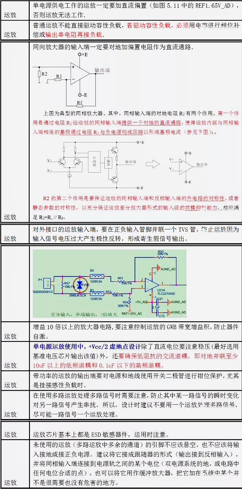

  - 运放应用要点：[运放使用的注意事项 (qq.com)](https://mp.weixin.qq.com/s/PascwarLFo7kndlbt8vw0w)。

    > - 运放的输出和输入口上不要直接并电容，要先通过电阻再经过电容。
    > - 反馈回路的元器件必须要靠近运放，而且 PCB 走线要尽量短，避开干扰源。
    > - 运放的电源滤波不容忽视，电源的好坏直接影响输出。特别是对于高速运放，电源纹波对运放输出干扰很大，弄不好就会变成自激振荡。所以最好的运放滤波是在运放的电源脚旁边加一个0.1uF的去耦电容和一个几十uF的钽电容，或者再串接一个小电感或者磁珠，效果会更好。
    > 
    > 下面引自 ADI 2021.12 线下专题讲座 某个 PPT。
    > 
    > 

  - 运放应用要点：[运放实际应用中常见的8大问题总结! (qq.com)](https://mp.weixin.qq.com/s?__biz=MjM5ODE0NTI2OQ==&mid=2650570692&idx=2&sn=92f1653735a218b92591aa81aad2d011&chksm=bec7e25e89b06b4825a2e98549968992f7143fbe3a18538d371ec4526a7c821b527c151de284&mpshare=1&scene=23&srcid=0731LVeAOBhA6WNtRQsEUsUq#rd)。
  
  - 测量中，测量仪器有输入内阻（1M到10M，普通万用表和普通示波器表笔x1的在M级别，普通万用表表笔x10的在10M级别），注意会对测量电路有影响。比如高阻值的分压电阻或电位器的中间输出的分压，直接表笔测量会偏小（偏小几mV到十几mV嘞），测量输出电阻较小的电路（如运放输出）则比较准确。

##### 低噪声设计相关

列举能带来噪声的环节：

- 运放本底噪声，电阻热噪声。
- 低噪声电路设计，如：输入信号双绞线多层铝箔包裹的线，运放输入等电动势保护环，线之间3W原则，减少并行长度减小串扰，数模分离，单点接地等等，具体见 前面 `本科生级` 里面的 `敏感信号线/关键信号线 和 高频信号线/高速信号线 设计的几个原则`。
- 温度影响。
- PCB 线路和板层，布局布线，经验、规范。
- PCB 厂家工艺。

举例要点：

- 计算噪声还要考虑电源噪声和运放的电源纹波抑制比。

- 电源整体远离信号调理电路；电源等为发热源，远离信号调理电路。

  降低电源输出纹波，尽量到 10mv 甚至 5mv；小电容换 MLCC / 独石电容，大的电源滤波电容换固态电容（但也不是绝对，过低的 ESR 可能引起电路不稳定）。

  一般遵守电源芯片输入端小电容靠近电源芯片引脚，电源芯片输出端大电容靠近电源芯片引脚。

- 信号调理电路 / 运放电路，低噪声。

  运放噪声相关参数有：

  - 输入电压噪声（一般为 nV/√Hz 为单位）、输入电流噪声。
  - 运放周围的电阻的热噪声（不得大于运放本身噪声）。
  - 噪声密度频率曲线。
  - PSRR 等等。

  跟运放精密度相关的：

  - 输入失调电压 Vos（视情况，小于 100uV 为佳，这个最大失调电压要小于对采集准确度的影响）。
  - 输入失调电流 Ios。
  - 输入偏置电流 Ibias（此为运放输入端吃掉的电流，要远小于输入信号 / 被测电流信号 的电流）。
  - 前面这些的温漂、时漂。
  - 运放输入电阻（要远大于反馈电阻）。
  - CMRR 等等。

  运放电路噪声计算 [信号链类——放大器噪声计算 - 知乎 (zhihu.com)](https://zhuanlan.zhihu.com/p/464206112)。

  [噪声（Noise）-1 - 知乎 (zhihu.com)](https://zhuanlan.zhihu.com/p/169428604)。[噪声（Noise）-2 - 知乎 (zhihu.com)](https://zhuanlan.zhihu.com/p/182470391)。

- 良好 PCB 布局，减小 噪声 耦合进入 敏感电路。

- 保证 运放的地 和 ADC 的模拟地 处在 同电位，保证好接地。

- 如果 TIA 电路，保证好 各个环节 漏电流 和 噪声引入，如 各个器件的 漏电流、噪声计算，PCB 电路板的漏电流 等等。若使用 开关器件，着重考虑 漏电流 和 关闭电阻，比如一些 电子开关有 nA 级别的漏电流 如果在测量范围内就不行，可以使用 关闭电阻 比较高的 干簧管继电器等（比如 绝缘关闭电阻 > 10^11Ω，这是 最大 10pA 级别的漏电流）

  保持 PCB 板面清洁，防止 杂物 形成 漏电流 和 原电池 对信号造成干扰。

  **TIA 电路专题 文档 `TIA弱电流测量措施和经验汇总`。**

- 差分对消来消除运放输出误差，ADC对运放输出的采集，首先将运放输入端短接（单端输入则输入端直接接地（对于 I/V TIA 电路，应该是正负输入端短接），差分输出则两个输入端短接），测量此时运放输出电压，再输入被测信号，测量此时运放输出电压，二者相减，得到消除误差后的实际量。

  开关器件可以用 高绝缘阻抗 ( > 10^14Ω)、低漏电流的干簧管继电器。

  对于气体传感器电路，因为校准过程中有零点（0ppm，如填充纯氮气）的测量，所以相当于从硬件整体消除掉零点误差。像这种测量某个量的传感器硬件系统，只要保证好其内部中间各种过程的线性度，然后测量输入端和结果输出端这一头一尾做好零点误差消除也就行，系统内部的误差在这种时候意义较小，应关注主要矛盾，对于快速迭代成型，即把硬件系统当成黑盒将一头一尾保证好，中间过程内部可不细致分析。

- 运放输入端保护环：

  在 PCB 布线设计中，可以应用保护环原理来保护电路板上的敏感区域，例如运放的输入端（如下图）。ADI 公司推荐了两种保护环接法，这些保护环围绕运放的反向输入端或同相输入端布置，并在敏感输入端周围形成等电位的环路。这样，可能干扰敏感输入端的漏电流会流经保护环，从而减少对敏感输入端的信号干扰。

  也可参考 ADI 具体文档如 `ADA4530 应用参考电路 CN0407`。

  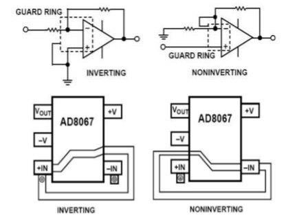

- 运放输入端的反馈电阻靠近其所连接的输入端，尽量减小环路面积，尽量减小走线长度。

- 特殊电路拓扑来降低噪声（成本也高）：

  - 对于低频信号测量，为降低运放闪烁噪声干扰，可将输入信号调制到高频再进行放大，再解调。
- 使用 J-MOS 作为前级放大。
  - 多路低噪声运放电路并联。

  相关 低噪声运放电路设计，可参考丰富的网络资料，大厂文档，比如 ADI / TI 等等。ADI等超低噪声方面的芯片和经验手册。

- 每个模块都加地线罩，像手机主板一样，每个模块加屏蔽罩；将放大电路和过滤电路部分放置在法拉第盒子中来屏蔽环境低频噪声。

  在选择金属屏蔽层材料时，为了同时应对不同频段的电磁干扰，可以采用由多种金属材料组成的多级屏蔽层。低电阻率的金属，如铜，能通过涡流效应抵御高频电磁波；而高导磁率的材料，如钢，则通过限制磁力线来抵御低频电磁波。此外，鉴于放大部分的高精密要求，为防止电磁干扰对其造成影响，还需为该部分电路额外加装金属屏蔽罩。

  测量仪器放在 金属盒 / 金属仪器外壳内 进行电磁保护，金属盒 接地；仪器内的敏感电路 外围应加 设隔离屏蔽罩，屏蔽罩保持与地连接，消除电磁干扰对测量电路的影响。

  选择同轴电缆作为信号输入线，因为微弱信号的传输需要完全封闭的环境。由于同轴电缆具有强抗干扰能力，因此使用它作为信号输入线可以有效防止在信号传输过程中产生干扰。

- 利用导热元件降低温度，降低信号调理电路的温度。电阻采用金属溥膜(低电流噪声)精密电阻器。

- 软件上 使用 均值滤波（平均、滑动窗口）、低通滤波（一阶低通滤波、FIR / IIR 数字滤波 等） 进一步处理。

丰富参考（均是网络上可找的）：

- nvm 开源纳伏表 [jaromir-sukuba/nvm: Open source nanovoltmeter (github.com)](https://github.com/jaromir-sukuba/nvm)。

- [Home-Built STM | Dan Berard (dberard.com)](https://dberard.com/home-built-stm/)。

- CERN超强开源八位半电压表HPM7177。

  - [Home · Wiki · Projects / OPT-ADC-10k-32b-1cha HPM7177 · GitLab (ohwr.org)](https://ohwr.org/project/opt-adc-10k-32b-1cha/-/wikis/home)
  - [【硬核】超强八位半开源万用表-腾讯云开发者社区-腾讯云 (tencent.com)](https://cloud.tencent.com/developer/article/1798492)

- Keithley吉时利源测流单元和电表仪器手册附原理图。

- 安捷伦电表原理图。

- OpenSTM-Ref-Document [Dimsmary/OpenSTM at Ref-Document (github.com)](https://github.com/Dimsmary/OpenSTM/tree/Ref-Document)

- 相关教程 / 书籍：
  - 戴逸松，微弱信号检测方法及仪器，国防工业出版社，必读参考资料。
  - 许树，声信号检测与估计，国防工业出版社。
  - 曾庆勇，微弱信号检测，浙江大学出版社。
  - 陈佳圭，微弱信号检测，中央广播电视大学出版社。
  - 高晋占，微弱信号检测，清华大学。
  - 刘国福，微弱信号检测技术，机械工业出版社。
  - 低电平测量手册。微电流放大电路设计。

- 运放噪声问题：

  > 下面引自 ADI 2021.12 线下专题讲座 某个 PPT。
  > 
  > 
  > 
  > - 噪声的概念文章：[噪声（Noise）-1 - 知乎 (zhihu.com)](https://zhuanlan.zhihu.com/p/169428604)，[噪声（Noise）-2 - 知乎 (zhihu.com)](https://zhuanlan.zhihu.com/p/182470391)。
  > - 功率谱密度的理解：[功率谱和频谱的区别_Charles' home-CSDN博客_功率谱和频谱的关系](https://blog.csdn.net/godloveyuxu/article/details/77030793)，[FFT求频谱图和功率谱密度图_《好好先生》专栏-CSDN博客_功率谱密度图](https://blog.csdn.net/liubing8609/article/details/85526616)。
  > - 引用较详细说明运放噪声计算过程的文章：[信号链类——放大器噪声计算 - 知乎 (zhihu.com)](https://zhuanlan.zhihu.com/p/464206112)，[运放噪声如何计算？_TaylorLi421的博客-CSDN博客_运放的噪声计算](https://blog.csdn.net/TaylorLi421/article/details/105127846)。
  > - ADI 的 AN-114 介绍了低噪声和噪声计算相关内容：[AN-1114_cn.pdf (analog.com)](https://www.analog.com/media/cn/technical-documentation/application-notes/AN-1114_cn.pdf)。

#### 电源规范设计

电源相关指标见 `1 最基本的设计理念和器件选型` 章节里 `电源` 一节。

##### 概述规范和指标

**电源绘制规范**。基本规则分为三大块，都搞明白了就**自然**的知道怎么画了：

1. 画 PCB 的基本规范要首先知道：按照信号流向走线、走线尽量短、电容尽量靠近要滤波的端口、走线宽度足够设计电流通过（或开窗加锡）、电流路径尽量一马平川而减少过孔和拐弯，还有本规范的其它相关规范内容；
2. 了解 LDO、BUCK、BOOST 或 正激、反激 等电源拓扑的运行原理；（电源主要分为两大类，线性电源（LDO） 和 开关电源（DC-DC / AC-DC / DC-AC）。开关类电源不可避免会引入高频噪声、纹波相对大一些，但是效率较高、电流能力可以很大；选择 LDO 主要是用其高的 PSRR（电源纹波抑制比，在 10Hz~10MHz 这个完整范围内具有较大的抑制能力）和 低噪声输出。但是 LDO 输出噪声与降压差、电流和输入噪声频率都有关系，PSRR 会随着这些变化，电流影响很大）
3. 了解电源的主要参数（本规范里 “1 最基本设计理念和器件选型” 章的 “电源” 小节）。电源类芯片的数据手册一般均有 PCB 布局布线参考图，在空间允许的范围内还是尽量参照该参考图。需要完整实践几次，从绘制 SCH、PCB 再到焊接、测量主要参数和调试。

**电源设计四指标**（设计一个好电源，打好整板的 “地基”）：

1. 体积小。
2. 效能高（效率高（轻载、重载情况下均 90% 以上）、低静态电流、热控制好）。
3. 低 EMI。
4. 好的动态响应（负载调整率好，负载快速变化时输出波动（过冲和下降）小且恢复快，输出纹波良好（20mV 左右 可以，10mV 以下优良））。

##### 通用 电源树/电源轨 框图

##### 高价值补充

- 一文 LDO [这些LDO的问题，你都解决了吗？（建议收藏） - 知乎 (zhihu.com)](https://zhuanlan.zhihu.com/p/629397939)。

- Layout：

  - [硬件电路设计-开关稳压器Layout指南 (qq.com)](https://mp.weixin.qq.com/s/dzkk-5oCt8TPqDaoU0o9bQ)。

- 电源噪声 / 去耦&旁路电容设置：

  [EEVblog #594 - 怎样测量电源纹波和噪声_哔哩哔哩_bilibili](https://www.bilibili.com/video/BV15t411F76U)、[EEVBlog #1116 - 怎样消除电源纹波_哔哩哔哩_bilibili](https://www.bilibili.com/video/BV1Gt411u7eR)。这篇文章 [【实用】看完这篇，轻松掌握开关电源纹波测量和抑制方法 (qq.com)](https://mp.weixin.qq.com/s?__biz=MzI4NTQ4NTA3NA==&mid=2247486962&idx=1&sn=48001cbfdaa8e92e939abe2c932cb1ec&chksm=ebea3c8fdc9db599c9e6b0ba26274dae8adc999f5bed574fd9ccb50e8f2234ffcbe7c20141fb&scene=0&ascene=7&devicetype=android-23&version=26060638&nettype=3gnet&abtest_cookie=BAABAAoACwASABMABAAjlx4AWZkeAGKZHgBtmR4AAAA%3D&lang=zh_CN&pass_ticket=BK2iBKubCk8sK6qJcWVmP87gLgblu8%2Bkqe1bucAW6oix4OJh3N5tw4OjP9nBjIVB&wx_header=1) 就是对前面两个视频的总结。

  去耦、旁路电容的作用分析：

  [只知道芯片旁边加一个电容是不够的！一个简单的小实验，让你马上明白“去耦电容”和“旁路电容”的工作原理_哔哩哔哩_bilibili](https://www.bilibili.com/video/BV1sR4y1Q7up/?vd_source=c633af9518bed5572b1614612e2be3df)。

  [去耦电容、旁路电容 “接地才是关键！”，仿真实验揭示答案_哔哩哔哩_bilibili](https://www.bilibili.com/video/BV1qP411w7pZ/)。

  重要概念 [多电容并联滤波原理（为什么滤波电容要并联几个小电容，而非用一个大电容） - 知乎 (zhihu.com)](https://zhuanlan.zhihu.com/p/597152452)。

  图示去耦电容布局 [退耦电容布局_newzhpfree的博客-CSDN博客](https://blog.csdn.net/newzhpfree/article/details/129306707)。

  比肩 LDO 噪声水平的 DCDC IC [消除误解：大电流开关稳压器IC噪声可以降低到接近LDO的数值 - 电源技术 - 电子工程网 (eechina.com)](https://www.eechina.com/thread-819827-1-1.html)。

  合理布局布线 [小电源，大讲究 (qq.com)](https://mp.weixin.qq.com/s/G4cu8lWxNmidfYLYExafjg)。

  示波器测量电源噪声的正确操作：

  - [如何测量电源的纹波（一）_哔哩哔哩_bilibili](https://www.bilibili.com/video/BV1dq4y1s7JK/)。
  - [电源纹波正确测试方法，轻松快速搞定纹波测试_哔哩哔哩_bilibili](https://www.bilibili.com/video/BV1bs4y1J7ep/)。
  - 要点：
    - 示波器设置交流耦合，20MHz带宽限制。
    - 水平刻度调到 20ms 或 10ms，垂直刻度调到 20mV 或 10mV，看峰峰值。
    - 用测量弹簧安插在表笔上测，怼到电源输出的电容的两侧。减小环路面积，减小捕获空间中的干扰。
    - 表笔设置 X10，对应的示波器也设置 X10。
    - 一般小于 20mV 为佳。
    - 测量示波器底噪：示波器拔掉表笔，水平和垂直刻度均调到最小，看峰峰值。

- 电源测量小贴士，10 个设计阶段：[10_Steps_Power_Supply_48C-60180-cn.pdf (tek.com)](https://download.tek.com/document/10_Steps_Power_Supply_48C-60180-cn.pdf)，文档离线在`\额外文档\10_Steps_Power_Supply_48C-60180-cn.pdf`里。泰克官方。

- EMC 环节，PCB Layout：

  - 参考 各种 EMC 标准电路，[protection-circuits/EMC 理论和设计要点 at master · Staok/protection-circuits (github.com)](https://github.com/Staok/protection-circuits/tree/master/EMC 理论和设计要点) / [EMC 理论和设计要点 · 瞰百/protection-circuits - 码云 - 开源中国 (gitee.com)](https://gitee.com/staok/protection-circuits/tree/master/EMC 理论和设计要点)，其它保护电路也参考这个仓库里面的电路。
  - DCDC PCB Layout 经验。[一文将 DCDC 的 Layout 讲的明明白白 (qq.com)](https://mp.weixin.qq.com/s/hDT5qWXzD-droTiETXwQPQ)。输入环路和输出环路的面积要尽量小，心中有 DCDC 的开 和 关状态时的信号流向。
  - [DC-DC PCB layout经验-含走线宽度和载流量表格_ltqshs的博客-CSDN博客](https://blog.csdn.net/qq_21794157/article/details/128617280)。

- 阻尼震荡与振铃问题：[Buck的振铃实验与分析 (qq.com)](https://mp.weixin.qq.com/s/xj0gmkcpq5TplHRwkMHrCA)、[开关电源的阻尼振荡 (qq.com)](https://mp.weixin.qq.com/s/0n8xpQxZ8uDzwqaKPTruwg)。

- 环路相关：
  - [电源-环路补偿的意义 - 知乎 (zhihu.com)](https://zhuanlan.zhihu.com/p/255169832)。
  - [前馈电容是如何影响buck电路的输出特性的？ (qq.com)](https://mp.weixin.qq.com/s/Ia0-qRDyGThergkzwJJuiA)。反馈电阻的上电阻并联的前馈电容的作用的理论分析和经验参数。

- “合路” 环节，对于低压、小电流用两个二极管来选择即可，对于高压、大电流用第二类或第三类路径切换电路，[protection-circuits/掉电保护 简易自动切换电源轨 at master · Staok/protection-circuits (github.com)](https://github.com/Staok/protection-circuits/tree/master/掉电保护 简易自动切换电源轨)。[掉电保护 简易自动切换电源轨 · 瞰百/protection-circuits - 码云 - 开源中国 (gitee.com)](https://gitee.com/staok/protection-circuits/tree/master/掉电保护 简易自动切换电源轨)。

  MLCC 会引起 线路上 瞬时电流很大，若线路上有MOS管则要考虑其参数是否足够，其的保护、软起需要考虑（GS极并联1uf电容等，不过这样做也会增加 启动时间 和 关闭时间 对于整系统的 多路电源 的 启动顺序 会造成影响，对电路的调整需要从硬件整体考虑）。

##### 降低纹波的经验

- LDO 相关：
  - [LDO纹波抑制_哔哩哔哩_bilibili](https://www.bilibili.com/video/BV1we411W7vP/)。
  - LDO 前后用大电容 均 顺序为 从大到小，例如 47uF、10uF、0.1uF。
  - 为了降低 LDO 的 PSRR 在高频段 不足，在 LDO 前加 能够 覆盖 其 PSRR 的高频段的 磁珠。

- 通用的：
  - [[TI\] 无 LDO 的低噪声、低纹波电源设计技术[TI Training & Videos]_哔哩哔哩_bilibili](https://www.bilibili.com/video/BV1jF411x7QE/)。
  - 优化 PCB 布局，参考 官方的建议 PCB Layout。
  - 反馈线路 原理 磁性元件、开关管 和 功率二极管等。
  - 在满足输出电流的情况下，加大电感值，会改善纹波，但动态响应性能会降低，根据应用场景权衡。
  - 提高开关电源的开关频率。
  - 输入输出端的 滤波 / 旁路电容 良好。

- [DCDC的Layout终极奥义 - 知乎 (zhihu.com)](https://zhuanlan.zhihu.com/p/710634540) DCDC layout经验

  输入回路的 Cin 和 续流DIO 环路尽量小（其 GND 就近进入地敷铜，且要在 IC 同层，尽量靠近 IC 引脚，一定避免过孔），输出回路同理，FB 等敏感信号远离电感和开关管和 DIO 等。

- 一些大厂文档参考：

  - [通过 TPS62913 低纹波和低噪声降压转换器为敏感型 ADC 设计供电 (ti.com.cn)](https://www.ti.com.cn/cn/lit/an/zhcaa55/zhcaa55.pdf?ts=1726321200400)。
  - 

##### 综合性实践参考和补充

- [硬件-硬件工程师应该知道DCDC知识 - 知乎 (zhihu.com)](https://zhuanlan.zhihu.com/p/255011356)。这个实在太全了！
- [硬件-ACDC-DCDC-Common-mistake - 知乎 (zhihu.com)](https://zhuanlan.zhihu.com/p/255015076)。一些 AC-DC 和 DC-DC 的问题的分析和使用处理经验。
- [如何做一个不炸机的电源？ - 知乎 (zhihu.com)](https://zhuanlan.zhihu.com/p/119223784)。电源可靠性要点。
- [如何减少PCB元器件的磁场辐射 - EMC/EMI设计 - 电子发烧友网 (elecfans.com)](https://www.elecfans.com/emc_emi/1163855.html)。减少电磁辐射。
- [plla1981/PCB-Layout: 多层板的设计 (github.com)](https://github.com/plla1981/PCB-Layout)，这篇文章概述了叠层排布原则、布局原则、布线原则、阻抗设计、信号完整性、电源完整性、EMC设计、热设计、DFM设计 等内容，感谢分析。特别对电源的画法有很多实例说明。原文已经离线在本地 `额外文档\plla1981-PCB-Layout`。
- 充电相关丰富资料：[→→ 电动汽车充电系统相关专辑 37 册 62M ←← - 汽车电子 - 电子工程网 (eechina.com)](https://www.eechina.com/thread-70958-1-1.html)。
- 变频器相关丰富资料：[*@变频器实用技术资料 - 工业/测控 - 电子工程网 (eechina.com)](https://www.eechina.com/thread-60585-1-1.html)。

- 上电时序控制：

  引自 [【一张图概括】上电时序控制 (qq.com)](https://mp.weixin.qq.com/s/tso8zMkPpFq5XCtltTu5-g)。

  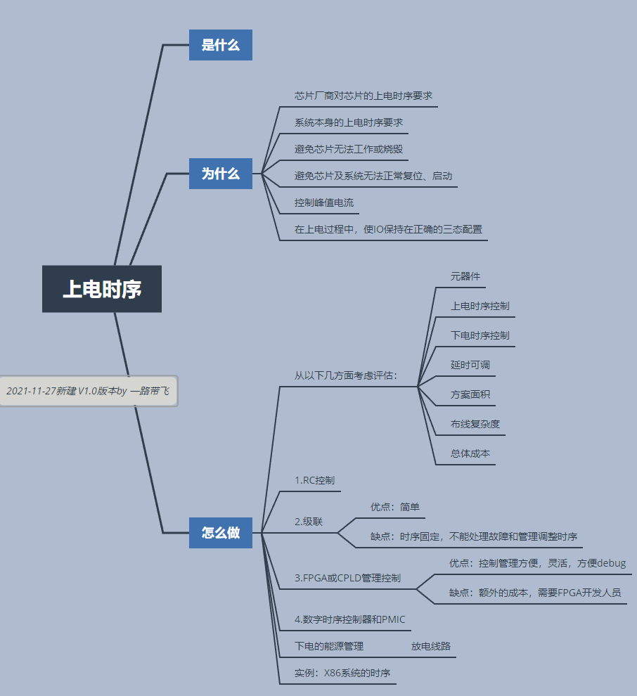

- .etc

### 布局模块分离 / 地分割

#### PCB 布局模块分离

- 要进行电源分割、空间远离和地线单独安排等措施。
- 各个部分接各自独立的“地”，最后都各自单点接公共地。
- 模块特性区分：
  - 数字部分供电电源，给数字电路；模拟部分供电电源，给模拟电路。
  - 强信号、大电流部分 与 弱信号（又分高频、低频）部分。
  - 高电压区域 与 低电压区域。
  - 干扰源 与 敏感元件。即按频率范围划分区域。

#### 接好地 / 地分割

要划分这些“地”，防止互相干扰，每一个“地”单独划分区域，单独覆铜。一般是 每个模块各自**单点接地**。不同电源或地之间可以通过 磁珠 或 0R 电阻 连接，推荐前者，注意电流能力（0805/0603 的 磁珠 的电流能力在其手册有写，1% 0805（1/8W）的 0R 电阻 的电阻最大为 0.01R，电流能力约为 3.5A（3A 左右可能就烧了））。

- 电源地（PGND），公共地（GND），这俩看作一回事；

- 模拟电源部分 对应的 模拟地（AGND）；

- 数字电源部分 对应的 数字地（DGND）；

- 负载地（外接的电机等大负载进行隔离）；

- 外接传感器地（外接模块地隔离，或者共模电感隔离）；

- 机壳地，外壳地；

- 以下为接地的考虑：
  
  
  
  地线原则：
  
  - 接地线应尽量加粗。
  - 低频电路的地应尽量采用单点并联接地，实际布线有困难时可部分串联后再并联接地。高频电路宜采用多点串联接地，地线应短而粗，高频元件周围尽量用栅格状大面积地箔。
  - 下图，参考文档 `./额外文档/单点接地和多点接地剖析.doc`。
  
  

更多参考：

[关于接地：数字地、模拟地、信号地、交流地、直流地、屏蔽地、浮地_newzhpfree的博客-CSDN博客](https://blog.csdn.net/newzhpfree/article/details/129094780)。

### EMC 电磁兼容设计

> 引自《硬件系统工程师宝典》。
>
> EMC（Electromagnetic Compatibility）即电磁兼容性，指在特定的电磁环境下，电子系统或PCB上的电子元器件之间相互协调有序工作的能力。对于EMC，相应的标准有欧洲的CE认证、美国的FCC认证和中国的3C认证，电子产品在各个区域必须符合相应的认证才可以
> 销售。
>
> **EMC 包含 EMI 和 EMS 两项。**EMI (Electromagnetic Interface)即电磁干扰，指电子系统或PCB上的电子元器件之间在工作时，产生的不利于其他电子系统或器件的电磁能量。EMS (Electromagnetic Susceptibility)即电磁敏感度，指电子系统或PCB上的电子元器件应能接受其他设备或器件的电磁干扰。
>  **EMC 设计的方法可以分为以下四点：接地、滤波、隔离和屏蔽。**接地能够有效地将噪声导入GND平面，滤波能够将无效的信号频段滤除，隔离能够阻挡噪声的传导干扰，屏蔽能够有效地阻断噪声的辐射干扰。
>
> ...
>
> **干扰源、耦合途径 和 敏感装置 是 EMC 存在的三个要求。对症下药。**
>
> 在进行产品的EMC可行性分析时，首先要确定产品定位的区域，从而对应其标准进行相应的测试。对于EMC的可行性分析，可以着重从三个方面入手：**隔离（或抑制）干扰源、切断干扰噪声的传输路径和保护受干扰的群体。**

> 引自 [单片机硬件设计原则：抗干扰常用方法（学习群：943552345） - 知乎 (zhihu.com)](https://zhuanlan.zhihu.com/p/450623564)。
>
> 1. 干扰源。指产生干扰的元件、设备或信号，用数学语言描述如下：du/dt， di/dt大的地方就是干扰源。如：雷电、继电器、可控硅、电机、高频时钟等都可能成为干扰源。
> 2. 传播路径。指干扰从干扰源传播到敏感器件的通路或媒介。典型的干扰传播路径是通过导线的传导和空间的辐射。
> 3. 敏感器件。指容易被干扰的对象。如：A/D、D/A变换器，单片机，数字IC，弱信号放大器等。干扰的分类干扰的分类有好多种，通常可以按照噪声产生的原因、传导方式、波形特性等等进行不同的分类。按产生的原因分：可分为放电噪声音、高频振荡噪声、浪涌噪声。按传导方式分：可分为共模噪声和串模噪声。按波形分：可分为持续正弦波、脉冲电压、脉冲序列等等。
>
> 因此，常用硬件抗干扰技术针对形成干扰的三要素，采取的抗干扰主要有以下手段：
>
> 一是，抑制干扰源抑制干扰源，就是尽可能的减小干扰源的du/dt，di/dt。这是抗干扰设计中先考虑和重要的原则，常常会起到事半功倍的效果。减小干扰源的du/dt主要是通过在干扰源两端并联电容来实现。减小干扰源的di/dt则是在干扰源回路串联电感或电阻以及增加续流二极管后RC抑制来实现。
>
> 二是，切断干扰传播路径按干扰的传播路径可分为传导干扰和辐射干扰两类。所谓传导干扰是指通过导线传播到敏感器件的干扰。高频干扰噪声和有用信号的频带不同，可以通过在导线上增加滤波器的方法切断高频干扰噪声的传播，有时也可加隔离光耦来解决。电源噪声的危害，要特别注意处理。所谓辐射干扰，是指通过空间辐射传播到敏感器件的干扰。一般的解决方法是增加干扰源与敏感器件的距离，用地线把它们隔离和在敏感器件上加蔽罩。
>
> 三是，提高敏感器件的抗干扰性能提高敏感器件的抗干扰性能是指从敏感器件这边考虑尽量减少对干扰噪声的拾取，以及从不正常状态尽快恢复的方法。
>
> 四是，其它常用抗干扰措施交流端用电感电容滤波：去掉高频低频干扰脉冲。变压器双隔离措施：变压器初级输入端串接电容，初、次级线圈间屏蔽层与初级间电容中心接点接大地，次级外屏蔽层接印制板地，这是硬件抗干扰的关键手段。次级加低通滤波器：吸收变压器产生的浪涌电压。采用集成式直流稳压电源：因为有过流、过压、过热等保护。I/O口采用光电、磁电、继电器隔离，同时去掉公共地。通讯线用双绞线：排除平行互感。防雷电用光纤隔离为有效。A/D转换用隔离放大器或采用现场转换：减少误差。外壳接大地：解决人身安全及防外界电磁场干扰。加复位电压检测电路。防止复位不充分CPU就工作，尤其有EEPROM的器件，复位不充分会改变EEPROM的内容。

EMC（电磁兼容性）下分 EMI（电磁干扰，因发射/排放（Emission）电磁波而对环境的干扰）和 EMS（电磁敏感性，对电磁波干扰的耐受度/抗扰度（Immunity））。EMI 下分 CE（Conducted Emission，传导嗓声）、RE（Radiated Emission，辐射噪声）；EMS 下分 CI（Conducted Immunity，传导抗扰度）、RI（Radiated Immunity，辐射抗扰度），还有 浪涌（Surge）和电压跌落等测试。

EMC 主要用到的器件有：TVS 瞬态抑制管（和 GDT 气体放电管）、ESD 防护器件、Y/X 电容、MLCC（片式多层陶瓷电容）、共模电感、磁珠等；还有 RC 或 RCD 尖峰吸收电路（常见于 AC-DC、全桥驱动 的 MOS 管 D S 极间 等  du/dt 比较大（电压变化剧烈）的地方，di/dt 比较大（电流变化剧烈）的地方可以加 电感 来缓和）。对于 各种电压的 AC、DC 电源接口，以及各种通讯接口，均有 标准/常用 的 EMC 电路供参考。

更多内容参见 参考上文的 “保护机制” 小节。更多内容参见 可以参考在 “保护电路” Github 仓库里面总结比较丰富的 EMC 有关的教材资料、**EMC 标准电路**和，以及 ESD 器件如 TVS管、共模电感、磁珠等的介绍和选型。详见如下：github + gitee 链接

- [protection-circuits/EMC 理论和设计要点 at master · Staok/protection-circuits (github.com)](https://github.com/Staok/protection-circuits/tree/master/EMC 理论和设计要点)。[EMC 理论和设计要点 · 瞰百/protection-circuits - 码云 - 开源中国 (gitee.com)](https://gitee.com/staok/protection-circuits/tree/master/EMC 理论和设计要点).
- [protection-circuits/TVS管 ESD器件选型 接口保护选型 at master · Staok/protection-circuits (github.com)](https://github.com/Staok/protection-circuits/tree/master/TVS管 ESD器件选型 接口保护选型)。[TVS管 ESD器件选型 接口保护选型 · 瞰百/protection-circuits - 码云 - 开源中国 (gitee.com)](https://gitee.com/staok/protection-circuits/tree/master/TVS管 ESD器件选型 接口保护选型)。

很有价值的文章：

- [EMC-简单记录 - 知乎 (zhihu.com)](https://zhuanlan.zhihu.com/p/255005607)。
- [EMC-产品EMC设计 - 知乎 (zhihu.com)](https://zhuanlan.zhihu.com/p/255007193)。
- [EMI辐射发射超标案例_二极管并联电容对辐射的影响_liht_1634的博客-CSDN博客](https://blog.csdn.net/liht_1634/article/details/127233385)。

### SI/PI/HS/RF 概念

*p.s 本节为专业 PCB 领域，本文作者不涉及。只写一点点概念。*

*p.s.s 这一块内容，高速电路、SI、PI、阻抗匹配、射频天线 等的设计，专业的来说，非常依靠 电路/电磁场 的仿真软件 的 专业领域。*

> 引自《硬件系统工程师宝典》。
> 
> **信号完整性设计，是指设计的系统在信号传输的过程中能够保持信号的时域特性和频域特性，信号从发送端到接收端能够保持正确的时序、幅度及相位等电气参数。**时域分析从时间和信号波形来观察结果，它研究电源和信号实际的波形，与激励信号有关，适用于观测系统的有源、非线性特性。**时域分析的优点是直观，有明确的SPEC**，如Ripple和Transient等指标供参考；**缺点是不容易发现和解决问题**，IC器件的电流激励波形难以得到，测量容易受外部噪声的干扰。频域分析会从不同频率和对应的阻抗值来观察结果，它研究的是物理结构本身随频率变化的特性，与激励信号无关，适用于无源、线性、时不变系统。**频域分析比时域分析更容易定位和解决问题，容易进行频域仿真**，能够清晰地分析Board Package和Die等各部分对系统性能的贡献，不受外部噪声的干扰。
> 
> ...
> 
> **系统的信号完整性问题可以归结为5大类**：①**单网络问题**，主要研究单根走线信号的时序、幅度和相位等，引起单根网络信号完整性问题的主要根源是信号的反射问题；②**多网络之间的问题**，主要研究的是相邻信号（同平面走线、不同平面走线）之间串扰祸合的影响；③**信号时序问题**，主要研究的是对信号采样的建立时间和保持时间的最大余量设计；④**电源完整性问题**，主要设计到同步开关输出(SSO)、同步开关噪声(SSN)、因平面谐振引起的电源/地反弹(Ground Bounce)；⑤**电磁兼容与电磁干扰问题**，主要研究PCB的近场辐射特性与远程辐射特性。
> 
> ...
> 
> 电源完整性(Power Integrity)简称PI，指的是电源波形的质量。从广义上讲，PI分析隶属于SI研究的范畴之内，电源完整性是信号完整性的基础。
> 
> ...
> 
> EMC 与 SI、PI 虽然在概念上分的很清晰，但从提高信号质量、完善系统设计的具体措施角度考虑，彼此之间又没有明显的界限。

#### 信号完整性（SI）

信号具备信号完整性，是指信号发射端将信号有效的输送到接收端，接收端能够接收到符合逻辑电平要求、时序要求和相位要求的信号。

高速电路（以 100MHz 为界）中 电路元器件参数 和 PCB上的 电磁场分布参数 会共同起 主要作用，影响信号质量。

四类 SI 问题（《信号完整性分析-Eric Bogatin》的一家之言）：

- 反射(reflection)；
- 串扰(crosstalk)；
- 电源噪声（同步开关SSN、地弹、轨道塌陷）；
- 电磁干扰(EMI)。

串扰和振铃：串扰是指一个信号被其它信号干扰，作用原理是电磁场耦合。信号线之间的互感和互容会引起线上的噪声。容性耦合引发耦合电流，而感性耦合引发耦合电压；振铃是因为信号线本身阻抗不匹配导致信号发生反射和叠加，从而使信号出现了振荡波形。

避免反射问题最基本的要做阻抗匹配：高频电路源与目的之间的阻抗匹配非常重要，错误的匹配会带来信号反馈和阻尼振荡。过量地射频能量则会导致 EMI 问题。此时，需要考虑采用信号端接；滤波器选型的阻抗失配准则：对低阻抗噪声源，滤波器需为高阻抗（大的串联电感）；对高阻抗噪声源，滤波器就需为低阻抗（大的并联电容）；降低敏感线路的输入阻抗有效减少引入干扰的可能性；LC滤波器 在低输出阻抗电源和高阻抗数字电路之间，需要LC滤波器，以保证回路的阻抗匹配；降低敏感线路的输入阻抗。

对症下药，简单地说为：

- 传输延迟问题：走蛇形线保证信号线等长。
- 反射：要 阻抗匹配，线长不要是1/4波长的整数倍。更多阻抗匹配内容见本文 `PCB 差分走线设计` 一节！！
- 串扰：元件和导线的磁场相互垂直、平行线相互远离（3W原则）、信号线间用地平面隔离等等。串扰的影响 [PCB中走线的串扰很难理解吗？看完这个视频就不会啦！_哔哩哔哩_bilibili](https://www.bilibili.com/video/BV1mM4y1e72g)。
- 电源噪声：见本文 `电源规范设计` 一节 和下面 `电源完整性（PI）分析`。
- 电磁干扰：见本文 `EMC 电磁兼容设计` 一节。

> 引自《硬件系统工程师宝典》。
> 
> 在进行高速PCB设计时，考虑到PCB设计的实际操作，在操作中需要考虑的主要因素有PCB叠层结构(PCB Layer Stackup )、阻抗(Impedance)、器件互连的拓扑结构(InterconnectTopologies )、延迟(Delay Matching)、串扰(Cross Talk)、时序(Timing)、电源完整性(Power Integrity)、电磁兼容和电磁干扰分析(EMC and EMI)。

> 引自百度百科。
> 
> 阻抗匹配网络的目的是为了解决功率传输时阻抗不匹配的问题，可以通过集总参数元件（比如电容、电感）或者分布参数元件（微带线）来实现，前者主要用于较低频率，后者主要用于更高的频率。
> 
> 阻抗匹配（Impedance matching）是微波电子学里的一部分，主要用于传输线上，来达到所有高频的微波信号皆能传至负载点的目的，不会有信号反射回来源点，从而提升能源效益。[史密夫图表](https://baike.baidu.com/item/史密夫图表)上。电容或电感与负载串联起来，即可增加或减少负载的阻抗值，在图表上的点会沿着代表实数电阻的圆圈走动。如果把电容或电感接地，首先图表上的点会以图中心旋转180度，然后才沿电阻圈走动，再沿中心旋转180度。重覆以上方法直至电阻值变成1，即可直接把阻抗力变为零完成匹配。更多概念 [阻抗匹配_百度百科 (baidu.com)](https://baike.baidu.com/item/阻抗匹配)。

差分线 以及 阻抗匹配，会大概率遇到，对于非硬件人员可能属于需要稍稍会做的内容，其更多内容可看“PCB 差分走线设计”一节。

更多好文参考：

- [“一秒”读懂串扰对信号传输时延的影响 (qq.com)](https://mp.weixin.qq.com/s/xWhxFQkAHZj35yWyBKKcHg)。
- [信号完整性常用九类公式 (qq.com)](https://mp.weixin.qq.com/s/Y7entmL5X_DIyWZ7LNjGZg)。
- [硬件-简单的Signal Integrity - 知乎 (zhihu.com)](https://zhuanlan.zhihu.com/p/254991939)，有关于 SI 的涉及到的点 和 一些使用经验。

#### 电源完整性（PI）

> 引自《硬件系统工程师宝典》。
> 
> 电源完整性研究的是电源分配网络(Power Distribution Network, PDN )，包含电源的源头、供电模块VRM、PCB上的储能电容和去耦电容、PCB上的电源和地平面、芯片封装内的电源和地网络、Die上的电容。
> 
> ...
> 
> 在电源系统中，噪声是影响电源完整性的一个主要性问题，明确了电源噪声的来源，就能在设计中尽可能地去避免或在出现问题的地方解决问题。

电源完整性可以通过波形观察，用于确认电源末端的电压及电流、纹波等是否符合需求。主要看 DC-DC 开关电源的电压降与电源纹波，只有满足一定性能指标的电源才能保证单板长期运行稳定。

电源完整性 PI 分析是个整体工程。从供电端 VRM 来看整个电路，良好的设计，对各个频段的电流的阻抗应该是均比较低的，在电源和信号到达目的地之前，其对各频段噪声均有较好的泄放路径。

**电源完整性的测量**：

- 纹波和噪声的测量。
- 输出阻抗的测量。
- 环路增益的测量。
- 滤波器件（电容/磁珠等）性能参数的测量。

...

更多精华网文教程：**都是大赞好文~**

- [电源完整性设计（重复造轮子） - 知乎 (zhihu.com)](https://zhuanlan.zhihu.com/p/617461493)。
- [深刻理解电源完整性PI，图文并茂，浅显易懂_YIRender的博客-CSDN博客_pi电源完整性](https://blog.csdn.net/weixin_40727233/article/details/118280924)。

#### HS/RF 高速PCB / 高频  / 射频

高速 PCB 设计指南系列（16篇文章）：[高速PCB设计指南系列（一）_newzhpfree的博客-CSDN博客](https://blog.csdn.net/newzhpfree/article/details/129432540)。

——

**高频相关**

高于 1GHz 信号的线路属于高频范畴，如 LPDDRx、PCIe、天线 等。

对于高频电路，需要考虑元件之间的分布参数的影响。

见本文的差分布线规范的小节如 `PCB差分走线设计` 和 `本科生级` 里面的等。

**射频相关**

首先是 电磁波与电磁场 相关：

- [天线是如何接收到电磁波的？ - 知乎 (zhihu.com)](https://www.zhihu.com/question/328054510/answer/836523462)。
- [天线是如何接收到电磁波的？ - 知乎 (zhihu.com)——什么是电磁波？](https://www.zhihu.com/question/328054510/answer/2570967009) 视频演示比较形象。
- [天线的工作原理 - 知乎 (zhihu.com)](https://zhuanlan.zhihu.com/p/286117993/)。
- [天线是如何接收到电磁波的？ - 知乎 (zhihu.com)](https://www.zhihu.com/question/328054510/answer/710146188)。
- [大道至简 ｜ 如何学习《电磁场与电磁波》 - 知乎 (zhihu.com)](https://zhuanlan.zhihu.com/p/343225605)。

然后是 射频的硬件电路 相关：

一个 射频 / 无线电 相关资料比较全的：[→→ 无线电技术相关专辑 76册 894M ←←, 大礼包 - 通信/网络 - 电子工程网 (eechina.com)](https://www.eechina.com/thread-25371-1-1.html) 很丰富，但要积分。

离线文档资料：`\额外文档\射频相关\`，更多文章：

- 一个 微波/射频/天线 的 电磁波理论/天线设计相关的 底层原理/科班式 基础介绍 [天线原理（最专业最全面的精华）-面包板社区 (eet-china.com)](https://www.eet-china.com/mp/a84131.html)。
- [非常实用: 2.4G天线设计指南(赛普拉斯工程师力作)_ 霁风AI-CSDN博客 _2.4g天线调试](https://blog.csdn.net/wwt18811707971/article/details/79452165)。
- [鬼才工程师，20天让你“征服”射频天线那些事！ (qq.com)](https://mp.weixin.qq.com/s/v-Dd5QxOuSm13Dy-Lmg4pQ)。
- [射频电路设计要点 (qq.com)](https://mp.weixin.qq.com/s/A7ODTepWoJy46ja_hEKN8g)。
- [射频电路PCB LAYOUT处理技巧_电子技术基础-面包板社区 (eet-china.com)](https://mbb.eet-china.com/forum/topic/122904_1_1.html)。

一个 RF\HS 的 PCB 走线例子：

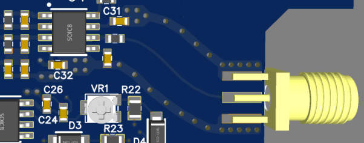

板载天线布局布线规则：

引自 [lvds匹配阻抗 (360doc.com)](http://www.360doc.com/content/22/0419/09/348183_1027204430.shtml)、沁恒 MCU 手册。

板载天线布局布线规则1：

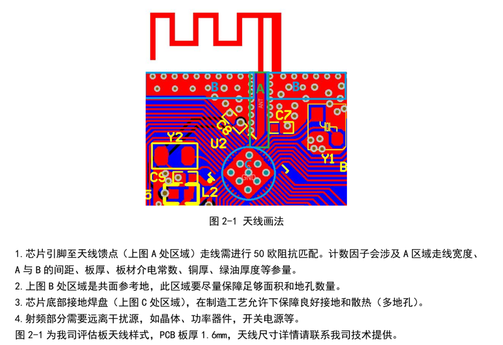

板载天线布局布线规则2：

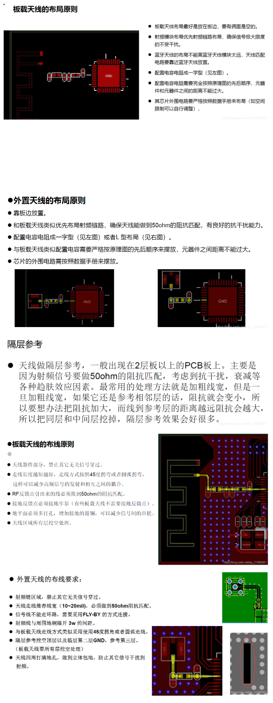

## 5 硬件 Debug 相关技巧经验记录

- 分模块调试。各个模块独立出来，单独供电，调试和测量输入输出。再组合联调。有问题就拆分到最小单元进行测试直到找出问题。
- 测量电流是否正常。一个确定的电路，其正常工作中消耗的电流是可以被估计的，其中的各个模块的电流消耗也是基本已知的，经验老道的硬件人遇到一些硬件问题，条件反射式的首先测把电流看看。不正常的具体的电流数值可能会指示哪些地方有可能出问题。
- 电阻的精度，计算最差的情况，是否还能满足电路需求，让电路正确工作。
- 测量仪器有输入内阻（1M到10M，普通万用表和普通示波器表笔x1的在M级别，普通万用表表笔x10的在10M级别），注意会对测量电路有影响。比如高阻值的分压电阻或电位器的中间输出的分压，直接表笔测量会偏小（偏小几mV到十几mV嘞），测量输出电阻较小的电路（如运放输出）则比较准确。
- .etc

## 6 AD 软件 several more things

### AD 导出 BOM 表 和 BOM 对比工具

**AD 导出 BOM 表**

AD10 的教程：[Altium Designer（AD）软件导出BOM文件操作步骤-百度经验 (baidu.com)](https://jingyan.baidu.com/article/0eb457e501efda42f0a9056a.html)；

AD20 的教程（推荐使用，还包含自定义 BOM 表模板）：[AD20如何自定义BOM模板?Altium Designer20 实用技巧系列教程（五）_哔哩哔哩 (゜-゜)つロ 干杯~-bilibili](https://www.bilibili.com/video/BV1FZ4y1M71U)，其中 BOM 模板文件在 `./PCB LOGO-画法集合-PCB工具-规则文件/AD20 BOM模板/` 里面，这个模板导出的 BOM 表比较常用、整齐，还包含描述、封装、单位价格（可以在导出 Excel 表格后再填入单价，表中的总价格会自动计算；表格最底部有一栏 PCB ，可以填入价格）等，比较实用。注，视频中的模板的位置，在不同版本 AD20 不同，如果按照视频找不到，那么就应该在 `/Altium/AD20/Documents/Templates/` 目录下。

**BOM 对比工具**

在 `PCB LOGO-画法集合-PCB工具-规则文件\BOM对比工具-省时专业` 路径里面 提供 BOM 对比工具，可以快速对比 两个 excel 格式 的 BOM 表 里面 器件 的差异。

### AD 生成器件库 和 Gerber 和 钻孔文件

**生成器件库**

分别在 SCH 和 PCB 页面 的 Design 下 找到 Make SCH/PCB Lib 按钮，会弹出 器件分组 窗口，里面全部不打勾，确定后 分别生成后保存到一个目录即可，不要用 生成集成库，那会重复生成器件。

库可以重新导入到工程，在 Project based 里面 安装库即可，方便其他人打开。

**导出 Gerber 和 钻孔文件**

用时再学：

- 嘉立创官方教程 [技术指导：Altium Designer输出Gerber文件步骤 (jlc.com)](https://www.jlc.com/portal/server_guide_10171.html)。
- [【AD小教程】导出Gerber文件和钻孔文件_哔哩哔哩 (゜-゜)つロ 干杯~-bilibili](https://www.bilibili.com/video/BV1n4411L7c9)
- [【完结】第26课 Altium Designer20(AD20)+VESC6.4实战教程：调整丝印输出Geber文件并投板（北冥有鱼）完结撒花_哔哩哔哩 (゜-゜)つロ 干杯~-bilibili](https://www.bilibili.com/video/BV1ea4y1Y7Mx)

### AD 导入导出配置文件

AD 软件的设置和 PCB Rule 设置，两个配置文件的导入和导出，参考本文件夹这里 `./PCB LOGO-画法集合-PCB工具-规则文件/AD 软件设置和 PCB 规则 Rules 配置文件/`。

## 7 在线/离线 电路仿真计算工具

### 电路计算小工具

内容丰富，参看 `4 SCH-PCB 设计规范` 章的 `PCB 计算小工具 / 辅助设计小软件` 小节。

### PCB DFM 自动化检查工具

PCB 可制造性分析工具，PCB画好后、打板前的自动化检查工具。

- [华秋 DFM](https://dfm.elecfans.com/)：一键分析导入的 PCB 文件，检查项有板子尺寸、孔、线、间距、孤铜等等，排除生产难点、设计缺陷，给出优化建议，结合各种生产因素，自动计算或反算阻抗等等，还有 BOM 管理、对比 等工具，比较有用。

  [PCB反复评审难题，终极解决密码出现了？（资料+福利） - 知乎 (zhihu.com)](https://zhuanlan.zhihu.com/p/585943085)。

  [你被 BOM “坑”过吗？珍藏的BOM检查方法你一定要学！ - 知乎 (zhihu.com)](https://zhuanlan.zhihu.com/p/578329617)。

- [捷配DFM](https://www.jiepei.com/dfm.html) PCB检查工具。

- etc.

### TI-设计和仿真工具

以下

ADI 芯片推荐用 LTspice，其所支持大多仅为 ADI 公司自己的芯片模型。
TI 芯片推荐用 TINA-TI，所支持大多仅为 TI 公司自己的芯片模型。

[设计工具和仿真 | 设计资源 | 德州仪器 TI.com.cn](https://www.ti.com.cn/zh-cn/design-resources/design-tools-simulation.html)。

包括 电源设计工具（开关模式电源、处理器电源（PMIC、FPGA 电源等） 和 用 Power Stage Designer™ 软件工具深入分析电压、电流应力和稳定性）、信号链设计工具（滤波器、模拟电路（运放 和 ADC 设计） 和 时钟树设计） 和 分析和仿真工具（PSpice® for TI 对器件进行热分析等）。

[TINA-TI 模拟工具 | 德州仪器 TI.com.cn](https://www.ti.com.cn/tool/cn/TINA-TI)。

一个 WEBENCH POWER DESIGN 设计工具 教程：[【TPS5450开关电源设计】TI官网的WEBENCH POWER DESIGN设计工具非常好用，物联网硬件电子工程师学开关电源从此芯片开始，事倍功半_哔哩哔哩_bilibili](https://www.bilibili.com/video/BV17E41137Sm)。

### ADI-设计工具与解决方案

**ADI-设计工具**

[设计工具与计算器 | 设计资源 | 亚德诺半导体 (analog.com)](https://www.analog.com/cn/design-center/design-tools-and-calculators.html)。

包括：

- 电源树/电源轨的设计：LTpowerPlay 和 LTpowerCAD，[LTpowerCAD和LTpowerPlanner | 亚德诺半导体 (analog.com)](https://www.analog.com/cn/design-center/ltpowercad.html)。
  
  教程（可网搜更多，ADI 官网也有教程）：
  
  - [LTpowerPlanner：一种系统级电源架构设计工具-EDN 电子技术设计 (ednchina.com)](https://www.ednchina.com/news/201701051400.html)。
  - [√电源设计工程师福利，LTpowerCAD教学视频来啦！ (qq.com)](https://mp.weixin.qq.com/s/bPAfw8iDCzIs9f7RzNwBlQ)。

- 模拟类设计，包括滤波、放大、模拟光电二极管、仪放、ADC/DAC 等：[放大器与线性工具 | Analog Devices](https://www.analog.com/cn/resources/design-tools-and-calculators/amplifier-and-linear-tools.html)。

- LTspice 电路仿真：[LTspice Simulator | 亚德诺半导体 (analog.com)](https://www.analog.com/cn/design-center/design-tools-and-calculators/ltspice-simulator.html)。

  [硬件-LTspice仿真 - 知乎 (zhihu.com)](https://zhuanlan.zhihu.com/p/255003440)。

- RF 及相关工具（包括 RF 阻抗匹配设计）：[RF及相关工具 | 亚德诺半导体 (analog.com)](https://www.analog.com/cn/design-center/design-tools-and-calculators/rf-and-synthesis-tools.html)。

**ADI-解决方案**

- [技术解决方案 | 亚德诺半导体 (analog.com)](https://www.analog.com/cn/applications/technology.html)。
- [参考设计 | 设计资源 | 亚德诺半导体 (analog.com)](https://www.analog.com/cn/design-center/reference-designs.html)。
- [评估硬件与软件 | 设计资源 | 亚德诺半导体 (analog.com)](https://www.analog.com/cn/design-center/evaluation-hardware-and-software.html)。
  - [精密技术信号链 | ADI公司 | 亚德诺半导体 (analog.com)](https://www.analog.com/cn/applications/technology/precision-technology.html)。
  - 等等。

### MPS-设计工具

[设计工具 - 设计 (monolithicpower.cn)](https://www.monolithicpower.cn/cn/design-tools/design-tools.html)。

包括：DC/DC 设计工具、AC/DC 设计工具 和 磁钢设计工具。

### 村田-设计辅助软件

[设计辅助软件 SimSurfing | 设计辅助工具 | 村田制作所 (murata.com)](https://www.murata.com/zh-cn/tool/simsurfing)。具有在线版和离线版。

具有的工具和功能：

使用教学视频：

- [设计支持工具 SimSurfing - SimSurfing - 视频資料库 | 村田制作所 (murata.com)](https://video.murata.com/zh-cn/detail/videos/simsurfing/video/5288510174001)。
- [电源噪声查不出来？不用上板子，滤波器仿真就能搞定 (bilibili.com)](https://www.bilibili.com/medialist/play/watchlater/BV12v411r798)。

### 滤波器在线设计

[Filter Design and Analysis (okawa-denshi.jp)](http://sim.okawa-denshi.jp/en/Fkeisan.htm)。

### Cadence 的 AI 自动化布线

## 8 使用 KeyShot 10 渲染 PCB 效果图

B站等有很多教程视频，可自行搜，以下只经验之谈。

**基本步骤**

- 用 Altium Designer 导出 .step 格式的 3D 模型文件，再导入keyshot，但这个模型不带走线和丝印。
- 导出表面贴图：在 Altium Deigner 里面使用 “智能PDF” 分别导出正反面的只有 “走线和丝印” 两个层的图，注意颜色可选，然后可以把这个 pdf 使用 PS 简单修一修（比如颜色修改和过孔透明），再导出 .png 格式的图。省事的做法可以直接在 AD 的 3D 视图截图，然后贴到 keyshot 的 PCB 板面上。
- PCB 板面添加贴图：然后把贴图添加到 keyshot 中 PCB 模型的板面的材质里面的标签里面。如果板面不加材质，保持原色，则直接在其材质面板下的纹理下的颜色双击添加图片，映射类型选平面，对准选部件，然后点移动纹理调整，调整使这个图像对齐贴合 PCB 板面即可，另一面的图片再在标签里添加。

**KeyShot 的几个初级技巧**

（毕竟只是看一下效果，不是专业的）

- 3D 视图下，tools 菜单下的 legacy tools 可以导出带走线的，带丝印的模型，但是文件太大，keshot 会卡，对电脑性能要求很高，我还没测试。
  没试
- 高版本的 AD，可以导出 pdf 3d，没试。
- 单个模型加材质：单击选中一个模型（出现橘色描边），然后添加材质。或者双击这个模型，右边菜单下面点 “接触链接材质”。
- 单独删除模型，先模型右击点分离，便可删除单独部件。
- 右边菜单 什么都不选 全局设置的情况下 有 照明和图像里面很多不错的效果可以调整。
- 材质和打光：https://www.bilibili.com/video/BV14W411d7Hx。
- 动画制作：https://www.bilibili.com/video/BV1T741177WU。

## 9 优秀参考/书籍/数模电基础（大杂烩）

这里面有 系统入门、学习的 书籍、视频，还有适合零碎时间翻看汲取各种硬件设计中经验技巧的小文章。

### 好书/教程推荐

- 首先精读电路和数模电课本，基本功， 《电路(第五版).邱关源》、《模拟电子技术基础（第四版）童诗白》、《数字电子技术基础（第五版） 阎石》。

- 《新概念模拟电路》1-5册，杨建国，这个系列的模电书讲的很地道、实用。基本数模电学习和查询推荐。如果上面的课本看不下去，就看这个。

- [10讲最具代表性模电问题与解答系列视频 #西安交大杨建国—亚德诺半导体_哔哩哔哩_bilibili](https://space.bilibili.com/485090867/channel/collectiondetail?sid=402794) 模电。

- [唐老师讲电赛的个人空间_哔哩哔哩_bilibili](https://space.bilibili.com/28143041/channel/series) 系统讲解。

- [一个电子工程师的杂货箱 - 知乎 (zhihu.com)](https://www.zhihu.com/column/c_1271183407943802880) 杂。

- [ADI电子书-您绝对值得拥有的电子书 | 亚德诺半导体 (analog.com)](https://www.analog.com/cn/education/landing-pages/002/chinese-ebook.html) 杂且精。

- 《电子技术讲座四册》，引用网友一个介绍：

  > 建议读一下70年代上海业余工业大学的四本《电子技术讲座》，包括《晶体管整流电路》、《晶体管放大与振荡电路》、《晶体管收音机》和《晶体管开关电路》，就知道什么叫做编写让工农兵都能读懂的书，什么叫做理论与实践相结合。这一套书当年发行量是以百万册计的。

- 《华为硬件工程师手册》159页，用于补充。

- [《硬件系统工程师宝典》](https://book.douban.com/subject/26318343/)——EDA精品智汇馆，介绍了硬件系统设计概要、信号完整性、电源完整性、EMC/EMI、原理图和PCB设计详情等，用于补充。

- 好书推荐，如下，比如《高速数字电路设计与安装技巧》这本里面对于信号阻抗匹配通过画图说明非常形象。

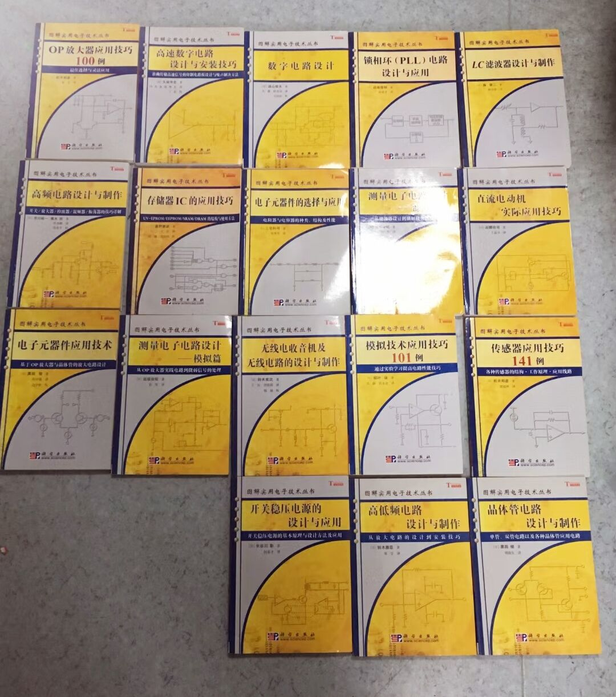

- 一本比较全的书《印制电路板（PCB）设计技术与实践》，对 PCB 中的走线、叠层、接地、去耦合、电源、数模、高速数字电路等等有实用而丰富的介绍。

  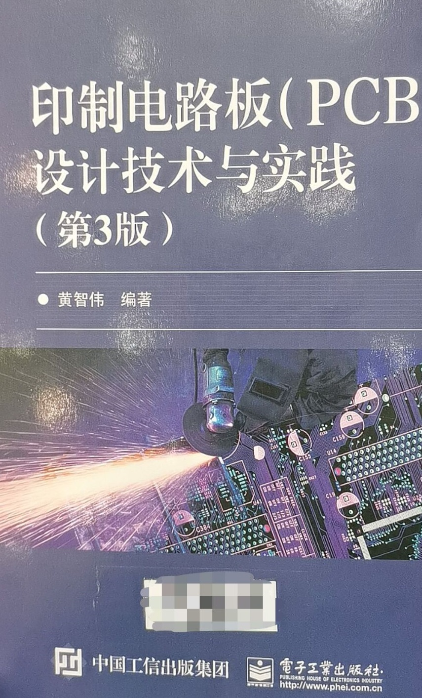

- 《PCB电磁兼容技术——设计与实现》清华大学出版社出版。[PCB电磁兼容技术：设计实践_百度百科 (baidu.com)](https://baike.baidu.com/item/PCB电磁兼容技术：设计实践)，[PCB电磁兼容技术——实践设计 - 百度文库 (baidu.com)](https://wenku.baidu.com/view/f28d9d1f7075a417866fb84ae45c3b3567ecddbc.html)。网友推荐，不厚，干货多。

- 一搏科技赠资料：cadence设计红宝书案例、高速先生原创技术文章、一博历届研讨会课件、Designcon大会17、19、20文章，内容很丰富。

  链接：https://pan.baidu.com/s/1NoneuqKxPURPZFoZxCFGzQ?pwd=XHYF 提取码：XHYF --来自百度网盘超级会员V5的分享。

- .etc

### 网络优秀参考

*p.s 以下有些是作者还没有看到的，均填列其中（有时间的话会看看，再之后都会把其精髓补充在本文）。*

- Altium Designer 好教程系列 [【资源合集】Altium资源汇总 (qq.com)](https://mp.weixin.qq.com/s/A7DdsiQECRapabkRo6RVTw)。

  > [RV1106 AI视觉主板PCB设计|李崇伟|共6节](https://www.bilibili.com/video/BV1WW421977o/)
  >
  > [第十七届“高教杯”成图大赛-国赛赛前培训](https://www.bilibili.com/video/BV1sr421K7kH/)|林超文|共1节
  >
  > [4层STM32开发板基础入门实战课程](https://www.bilibili.com/video/BV1Fr421w7Tb/)|郑振宇|共6节
  >
  > [第十七届“高教杯”成图大赛-省赛赛前培训|林超文|共1节](https://www.bilibili.com/video/BV1bt421T7xj/)
  >
  > [14层FPGA核心板高速PCB Layout设计实战课程](https://www.bilibili.com/video/BV1aw4m1R7XN/)|李崇伟|共6节
  >
  > [Altium 365 新功能介绍](https://www.bilibili.com/video/BV1GF4m1E7sH/)|梁文乐|共1节
  >
  > [Altium Designer 24 新功能介绍](https://www.bilibili.com/video/BV1244y1F7FR/)|游晋|共1节
  >
  > [高质量开关电源PCB设计](https://www.bilibili.com/video/BV1XG411Y7hA/)|林超文|共6节
  >
  > [8层RK3588主板PCB设计](https://www.bilibili.com/video/BV1tN4y167Je/)|郑振宇|共6节
  >
  > [模拟计算机与混沌电路](https://www.bilibili.com/video/BV1Yw411y7N4/)|程子昂|共1节
  >
  > [挑战！自制LCR智能镊子](https://www.bilibili.com/video/BV1mV4y1e7rk/)|高博|共8节
  >
  > [Altium Designer 23入门实战课程](https://www.bilibili.com/video/BV1Ka4y1c75m/)|李崇伟|共6节
  >
  > [16层Mini PC-Motherboard PCB设计](https://www.bilibili.com/video/BV1Nz4y18794/)|郑振宇|共6节
  >
  > [高质量PCB设计](https://www.bilibili.com/video/BV1AY4y117yv/)|林超文|共6节
  >
  > [Altium Designer中铺铜对象的设计与常见问题](https://www.bilibili.com/video/BV1ov4y167nM/)|窦菲菲|共1节
  >
  > [Altium Designer 23 新功能介绍](https://www.bilibili.com/video/BV1iD4y1H7U2/)|杨晓晨|共1节
  >
  > [PCB出图利器：Draftsman](https://www.bilibili.com/video/BV1wY411R7SP/)|梁文乐|共1节
  >
  > [RK3568网络视频录像机高速PCB设计](https://www.bilibili.com/video/BV1AG411u76i/)|李崇伟|共6节
  >
  > [Altium Designer中的PDN仿真分析](https://www.bilibili.com/video/BV1ev4y127Ws/)|游晋|共1节
  >
  > [DigiPCBA新功能演示](https://www.bilibili.com/video/BV1124y117L3/)|胡庆翰|共1节
  >
  > [Altium实训班：声源跟踪小车](https://www.bilibili.com/video/BV1dP411F7Md/)|郑振宇&陈俊祥|共7节
  >
  > [PCB Layout技巧和云管理](https://www.bilibili.com/video/BV1Ed4y1C7G2/)|张志俊|共1节
  >
  > [Altium Designer中的电路SPICE仿真与分析](https://www.bilibili.com/video/BV1XP411A7UG/)|梁文乐|共1节
  >
  > [电子设计中的计算机仿真技术](https://www.bilibili.com/video/BV1xa411U7UA/)|高博|共6节
  >
  > [AD22新功能](https://www.bilibili.com/video/BV1kN4y1T7Qu/)|张志俊|共1节
  >
  > [高质量PCB设计](https://www.bilibili.com/video/BV17Y4y1t75H/)|林超文|共6节
  >
  > [AD22新手入门](https://www.bilibili.com/video/BV1sY4y1e7G5/)|李崇伟|共6节
  >
  > [AD+DigiPCBA实战演练](https://www.bilibili.com/video/BV1tL4y1T7r6/)|官方技术老师|共7节
  >
  > [挑战300V升压模块极限尺寸](https://www.bilibili.com/video/BV1yi4y1R7Yn/)|高博|共4节
  >
  > [8层二阶盲埋孔飞行控制板PCB设计解析](https://www.bilibili.com/video/BV1gu411S7g1/)|郑振宇|共8节
  >
  > [12层FPGA高速数据采集和图形处理主板](https://www.bilibili.com/video/BV1DR4y177ez/)|李崇伟|共6节
  >
  > [6层板汽车电子PCB设计实战攻略](https://www.bilibili.com/video/BV1R64y1h7gy/)|林超文|共6节
  >
  > [华为海思Hi3516DV300开发板](https://www.bilibili.com/video/BV1FP4y1x7q2/)|郑振宇|共6节
  >
  > [六层板RK3288广告机主板](https://www.bilibili.com/video/BV11f4y157bJ/)|李崇伟|共6节
  >
  > [4层板2.4G无线音箱](https://www.bilibili.com/video/BV1MQ4y1d7Vb/)|林超文|共6节
  >
  > [DigiPCBA入门免费培训](https://www.bilibili.com/video/BV1nA411G7Cs/)|共6节
  >
  > [电子发烧友联合Altium](https://www.bilibili.com/video/BV1PK4y1T7Js/)入门课程|共6节
  >
  > [4层华为鸿蒙开发板](https://www.bilibili.com/video/BV1qf4y1r7mD/)|林超文|共6节

- [硬件工程师入门——4000字，看这一篇就够了V1.0 (qq.com)](https://mp.weixin.qq.com/s/JMV73gADGxLm4eUpwEOoUg)。

- [ 刀与沉默 - 知乎 (zhihu.com)](https://www.zhihu.com/people/dao-yu-chen-mo-36/posts)，这位的文章对 电源、EMC、运放等等等等总结的比较全面实在！

- [你的产品怎样进行抗干扰设计? (qq.com)](https://mp.weixin.qq.com/s/2U5ga9O7FBnzuqJ8r2XjMQ)，这个已经补充到 “4 SCH-PCB 设计规范” 里面了。

- [嘉立创PCB下单帮助文档-嘉立创PCB打样专业工厂-线路板打样 (jlc.com)](https://www.jlc.com/portal/serviceGuide/service_pcb/service_type_technology)，好总结，很多文章。

- [PCB 基本布线规范与设计原则 by Hank](https://uinika.gitee.io/Electronics/PCB/)。

- [Andrew Chu - 知乎 (zhihu.com)](https://www.zhihu.com/people/zixiang-44/posts)，[HardwareDesign: 介绍硬件设计的一些内容 - Gitee.com](https://gitee.com/AndrewChu/hardware-design/tree/master)。这其中的一些专题文章已经放到了 正文 对应的章节内，这个内容很丰富，是 经验丰富的/优秀的 硬件工程师 必看的。[硬件工程师技能树 - 知乎 (zhihu.com)](https://zhuanlan.zhihu.com/p/254980338)。

- 一个PCB设计问答集，内容很实在，离线在 `额外文档/PCB设计问答集.pdf`。

- 本条是作者的备注：

  本地收集的文章：

  - 《PCB小知识》系列文章，路径：【3 硬件、电路】\【PCB设计规范】\ PCB小知识。
  - 有关高速PCB的独立文章，路径：【3 硬件、电路】\【高级 PCB 设计 SI EMC 高速等】\ 高速PCB。
  - 

- ADI 智库文章：《PCB设计秘籍》、《高速电路设计指南》（这个主要针对高速数模转换器件的PCB技巧）、《非隔离式开关电源的PCB布局考虑》、《Power技术问题解答》（这个针对常用 LDO 和 DCDC 的常见问题做梳理）、《电源设计基础知识精选》（对电源方方面面的内容做大梳理）等，具体文章免费在下面链接下载：[ADI电子书-您绝对值得拥有的电子书 | 教育 | 亚德诺半导体 (analog.com)](https://www.analog.com/cn/education/landing-pages/002/chinese-ebook.html)，或者在 微信里添加 “ADI智库” 小程序，在小程序里面搜索这些文章的名称，即可下载。

- MPS：PCB 布局指南：《电机驱动PCB布局指南》上、下篇、《低EMI DCDC变换器PCB设计》。

- TI 的 有关电源的文章。

- 网上传开的华为的硬件规范。[华为内部硬件开发设计流程 (qq.com)](https://mp.weixin.qq.com/s/8GRIrdKN4gmoB7gNsvI-qg)。

- ..

AD 的更多丰富技巧和高速布线：

- 综合类（高级技巧）：
  - AD官方：[Altium Designer 全套最权威教学|【官方PCB设计培训】|Altium 战疫免费云公益课堂 | 共27节|AD20|PCB Layout_哔哩哔哩 (゜-゜)つロ 干杯~-bilibili](https://www.bilibili.com/video/BV1D7411T7Pr)；
  - 凡亿：[凡亿教育的个人空间 - 哔哩哔哩 ( ゜- ゜)つロ 乾杯~ Bilibili](https://space.bilibili.com/11979252/channel/detail?cid=77461)；
  - ..
- 高速板设计（蛇形线 和 Active route）：
  - AD官方：[【官方培训】Altium Designer 高速DDR3模块全流程实战PCB设计 | AD20 教程 | 共5节|PCB Layout_哔哩哔哩 (゜-゜)つロ 干杯~-bilibili](https://www.bilibili.com/video/BV1oy4y1v7z1)；
  - AD官方：[DDR存储器布局布线设计思路解析_哔哩哔哩 (゜-゜)つロ 干杯~-bilibili](https://www.bilibili.com/video/BV1x441187Bd)；
  - 凡亿：[【PCB自动布线】 6层PCB高速ActiveRoute自动布线 速度就是快 Altium Designer 20_哔哩哔哩 (゜-゜)つロ 干杯~-bilibili](https://www.bilibili.com/video/BV1SE411n7os)；
  - 文章：[AD19如何使用强大的自动布线功能 - 哔哩哔哩专栏 (bilibili.com)](https://www.bilibili.com/read/cv3479922/)；
  - 文章：[Altium Designer 的ActiveRoute使用_MrZhanghx的博客-CSDN博客](https://blog.csdn.net/qq_34885615/article/details/77965021)；
  - ..

- [azonenberg/pcb-checklist: Sign-off review checklist for PCB designs (github.com)](https://github.com/azonenberg/pcb-checklist)。

作者自己记：硬盘里面的更多比较全的技巧视频 `【电子 学习】\【Altium.Designer】视频+教材\Altium 技巧经验 较多`。

## 署名

- 编辑整理：[个人主页](https://staok.gitee.io/categories/)，[Github 页](https://github.com/Staok)，[知乎页](https://www.zhihu.com/people/xuhaoyang)，[CSDN页](https://blog.csdn.net/Staokgo)。
- 发表时间：始于 2020.7 且无终稿。
- 遵循协议：[CC BY-NC-SA 4.0](https://creativecommons.org/licenses/by-nc-sa/4.0/deed.zh)。
- 其他说明：
  1. 本文件是“瞰百易”计划的一部分，尽量遵循 [“二项玻”定则](https://github.com/Staok/Please-stay-in-the-future)，致力于与网络上碎片化严重的现象泾渭分明（这中二魂...）！
  2. 本文系广泛撷取、借鉴和整理，侵删。本文适合刚入门的人阅读和遵守，也适合已经有较多编程经验的人参看。如有错误恭谢指出！
  3. 转载请注明作者及出处。整理不易，请多支持。
