<!--采用非Github模板，请使用Typora软件打开-->

#  PCB Layout及电路基础

<!--PCB设计，是一个折中的艺术。-->

## 一、 设计思路

### 前言

#### 高速PCB设计需要考虑的因素

- 成本控制

- 叠层排布原则

- 布局原则

- 布线原则

- 阻抗设计

- 信号完整性

- 电源完整性

- EMC设计

- 热设计

- DFM设计

  ------

  

  - **所有器件进行电源滤波，均匀分配电源，降低系统的噪声**

  - **匹配信号线，减少信号反射**

  - **降低并行走线之间的串扰**：（3W原则）

    - 理论基础：

      当两个电路彼此靠近时，由于电路之间的电容性（电场）和电感性（磁场）**耦合**，在一个电路中传播的信号会在另一电路中感应出信号。这种现象称为串扰。基础模型如图1-1所示。

      [^耦合]:*两个或两个以上的电路构成一个网络时，若其中某一电路中电流或电压发生变化，能影响到其他电路也发生类似的变化，这种网络叫做耦合电路。耦合的作用就是把某一电路的能量输送（或转换）到其他的电路中去。*

      
      
      
图1-1 微带线PCB示意图

      
      [如何有效减少PCB走线之间的串扰]: https://www.sohu.com/a/452855106_656620

  - **减小地反弹效应**

  - **阻抗匹配**（信号反射）

    

  ****

  

#### 高速PCB的定义

- 数字逻辑电路的频率 ≥ 45MHZ~50MHZ，而且工作在这个频率之上的电路已经占到了整个电子系统的1/3

- 实际上，**信号边沿的谐波频率比信号本身的频率高**，是信号快速变化的上升沿与下降沿，引发了信号传输的**非预期结果**。因此，通常约定，**==如果线传播延时大于1/2数字信号驱动端的上升时间，则认为此类信号是高速信号并产生传输线效应==**。

- **==信号的传播时间在PCB设计中由实际布线长度决定，PCB板上的每单位英寸的延时为0.167ns==。**过孔多、器件管脚多、网络线上设置的约束多，延时将增大。

- 通常高速逻辑器件的信号上升时间大约为0.2ns

  设Tr为信号上升时间，Tpd为信号线传播延时
  $$
  Tr≥4Tpd，则信号落在安全区域。
  $$

  $$
  2Tpd≤Tr≥4Tpd，则信号落在不确定区域。
  $$

  $$
  Tr≤2Tpd，则信号落在问题区域。
  $$

------

##### 1.信号流向规划

规范的信号流向图1-2：

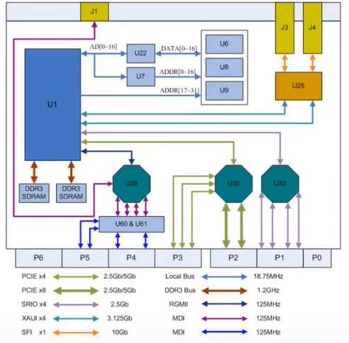

图1-2 信号流向图

- 标注关键信号的速率

- 标注关键器件的位置信息

  ------

  

##### 2.飞线引导规划

1. 每一个模块的器件放在一起，

2. 电源与地线飞线显示关闭，只留信号飞线
3. 标注每个模块的名称、功能和速率等

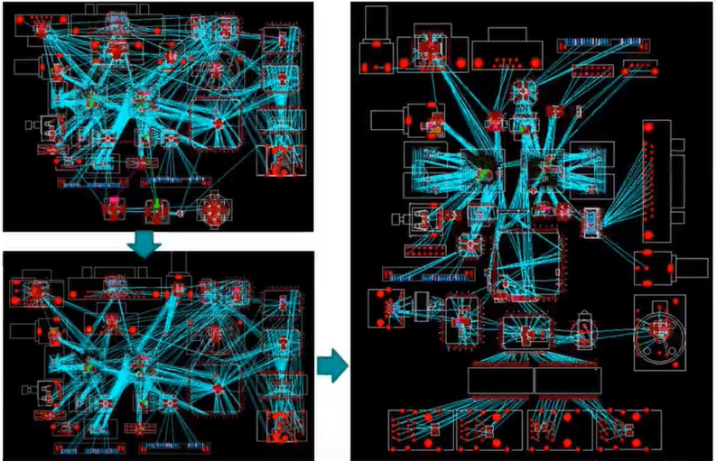

图1-3 由繁到简飞线图

##### 3.电源树分析

1. 理清电源电路的输入及输出供电路径，有助于PCB设计：
   - 走线粗细设计
   - 增加电源过孔
   - 规划电源平面
   - 设计叠层
   
2. 标注出每路电源的电压值和电流值

   

#### 章总结：模块规划分为电源电路和数电模电电路。画板软件熟能生巧，**==掌握产品设计要点和每个模块的功能，才能让设计的方法和思路更进一步==**。

------

第一章END

------

## 二、常用电路模块布局设计

### 1. 电路分区设计

- 给每个模块划分区域
- 多人协作，加快效率

### 2.掌握每个模块的设计要点、原理

- 模块的主要信号线
- 特定的电容电阻灯元器件，应当放置在特定的引脚和信号线附近
- 在ddr内存和flash中，信号引脚都会有防反射的电阻，如走线困难，需要通过仿真验证，来确定是否去掉电阻
- CPU部分中的去耦电容，放在芯片背面，通过打孔连接
- 电源单点接地：输入滤波电容的地、输出滤波电容的地和芯片的地汇流在一起，**优点：电源纹波比较小**

------

第二章END

------

## 三、电源完整性PCB设计

### 1.电源完整性的概述

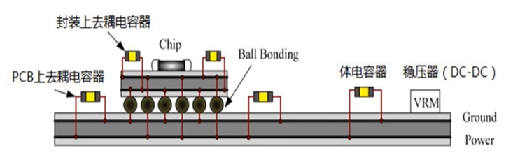

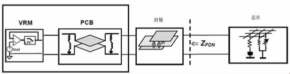

图3-1 PCB电源平面图

- 电源完整性主要研究的是**电源分配网络PDN**

  - **电源分配网络PDN，包含从稳压模块（VRM）到芯片的焊，再到裸芯片内分配本地电压和返回电流的片上金属层在内的所有互联。**
  - 其中有：VRM、各种板级电容器、过孔、互连线、电路板上的平面、封装的焊盘或引脚、芯片封装中的互连、键合线、电容器、芯片上的互连等。

- 随着半导体技术和封装集成的发展，更多的晶体管集成到单个芯片中，**处理器和芯片的功耗增加，供电电压减小，电压噪声容限也随之降低。同时时钟频率不断提高，瞬时电流的幅值也剧增加，这种发展趋势迫使电源分配系统PDN的目标阻抗不断下降。**在如此高功耗需求情况下，PI的设计将取代信号SI设计成为高速PCB设计的新难点。

  

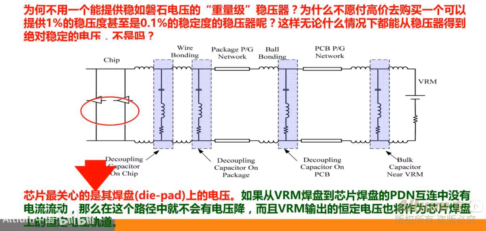

图3-3 稳压器的选择

- **当直流电压时**，芯片汲取的是一个恒定的DC电流，那么由于互连的串联电阻的存在，该DC电流会在PDN互连上产生压降，通常称之为IR-Drop。当芯片的电流发生流动时，PDN上的压降也会随之波动，从而芯片焊盘上的电压也将会波动。
- 当交流电压时，不仅仅要考虑PDN的电阻性阻抗，还要考虑复阻抗，其中包括PDN互连的感性阻抗和容性阻抗。

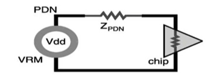

图3-4

- 当具有一定的频谱宽度的波动电流通过PDN的复阻抗时，PDN上会产生压降：
  $$
  V（f）=I（f）*Z（f）
  $$
  **在PDN上的这一压降表明：稳压器输出的恒定电压是芯片得不到的，在进入芯片前就已经改变**。

  

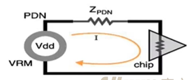

图3-5

- 芯片焊盘上的电压变化必须小于电压噪声容差，即与电流波动对应的纹波。这就要求PDN阻抗必须低于某一最大允许值，即目标阻抗：
  $$
  V(ripple)>V(PDN)=I(f)*Z_{pdn}(f)
  $$

  $$
  Z_{pdn}(f)<Z_{target}(f)=V(ripple)/I(f)
  $$

  其中：

  ​	V（ripple）为芯片的电压噪声容差；

  ​	V（PDN）为PDN互连噪声压降；

  ​	I（f）为芯片汲取电流的频谱；

  ​	Zpdn（f）为从芯片焊盘看过去的PDN阻抗；

  ​	Ztarget（f）为PDN允许的最大阻抗；

  

*例 1：大部分数字电路器件对于电源波动范围要求是正常电压±5%；对于正常电源电压为5V，允许的锻压噪声为5%、最大瞬态电流为1A的PCB设计，其最大电源阻抗为：*
$$
Z_{target}=\frac{\Delta V}{I_{transient}}
$$

5V * 5% / 1A = 0.25欧姆

*例 2：如何估算最大瞬态电流$I_{transient}$?*

**瞬变电流估计为最大电流的一半（一般数据手册会有写）**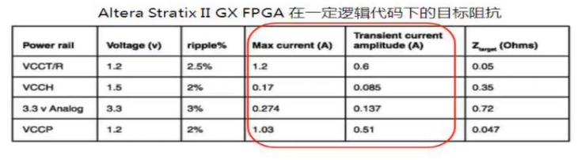

图3-6 

- 假定芯片中电流产生了波动，如果我们要保持芯片焊盘上的电压稳定，这就需要保持PDN阻抗低于目标阻抗，即：
  $$
  Z_{pad}(f)<Z_{target}(f)
  $$
  

  ==**这是PDN设计中最根本的指导准侧。**==

  

- ==设计PDN互连的直接目标：==

  **能够从直流到高频的范围内，使阻抗都低于目标阻抗。**

- ==设计PDN互连的最终目标：==

  1. **为数字信号提供稳定的电压参考**
  2. **为逻辑电路正常工作提供电源**
  3. **为逻辑电路提供低阻抗的接地连接**
  4. **为逻辑电路提供低阻抗的电源连接**
  5. **为电源和地提供低交流阻抗的通路**

### 2.电源完整性的实现方法

- 关于电源完整性的问题是每个硬件工程师在前端设计的时候就必须考虑的问题。
- 电路采用什么类型的电源芯片，在电路板上放置多少电容，多大电容，以及针对某个具体的芯片又分配多少电容等，这个是硬件工程师在进行原理图设计的时候就应该考虑好并且分配好的
- 在layout时，PCB工程师就要正确放置电源模块和这些电容的位置，以及妥善处理他们的出现打孔方式和电源平面等。

#### PI的PCB设计实现方法

##### 1.电源的源头：电源模块

- 电源模块是电源的源头，一定要在源头处理好布局与走线，尽量减少源头的噪声引入和保证过流。
- 总体布局原则：尽量靠近供电的芯片放置。

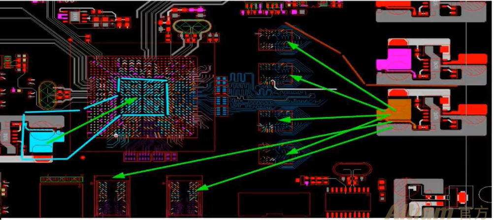

图3-7 

- 按照datasheet推荐的布局和布线进行设计。

  

  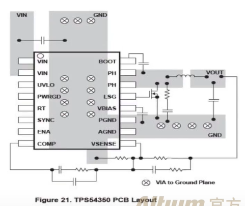

  
图3-8 

- 输入、输出的主回路明晰，并留出覆铜和打孔的位置。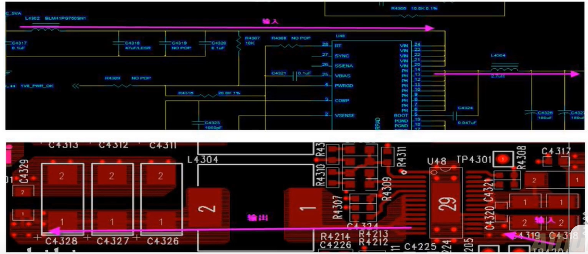

图3-9 

- 开关电源模块的布局要紧凑，一字型布局，尽量少打过孔，滤波器件的放置一定要合理，**左进右出，上进下出等**。

  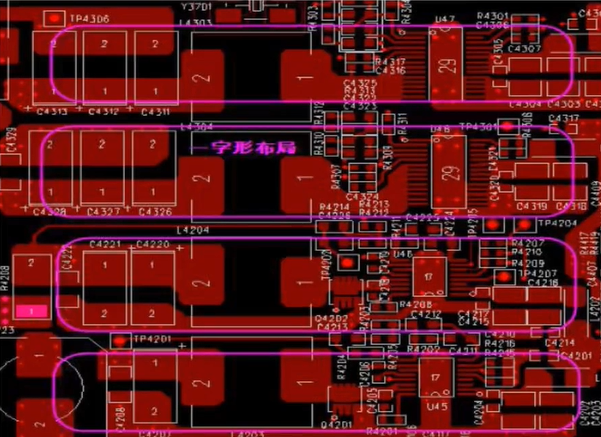

  
图3-10 

- 开关电源模块内部的信号互连线都需要加粗（8-10mil）。

  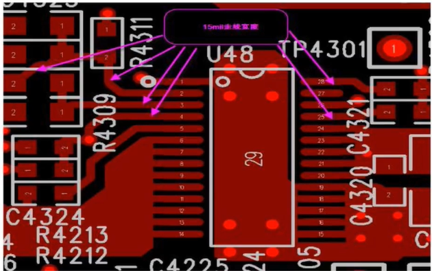

  
图3-11 

- 输入输出主回路载流处理：注意铺铜的同流能力和过孔的数量，**一定要做余量的设计**。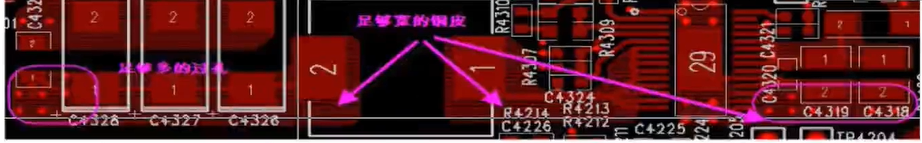

  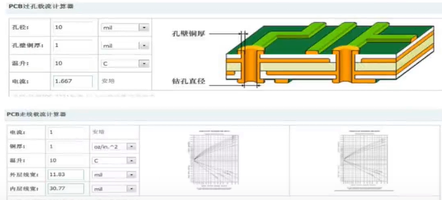

  
图3-12 

- SENSE路径：（采样反馈，FB引脚）远离干扰个大电流的平面上，不要直接将sense线连接在开关电源管脚，一般采用0.5mm的线连接到输出滤波电容之后

- GATE引脚：尽量粗而短，原理干扰源

- INTVCC引脚滤波：这两个电容为快速波动GATE引脚提供电源回路，对电路的正常工作及其重要，一定要就近放置。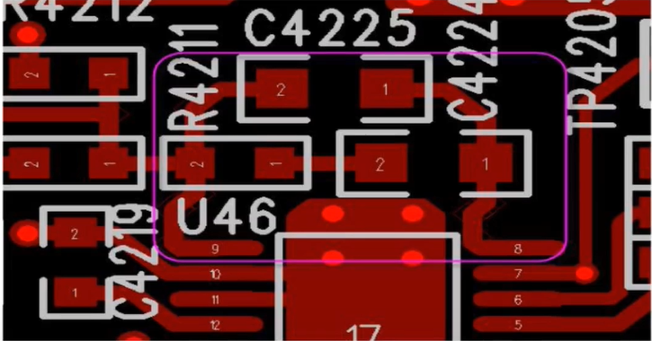

  
图3-13 

  

- **开关电源芯片及其电感下面不能布其他信号线，电感和芯片属于干扰源。**

  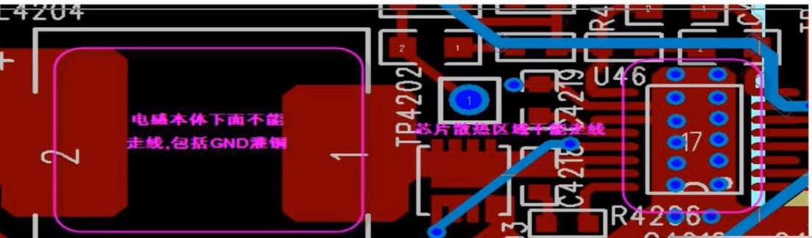

  
图3-14 

- 开关电源的散热焊盘一般需要打散热地过孔（为了确保充分的散热）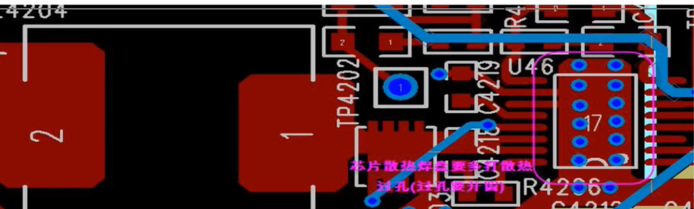

  
图3-15 

- 对于输出多路的开关电源，尽量使相邻的电感之间垂直放置，避免形成一个磁场。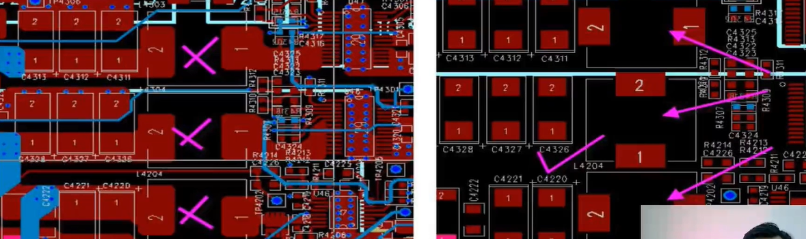

  
图3-16 

- 开关电源的覆铜特别要注意，芯片管脚不能全连接，（功率要求）。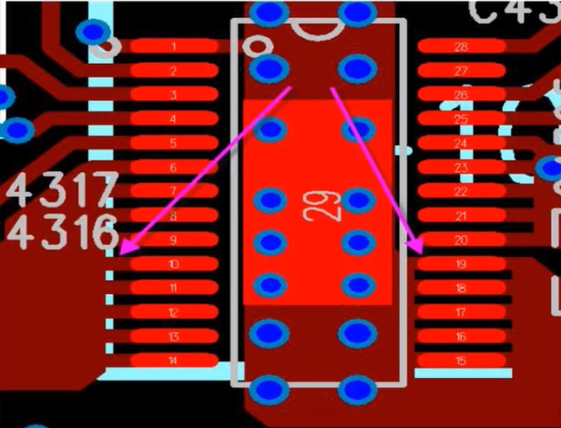

  
图3-17 

- 对于芯片的模拟地处理提别要注意，最好根据datasheet上推荐的电路处理。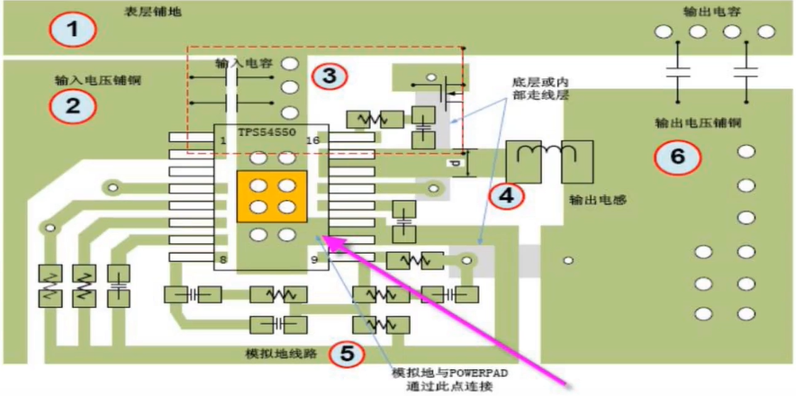

  
图3-18 

- 电感和大电容体积较大，一般不要放置在焊盘面（bottom底层）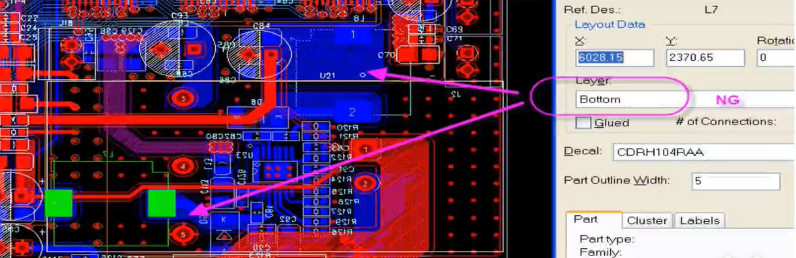

  
图3-19 

- 减小电流环路

  - 许多开关电源的负远离电源的输出端口。

  - 为了避免输出走线受电源自身或周边电子器件所产生的电磁干扰，输出电源走线必须像图3-20那样靠得很近，使输出电流环路的面积尽可能减小。

    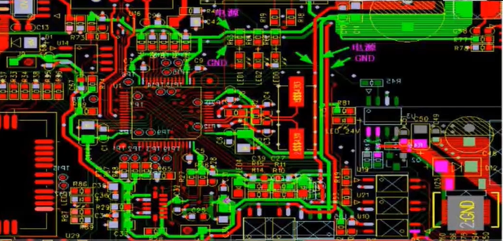

    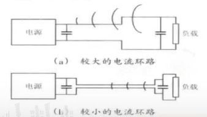

    
图3-20 

    **在布线时，地线因当伴随着电源线。**

- 不同电源模块的接地通过接地平面层单点连接

  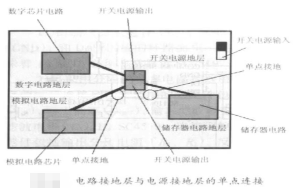

  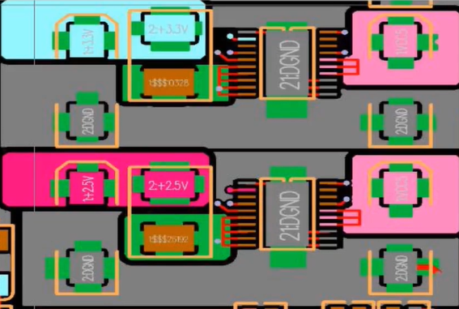

  
图3-21 

- **==通过实战去积累成熟的经验公式，通过实战去理解理论知识。==**

##### 2.电源的路径：平面，电源完整性的实现方法

- **叠层的设计**

  叠层是PCB的EMC和PI设计中关键的一环，在设计层叠是必须考虑**布线分配**和**电源切割**

  - 尽量使电源层有**紧耦合的参考地平面**，以保证电源平面的低阻抗特性和地对电源噪声的耦合吸收，电源、底层间距不应该大于10mil，通常小于5mil。
  - 采用一个电源平面无法实现时，可利用表层小面积来覆铜作为小电源平面。
  - 在叠层安排上要尽量避免有相邻的两个二电源层，尤其是电压差别较大的两个电源层，以防止相邻的两个电源层噪声互相耦合，导致小电压器件工作不稳定；如果不可避免有相邻的两个电源层，要尽量拉大两个电源层间的间距。
  - 尽量保证参考平面油漆是电源参考平面的低阻抗特性，参考平面的低阻抗可通过在PCB上加旁路电容，和调整叠层等加以改善，在可能的情况下可通过PI仿真来解决。
  - 工作频率大于500MHZ的芯片，主要依靠平面电容滤波，并采用组合电容滤波。总体滤波应通过电源完整性仿真确定。

- **多种电源分割**

  - 对于PCB上小范围内用到的电源，入某个IC芯片的核心工作电压，应尽量在信号层上覆铜加以解决以保证电源层的完整性。但要尽量避免在表层敷电源铜皮，以防止电源不干净带来噪声辐射。

    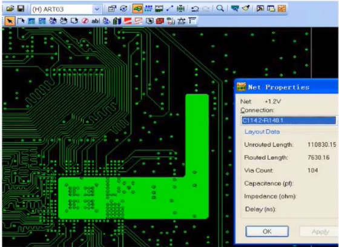

    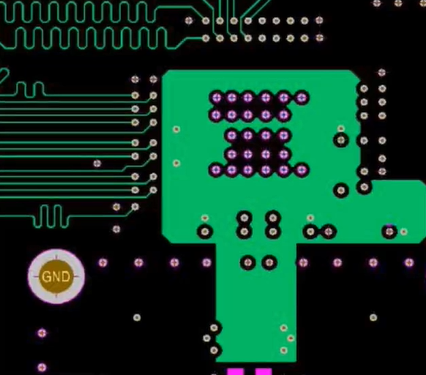

    
图3-22 

  - 对于平面的分割宽度，电压大于12V时，分割卷度可加大至50mil，反之。可选20-30mil。对于模拟电源和数字电源的分割宽度需适当加大，以防止数字电源对模拟电源的噪声干扰。

    **电流决定走线和覆铜的宽度，电压决定电源模块与电源模块之间分割的间距。**

  - 较少节点的网络应该尽量在走线层完成（最好采用覆铜皮的方式），对于长度较长的电源网络，需加一些滤波电容（**在电源末端加RC滤波）**。

  - 分割后的电源平面尽量要保持规则，不规则的分割形状易造成平面的谐振和电源阻抗的增大。电源地平面上不允许有细长条及哑铃形分割，如下图。

    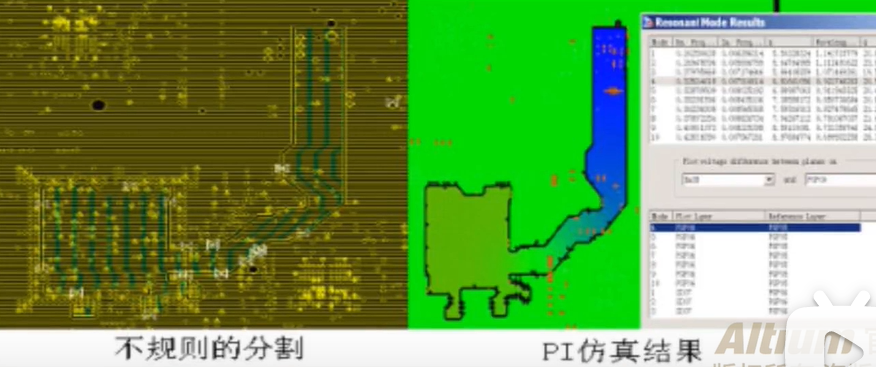

    
图3-23 

  - 如有不规则电源分割，需要注意电流通道是否能承受所需的电流，在保证能承受所需电流的前提下，对于那些窄的瓶颈需要尽量加宽。

    - 估算方法：

      对于line，外层铜厚$1_{OZ}$时$1A/mm$的线宽，内层$0.5A/mm$线宽，断=短线电流加倍；

      对于via，按孔的周长来等效走线的线宽，如$0.5mm$的孔，周长$0.25π=0.785mm$可通过约$0.785A$的电流。

  - 相邻层不同的电源平面要避免交叠放置，以防止噪声的互扰。

  - 在平面层分割时要注意：不要将没有联系的平面之间形成交叠，模拟电源和模拟地；数字电源和数字地，两者严格分开，不要在平面上存在容性耦合。

    - 大量不同的逻辑电平、不同噪声容限的电路（如TTL、ECL等）在混合设计中，可以建议硬件工程师为他们分别提供独立的PDS

    - PCB设计实例：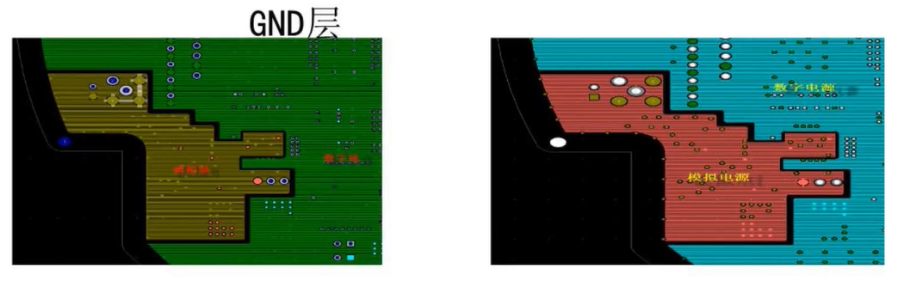

      
图3-24 

      **从图中可看到在地层和电源层，模拟地与模拟电源形状在空间上是完全重合的，模拟地没有与数字电源在空间上交叠，这一点尤其注意。**

      

- **同步开关噪声与回弹**

  - 同步切换噪声（Simultaneous Switch Noise，SSN）：SSN是指当PCB板上众多数字信号同步进行切换时（如CPU的数据总线、地址总线等），产生的瞬间变化电流，在有电感回路上引起交流压降而产生的噪声。

    - **同步切换噪声的后果**：

      1. 同步切换噪声硬气地面平面的波动，造成芯片地和系统地的不一致，形成了地弹（Ground Bounce）。
      2. 同步切换噪声引起电源平面的波动，造成了片电源和系统电源的不一致，形成了电源反弹（Power Bounce）。

    - **影响同步切换噪声的因素**：

      SSN的强度也取决于集成电路的I/O特性、PCB板电源层和地平面层的阻抗，以及高速器件在PCB板上的布局和布线方式。负载电容的增大、负载电阻的减小、封装电感的增大和开关器件数目的增加，均会导致地弹和电源反弹的增大。

    - **同步噪声分类：**

      1. 芯片内部（on-chip）开关噪声：该噪声只流经芯片的电源和地的封装电感。

         - 芯片内部开关噪声对电源的影响：

           由于芯片内部（on-chip）噪声，使得在瞬间开关时，加载在芯片上的电源电压会下降，从而造成器件的驱动能力下降，电路速度减满，发生电源反弹

      2. 芯片外部（off-chip）开关噪声：该噪声只流经芯片的信号线和地的封装电感。

         - 芯片外部开关噪声对电源的影响：

           当开关状态由1到0跳变时，芯片的地并不是理想的零点位，导致地弹。

           当开关状态由0到1跳变时，封装电感会给电源照成一定压降，导致电源反弹。

    - 减低芯片内部（on-chip）噪声的措施：

      1. 使用单独的电源层，并让电源和地面层尽量接近，以降低系统供电电源的电感；
      2. 增加电源和低的引脚数目，减短引线长度，尽可能采用大面积覆铜，以降低芯片封装中的电源和地管脚的电感；
      
    - 降低芯片外部（off-chip）噪声的措施：
    
      1. 让电源和地的引脚成对出现，并尽量靠近，以增加电源和地的互相耦合电感，从而减少回路总电感；
      2. 给系统电源增加旁路电容，从而给高频的瞬变交流信号提供低电感的旁路，但变化较缓慢的信号仍走系统电源回路。
      
      

- **边缘效应**

  地平面和电源平面之间的边缘效应，就是指边缘反射和辐射现象，可列入EMI讨论范畴

  **解决方法：**

  - 通过采用添加去耦电容的方式抑制电源平面上的高频噪声，从而减轻边缘的电磁辐射；
  
  - 在PCB设计时，尽量让信号走线远离覆铜边缘，以免电源平面和地平面搜受太大的干扰；
  
  - 20H原则。
  
    - 什么是20H原则？
  
      由于电源层与地层之间的电场是变化的，在板的边缘会向外辐射电磁干扰，称为边缘效应。可以将电源层内缩，使得电场只在接底层的·范围内传导。以一个H（电源和地之间的·介质厚度）为单位，若内缩20H则可以将70%的电场限制在接地边沿内；内缩100H则可以将98%的电场限制在内。最好在内所区域每隔150mil打一个屏蔽地过孔。
  
      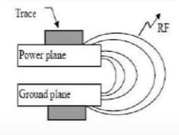
  
      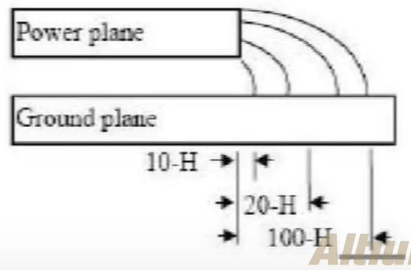
  
      
图3-25 

  
      

##### 3.电源的接收端：芯片

​	对于供电芯片进行电源完整性的控制主要是处理好芯片电源管脚的走线和电容。

- 首先是芯片的电源管脚，一般都要加粗到和芯片管脚一样宽，一般不小于8mil，尽量做到10mil以上。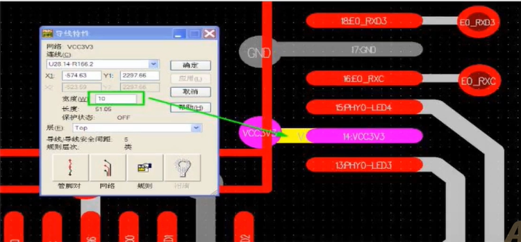

  
图3-26 

- 电容

  1. **电容的分类（按照所起的作用划分）**

     - 旁路电容：为交流信号提供低阻抗回路；
     - 去耦电容：增加电源和地的交流耦合，减少交流信号对电源影响；
     - 滤波电容：用于滤波电路，起到滤波作用；
     - 对于直流电压，可利用电容充放电起到电池作用。

  2. **电容的频率特性**

     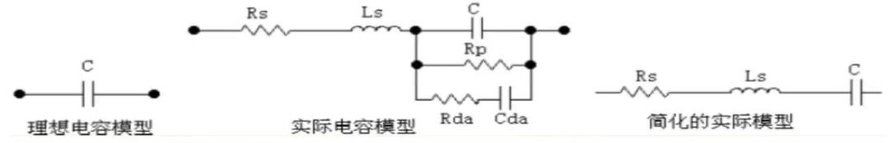

     
图3-27 

  3. **电容的相关参数**

     根据简化的实际模型，电容可看做是一个串联谐振电路，其等效阻抗、串联谐振频率和品质因数Q为：**==（公式未填写）==**

  4. **电容的选择原则：**

     - 由于电容在谐振点附近的阻抗最低，所以在设计时尽量选用和实际工作频率相近的电容
     - 如果工作频率变化范围较宽，则可以通过同时并联使用一些较小的大电容和较大的小电容

  5. **电容并联的频率特性：**

     - 当n个相同容值的电容并联使用时，等效电容C变成nC，等效电容Ls变成Lc/n，等效电阻Rs变为Rs/n,但谐振频率不变。

     - 当n个不同容值的电容并联使用时，因为每个电容的谐振频率不同，当工作频率处于最低谐振频率和最高谐振频率之间时，一些电容表现为容性，另外一些表现为感性，形成了一个LC并联谐振电路。

     - 当处于谐振状态时，电容和电感之间进行周期性的能量交换，以至于流经电源层的电流非常小，电源层表现为高阻抗状态，形成反谐振形现象，并且电容Q值越大，反谐振的振幅就越大。

     - **组合电容靠近芯片引脚**

     - **==并联多个相同容值去耦电容其目的：==**利用电容的并联降低单个电容的ESL

       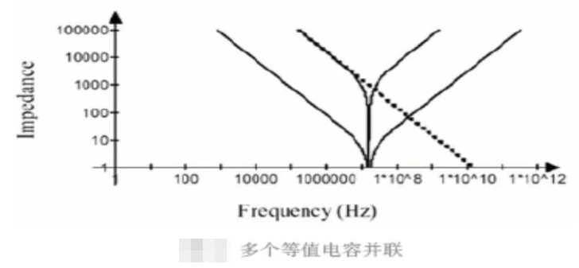

     
图3-28 

     - **==并联多个不同容值去耦电容其目的：==**拓宽去耦的频率范围。可以把要去耦的频率范围分成几段，一般划分为3到4个段。所以容值等级需要3到4个等级，容值等级不要相差10倍。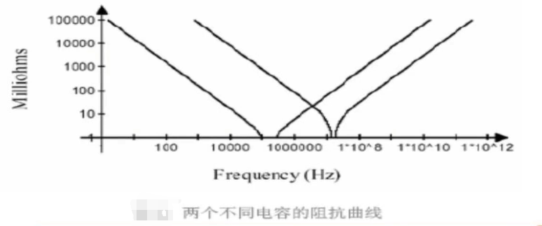

       
图3-29 

     - 有效削弱反谐振程度应采取的措施：

       - 采用Q值较小的电容，即采用寄生电阻Rs较大的电容；
       - 减少不同电容之间谐振频率的相对差值，即各个电容之间的容差不要过大，使得谐振幅值被限制在允许最大电源阻抗之内；
       - 尽可能选取Ls较小的电容，以减少电容的使用数量；

6. 电容在PCB中布线方式：

   - 高速PCB布线对电容处理要求：降低电感

   - 高速PCB布线对电容处理措施：

     - 减小电容引线/引脚的长度；
     - 使用宽的连线；
     - 电容尽量靠近器件，并直接和电源管脚相连；
     - 使用表贴型电容，减低电容的高低；
     - 电容之间不要共用过孔，可以考虑打多个过孔接电源/地；
     - 电容的过孔要尽量靠近焊盘；

   - 旁路电容布线方式与其布线电感大小的关系：

     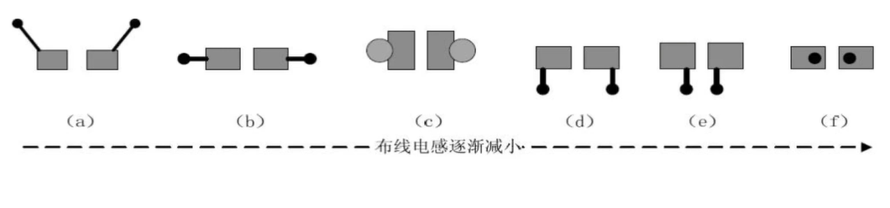

     
图3-30 

7. 去耦电容放置：

   - 分两种，一种是大电容，一种是小电容。
   - 一般大电容均匀分布在芯片周围，谐振频率低，滤波半径大；
   - 小电容要尽量靠近芯片管脚放置，因为小电容谐振频率高，滤波半径小，如果放的元就失去了去耦的作用。

- 思考2：如何确定电容去耦频率的范围？

- 思考3：如何确定电容去耦半径？

- PCB实例：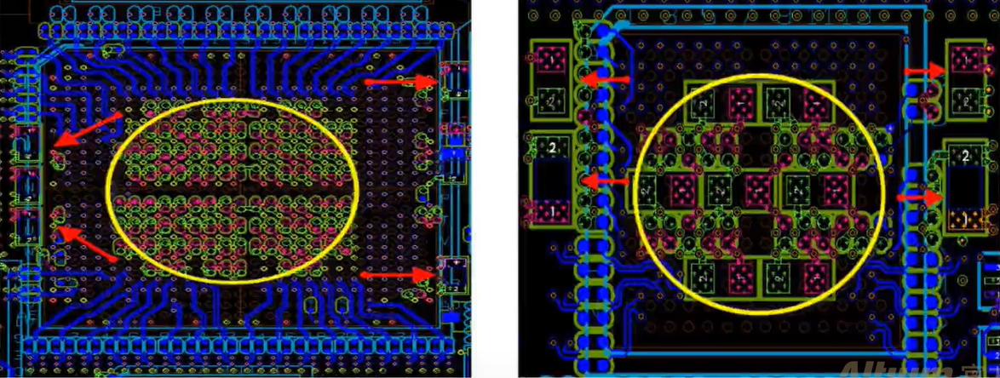

  

  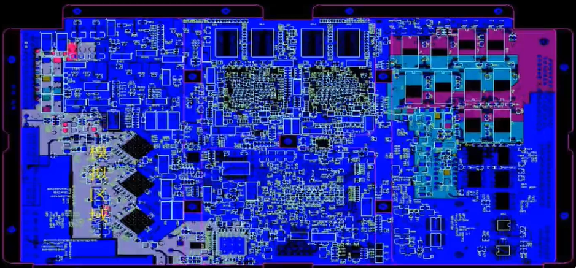

  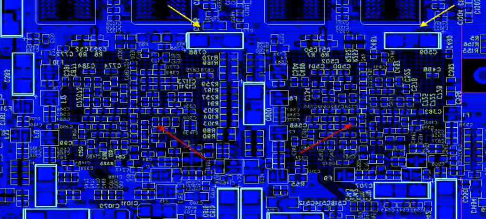

  
图3-31 

- 电源完整性案例分析：

  从top层到bottom层的布局可以看到

  - 模拟器件都放置在模拟区域内；
  - 模拟区域没有掺杂数字器件；
  - 模拟和数字由较明显的区域分隔；
  - 大电容均匀放在芯片周围，小电容靠近芯片管脚；

------

第三章END

------

